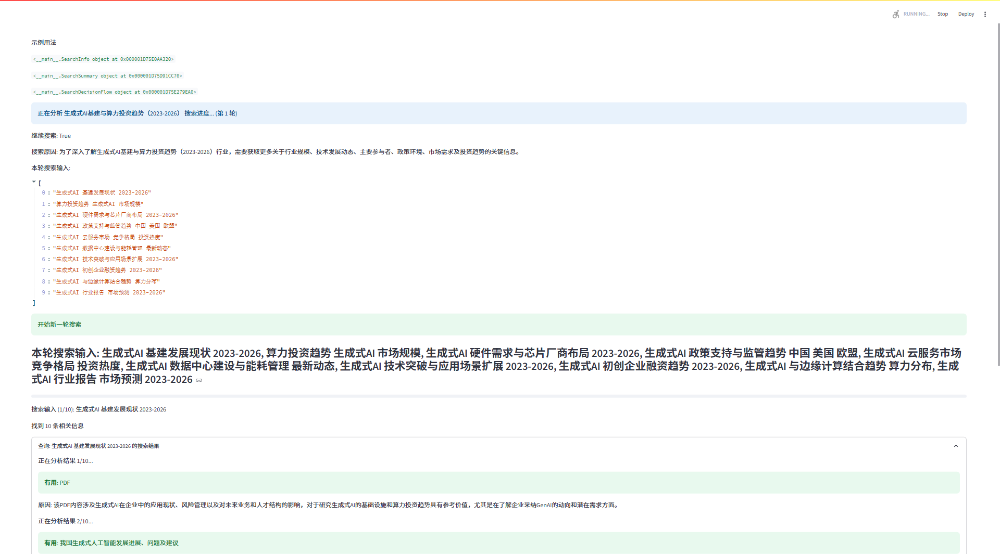
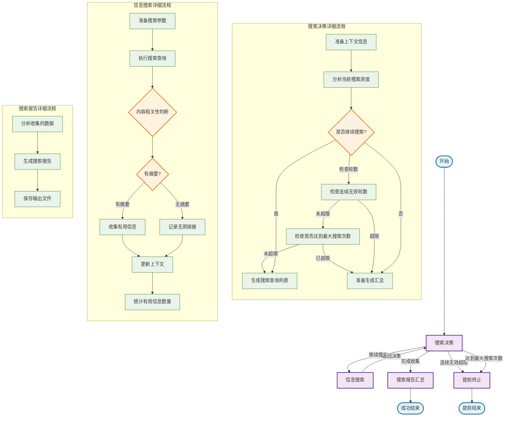

# deepsearch-google

## 工作流程图

## 工作流程说明

### 主流程概述

整个搜索流程包含四个主要节点：

1. **搜索决策** - 分析当前状态，决定下一步行动
2. **信息搜索** - 根据决策执行具体的信息检索
3. **搜索报告汇总** - 整理和生成最终搜索报告（含详细参考文献和搜索时间记录）
4. **提前终止** - 在无效搜索过多、或达到最大搜索次数时提前结束流程

### 详细节点说明

#### 1. 搜索决策节点 (research)

- 分析已收集的信息质量和完整性
- 评估当前搜索进度
- 决定是否需要继续搜索或开始汇总
- 检查无效轮数和总搜索次数，防止无限循环搜索或超出预设搜索量

**输入参数**: industry, context, search_round, invalid_search_rounds, max_invalid_rounds, total_search_count, max_search_count

**输出结果**: continue_search, search_queries

#### 2. 信息搜索节点 (search)

- 执行具体的网络搜索操作（当前使用 Google Search）
- 判断搜索结果的相关性（有摘要才判定，否则直接无用）
- 分类和存储有用信息
- 统计分析本轮有效信息数量
- 累计总搜索次数

**输入参数**: search_queries, industry, useful_links, useless_links, search_pool

**输出结果**: 更新的上下文信息、链接分类、本轮有用信息统计、更新后的 total_search_count

#### 3. 搜索报告汇总节点 (summary)

- 分析所有收集的信息
- 生成结构化的搜索报告
- 报告中包含所有有用搜索结果的详细参考文献（标题、链接、摘要）以及搜索过程中的时间记录
- 保存输出文件

**输入参数**: industry, context, search_round, search_times

**输出结果**: Markdown 格式搜索报告（含参考文献和搜索时间记录）、文件路径

#### 4. 提前终止节点 (early_stop)

- 连续无效搜索轮数 >= 最大允许无效轮数时触发
- 或，总搜索次数 >= 最大允许搜索次数时触发
- 避免无效的重复搜索或超出预算，节省资源
- 可输出部分结果

---

> **参考文献区块说明**：
>
> 生成的搜索报告会自动附带所有有用搜索结果的详细参考文献区块，每条包含标题、原文链接和摘要，便于溯源和查阅。
>
> **搜索时间记录说明**：
>
> 报告中还会包含各主要搜索阶段的时间戳记录。

如需调整提前终止策略，只需修改 `max_invalid_rounds` 或 `max_search_count` 参数即可。
