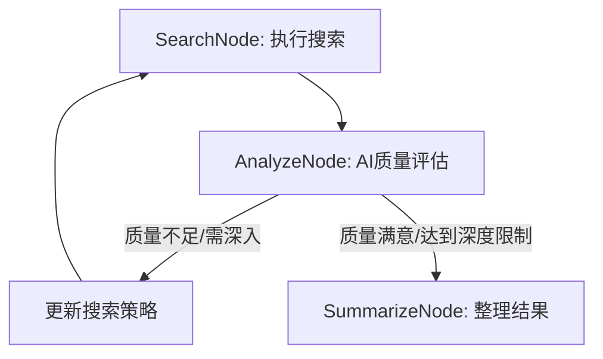

# DeepSearch Workflow

本项目基于 PocketFlow 流程引擎，结合大模型与 DuckDuckGo 搜索，实现了智能化的深度信息检索系统。

## 功能简介

- 质量驱动搜索：基于AI对搜索结果质量和相关性的评估，智能决定是否继续深入。
- 自适应策略：根据搜索效果自动调整搜索策略和关键词。
- 多轮迭代：支持多轮深度搜索，直到获得满意的信息质量。

## 主要流程架构



## 主要节点说明

- **SearchNode**：执行关键词搜索，收集信息。
- **AnalyzeNode**：使用AI分析搜索结果的质量和相关性，决定是否继续搜索或调整策略。
- **SummarizeNode**：整理所有搜索轮次的结果，输出最终报告。

## 质量评估机制

DeepSearch 的核心在于智能质量评估，具体包括：

### 1. 质量评分维度
- **内容质量** (1-10分)：信息的准确性、完整性、权威性
- **相关性评分** (1-10分)：与原始查询的匹配度和关联性
- **信息新鲜度**：发布时间、时效性评估
- **来源可信度**：网站权威性、内容可靠性

### 2. 继续搜索的触发条件
- 质量评分 < 7分：结果质量不足，需要调整搜索策略
- 相关性评分 < 6分：搜索方向偏离，需要优化关键词
- 信息覆盖不全：重要方面缺失，需要补充搜索
- 达到最大深度限制：强制终止搜索

### 3. 搜索策略优化
- **关键词扩展**：基于搜索结果自动生成更精准的关键词
- **搜索角度调整**：从不同维度重新审视搜索主题
- **排除无效结果**：过滤低质量、重复或无关信息
- **专业化搜索**：针对特定领域使用专业术语

### 4. AI评估提示词示例

```text
原始查询: {query}
搜索结果摘要: {results_summary}

请从以下维度评估:
1. 内容质量 (权威性、准确性、完整性)
2. 相关性 (与原始查询的匹配度)
3. 信息价值 (是否包含有用的新信息)
4. 覆盖面 (是否遗漏重要方面)

评估结果请包含:
- 数值评分 (1-10)
- 继续搜索的必要性判断
- 优化建议的具体关键词
- 调整搜索策略的建议
```

## 工作流程示例

1. **初始搜索**：用户输入 "AIGC在金融行业的应用"
2. **首轮评估**：AI发现结果偏向理论，实际应用案例不足 (质量6分)
3. **策略调整**：搜索关键词改为 "AIGC金融应用案例 实际部署"
4. **二轮评估**：获得更多实践案例，但技术细节不够 (质量7.5分)
5. **深度搜索**：进一步搜索 "金融AI模型部署架构 技术实现"
6. **最终评估**：信息质量和覆盖面满足要求 (质量8.5分)，完成搜索

## 快速开始

1. 安装依赖：

   ```bash
   pip install -r requirements.txt
   ```

2. 配置环境变量（.env 文件）：

   - OPENAI_API_KEY=你的OpenAI密钥
   - OPENAI_BASE_URL=你的OpenAI接口地址（可选）
   - OPENAI_MODEL=模型名称（如gpt-4）

3. 运行主程序：

   ```bash
   python deepsearch_workflow.py
   ```

## 依赖

- openai
- duckduckgo_search
- python-dotenv
- pyyaml
- pocketflow（自定义流程引擎）

## 适用场景

- 智能信息检索：当简单搜索无法满足需求时的深度挖掘。
- 质量优先搜索：基于结果质量自动调整搜索策略。
- 自适应信息收集：根据搜索效果动态优化搜索过程。
