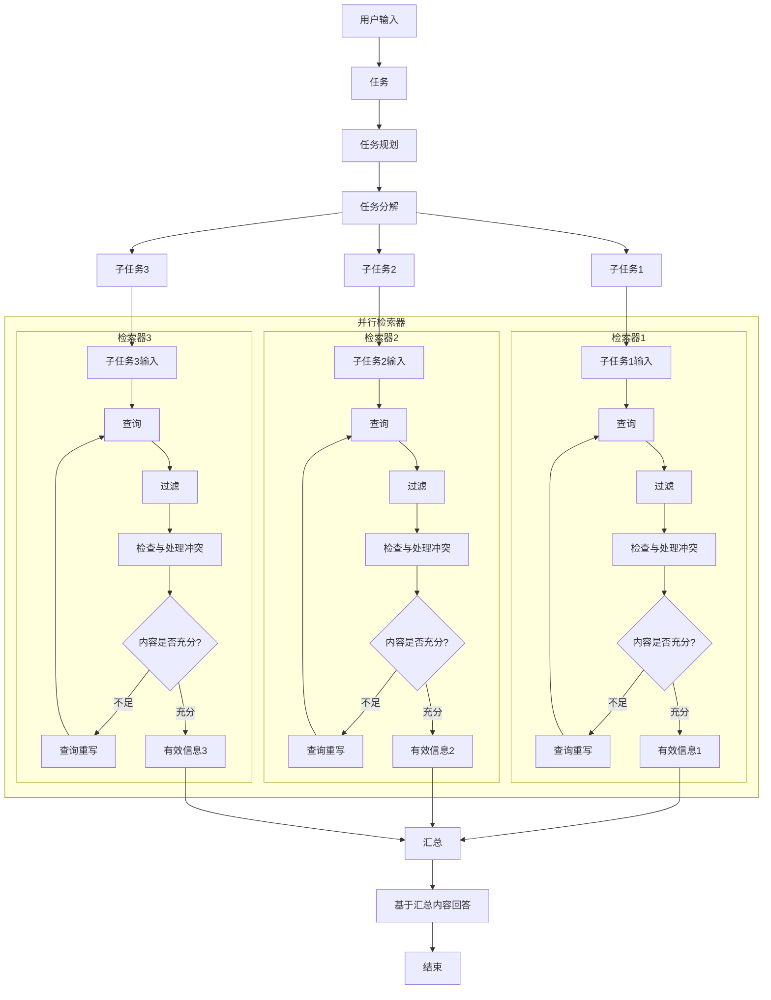

# DeepSearch 网络深度搜索系统设计方案

## 1. 系统概述

DeepSearch 是一个基于网络搜索的智能深度搜索系统，能够主动从互联网获取信息，理解多个来源的内容，处理信息冲突，并提供综合准确的回答。系统不仅仅停留在简单的搜索结果展示，而是通过深度分析和综合各类网络资源，提供更加全面可靠的答案。

### 1.1 设计目标

- 实现深度网络搜索与内容分析
- 评估搜索结果时效性与相关性
- 处理内容重复与冲突情况
- 支持查询改写与多轮搜索
- 提供有来源引证的可靠信息

## 2. 系统架构

### 2.1 核心架构

DeepSearch 采用新的处理架构，主要包括以下阶段：

1. **任务接收与理解**：接收用户输入，明确核心任务。
2. **任务规划**：对主任务进行宏观规划。
3. **任务分解**：将复杂任务分解为多个可独立执行的子任务。
4. **并行检索**：为每个子任务启动独立的检索器，并行从多源获取信息。每个检索器内部包含查询、过滤、冲突检查与处理、内容充分性检查及查询重写等步骤。
5. **信息汇总**：整合来自所有检索器的有效信息。
6. **答案生成**：基于汇总后的全面信息，生成最终回答。

## 3. 系统工作流程

系统的工作流程围绕任务的分解、并行处理和信息的智能整合展开，具体如下：

### 3.1 任务规划与分解

- **任务理解**：深入分析用户输入，明确核心需求和期望的答案形式。
- **任务规划**：制定整体执行策略，确定信息获取的大方向。
- **任务分解**：将主任务拆解为一系列更小、更具体的子任务，每个子任务对应一个特定的信息搜集目标。例如，一个复杂问题可能被分解为事实查找、观点对比、定义解释等多个子任务。

### 3.2 子任务并行检索与信息处理

每个子任务由一个独立的检索器负责。多个检索器并行工作，以提高效率。每个检索器的内部流程如下：

1. **初始查询构建**：基于子任务的目标，生成初始搜索引擎查询。
2. **多源搜索与内容获取**：
    - 调用搜索引擎API，获取初步结果。
    - 抓取相关网页内容，提取主体信息。
3. **内容过滤与评估**：
    - **相关性评估**：判断内容与子任务的匹配程度。
    - **时效性检测**：评估信息的当前有效性。
    - **可靠性评估**：初步判断信息来源的可信度。
    - 过滤无关或低质量内容。
4. **信息冲突检查与处理**：
    - **冲突识别**：检测来自不同来源的信息之间的矛盾点（如事实、数据、观点）。
    - **冲突解决**：尝试通过预设策略（如采信权威来源、多数一致、最新信息优先）解决冲突，或标记争议点。
    - **内容去重**：识别并处理重复或高度相似的信息。
5. **内容充分性检查与迭代**：
    - **信息评估**：判断当前收集到的信息是否足以回答子任务。
    - **迭代决策**：
        - **信息充分**：若信息足够或达到预设的检索限制（如最大迭代次数、时间限制），则输出有效信息。
        - **信息不足**：若信息不足且未达限制，则触发**查询重写机制**（如同义词替换、调整关键词、改变搜索角度），返回步骤1重新执行查询。
6. **有效信息输出**: 检索器将经过处理和验证的有效信息片段传递给后续的汇总阶段。

### 3.3 信息汇总

- **多源信息整合**：收集所有并行检索器输出的有效信息。
- **全局一致性检查**：在汇总层面再次审视不同子任务结果间的潜在冲突或不一致。
- **知识补充与关联**：根据需要，可能会进行知识的补充或建立不同信息片段间的关联。
- **构建综合信息视图**：形成一个相对完整和结构化的信息集合，为答案生成做准备。

### 3.4 答案生成与呈现

1. **综合回答生成**：
    - 基于汇总后的信息，运用自然语言生成技术，构建流畅、准确、全面的答案。
    - 确保答案直接回应用户最初的整体任务。
    - 按重要性和逻辑顺序组织内容。
2. **来源引证**：为答案中的关键信息提供来源引用，增强透明度和可信度。
3. **答案优化与呈现**：
    - 对生成的答案进行校对和润色。
    - 以清晰、易懂的方式呈现给用户。
    - 在必要时，主动声明信息的不确定性或存在的争议。

## 4. 核心功能

### 4.1 查询改写机制

- **触发条件**：初次搜索未找到相关内容或相关度低
- **改写策略**：
  - 同义词替换
  - 问题表述重构
  - 专业术语通俗化
  - 缩小/扩大搜索范围
  - 增加/移除限定条件

### 4.2 时效性检测

- **显式时间提取**：从元数据、URL、页面特定位置提取发布日期
- **隐式时间推断**：
  - 从内容中提取时间指示词
  - 分析内容提及的事件时间
  - 基于网页历史版本分析
- **时效性判断**：根据查询类型确定所需信息的时效性要求

### 4.3 内容重复处理

- **重复度计算**：基于TF-IDF或语义向量的相似度计算
- **合并策略**：
  - 保留最完整信息
  - 多源交叉验证
  - 按来源可靠性优先级选择

### 4.4 冲突信息处理

- **冲突类型识别**：
  - 数值冲突(不同数据)
  - 事实冲突(不同描述)
  - 观点冲突(不同立场)
- **冲突解决方法**：
  - 列举多方观点
  - 标明信息可靠性
  - 寻找权威来源验证
  - 时间线分析解释冲突原因

## 5. 技术实现

### 5.1 搜索引擎集成

- 多搜索引擎API调用(Google, Bing, 百度等)
- 结果合并与排重
- 搜索配额管理与失败重试

### 5.2 网页处理技术

- 反爬处理与重试机制
- 网页解析与主体内容提取
- 结构化与非结构化数据处理

### 5.3 NLP技术应用

- 文本相关性计算
- 命名实体识别与事实抽取
- 观点与立场分析
- 时间表达式识别与解析

### 5.4 知识验证

- 多源信息交叉验证
- 信息可靠性评分
- 来源权威性评估

## 6. 特殊场景处理

### 6.1 多轮搜索策略

- 基于初始搜索结果判断是否需要深入搜索
- 根据初始回答不完整程度决定继续搜索方向
- 跟踪搜索历史避免循环搜索

### 6.2 搜索失败处理

- 无结果情况下的提示生成
- 近似结果推荐
- 引导用户澄清或重构问题

### 6.3 实时性信息搜索

- 识别需要最新信息的查询
- 优先从新闻源和社交媒体获取
- 明确标注信息时效性

## 7. 质量保障

### 7.1 信息可靠性评估

- 来源可信度评分
- 内容一致性检测
- 专业性与准确性评估

### 7.2 回答质量控制

- 完整性评估
- 逻辑一致性检查
- 事实准确性验证
- 引用来源透明度
