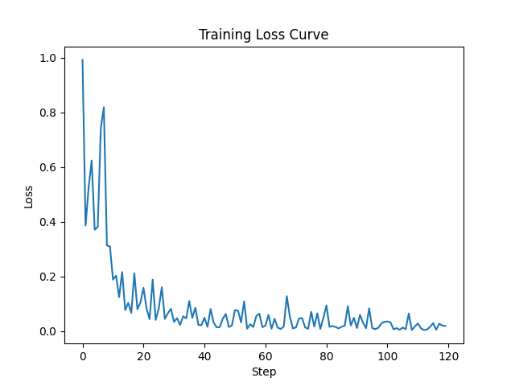

# BGE Reranker 微调脚本使用说明（train_bert_rerank.py）

交叉编码器（Cross-Encoder）重排模型微调脚本，默认使用 `BAAI/bge-reranker-large`，采用 pointwise 训练（BCEWithLogitsLoss）。

## 依赖

- Python 3.10/3.11
- 通过 `requirements.txt` 安装核心依赖：`torch`、`transformers`、`accelerate`、`tqdm`、`tensorboard`
- 可选：`wandb`（若将 `args["log_with"]` 设为 `"wandb"`）

安装方式：

```bash
pip install -r requirements.txt
# 如需使用 wandb 日志
pip install wandb

# 提示：若需要特定 CUDA 版本的 PyTorch，请参考官方指引安装：
# https://pytorch.org/get-started/locally/
```

## 数据格式（JSONL）

每行一个样本：

```json
{"query": "问题文本", "content": "文档文本", "label": 1}
```

`label` 建议在 [0,1] 区间；脚本内部支持线性归一化。

## 快速开始

1) 编辑 `train_bert_rerank.py` 中 `main()` 的 `args` 参数：

- `train_dataset`: 训练数据的 JSONL 路径
- 其他参数按需调整（见下）

2) 运行：

```bash
python train_bert_rerank.py
```

3) 输出：

- 模型保存于 `args["output_dir"]/final_model/`

## 可复现性与确定性运行

本项目在 `train_bert_rerank.py` 中已通过 `seed_everything()` 固定随机性、启用确定性并关闭 TF32。然而，若使用 GPU（CuBLAS），还需要在“启动前”设置环境变量，否则会报 Deterministic 错误。

- 推荐启动方式（在命令前设置环境变量）：

```bash
CUBLAS_WORKSPACE_CONFIG=:16:8 PYTHONHASHSEED=42 python train_bert_rerank.py
```

- 如果仍有报错，可尝试另一可选值：

```bash
CUBLAS_WORKSPACE_CONFIG=:4096:2 PYTHONHASHSEED=42 python train_bert_rerank.py
```

- 或先导出再运行：

```bash
export CUBLAS_WORKSPACE_CONFIG=:16:8
export PYTHONHASHSEED=42
python train_bert_rerank.py
```

补充说明：

- 代码中已设置：
  - 统一种子（`random`/`numpy`/`torch`/`cuda`）
  - `torch.use_deterministic_algorithms(True)`、`cudnn.deterministic=True`、`cudnn.benchmark=False`
  - 关闭 TF32：`torch.backends.cuda.matmul.allow_tf32=False`、`torch.backends.cudnn.allow_tf32=False`
  - 固定 DataLoader 随机源：使用 `torch.Generator()` 且 `num_workers=0`
- 开启完全确定性可能略有性能下降；若个别算子不支持确定性，程序会抛错以便定位与替换。
- 若你的 GPU/驱动不支持 `bf16`，可将 `args["mixed_precision"]` 设为 `"no"` 进行排查。

## 关键参数说明

- `model_name_or_path`: 预训练重排模型（默认 `BAAI/bge-reranker-large`）
- `train_dataset`: 数据路径（JSONL）
- `output_dir`: 输出目录
- `max_len`: 最大序列长度（默认 512；显存紧张可设 384/256）
- `epochs`: 训练轮数（默认 3）
- `lr`: 学习率（默认 1e-5，适合在已精调模型上做二次微调）
- `batch_size`: 批大小（默认 2，大模型需小 batch,如果你的显存够大可以设置更大的batch size）
- `gradient_accumulation_steps`: 梯度累积步数（默认 8）
- `warmup_proportion`: 预热比例（默认 0.1）
- `mixed_precision`: `fp16` 或 `bf16`（硬件支持优先 `bf16`）
- `log_with`: `tensorboard` 或 `wandb`

## 显存/稳定性建议

- OOM 时：将 `batch_size` 调为 1，降低 `max_len`；必要时改用 `bf16`。
- 学习率过大可能导致灾难性遗忘；可尝试 `1e-5`、`5e-6`、`1e-6`。

## 推理示例

```python
import torch
from train_bert_rerank import BertRerankerModel

device = "cuda" if torch.cuda.is_available() else "cpu"
save_dir = "./output_bge_reranker_large_finetuned/final_model"

model = BertRerankerModel.from_pretrained(save_dir)
model.eval()
model.to(device)

pairs = [("查询示例", "文档示例")]
tokens = model.preprocess(pairs, max_len=512)
tokens = {k: v.to(device) for k, v in tokens.items()}

with torch.no_grad():
    out = model(tokens)               # out['logits'] shape: [1, 1]
    score = out["logits"].squeeze(-1) # 未过 sigmoid 的相关性分数
    probs = torch.sigmoid(score)       # 转为概率（0-1）

print(score.tolist())
print(probs.tolist())
```

## 推理模型的运行示例输出

```
[-2.9021458625793457]
[0.05204758793115616]
```

## 训练模型的运行示例输出

```bash
(finetune_rerank) xiaoke@DESKTOP-112CDUC:~/projects/rerank_finetuing$ CUBLAS_WORKSPACE_CONFIG=:16:8 PYTHONHASHSEED=42 python train_bert_rerank.py
Training Args: {'model_name_or_path': 'BAAI/bge-reranker-large', 'train_dataset': 'default_train_data.jsonl', 'output_dir': './output_bge_reranker_large_finetuned', 'max_len': 512, 'epochs': 30, 'lr': 1e-05, 'batch_size': 50, 'seed': 42, 'warmup_proportion': 0.1, 'gradient_accumulation_steps': 8, 'mixed_precision': 'bf16'}
Loading data: 198it [00:00, 196143.64it/s]
----- Label Distribution -----
Label 0.00: 99 (50.00%)
Label 1.00: 99 (50.00%)
Start training for 30 epochs ...
  0%|                                                       | 0/15 [00:00<?, ?it/s]Training finished! Saving model ...
Model saved successfully!
  0%|                                                       | 0/15 [00:42<?, ?it/s]
```

## 训练损失曲线



## 文件结构

- `train_bert_rerank.py`: 训练脚本（模型/数据集/训练循环）
- `README.md`: 本脚本说明
- `default_train_data.jsonl`:训练使用的数据
