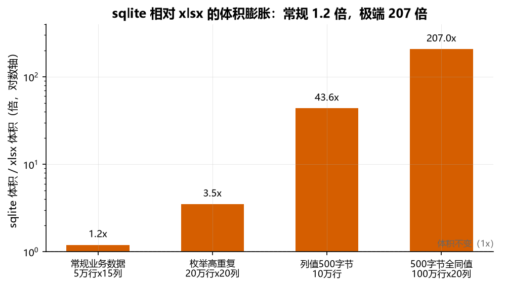
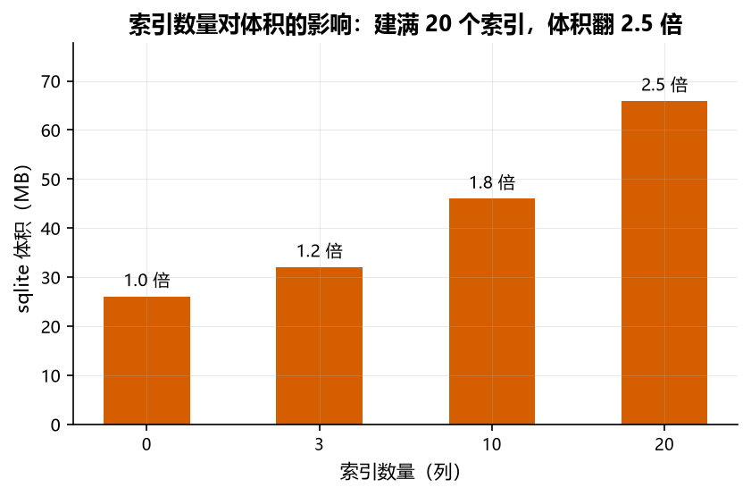
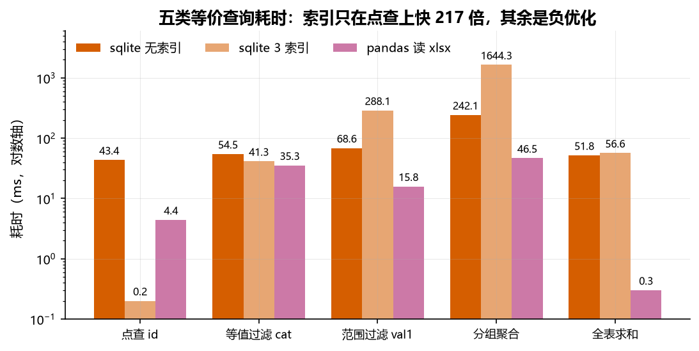
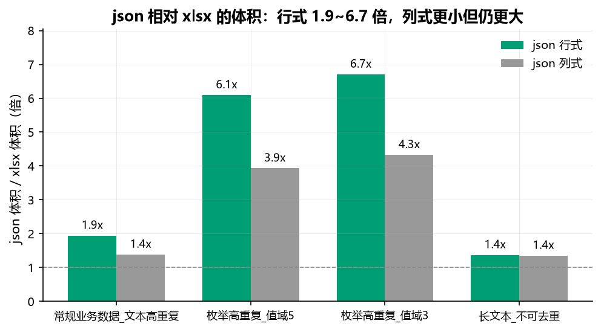
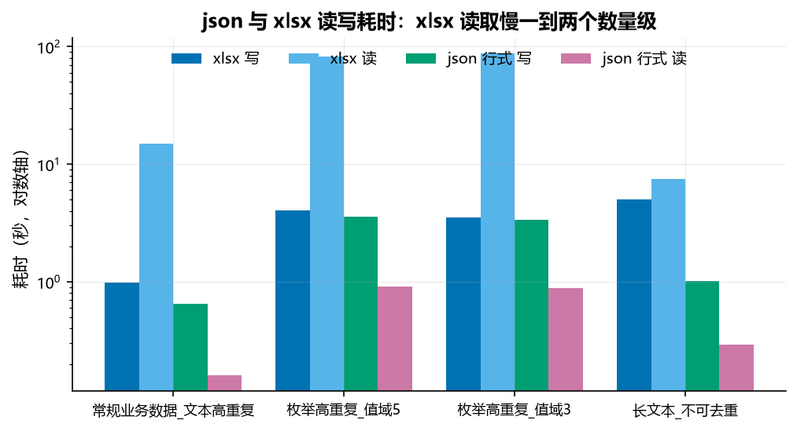
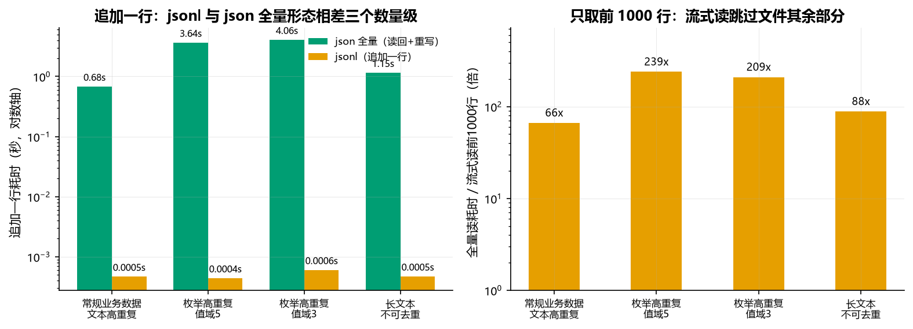

# xlsx、sqlite、json 与 jsonl 的体积与速度实测

朋友丢来一句话：几兆的 Excel 表导进 sqlite，文件变成了上 G。我第一反应是不信，但说不清哪里不对。

另一个问题藏在我自己身上。我一直觉得 sqlite 查数据比 Excel 快，理由是它有索引而 Excel 没有。这个想法从没验证过，只是默认成立。

第三个问题更日常。往配置和缓存里写数据时，json 和 xlsx 该选哪个，我每次都按感觉定，没算过代价。

三个问题指向同一件事：同一份数据在不同格式下的体积和速度到底怎么算。这篇记录实测过程和结果，脚本可复现。

## 结论

体积上朋友说的情况确实可能发生，但需要三个条件同时成立，日常数据转换后体积几乎不变。速度上我那个默认想法错了一半，索引只在点查上有用，在其他场景反而是负担，而 sqlite 相对 Excel 的优势也只在跨进程共享数据时才成立。json 与 xlsx 的取舍最干脆，用 1.4 到 6.7 倍的磁盘换 24 到 104 倍的读取速度。jsonl 的体积与 json 完全相同，换来的是边读边筛和末尾追加的能力，追加一行比 json 全量形态快三个数量级。

## 体积：膨胀倍数等于 xlsx 的压缩率

xlsx 是 zip 压缩的 XML，sqlite 是不压缩的二进制行存储。直觉是压缩包解开会变大，但 sqlite 的行存储比 XML 紧凑，XML 要给每个单元格写开合标签，sqlite 只记类型加长度加值。所以 sqlite 的体积约等于 xlsx 解压后的 XML 体积，膨胀倍数可以直接用压缩率估算。

常规业务数据测出来是 1.1 到 1.2 倍，方向甚至可能是缩小。

| 数据形态 | xlsx | 压缩率 | sqlite | 膨胀 |
|---|---|---|---|---|
| 5 万行 15 列，文本高重复 | 8.26MB | 5.3 倍 | 9.80MB | 1.2 倍 |
| 5 万行 15 列，文本全唯一 | 13.90MB | 3.6 倍 | 16.30MB | 1.2 倍 |
| 20 万行 8 列，纯数字 | 8.90MB | 6.8 倍 | 11.00MB | 1.2 倍 |



大幅膨胀只出现在列值长且高度重复的数据上，因为 xlsx 有共享字符串表，重复值只存一次，sqlite 每行都存全量。枚举字段是典型。

| 数据形态 | xlsx | 压缩率 | sqlite | 膨胀 |
|---|---|---|---|---|
| 20 万行 20 列，取值 5 种 | 10.60MB | 20.7 倍 | 37.30MB | 3.5 倍 |
| 50 万行 40 列，取值 5 种 | 60.42MB | 18.2 倍 | 178.01MB | 2.9 倍 |

我一度以为压缩率有上限，探到 100 字节时看到 55 倍就下了结论。把值长拉到 500 字节再测，压缩率到 110.3 倍，膨胀 207 倍，跨过了 200。

| 数据形态 | xlsx | 压缩率 | sqlite | 膨胀 |
|---|---|---|---|---|
| 10 万行，每行 500 字节 | 1.28MB | 45.0 倍 | 55.94MB | 43.6 倍 |
| 100 万行 20 列，500 字节全同值 | 95.13MB | 110.3 倍 | 19.23GB | 207.0 倍 |

值越长，每个单元格的 XML 标签开销被摊得越薄，压缩率持续上升，没有封顶。所以朋友那句话是可达的，但三个条件要同时成立：列值长到 500 字节左右、值高度重复、建了大量索引。缺一个，量级就掉下来。

索引本身也占体积。同一份数据（10 万行 20 列，取值 5 种，xlsx 21.89MB）：

| 索引数 | sqlite | 膨胀 | 相对无索引 |
|---|---|---|---|
| 0 | 26.12MB | 1.2 倍 | 1.0 倍 |
| 3 | 32.09MB | 1.5 倍 | 1.2 倍 |
| 10 | 46.04MB | 2.1 倍 | 1.8 倍 |
| 20 | 65.96MB | 3.0 倍 | 2.5 倍 |



建满 20 个索引，索引体积可以超过表本身。短值列影响较小，长文本列建满索引能让总体积再涨 1.5 到 2 倍。这也是凑满 200 倍的必要条件之一。

## 速度：索引是点查专用加速器

50 万行 8 列，xlsx 27.0MB，同一份数据跑五类等价查询，三种形态对比。

| 查询 | sqlite 无索引 | sqlite 3 索引 | pandas 读 xlsx 后 |
|---|---|---|---|
| 点查 `id=250000` | 43.4ms | **0.2ms** | 4.4ms |
| 等值过滤 `cat='cat7'` | 54.5ms | 41.3ms | **35.3ms** |
| 范围过滤 `val1 100~200` | 68.6ms | **288.1ms** | **15.8ms** |
| 分组聚合 `GROUP BY cat` | 242.1ms | **1644.3ms** | **46.5ms** |
| 全表求和 `SUM(val2)` | 51.8ms | 56.6ms | **0.3ms** |



点查快了 217 倍，这是索引唯一真正发光的场景，前提是列选择性高，比如 id 这种唯一列。

另外三行索引是负优化。`val1` 是 0 到 1000 均匀分布，范围条件命中 5% 的行，走索引要回表取其他列，大量随机 IO 比顺序扫全表还慢，从 68.6ms 涨到 288.1ms。分组聚合同理，从 242.1ms 涨到 1644.3ms。索引加错了是给每次查询加税。

pandas 在内存里做向量化运算，全表求和 0.3ms 对 sqlite 51.8ms，差 170 倍，五类查询里拿三个最优。

我原本默认的「sqlite 因为有索引所以更快」，在这里只剩点查那一格成立。

### 场景决定谁快

读入是一次性的，之后都在内存或本地文件上跑，sqlite 导入 76.9 秒，pandas 读 xlsx 69.5 秒，之后都是毫秒级。

差别在数据活在哪里。DataFrame 只存在于进程内存，进程结束即消失；sqlite 落盘，进程结束数据还在。

同一进程内做多步分析，pandas 更快，sqlite 没有优势，导入还多花约 7 秒。跨进程或跨会话共享数据，sqlite 才占优，新进程连上即可查，pandas 必须重读 xlsx（本次实测 69.5 秒），除非先把 DataFrame 序列化落盘，那又引入另一次序列化开销。

所以「sqlite 远快于 Excel」只在重复查询且跨会话这个前提下成立。同一次运行里的多步分析，结论相反。

## json 与 xlsx：用体积换读取速度

json 体积始终大于 xlsx，倍数从 1.4 到 6.7，跨度由取值重复度决定，不由数据规模决定。读取速度 json 快 22 到 106 倍。写入两者同量级。

| 数据形态 | xlsx | json 行式 | json 列式 | 行式 / xlsx | 列式 / xlsx |
|---|---|---|---|---|---|
| 5 万行 15 列，文本高重复 | 8.27MB | 16.07MB | 11.44MB | 1.9 倍 | 1.4 倍 |
| 20 万行 20 列，取值 5 种 | 11.65MB | 70.95MB | 45.78MB | 6.1 倍 | 3.9 倍 |
| 20 万行 20 列，取值 3 种 | 10.58MB | 70.95MB | 45.78MB | 6.7 倍 | 4.3 倍 |
| 10 万行 2 列，值长 500 字节 | 71.13MB | 97.47MB | 96.13MB | 1.4 倍 | 1.4 倍 |



取值 5 种和取值 3 种两个场景，json 体积完全相同，都是 70.95MB。原因在值长固定为 8 字节，json 每个单元格占的字节数只由列数决定，跟取值分布无关，两个场景生成的随机序列不同但字节数一致。xlsx 却从 11.65MB 缩到 10.58MB，差的这 0.3 倍就是共享字符串表少存了两种取值的收益。

反过来说到长文本场景，只差 1.4 倍。500 字节的随机字母串 zip 压不动，xlsx 丢掉压缩这一层，只剩共享字符串表的去重（10 万个唯一值各存一次），而 json 每行存全量，两边差距自然收窄。

所以 json 的体积惩罚本质上是共享字符串表的缺失，重复度越高罚得越狠。列式 json 能扳回一部分，15 列和 20 列的场景小了三成半，因为行式每行都要重复写一遍全部键名，列式只写一次。长文本场景只有 2 列，这个收益就缩到 1.4%，几乎可以忽略。

耗时上读的差距比体积更值得看。

| 数据形态 | xlsx 写 | json 行式 写 | xlsx 读 | json 行式 读 | 读取加速 |
|---|---|---|---|---|---|
| 5 万行 15 列，文本高重复 | 1.01s | 0.99s | 19.90s | 0.20s | 100 倍 |
| 20 万行 20 列，取值 5 种 | 4.42s | 3.76s | 96.50s | 0.95s | 102 倍 |
| 20 万行 20 列，取值 3 种 | 4.00s | 3.86s | 105.13s | 1.01s | 104 倍 |
| 10 万行 2 列，值长 500 字节 | 5.19s | 1.01s | 7.51s | 0.32s | 24 倍 |



xlsx 读取慢在 XML 解析。把解压和解析拆开测，长文本场景解压 71MB 只要 0.44 秒，解析那 20 万个单元格要 7.51 秒，占 95%。枚举场景 400 万个单元格，平均每个 24 微秒；同样的数据 json 读是一次 C 层扫描，0.95 秒走完。长文本场景只差 24 倍，因为它只有 20 万个单元格，XML 解析总量小。这个场景单个单元格的解析成本反而更高，38 微秒对枚举场景的 24 微秒，因为共享字符串表有 10 万条，每次取值都要查表，但总量差 20 倍，总耗时还是低一个数量级。

写入两者同量级，只有长文本场景例外，xlsx 花 5.19 秒去压缩一堆压不动的内容，json 只要 1.01 秒。枚举场景两边接近，因为重复数据的压缩很便宜。

列式 json 在体积、写入、读取三个维度上都优于行式，读快 1.2 到 2.9 倍，写快 1.4 到 3.0 倍，代价是失去行独立性，不能按行流式处理，写入方必须凑齐整列数据。

## jsonl：体积与 json 相同，换取增量能力

jsonl 是每行一个独立 JSON 对象、行尾换行、无外层数组。它与 json 全量形态的体积完全相同，四个场景实测字节数逐位相等（16850000、74400000、74400000、102200000）。原因很直接，json 行式是 `[{...},{...}]`，jsonl 是 `{...}` 换行 `{...}`，差别只是外层两个括号和行间逗号换成换行，行数上去之后这点字节可以忽略。所以体积维度上 jsonl 不占便宜，也不吃亏。

真正值得测的是 json 做不到的三件事：只取前 N 行、末尾追加一行、流式读取的内存峰值。

### 只取前 1000 行：快 66 到 239 倍

json 要先解析完整文件才拿得到第一行，jsonl 读满 1000 行就可以停手，文件剩下百分之九十九的内容根本不碰。

| 数据形态 | jsonl 全量读 | 流式读前 1000 行 | 加速 |
|---|---|---|---|
| 5 万行 15 列，文本高重复 | 0.31s | 0.0046s | 66 倍 |
| 20 万行 20 列，取值 5 种 | 1.37s | 0.0057s | 239 倍 |
| 20 万行 20 列，取值 3 种 | 1.60s | 0.0076s | 209 倍 |
| 10 万行 2 列，值长 500 字节 | 0.66s | 0.0074s | 88 倍 |

加速倍数与数据规模无关，只跟「取多少行」有关，四个场景都受 1000 行的上限封顶。文件越大，流式读的耗时几乎不涨，全量读线性上涨，差距只会拉大。

代价是全量读反而慢一点。jsonl 逐行读 1.37 秒，json 行式全量读 0.91 秒，慢 1.5 到 2.3 倍。逐行 `json.loads` 每次调用都有固定开销，20 万行就是 20 万次调用，而 `json.load` 是一次 C 层扫描走完。这是增量能力的对价，不是实现缺陷。

### 追加一行：快 1458 到 8333 倍

这是 jsonl 唯一压倒性的优势。json 全量形态追加一行，必须把整个文件读回内存、追加、整文件重写，耗时随文件规模线性增长。jsonl 只需在末尾追加一行，耗时与文件规模无关，稳定在 0.5 毫秒左右。

| 数据形态 | json 行式追加 | jsonl 追加 | 倍数 |
|---|---|---|---|
| 5 万行 15 列，文本高重复 | 0.68s | 0.0005s | 1458 倍 |
| 20 万行 20 列，取值 5 种 | 3.64s | 0.0004s | 8333 倍 |
| 20 万行 20 列，取值 3 种 | 4.06s | 0.0006s | 6773 倍 |
| 10 万行 2 列，值长 500 字节 | 1.15s | 0.0005s | 2449 倍 |

写日志、写缓存、追加流水记录这类场景，选 json 全量形态就等于每次写入重写整个文件，文件越大越贵。

### 内存：全量读同量级，流式读差 48 到 201 倍

峰值内存用 `tracemalloc` 计量。全量读时 jsonl 与 json 行式同量级，但差异方向不稳定，枚举场景 jsonl 高 27%（442.9MB 对 347.9MB），长文本场景 jsonl 低 40%（129.7MB 对 219.0MB）。

长文本场景这个方向可以确证归因：json 全量读必须同时持有整个文件的文本缓冲（该文件 102MB），jsonl 逐行读没有这份缓冲。把文本缓冲排除后单独测 json 解析，峰值从 219.0MB 降到 121.5MB，与 jsonl 的 129.7MB 持平。枚举场景的反向差异尚未定论，已排除「重复值去重」这一假设（验证：单次 `json.loads` 调用内，重复出现的值也不是同一对象）。

流式读的内存才是决定性的。只取 1000 行时峰值 1.3 到 2.2MB，是全量读的 1/48 到 1/201。

| 数据形态 | json 行式全量 | jsonl 全量 | jsonl 流式 1000 行 |
|---|---|---|---|
| 5 万行 15 列，文本高重复 | 76.5MB | 91.5MB | 1.9MB |
| 20 万行 20 列，取值 5 种 | 347.9MB | 442.9MB | 2.2MB |
| 20 万行 20 列，取值 3 种 | 347.9MB | 442.9MB | 2.2MB |
| 10 万行 2 列，值长 500 字节 | 219.0MB | 129.7MB | 1.3MB |



## 选型

数据会被反复读取且延迟要紧，选 json，启动配置、索引、缓存都属于这类。数据要长期归档、体积敏感、读取一次性，选 xlsx。列值高度重复时最不该用 json，体积罚到 6 倍级别；列值长且几乎唯一时 json 接近免费，体积只多 1.4 倍，写入还快 5 倍。

同一份数据要频繁追加、或者只需要读其中一部分，选 jsonl。追加一行比 json 全量形态快三个数量级，取前 1000 行比全量读快 66 到 239 倍，内存峰值低两个数量级。代价是全量读慢 1.5 到 2.3 倍，体积与 json 完全相同。

整份数据要一次性进内存做向量化运算，选 json 行式或 json 列式，别用 jsonl，逐行解析的固定开销在这里纯属浪费。

要跨进程或跨会话反复查询同一份结构化数据，选 sqlite，这是它唯一相对文件格式的硬优势。同一次运行里做多步分析，pandas 读进内存更快，别为了「有索引」绕一圈。

## 运行

```bash
# 体积测试（xlsx 转 sqlite），约 3 分钟
python bench_size.py

# 体积测试，只跑小场景
python bench_size.py --quick

# 速度测试，约 3 分钟
python bench_speed.py

# 速度测试，缩小规模
python bench_speed.py --rows 100000

# 跳过 pandas 侧对比
python bench_speed.py --skip-pandas

# json 与 xlsx 对比，约 7 分钟
python bench_json.py

# json 与 xlsx 对比，只跑小场景
python bench_json.py --quick

# 额外拆分 xlsx 读取的解压与 XML 解析耗时
python bench_json.py --decompose

# 按现有数据重出图表（读 output/bench_json_results.json）
python make_figures.py
```

依赖：`openpyxl`、`pandas`、`matplotlib`。

jsonl 的三项测量（流式读、追加写、峰值内存）都在 `bench_json.py` 里，产物同样写入 `output/bench_json_results.json`，字段以 `jsonl_` 开头。

体积与耗时会随硬件、数据分布、库版本变化，绝对值仅供参考，倍数关系稳定。

产物写入同级 `output/` 目录（已被 `.gitignore` 覆盖），图表写入 `figures/`（入库）。

## 实测环境

- 日期：2026-09-05
- 操作系统：Windows 11
- Python 3.13.0
- openpyxl 3.1.5
- pandas 3.0.5（仅 speed 测试用）
- matplotlib 3.11.1（图表）
- SQLite 3.49.1
