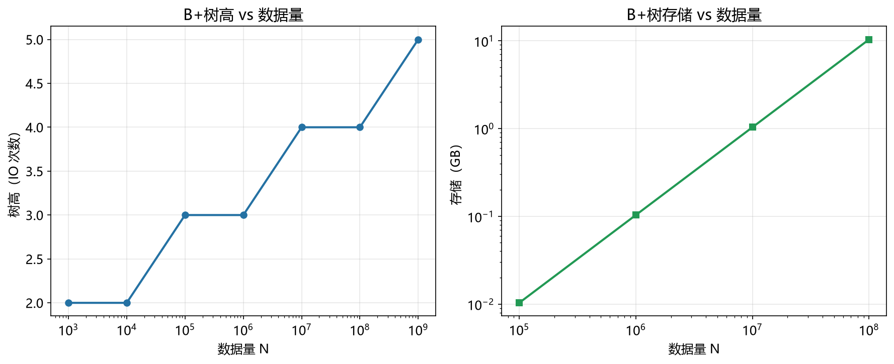

# B+树性能模型

> 实证日期 2026-09-07 · sqlite 3.45.3 · Python 3.13.0 · 脚本 `scripts/btree_model.py`、`scripts/verify_btree_storage.py`、`scripts/verify_btree_lookup.py` · 结果 `results/btree_storage_*.json`、`results/btree_latency_*.json`

选型时最先要回答的是「这个规模下 B+树点查要几次 IO、占多少磁盘、写放大多少」。本笔记给出 B+树的性能公式，并在 sqlite 上验证。核心结论是存储与点查 IO 次数都是闭式解，不需要跑实验，公式在小规模验证后直接外推；延迟需要在本机标定一个内存随机访问常数后按公式换算。

## 参数与扇出

B+树的性能由四个物理量决定：页大小 `P`（sqlite/InnoDB 默认 4096）、键大小 `K`、值大小 `V`、填充因子 `f`。扇出 `fanout` 是每个内部节点最多能指向的子节点数，它决定树高。

内部节点每项占 `K + 指针` 字节（指针 8 字节），可用空间 `(P - 页开销) × f`，所以 `fanout = (P - 100) × f / (K + 8)`。叶子每项占 `K + V` 字节，`leaf_cap = (P - 100) × f / (K + V)`，即每叶子最多存多少条记录。

页开销取 100 字节（页头加 cell 指针数组等），填充因子随机插入的 B+树典型 0.7 到 0.85。这两个常数由 sqlite 实测标定，见下节。

## 树高与点查 IO

树高 `h` 是根到叶子的层数，点查 IO 次数等于树高（从根走到叶子访问 h 个页）。叶子页数 `num_leaf = ceil(n / leaf_cap)`，需要 `fanout^(h-1) >= num_leaf`，所以 `h = ceil(log_fanout(num_leaf)) + 1`。

本机标定的典型参数（`P=4096, K=4, V=100, f=0.84`）下 `fanout=279, leaf_cap=32`，各规模树高如下。注意 B+树极矮，千万级只有 4 层，点查 IO 次数与数据规模几乎无关，这是它作为点查索引的核心优势。

| n | 叶子页数 | 树高 | 点查 IO 次数 |
|---:|---:|---:|---:|
| 10,000 | 313 | 3 | 3 |
| 100,000 | 3,125 | 3 | 3 |
| 1,000,000 | 31,250 | 3 | 3 |
| 10,000,000 | 312,500 | 4 | 4 |
| 100,000,000 | 3,125,000 | 4 | 4 |

## 存储公式

总页数 = 叶子页数 + 内部节点页数。叶子主导，`storage_pages ≈ n / leaf_cap`，内部节点占比很小（约 `1/fanout`）。`storage_bytes = storage_pages × P`。这个公式与数据内容无关，合成数据足够验证。

## 点查延迟

延迟 = 树高 × 每次 IO 的延迟常数。树高是精确公式，需要标定的是介质常数。缓冲池命中（热数据）时每次 IO 是一次内存随机访问，本机标定见下节。磁盘 IO 是另一个常数，取决于 SSD 随机读性能（NVMe 约 100 微秒，SATA SSD 约 200 微秒，HDD 约 10 毫秒），量级差距巨大，冷数据点查延迟由磁盘主导。

## 实测验证

### 存储：线性缩放律与填充率标定

sqlite 建表（`k INTEGER PRIMARY KEY, v TEXT(100)`），顺序插入与随机插入各扫 4 个规模，测 `page_count`。两个发现。

其一，存储随 n 严格线性，斜率稳定。顺序插入 110.98 B/record，随机插入 124.41 B/record。这验证了存储公式的缩放律。

其二，实测页数比理论（fill=0.70）少约 21%（随机）到 30%（顺序），反推实际填充率：随机 0.836，顺序 0.937。这说明默认 fill=0.70 偏保守，sqlite 实际填得更满。随机插入场景用 0.84 作标定值更准。

### 延迟：内存随机访问常数标定

指针追踪微基准（256 MiB 缓冲，超出 L3）测得本机内存随机访问延迟 11.36 ns（扣除 Python 循环开销 26 ns 后）。8 MiB 以上进入平台区，说明这是 DRAM 随机访问的真实延迟。

热数据点查延迟 = 树高 × 11.36 ns。千万级 4 层约 45 ns，百亿级仍只有 4 层约 45 ns。这就是 B+树点查在内存里快的原因，IO 次数不随规模增长。



## 规模外推

以典型参数（`P=4096, K=4, V=100, f=0.84`）外推：

| n | 树高 | 点查 IO | 存储 | 热数据点查延迟 |
|---:|---:|---:|---:|---:|
| 100 万 | 3 | 3 | 约 120 MiB | 约 34 ns |
| 1000 万 | 4 | 4 | 约 1.2 GiB | 约 45 ns |
| 1 亿 | 4 | 4 | 约 12 GiB | 约 45 ns |
| 10 亿 | 5 | 5 | 约 120 GiB | 约 57 ns |

十亿级树高才 5 层，点查 IO 次数仍然只有个位数。存储线性放大，十亿级 120 GiB 超出单机内存，此时点查要走磁盘，延迟从纳秒跳到百微秒量级。

## 选型边界

B+树是点查和范围扫描的通用主力索引，树高对数增长让它几乎在所有规模都用得舒服。它的短板不在读而在写，写放大和页分裂是 LSM-tree 要解决的问题，那是《LSM-tree模型》的内容。范围扫描 IO = 树高 + 扫描跨越的叶子页数，叶子顺序存储所以扫描部分接近顺序读，比点查的随机读快得多。

值的体积直接决定叶子容量和树高。V 越小扇出越大、树越矮。聚簇索引（值就是数据行）V 大、树高一些；二级索引（值只是主键指针）V 小、树更矮但要多一次回表。

## 进阶优化

B+树的优化分三条主线：并发控制（无锁或细粒度锁）、缓存优化（减少内存访问延迟）、写入优化（延迟分裂、批量操作）。

Bw-Tree（微软 2013，SQL Server Hekaton 采用）用无锁设计替代传统 latch。每个逻辑节点由 Base Node + Delta Chain 组成，修改通过 CAS 原子操作追加 Delta 节点，避免原地修改的锁竞争。多核场景下写入吞吐线性扩展，字节跳动的读优化版本（SIGMOD 2024）将读延迟 P99 从 97ms 降到 12ms。

Blink-Tree（1981，MySQL InnoDB 5.7+ 和 PostgreSQL 采用）解决节点分裂（SMO）期间的读阻塞。每个节点增加右兄弟指针和 High Key，分裂时读请求可通过右指针访问兄弟节点，避免因中间态导致的数据丢失。SMO 期间保持可读，大幅降低锁竞争。

Masstree（MIT 2012，openGauss MOT 采用）是 Trie 和 B+树的复合结构，按 8 字节切片处理变长 key。16 核上 Get 达到 12.7 倍扩展比，超过 600 万 QPS。内存开销比传统 B+树每行多 16 字节，换来了高并发和缓存感知。

OLC（Optimistic Lock Coupling，CMU 15-445 课程）用版本号验证替代加锁，读路径全程不进行内存写入，避免缓存不命中。DolphinDB IMOLTP 引擎采用，适合读多写少场景。

前缀压缩将节点内 key 的公共前缀只存储一次，后缀差异化存储。Oracle、MySQL InnoDB、PostgreSQL、PolarDB-X 均支持，索引空间降低 20-50%，同时减少缓存占用。

缓存优化包括内部节点缓存和热节点预取。内部节点只存键、空间小，高频访问容易被 CPU 缓存命中；预取器提前加载子节点，减少 30-50% 缓存未命中。Masstree 明确针对缓存优化设计。

延迟分裂（PostgreSQL 采用）允许节点短暂超载，减少 SMO 频率。批量插入时预先排序，一次性完成多个节点分裂，MySQL 5.7+ 的排序索引构建相比逐条插入性能提升数倍。

分形树（TokuDB 曾采用）在内部节点维护消息缓冲区，将插入/删除操作缓冲后批量写入叶子，写性能接近 LSM-tree，读性能接近 B+树。

## 复现

```bash
cd experiments/test_database_theory
<pkm-hub-runtime>/.venv/Scripts/python.exe scripts/btree_model.py                # 公式自测
<pkm-hub-runtime>/.venv/Scripts/python.exe scripts/verify_btree_storage.py      # sqlite 存储对照
<pkm-hub-runtime>/.venv/Scripts/python.exe scripts/verify_btree_lookup.py       # 内存随机访问标定
```

## 来源

- 公式推导与 sqlite 实测均为本机 2026-09-07 验证（sqlite 3.45.3，脚本见上）
- B+树分析参考 Database System Concepts (Ramakrishnan/Gehrke) 与 sqlite 文件格式文档
- 填充因子与页开销由实测反推，内存随机访问延迟由指针追踪微基准标定
