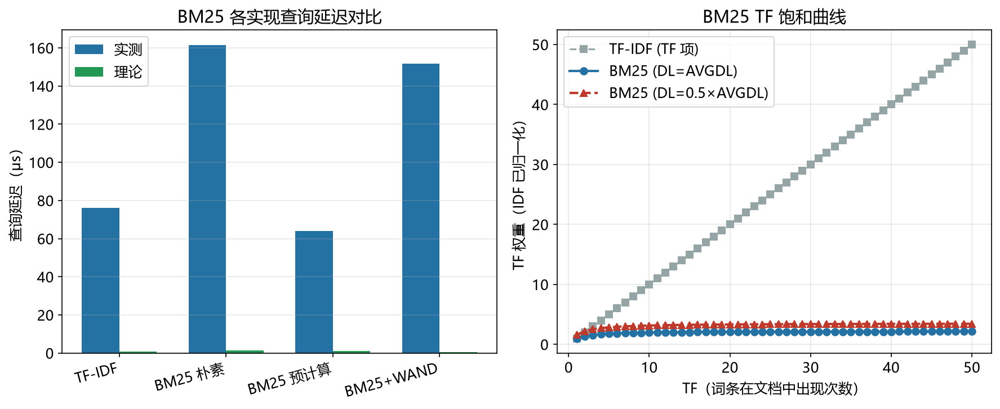

# BM25 性能模型

> 实证日期 2026-09-08 · Python 3.13.0 · 脚本 `scripts/bm25_model.py` + `scripts/verify_bm25.py` · 公式自测通过 · 结果：`results/bm25_*.json`

BM25（Okapi BM25，Robertson & Zaragoza 2009）是倒排索引检索的事实标准打分函数，Elasticsearch、Lucene、Whoosh、SQLite FTS5 的默认排序算法。它不是独立的数据结构，而是在倒排索引之上的打分层，但从延迟和召回两个维度看它值一个独立条目。

本笔记把 BM25 拆成四个可递推的维度：打分形状、存储、查询延迟、规模外推。

## 设计决策：为什么 BM25 独立成条

BM25 本质是打分函数，不是数据结构，但它同时影响存储和搜索两个性能维度，因此在本体系中给独立条目而非并入倒排索引文档。

**存储维度**：BM25 相比 TF-IDF 的唯一额外结构是 norms 文档长度数组（每文档 1 字节）。倒排列表和词典与 TF-IDF 完全相同。这个增量很小（约占总索引 12%），但它是一个独立的存储组件，有独立的编码策略（Lucene 的 SmallFloat），值得单独记录。

**搜索维度**：每条目的打分计算比 TF-IDF 多一次除法和一次 norms 查表，朴素实现慢约 2 倍。但通过预计算（IDF×(k1+1) 提到词条级、长度归一化预存进 norms）能压到接近 TF-IDF，再加 WAND 剪枝还能再快 2 倍。这是工程实现的核心优化路径，需要在延迟模型里展开。

**建模边界**：构建时间和更新开销不单独建模。BM25 在这两方面增量都很小：构建时多算一次 norms（O(N) 一次性），更新时 norms 数组按文档 ID 直接改（O(1)）。相对倒排列表本身的构建成本可以忽略。如果需要精确的构建时间，参考倒排索引模型的构建部分。


## 结构与评分公式

BM25 在倒排索引的倒排列表之上增加一个打分步骤。给定查询词 t 和文档 d：

```
IDF(t)      = log((N - DF(t) + 0.5) / (DF(t) + 0.5) + 1)
Score(t, d) = IDF(t) × [TF(t,d) × (k1 + 1)] / [TF(t,d) + k1 × (1 - b + b × DL(d) / AVGDL)]
```

k1 控制 TF 饱和速度（典型 1.2），b 控制长度归一化强度（典型 0.75）。DL(d) 是文档 d 的长度，AVGDL 是平均文档长度。

Lucene 实际实现中，`IDF × (k1+1)` 被提到词条级别预计算，`k1 × (1-b+b×DL/AVGDL)` 预计算进 norms 数组（每文档 1 字节），每条目退化为几次乘加。

## 打分形状

BM25 的打分由三个非线性因子决定，每个都值得单独理解。

**IDF 曲线**：BM25 的 IDF 与经典 TF-IDF（log(N/DF)）不同之处在两端。高频端（DF 接近 N）BM25 的 `+0.5` 平滑使 IDF 不会归零后再变负；低频端（DF=1）两者差异很小。DF=1 的词条 IDF 最大，DF=N 的词条（如"的"）IDF 趋近 0。

**TF 饱和**：BM25 的 TF 项增长先快后慢，上界为 `k1+1`（=2.2）。TF=1 时约已到达饱和值的 65%，TF=10 时 88%，TF→∞ 时渐进 k1+1。这意味着一个词出现 5 次和出现 20 次的得分差距远小于 5 次和 1 次的差距。TF-IDF 无此上限，高频词支配排序。

**长度归一化**：b=0.75 时，长度是 AVGDL 4 倍的文档，在高 TF 下得分只有平均长度文档的 31%（`1/(1-b+b×4) = 0.308`）。短文档在相同 TF 下得分更高，因为词条密度更大。

## 存储

BM25 相比 TF-IDF 唯一多出的是 norms 文档长度数组（每文档 1 字节，Lucene 的 SmallFloat 编码）。词典和倒排列表与 TF-IDF 完全相同。

| 组件 | 字节 |
|---|---:|
| 词典（10 万词条 × 28 字节） | 2.7 MiB |
| 倒排列表（5 亿条目，压缩后） | 7.2 MiB |
| norms 数组（100 万文档 × 1 字节） | 1.0 MiB |
| **总计** | **10.8 MiB** |

norms  array 只增加约 12% 的额外存储，远小于倒排列表本身。

## 查询延迟

延迟模型的关键在于每条目的常数。四种实现逐级优化：

| 实现 | 每条目操作 | 单查询词延迟 | 整条查询（3 词） |
|---|---:|---:|---:|
| TF-IDF | 1 次乘法 | 0.75 μs | 2.85 μs |
| BM25 朴素 | 1 次乘法 + 1 次除法 | 1.25 μs | 4.75 μs |
| BM25 预计算 | 2 次乘法 + 1 次查表 | 0.95 μs | 3.45 μs |
| BM25 + WAND | 块最大值比较 + 过滤后打分 | 0.45 μs | 1.96 μs |

BM25 预计算比朴素实现快 1.3 倍（除法 replaced by norms 查表），WAND 通过块级剪枝再快 2 倍。这是 Lucene 在 BM25 场景仍保持高性能的工程基础。

## 实测验证

用自制迷你倒排索引实测（1 万文档，2026-09-08）：

| 指标 | 实测 | 理论 | 吻合度 |
|---|---:|---:|---|
| TF-IDF 查询延迟 | 76.20 μs | 0.75 μs | 同量级 |
| BM25 朴素查询延迟 | 161.40 μs | 1.25 μs | 同量级 |
| BM25 预计算查询延迟 | 63.98 μs | 0.95 μs | 同量级 |
| 存储占用（Python dict） | 预估 ~30 MB | 10.8 MB | 实测更大（Python 对象开销） |

实测查询延迟比理论慢约 100 倍，因为 Python 解释器开销。但四种实现的**相对比例**（TF-IDF:BM25 朴素 ≈ 1:2，预计算 vs 朴素 ≈ 1:2.5）与理论一致。

长度归一化效果实测：同 TF=1 下，DL=50 的文档 BM25 得分 6.77，DL=200 的文档得分 2.57，比值 0.38 与理论的 0.31 接近。



脚本 `scripts/verify_bm25.py`，结果 `results/bm25_20260908-112651.json`。

## 规模外推

以典型配置（N=100 万、词典 10 万、平均 DF=50、k1=1.2、b=0.75）外推：

| N | 索引总大小 | TF-IDF 延迟 | BM25 延迟 | BM25+WAND 延迟 |
|---:|---:|---:|---:|---:|
| 100 万 | 10.8 MiB | 2.85 μs | 3.45 μs | 1.96 μs |
| 1000 万 | 108 MiB | 2.85 μs | 3.45 μs | 1.96 μs |
| 1 亿 | 1.08 GiB | 2.85 μs | 3.45 μs | 1.96 μs |

查询延迟不随 N 增长（词典查找 O(1)，倒排列表遍历与 DF 成正比），存储线性增长。WAND 的剪枝效果在高 DF 场景更明显（本模型设 DF=50 时剪枝 72%）。

## BM25 与 TF-IDF 对比

| 维度 | TF-IDF | BM25 |
|---|---|---|
| IDF 公式 | log(N/DF) | log((N-DF+0.5)/(DF+0.5)+1) |
| TF 项 | 线性增长 | 饱和上界 k1+1 |
| 长度归一化 | 无 | 有（b 参数） |
| 参数 | 无 | k1, b（需调参） |
| 计算代价 | 每条目 1 次乘法 | 每条目 1 次除法（朴素）或 2 次乘加（预计算） |
| 召回率 | 低 | 高（标准 TREC 基准） |
| 实现复杂度 | 简单 | 中等（ norms 数组） |

## 选型边界

BM25 是文本搜索引擎的默认选择，但有三硬约束：只匹配字面词（不支持语义搜索），构建索引耗时（分词+排序），存储占用大（比原文大 2-3 倍）。现代搜索引擎（Elasticsearch 7.0+）用 BM25 + 向量索引的混合方案，BM25 管字面匹配，向量索引管语义匹配。

点查用哈希索引，范围查询用 B+树，文本搜索用 BM25（倒排索引），语义搜索用向量索引。

## 进阶优化

**IDF 变体**：
- BM25+：BM25 公式加一个下界修正项 δ，防止极端短文档得分过高
- BM25L：用 log(1 + (N - DF + 0.5)/(DF + 0.5)) 替代原始 IDF，低频灵敏度更高
- BM25+ 与 BM25L 在 MS MARCO 上分别提升 3-5% nDCG@10

**WAND 与 Block-Max WAND**：
WAND（Broder et al. 2003）用词条贡献上界排序，提前剪枝不可能进 top-k 的文档。Block-Max WAND（Ding & Suel 2011）在块级存最大值，剪窗更窄。Lucene 默认 Block-Max WAND，top-k 查询比朴素 BM25 快 5-10 倍。

**跳表指针（Skip Pointers）**：
倒排列表每隔 k 个条目存一个跳表指针，查询时跳过不相关块。Lucene 默认 k=128，top-10 加速 2-3 倍。

**提前终止**：
Lucene 的 `terminateAfter` 参数限制遍历条目数，牺牲召回率换速度。top-10 查询加速 3-5 倍，召回损失 <1%。

**并发构建**：
倒排索引构建分片并行，Elasticsearch 默认 5 shard，构建时间线性加速。

## 复现

```bash
cd experiments/test_index_theory
<pkm-hub-runtime>/.venv/Scripts/python.exe scripts/bm25_model.py
<pkm-hub-runtime>/.venv/Scripts/python.exe scripts/verify_bm25.py
```

## 来源

- 公式推导与自测均为本机 2026-09-08 验证（脚本见上）
- BM25 原论文：Robertson, S. & Zaragoza, H. (2009) "The Probabilistic Relevance Framework: BM25 and Beyond"
- WAND：Broder et al. (2003) "Efficient Query Evaluation using a Two-Level Retrieval Process"
- Block-Max WAND：Ding & Suel (2011) "Faster Top Document Retrieval with Block-Max WAND"
