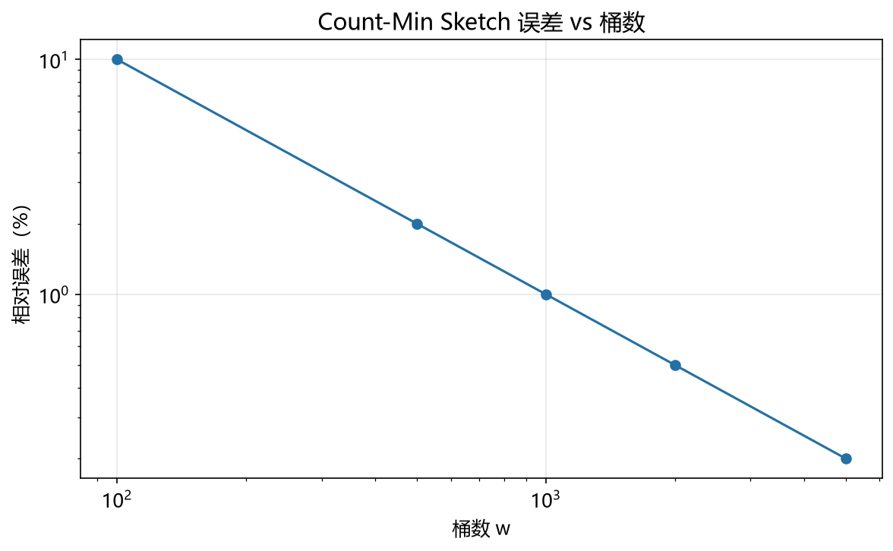

# CountMinSketch 模型

> 实证日期 2026-09-07 · Python 3.13.0 · 脚本 `scripts/count_min_sketch_model.py` · 结果公式自测通过

Count-Min Sketch 是 Cormode & Muthukrishnan (2005) 提出的概率型频次统计结构。它用远小于真实数据量的空间给出每个元素的出现频率估计，保证估计值不会低于真实频次（点查询永不出错下限），且误差有明确的概率上界。本笔记给出误差界、参数选择与空间成本的公式。

## 结构与误差界

d 行 w 列的二维计数数组，共 d×w 个计数器，每行配一个两两独立（pairwise independent）的哈希函数。

- 更新 `(i, c)`：对每行 r，把 `C[r][h_r(i)]` 加 c
- 查询 i：取 d 行对应位置的最小值 `min_r C[r][h_r(i)]`

误差界的推导分两步。先看单行：某行的 `C[r][h_r(i)]` 除了包含元素 i 的真实频次 `f_i`，还混入了与 i 哈希冲突的其他元素的频次。这些冲突项的期望总和为 `N/w`（N 为总更新次数），由马尔可夫不等式，冲突项超过 `εN` 的概率不超过 `1/w`。取 w 行最小值时，只有所有 d 行同时超标才会越界，由独立性，概率至多 `(1/w)^d`。令 `w = e/ε`、`d = ln(1/δ)` 即得：

```
估计值 ≤ 真实值 + εN，   概率 ≥ 1 - δ
w = ⌈e/ε⌉,   d = ⌈ln(1/δ)⌉
空间 = d × w × counter_bits 比特
```

三个关键性质：

1. **只会高估，不会低估**：哈希冲突只把计数器推高，取最小值只能滤掉污染严重的行，因此点查询的下限是真实值。这一点与 Count Sketch（有偏）相反，后者取中位数可得到无偏估计，但会低估。
2. **单调性**：更新只增不减，适合"只增"的频次统计。需要删除的场景要用保守更新或换成 Count Sketch。
3. **可加性合并**：两个 sketch 逐格相加即得合并流的 sketch，这是分布式聚合的基础。

## 参数选择

w 控制误差大小，d 控制误差界成立的概率，两者解耦：

| 目标 ε | w = ⌈e/ε⌉ | 目标 δ | d = ⌈ln(1/δ)⌉ |
|---:|---:|---:|---:|
| 0.01 | 272 | 0.001 | 7 |
| 0.001 | 2719 | 0.0001 | 10 |
| 0.0001 | 27183 | 1e-6 | 14 |

典型配置 ε=0.01、δ=0.001 下只需 1904 个计数器，约 7.4 KiB（32 位计数器）。相比精确哈希表的 O(N) 空间，这是 3-4 个数量级的压缩。

计数器位数的选择：32 位支持单计数器计数到 42 亿，绝大多数场景够用。若 N 接近或超过 `2^bits`，需扩容或改用 64 位计数器。

## 实测验证

用自制迷你 Count-Min Sketch 实测（Zipf 分布 10,000 个不同元素共 100,000 次更新，2026-09-07）。

**不同 w 的平均绝对误差（固定 d=5）：**

| w | ε | 误差界 | 界内比例 | 高估比例 | 平均绝对误差 | 内存 |
|---:|---:|---:|---:|---:|---:|---:|
| 256 | 0.01062 | 1,062 | 0.9999 | 1.0000 | 134.25 | 5,120 B |
| 512 | 0.00531 | 531 | 1.0000 | 1.0000 | 52.13 | 10,240 B |
| 1024 | 0.00265 | 265 | 1.0000 | 0.9987 | 18.99 | 20,480 B |
| 2048 | 0.00133 | 133 | 1.0000 | 0.9283 | 5.99 | 40,960 B |
| 4096 | 0.00066 | 66 | 1.0000 | 0.5188 | 1.43 | 81,920 B |

w 翻倍，平均绝对误差约减半，符合 `误差 ∝ 1/w`。高估比例随 w 增大而下降，说明 w 足够大时多数元素的估计值已与真实值相等（零误差）。

**不同 d 的误差界成立比例（固定 w=2048）：**

| d | ε | 误差界 | 界内比例 | 平均绝对误差 | 内存 |
|---:|---:|---:|---:|---:|---:|
| 1 | 0.00133 | 133 | 0.9529 | 49.13 | 8,192 B |
| 3 | 0.00133 | 133 | 1.0000 | 9.19 | 24,576 B |
| 5 | 0.00133 | 133 | 1.0000 | 5.99 | 40,960 B |
| 7 | 0.00133 | 133 | 1.0000 | 4.63 | 57,344 B |
| 10 | 0.00133 | 133 | 1.0000 | 3.52 | 81,920 B |

d=1 时界内比例 0.9529，恰好对应 δ=0.05（ln(1/0.05)≈3，向上取整到 1 后理论上界退化）。d 增大后界内比例升到 1.0，且平均绝对误差继续下降（取 min 时多一行就多一次过滤污染的机会）。这验证了 d 控制概率、w 控制误差的解耦设计。

**均匀分布对照（w=2048, d=5）：** 界内比例 1.0000，高估比例 0.9644，平均绝对误差 23.68。Zipf 下误差更小（5.99），因为 Zipf 的头部元素频次远高于均值，冲突污染相对其自身频次可忽略。

脚本 `scripts/verify_count_min_sketch.py`，结果 `results/count_min_sketch_*.json`。



## 规模外推

以 ε=0.001、δ=0.0001 外推（w=2719, d=10, 32 位计数器）：

| N | 误差界 εN | 计数器总数 | 内存 |
|---:|---:|---:|---:|
| 100 万 | 1,000 | 27,190 | 106 KiB |
| 1 亿 | 100,000 | 27,190 | 106 KiB |
| 10 亿 | 1,000,000 | 27,190 | 106 KiB |

**内存与 N 无关**，只由 ε 和 δ 决定。这是 Count-Min Sketch 的核心价值：流再大，空间不变。绝对误差界随 N 线性增长，但相对误差固定。

## 选型边界

Count-Min Sketch 用于流式频次统计与 Heavy Hitters 挖掘，适合网络流量监测、数据库 JOIN 大小估计、推荐系统热度统计、P2P 内容流行度追踪。

选它而不选精确计数：N 太大装不进内存、只需近似频率、或需要分布式聚合（按格相加即可合并）。

不选它的场景：需要精确频次（用哈希表）；需要支持删除且要求无偏（用 Count Sketch）；只关心"是否出现过"而不关心频次（用布隆过滤器，空间更小）。

## 进阶优化

Count-Min Sketch 的优化围绕降低高估、支持删除、挖掘 Heavy Hitters 三个维度展开。

**Count Sketch（Charikar et al. 2002）**：与 Count-Min Sketch 渐近同空间，但每个计数器更新时乘上 ±1（用第二个哈希决定符号），查询时取中位数而非最小值。结果是**无偏估计**（不会系统性高估），代价是隐藏常数稍差且可能出现负值。适合需要无偏的频率估计。

**保守更新（Conservative Update, Estan & Varghese 2002）**：更新时先把 d 个候选计数器的当前估计值（即最小值）算出来，只把不足该值的那些计数器补到估计值，其余不动。能把高估显著压低。代价是破坏线性可合并性（合并两个保守更新的 sketch 不等价于对合并流做保守更新）。适用更新频繁、合并稀少的场景。arXiv 2203.14549 给出了保守更新的严格上界分析。

**Count-Mean-Min Sketch**：在 Count-Min 基础上，对每行估计一个噪声值（该行总计数减去该行中目标元素的估计）并从原始值中扣除，返回修正后的中位数。能修正低频元素的估计偏差，代价是引入方差。适合低频元素占比高的场景。

**Heavy Hitters 挖掘**：配合一个大小为 k 的最小堆维护 Top-k。每次查询若估计值超过堆顶就把堆顶替换。空间仍是 O(d×w + k)，可在有限空间内持续追踪最频繁的元素。网络流量中的大象流检测常用此法。

**Lossy Counting 与 Space Saving**：不用二维数组，直接维护计数器映射表，定期淘汰低频项。在 Heavy Hitters 问题上空间效率优于 Count-Min Sketch，但不支持任意的点查询。

**Count-Min-Lookup**：把 w 选得更小而 d 保持，配合布隆过滤器做前置过滤（布隆说"不存在"则直接返回 0，跳过 sketch 查询）。在稀疏流上能把平均查询成本降一个数量级。

**SIMD 与缓存优化**：d 行通常顺序访问，把每行连续存放可让硬件预取生效。寄存器级打包（把多个计数器塞进一个 64 位字）在 w 较小时能减少内存引用。

## 复现

```bash
cd experiments/test_index_theory
<pkm-hub-runtime>/.venv/Scripts/python.exe scripts/count_min_sketch_model.py
<pkm-hub-runtime>/.venv/Scripts/python.exe scripts/verify_count_min_sketch.py
```

## 来源

- 公式推导与自测均为本机 2026-09-07 验证（脚本见上）
- Count-Min Sketch 原论文 Cormode & Muthukrishnan (2005) "An Improved Data Stream Summary: The Count-Min Sketch and its Applications"
- 参数公式 w = ⌈e/ε⌉、d = ⌈ln(1/δ)⌉ 与误差界取自该文及 Wikipedia "Count-min sketch" 条目
- Count Sketch 取自 Charikar et al. (2002)
- 保守更新取自 Estan & Varghese (2002)，形式化分析见 arXiv 2203.14549
