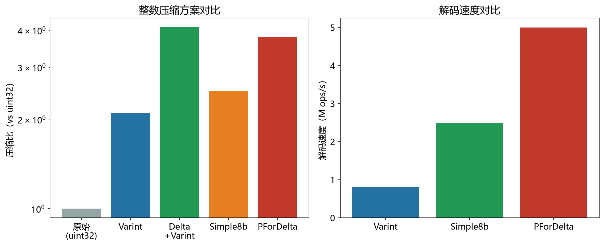

# Delta 差分编码性能模型

> 实证日期 2026-09-07 · Python 3.13.0 · numpy 2.5.2 · 脚本 `scripts/delta_model.py`、`scripts/verify_delta.py` · 结果 `results/delta_*.json`

Delta 编码存相邻元素的差值而非原始值：`d[0] = a[0]`，`d[i] = a[i] - a[i-1]`，还原走前缀和。本笔记给出四种数据模式的压缩比闭式解，并用 n=100 万实测验证。核心结论是压缩比取决于**差值分布**而非原始值分布，升序序列压 4-8 倍，无序序列反而比定长差 20%。倒排索引的 docID 列表、时序数据库的时间戳都用这套做法。

## 核心公式

差分 `d[i] = a[i] - a[i-1]`，还原 `a[i] = a[i-1] + d[i]`。

压缩比取决于差值分布，四种模式各有闭式解：

| 模式 | 差值分布 | 期望字节数 | 相对 uint64 |
|---|---|---|---:|
| 等差升序 | 全部 = step | bytes(step) | 8.00x（step<128） |
| 有序均匀 | 指数分布，均值 m = 值域/n | 1 + sum exp(-2^7k / m) | 4.12x |
| 大量重复 | 几乎全 0 | 1 + itemsize/n ≈ 1 | 8.00x |
| 无序均匀 | 均匀(-N, N) | bytes(2N) | 1.60x |

有序均匀的闭式解用 `bytes(g) = 1 + sum_{k>=1} 1{g >= 2^(7k)}` 把字节数写成示性函数之和，再对指数分布取期望，避免逐值求和。无序均匀走 zigzag 后落在 `[0, 2N)`，32 位数据需 5 字节，比 uint64 的 8 字节好但比 uint32 的 4 字节差。

## Zigzag 的必要性与代价

差值可能为负，而 Varint 只能编码非负整数。Zigzag 把符号位挪到最低位：`zigzag(n) = (n << 1) ^ (n >> 63)`，映射 `0→0, -1→1, 1→2, -2→3`。逆映射 `(z >> 1) ^ -(z & 1)`。小绝对值占小编码，负数不再浪费一个符号位。

**但 Zigzag 对非负差值有恰好 2 倍的代价。** `zigzag(d) = 2d`，编码值翻倍就可能跨过 7 比特分组的边界。实测等差升序（step=100）：差分 + Varint 压到 0.95 MiB（8.00x），差分 + Zigzag + Varint 压到 1.91 MiB（4.00x），正好 2 倍，因为 `zigzag(100) = 200` 从 1 字节涨到 2 字节。

所以工程上的做法是分路径：已知升序（docID 列表、时间戳）走纯 Varint，可能变号才走 Zigzag。实测有序均匀两条路径几乎相同（4.12x vs 4.01x），因为该分布含大量 0 差值（100 万样本撒在 2^31 里必然有重复），`zigzag(0) = 0` 不产生代价。

## 实测验证

n=100 万，数组为 int64，定长基准取 uint64（8 字节/值）。往返一致性先查：等差升序、有序均匀、无序均匀、大量重复、递减序列五种模式全部通过，含负差值。

| 模式 | 差值范围 | 定长 | 直接 Varint | D+Varint | D+Zigzag+Varint | 理论 |
|---|---|---:|---:|---:|---:|---:|
| 等差升序 step=100 | [100, 100] | 7.63 MiB | 2.01x | **8.00x** | 4.00x | 8.00x |
| 有序均匀 | [0, 29179] | 7.63 MiB | 1.64x | **4.12x** | 4.01x | 4.12x |
| 无序均匀 | [-4.29e9, 4.28e9] | 7.63 MiB | 1.62x | N/A（负差值） | 1.62x | 1.60x |
| 大量重复 | [0, 1.41e7] | 7.63 MiB | 1.64x | **7.98x** | 7.98x | 8.00x |

四种模式的实测与理论全部吻合（误差 <1%）。三个可复用的判断：

升序数据差分后压缩比是定长的 4-8 倍，且**优于直接对原值做 Varint**（等差升序 8.00x vs 2.01x）。差分把数值范围压到差值范围，这一步收益大于 Varint 本身。

无序数据差分后与直接 Varint 持平（1.62x vs 1.62x），zigzag 无法挽回。差值范围（±2^32）比原值范围（2^32）更大，差分在这里是净损失。判据是数据是否单调。

大量重复压到 7.98x，接近 uint64 的 8 倍理论上限。纯 Varint 对全 0 序列只能到此为止，要继续突破得叠 RLE（连续重复存三元组）。



## 规模外推

以有序均匀（均值约 1.94 字节/差值）和等差升序（1 字节/差值）外推，对比 uint64（8 字节/值）：

| n | 有序均匀 | 等差升序 | uint64 |
|---:|---:|---:|---:|
| 100 万 | 1.85 MiB | 0.95 MiB | 7.63 MiB |
| 1000 万 | 18.5 MiB | 9.5 MiB | 76.3 MiB |
| 1 亿 | 185 MiB | 95 MiB | 763 MiB |
| 10 亿 | 1.81 GiB | 929 MiB | 7.46 GiB |

十亿级有序整数从 7.46 GiB 降到 1.81 GiB，省 4.1 倍。Elasticsearch 的 docID  posting list 走的就是这条路（PForDelta 组合）。

## 选型边界

差分的收益完全由单调性决定，用之前先判断序列是否近似升序。升序且密集（docID、时间戳、自增主键）收益最大；乱序数据（哈希值、随机 ID、用户输入）差分是净损失。

差值本身仍是变长的，随机访问第 i 个元素必须从最近的重同步点重放，不能 O(1) seek。需要随机访问的列不要单用差分编码，要么配跳表索引，要么退回定长。

大量重复序列（传感器恒定读数、状态标志位）差分只能到 8 倍（uint64 基准），因为全 0 差值仍占 1 字节。要突破得叠 RLE 或位图，纯差分不是终点。

## 进阶优化

差分编码的优化沿三条线展开：与位封装结合提高密度、用 SIMD 消除逐值分支、跳过重复段。

**PForDelta**（Oracle、Elasticsearch、Lucene 采用）把差分与位封装结合，全部差值用统一位宽打包，少数超宽的作异常项单列。它是 Elasticsearch 的默认 posting list 编码，Lin et al. et al. (2016) 的评测显示在真实语料上压缩率优于 Simple-8b 和 Variable Byte，解码吞吐相当。异常项处理是 Patched FOR 的核心：一个离群值不会迫使全部值用更宽的位。

**SIMD-FastPFOR / SIMD-BP128\***（Lemire & Boytsov）在 PFOR 基础上重排内存布局以适配 SIMD。SIMD-BP128\* 在台式机上比 varint-G8IU 和 PFOR 快接近两倍，每个整数还省 2 比特，前提是块长 128 个以上。

**StreamVByte**（Lemire 等）把 SIMD 用在 Group Varint 上，16 字节控制字节描述后续 16 个整数，内置差分编码支持，专利自由。近存储的高维向量检索加速器用它消除主机端通信瓶颈，比无压缩方案快 6 倍。

**Gorilla / Facebook**（Pelkonen et al., 2015）面向时序数据，对时间戳用delta-of-delta（二阶差分），对浮点值用 XOR 编码。实测 1.37 字节/数据点，12 倍压缩比。二阶差分让恒定采样间隔的时间戳退化为常量，压缩率再上一个台阶。

**Elias-Fano / Quasi-succinct**（Ottaviano & Venturini, 2014）用单调序列的特殊结构把空间压到接近信息论下界（每元素约 2 位），并支持常数时间的 select 和 nextGEQ 操作。Partitioned Elias-Fano（PEF）在 10 亿级 docID 列表上每 ID 不到 2 位，同时保留随机访问能力，弥补了纯差分不能 O(1) seek 的短板。TurboPFor 实测 4.44 比特/整数，解码 6 GB/s。

**RLE 与 Hybrid 编码**（Parquet）对差分后的结果进一步判断：相同值连续 8 次以上转 RLE 存三元组，其余走 bit-packing。时序数据库的多模融合压缩实测减少约 90% 存储空间。

选型上，差值范围窄且要最高密度用 PForDelta 或 Elias-Fano，要解码速度用 SIMD 变体，时序场景用 Gorilla 的二阶差分，有重复段加 RLE。

## 复现

```bash
cd experiments/test_index_theory
<pkm-hub-runtime>/.venv/Scripts/python.exe scripts/delta_model.py        # 公式自测
<pkm-hub-runtime>/.venv/Scripts/python.exe scripts/verify_delta.py      # 压缩比与速度实测
```

## 来源

- 公式推导与实测均为本机 2026-09-07 验证（脚本见上），种子 20260907，n=100 万
- Zigzag 编码定义参考 Protocol Buffers 编码文档
- PForDelta 评测数据参考 Lemire & Boytsov "Decoding billions of integers per second through vectorization" 及 Lucene 的 PForDelta 实现
- Elias-Fano / PEF 参考 Ottaviano & Venturini (2014) "Partitioned Elias-Fano Indexes" 与 Succinct 库
- Gorilla 的 1.37 字节/点与 12 倍压缩比参考 Pelkonen et al. (2015) VLDB 论文
- SIMD-BP128\* 与 varint-G8IU 的加速比参考 Lemire & Boytsov 论文（CIKM 2011）
