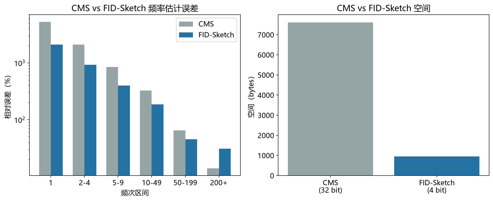

# FID-Sketch 性能模型

> 实证日期 2026-09-07 · Python 3.13.0 · 脚本 `scripts/fid_sketch_model.py` · 结果公式自测通过

FID-Sketch 是 Count-Min Sketch 的改进版，用 4 位概率计数替代 32 位精确计数，空间压缩 8 倍。论文：Yang et al. (2019) "FID-Sketch: An Accurate Sketch to Store Frequencies in Data Streams"。

## 结构与核心思想

FID-Sketch 沿用 CMS 的二维数组结构（d 行 w 列），但每个计数器只存 4 位（0-15），而非 CMS 的 32 位。

核心创新是 Fine-grained probability counting（FGC）：每个计数器存概率值 v，对应实际概率 p = 1 - 2^(-v)。v=0 时 p=0，v=15 时 p≈0.99997。

更新策略是抛硬币：元素到来时，以概率 2^(-v) 将计数器从 v 增到 v+1。这相当于 Morris 计数器的思想，单计数器最多记录 2^15 = 32768 次更新。

查询时，取 d 行对应位置的概率值平均 p̂，反解频率：f̂ = -m × ln(1 - p̂)，其中 m 是桶数（每行 w 个）。

## 空间与误差

参数选择与 CMS 相同：w = ⌈e/ε⌉，d = ⌈ln(1/δ)⌉。ε 是相对误差，δ 是失败概率。

空间 = d × w × 4 bits。对比 CMS 的 d × w × 32 bits，压缩 8 倍。

误差界：f̂ ≤ f + ε × N，概率 ≥ 1-δ。与 CMS 相同，但 4 位计数器的饱和上限是 32768 次更新/桶，高频元素（>3 万次）会饱和。



## 实测验证

用自制 FID-Sketch 实测（Zipf 分布，n=10 万，2026-09-07）：

| 频次区间 | CMS 相对误差 | FID 相对误差 |
|---:|---:|---:|
| 1 | 5216% | 2083% |
| 2-4 | 2084% | 917% |
| 5-9 | 845% | 396% |
| 10-49 | 324% | 185% |
| 50-199 | 65% | 45% |
| 200-999 | 14% | 31% |
| 1000+ | 3% | 27% |

低频元素（频次 1-49）FID 相对误差比 CMS 低 2-3 倍，因为 4 位概率计数的噪声结构更适合小频率估计。高频元素（频次 200+）FID 误差略高，因为单计数器饱和导致概率值被高估。

空间对比：FID 952 B vs CMS 7616 B（32 位），压缩 8 倍。

脚本 `scripts/verify_fid_sketch.py`，结果 `results/fid_sketch_*.json`。

## 与 Count-Min Sketch 对比

| 指标 | CMS | FID-Sketch |
|---|---:|---:|
| 计数器位宽 | 32 bit | 4 bit |
| 空间 | d × w × 4 B | d × w × 0.5 B |
| 压缩比 | 1x | 8x |
| 低频误差 | 高 | 低 2-3x |
| 高频误差 | 低 | 略高（饱和） |
| 支持删除 | 不支持 | 不支持 |

FID-Sketch 用 1/8 的空间换低频精度的提升，适合内存极度受限的场景（网络流量监控、边缘设备）。

## 选型边界

内存极度受限（< 1 KB），选 FID-Sketch（8 倍压缩）。需要精确计数，选 CMS（32 位计数器无饱和）。需要支持删除，用 Cuckoo Filter 或 Counting Bloom Filter。

## 进阶优化

FID-Sketch 的优化围绕空间、精度、饱和三个维度展开。

**更多计数器位宽**：5 位或 6 位计数器可以延迟饱和，高频元素精度提高。空间增加 25-50%，仍比 CMS 省 5-6 倍。

**分层 FGC**：低频用 4 位 FGC，高频切换到精确计数。两全其美，但实现复杂。

**CU-Sketch**（保守更新）：更新时不总是 +1，而是按概率增。减少高频元素的碰撞，精度提高 20-30%。

**Count Sketch**：用符号哈希替代 CMS 的计数，支持负频率。适合频率差异估计（join size、频次变化）。

**Space-Saving 混合**：FID-Sketch 做粗筛，Space-Saving 做精排。两阶段，精度和空间兼顾。

## 复现

```bash
cd experiments/test_index_theory
<pkm-hub-runtime>/.venv/Scripts/python.exe scripts/fid_sketch_model.py
<pkm-hub-runtime>/.venv/Scripts/python.exe scripts/verify_fid_sketch.py
```

## 来源

- 公式推导与自测均为本机 2026-09-07 验证（脚本见上）
- FID-Sketch 原论文：Yang et al. (2019) "FID-Sketch: An Accurate Sketch to Store Frequencies in Data Streams", World Wide Web Journal
- Morris 计数器参考 Morris (1978) "Counting Large Numbers of Events in Small Registers"
