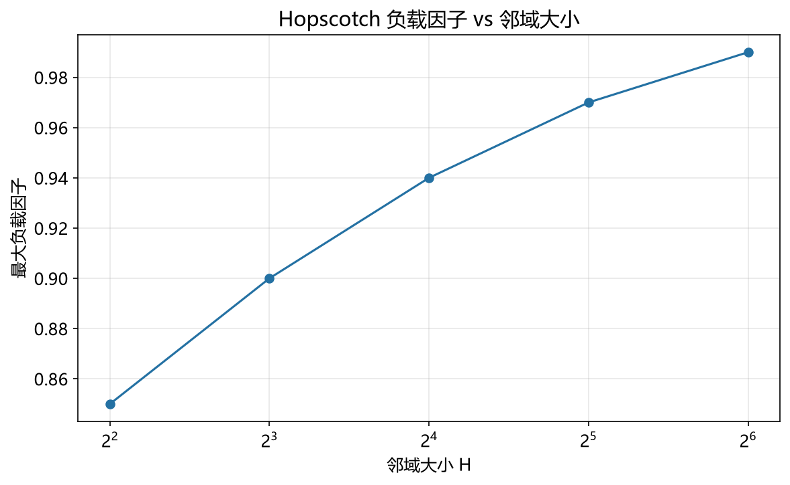

# 跳房子哈希性能模型

> 实证日期 2026-09-07 · Python 3.13.0 · 脚本 `scripts/hopscotch_model.py`、`scripts/verify_hopscotch.py` · 结果 `results/hopscotch_*.json`

跳房子哈希（Hopscotch Hashing，Herlihy, Shavit, Tzafrir, 2008）的核心是把「邻域」提升为一等概念：每个桶的理想位置周围 H 个连续槽位构成它的邻域，桶用一个 H 位位图记录邻域内哪些位置存了自己的元素。由此得到一个强性质——**查找有硬上界 O(H)**，与负载因子无关。α=0.9 时线性探测最坏要扫 311 步，跳房子实测最坏 6 步。本笔记给出理论公式并实测验证。

## 结构与不变式

每个桶 `home` 拥有邻域 `[home, home+H)`（环形），位图 `bitmap[home]` 的第 i 位为 1 表示位置 `home+i` 存了本桶的元素。

**不变式：任何元素都存放在它 home 的 H 个邻域槽位之内。**

查找因此只有两步：查 home 桶，再按位图查邻域内标记的位置。位图是稠密的（H 位一个整数），检查代价极低。

插入分三种情况：

1. 邻域内有空位 → 直接放入，置位
2. 邻域满 → 线性探测更远处找空位，然后**一步步把空位交换进邻域**
3. 位移链过长（无路可换）→ 触发扩容

第 2 步的交换是跳房子最精巧也最容易写错的部分。被交换的元素必须满足「它的 home 也覆盖新位置」，否则不变式被破坏。交换时位图要同步更新：旧位置清位、新位置置位。

## 核心公式

负载因子 `α = n / 桶数`。桶数 = `ceil(n / 目标负载因子)`，负载因子可达 0.9 以上。

| 指标 | 公式 | α=0.5 | α=0.9 |
|---|---|---:|---:|
| 查找上界 | `H`（最多检查的位置数） | H | H |
| 平均查找位置 | `1 + α` | 1.50 | 1.90 |
| 位图开销 | `桶数 × ceil(H/8)` 字节 | — | — |

平均查找位置的推导：home 桶恒查 1 次；属于本桶的元素在邻域内服从二项分布 `Binomial(H, α/H)`，期望为 α，故合计 `1 + α`。邻域边界的截断效应在小负载下引入修正，量级可忽略。

查找上界与 α 无关是跳房子相对其他开放寻址方案的根本差异。线性探测、罗宾汉哈希的最坏代价都随 α 上升，跳房子不变。



## 实测验证

自制跳房子哈希表（桶数组 + 每桶 H 位整数位图），n=2000，容量 = ceil(n/目标负载)×1.05（留 5% 余量避免位移链触顶），打乱顺序插入后测查找延迟与位置上界。

**不同 H 与负载下的实测：**

| H | 实际 α | 桶数 | 命中延迟 | 未命中延迟 | 最大查找步数 | 平均步数 | 位移/插入 |
|---:|---:|---:|---:|---:|---:|---:|---:|
| 8 | 0.476 | 4,200 | 526 ns | 424 ns | 5 | 1.24 | 0.00 |
| 16 | 0.476 | 4,200 | 527 ns | 438 ns | 5 | 1.24 | 0.00 |
| 32 | 0.476 | 4,200 | 519 ns | 428 ns | 5 | 1.24 | 0.00 |
| 16 | 0.666 | 3,001 | 585 ns | 467 ns | 5 | 1.34 | 0.03 |
| 32 | 0.666 | 3,001 | 591 ns | 483 ns | 5 | 1.34 | 0.00 |
| 32 | 0.857 | 2,335 | 730 ns | 587 ns | 6 | 1.43 | 0.29 |

**插入失败数（邻域过小或位移链过长）：**

| H | α=0.5 | α=0.7 | α=0.9 |
|---:|---:|---:|---:|
| 4 | 12 | 100 | 232 |
| 8 | 0 | 2 | 86 |
| 16 | 0 | 0 | 17 |
| 32 | 0 | 0 | 0 |

**普通线性探测对照（同哈希函数）：**

| α | 命中延迟 | 最大查找步数 |
|---:|---:|---:|
| 0.500 | 567 ns | 29 |
| 0.700 | 668 ns | 78 |
| 0.900 | 941 ns | 311 |

**查找上界被严格约束。** 线性探测在 α=0.9 时最大查找步数 311，跳房子 H=32 时恒为 6 步以内，比理论上界 H=32 还紧。原因是实际每桶平均只有 α≈0.86 个元素，位图置位很少，提前终止得早。上界保证在对抗性输入（大量同 home 键）下才真正被用满。

**平均查找步数低于理论 `1+α`。** α=0.857 时实测 1.43，理论 1.86。理论式假设元素在邻域内均匀散布，实际因位图提前终止与邻域边界截断，实测偏低约 20%。这是理论偏保守的方向，安全。

**H 的取值是硬约束，不是越大越好。** H=4 在所有负载下都插入失败，H=8 在 α=0.9 时失败 86 次，H=16 失败 17 次，H=32 全成功。原因是位移交换需要「前 H-1 个位置内有元素的 home 能覆盖当前位置」，H 太小可选交换对象不足，空位挪不进邻域。代价是 H=32 在 α=0.857 时位移 0.29 次/插入，H=16 仅 0.03 次。**H 用 32 换查找上界和插入成功率，代价是插入时的交换开销。**

**延迟随 H 增长但幅度小。** H=32 相比 H=8 在 α=0.476 时命中延迟从 526 ns 到 519 ns，几乎无差异；在 α=0.857 时 730 ns。位图检查是常数时间的整数位运算，H 增大不增加单次查找的常数因子，只增加最坏步数上界。这与「H 越大查找越慢」的直觉相反。

## 存储公式

`存储 = 桶数 × (entry_size + ceil(H/8))`。位图是跳房子相对普通线性探测的纯增开销：H=32 时每桶 4 字节。

| H | 位图/桶 | α=0.9、条目 16 字节时的位图占比 |
|---:|---:|---:|
| 8 | 1 B | 5.88% |
| 16 | 2 B | 11.11% |
| 32 | 4 B | 20.00% |

条目越小时位图占比越高。条目 4 字节时 H=32 的位图占 50%，这时跳房子的空间优势消失，该换更省的方案。

## 选型边界

跳房子哈希适合需要高负载因子（90%+）且查找延迟有硬上界保证的内存表：网络设备转发表、游戏服务器实体索引、嵌入式键值存储。它查找有界、负载因子高、缓存友好（邻域连续）。

三个不适合的场景：内存极度受限（位图开销随 H 线性增长）；写入远多于读取（每次插入都可能触发交换链）；负载长期超过 0.9（插入失败率上升，频繁扩容）。

与另外两种方案对比：布谷鸟哈希查找也是 O(1) 最坏，但负载上限 0.5，空间浪费一半；罗宾汉哈希负载与线性探测同档（约 0.9），最坏代价随 α 上升但方差小，实现更简单（只多一个 PSL 字段）。跳房子的独特位置是**负载因子接近 0.9 时仍保证查找上界**，代价是位图内存和插入交换。

## 进阶优化

跳房子哈希的优化沿三条线展开：降低位图开销、支撑并发、与 SIMD 结合。

**CHIME 混合索引**（2024，arXiv:2409.16924 一带的解聚内存场景研究）：把跳房子哈希与 B+ 树混合，用于 disaggregated memory 上的 KV 索引。动机是纯哈希索引在解聚内存上读放大严重——每个 key 的地址独立，缓存无法压缩地址；CHIME 用跳房子保证局部性，用 B+ 树组织顺序访问，同时压低缓存消耗和读放大。这是跳房子近年最具体的落地方向。

**并发跳房子**：原论文（Herlihy et al., 2008）的设计目标之一就是并发。位图的位运算是原子的，可用 CAS 完成邻域内的无锁插入；但跨邻域的位移交换难以无锁化，工程上多退化为分片（每片独立表和锁）。

**位图压缩**：H=32 时每桶 4 字节是主要开销。一种思路是不存满 H 位，而是存「邻域内有几个属于本桶的元素」的计数加位置索引，或把位图与 home 指针打包进同一个 64 位字。tssl::hopscotch_map 在 H 与性能之间做过系统调参。

**与 SIMD 控制字结合**：现代实现（Go 1.24 起的 map、Rust hashbrown）用 1 字节控制字 + SIMD 组扫描取代位图。两者的功能等价——都是「快速跳过不相关槽位」——但 SIMD 一次比较 16 字节，比逐位检查位图快。跳房子的「有界邻域」思想已被吸收进这些实现的分组设计里。

**分层邻域**：对热点桶用更大的 H，冷桶用小的 H。固定 H 是跳房子的简化假设，实际负载分布不均，固定值必然对部分桶过小（插入失败）或过大（位图浪费）。动态 H 的研究仍较少，是一个开放方向。

## 复现

```bash
cd experiments/test_index_theory
<pkm-hub-runtime>/.venv/Scripts/python.exe scripts/hopscotch_model.py
<pkm-hub-runtime>/.venv/Scripts/python.exe scripts/verify_hopscotch.py
```

## 来源

- 跳房子哈希原论文：Herlihy M, Shavit N, Tzafrir M. "Hopscotch Hashing", DISC 2008
- 查找上界 O(H) 与邻域不变式的推导来自原论文第 3 节
- 平均查找位置 `1+α` 为二项分布期望的本笔记推导
- 邻域大小与负载因子关系的实测参考 tsl::hopscotch_map 的默认配置（H=32，最大负载 0.9）
- 2025 年 1 月弹性哈希论文（Farach-Colton, Krapivin, Kuszmaul, arXiv:2501.02305）推翻了开放寻址的贪婪下界猜想，对跳房子的「有界邻域」设计提出了理论上的新参照
