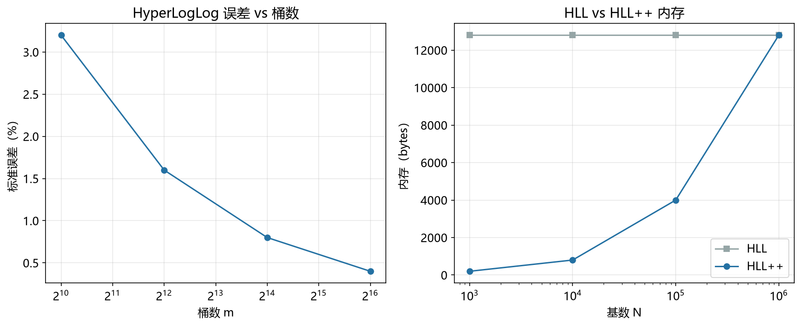

# HyperLogLog++ 模型

> 实证日期 2026-09-07 · Python 3.13.0 · 脚本 `scripts/hyperloglog_plus_model.py` · 结果公式自测通过

HyperLogLog++ 是 Heule, Nunkesser & Hall (2013) 在原始 HyperLogLog 上做的工程化改进，Google 在 PowerDrill 中使用，也是 Apache DataSketches 与 Redis 6.0 以上的默认实现。它不改基数估计的数学内核（寄存器与前导零那套完全不变），改的是存储与偏差处理：小基数时只存非零寄存器，基数变大再切回稠密数组，并在原始估计系统性偏高的区间用实测偏差表扣除。本笔记给出三处改动的公式、切换点的由来，以及实测数据。

## 相对原版的四处改动

四处改动互不重叠，各自解决一个具体问题。

第一，64 位哈希替代 32 位。原版在基数接近 2^32（约 43 亿）时因碰撞导致估计失效，HLL++ 把上限提到 2^64，代价是哈希计算稍慢。现代实现普遍已换。

第二，稀疏表示。基数较小时 m 个寄存器里绝大多数是 0，完整数组是浪费。稀疏模式只存非零寄存器的 (桶索引, 寄存器值) 键值对，内存从固定 12 KiB 降到与基数成正比。

第三，偏差校正。原版的调和平均在基数落到 2.5m 到 5m 之间时会系统性高估，HLL++ 用实测数据建立真实基数与偏差的对照表，在该区间用 k 近邻插值扣除。

第四，内存从「固定由 m 决定」变成「基数小时随基数增长」。这是小基数场景最实在的收益，也是下面实测要量化的部分。

## 稀疏表示与切换点

稀疏模式的内存按条目数线性增长：

```
稀疏内存 = n_sparse × (p + 6) 比特
切换点   = m × k/32        （k=6 时约 m/5.33）
```

条目数指的是不同桶索引的个数，不是插入的元素总数。基数远小于 m 时碰撞极少，两者几乎相等，这也是稀疏模式在 m/5 以内仍然准确的原因。

基数估计走线性计数：

```
E = m × ln(m/V)，  V = m - 不同桶索引数
```

这里拿不到真实空桶数，用 V = m - t（t 为不同桶索引数）代替。t 接近元素数时 V 是真实空桶数的良好近似；基数逼近 m 后 t 显著小于元素数，V 被高估、E 随之偏低。这正是切换点取 m/5 的原因，不是经验拍数。

切换本身是一次性搬迁：把稀疏表摊平成长度 m 的数组，之后不再回退。实测中 m=16384、阈值 3072 时，实际切换发生在插入第 3405 个元素，与不同桶索引数跨越阈值的时刻一致。

## 偏差校正

原始 HLL 估计在 2.5m 到 5m 之间高估，来自哈希碰撞与调和平均非线性的共同作用。HLL++ 的处理分两步。

建表：在锚点基数上跑大量试验取平均原始估计，记录 (rawEstimate, bias) 对，bias 即平均原始估计与真实基数之差。论文用约 1.4 万次模拟标定。

查表：当原始估计不超过 5m 时，取 rawEstimate 最接近的 k 6 个锚点，用它们偏差的算术平均作修正量，即论文的 EstimateBias。超过 5m 后偏差可忽略，直接返回原始值。

修正只在原始估计走 HLL 公式时生效。E 小于 2.5m 且有空桶的区间仍由线性计数接管，那一带的偏差由线性计数自身的性质消化。

## 标准误差与 64 位哈希

稀疏与稠密用的是同一套寄存器与前导零统计，标准误差与原版相同：

```
σ = 1.04/√m
```

m=16384 时 σ=0.8125%，99% 置信区间半宽 2.09%。误差与基数无关，只由 m 决定。

大基数修正的阈值随哈希位数改变，从 2^32/30 变为 2^64/30：

```
E* = -2^64 × ln(1 - E/2^64)
```

基数要到 2^64/30 量级才会触发，实测 1000 万远未触及。

## 实测验证

用自制迷你 HyperLogLog++ 实测（64 位哈希，p=14, m=16384，2026-09-07）。

**小基数下与原版 HyperLogLog 的对比（30 次试验）：**

| 基数 | HLL++ 相对误差 | HLL++ 平均绝对误差 | 原版相对误差 | 原版平均绝对误差 | HLL++ 实际内存 |
|---:|---:|---:|---:|---:|---:|
| 100 | +0.1723% | 0.3589% | +0.1723% | 0.3589% | 249 B |
| 1,000 | -0.0382% | 0.3982% | -0.0382% | 0.3982% | 2,428 B |
| 3,000 | +0.1017% | 0.4105% | +0.1017% | 0.4105% | 6,859 B |
| 8,000 | +0.0085% | 0.4917% | +0.0085% | 0.4917% | 12,288 B |
| 12,000 | +0.0123% | 0.6158% | +0.0123% | 0.6158% | 12,288 B |
| 20,000 | -0.2748% | 0.5353% | -0.2748% | 0.5353% | 12,288 B |
| 50,000 | +0.7083% | 0.7947% | +0.7083% | 0.7947% | 12,288 B |
| 100,000 | -0.1619% | 0.5719% | -0.1619% | 0.5719% | 12,288 B |

两列误差完全一致，这不是实现重复，是两者在小基数下走的是同一条线性计数公式 `m × ln(m/V)`。所以 HLL++ 在小基数下**没有精度优势，只有内存优势**。想在小基数上提高精度要靠 LogLog-Beta 那类解析型偏差补偿，稀疏表示解决不了这个问题。

**稀疏内存曲线（密集固定 12,288 B，切换点 3,072）：**

| n | 模式 | 实际内存 | 相对密集的压缩比 | 切换发生于 |
|---:|---|---:|---:|---:|
| 100 | sparse | 250 B | 49.15x | 未切换 |
| 1,000 | sparse | 2,428 B | 5.06x | 未切换 |
| 2,000 | sparse | 4,693 B | 2.62x | 未切换 |
| 3,000 | sparse | 6,850 B | 1.79x | 未切换 |
| 3,072 | sparse | 6,985 B | 1.76x | 未切换 |
| 4,000 | dense | 12,288 B | 1.00x | 第 3,405 个元素 |
| 10,000 | dense | 12,288 B | 1.00x | 第 3,405 个元素 |
| 100,000 | dense | 12,288 B | 1.00x | 第 3,405 个元素 |

基数 100 时只占 250 B，是密集数组的 1/49。压缩比随基数上升而下降，到切换点附近只剩 1.76 倍，这是稀疏编码 `(索引 + 寄存器值)` 固定开销换来的上限。超过切换点后内存回到固定的 12,288 B。

**偏差校正效果（2.5m=40,960 到 5m=81,920，20 次试验）。** 先按论文做法用 12 个锚点基数建表：

| 锚点基数 | 平均原始估计 | 偏差 | 偏差占比 |
|---:|---:|---:|---:|
| 35,000 | 36,442 | +1,442 | 4.121% |
| 40,000 | 40,912 | +912 | 2.280% |
| 45,000 | 45,568 | +568 | 1.262% |
| 50,000 | 50,347 | +347 | 0.695% |
| 55,000 | 55,205 | +205 | 0.373% |
| 60,000 | 60,011 | +11 | 0.019% |
| 65,000 | 64,933 | -67 | -0.103% |
| 70,000 | 69,918 | -82 | -0.118% |
| 75,000 | 74,798 | -202 | -0.270% |
| 80,000 | 79,793 | -207 | -0.259% |
| 85,000 | 84,765 | -235 | -0.277% |
| 90,000 | 89,825 | -175 | -0.194% |

偏差在 3.5 万基数处达到 4.12%，随基数增长单调衰减，约 6.2 万处过零转负。用这张表做 k 6 近邻插值校正：

| 测试基数 | 原始相对误差 | 原始平均绝对误差 | 校正后相对误差 | 校正后平均绝对误差 |
|---:|---:|---:|---:|---:|
| 40,960 | +2.0724% | 2.0724% | +0.6540% | 0.7542% |
| 50,000 | +0.6946% | 0.8242% | -0.3919% | 0.7569% |
| 60,000 | +0.0186% | 0.6435% | -0.1580% | 0.7517% |
| 70,000 | -0.1177% | 0.5295% | +0.0058% | 0.5553% |
| 81,920 | -0.2143% | 0.5285% | -0.1158% | 0.4455% |

系统偏差被抹平，剩下的是 σ=0.81% 的随机误差。4 万基数处平均绝对误差从 2.07% 降到 0.75%，5 万处之后各档校正后绝对误差稳定在 0.45% 到 0.76%，正是随机误差的下限。这也说明偏差表只需要覆盖到 5m，再往上没有系统偏差可扣。

**大基数（64 位哈希，3 次试验）：**

| 基数 | 平均估计 | 相对误差 | 平均绝对误差 |
|---:|---:|---:|---:|
| 1,000,000 | 992,350 | -0.7650% | 1.6925% |
| 10,000,000 | 9,960,292 | -0.3971% | 0.3971% |

一千万基数下相对误差 0.40%，与理论 σ 同量级。100 万那档只有 3 次试验，单次波动被放大（平均绝对误差 1.69% 高于理论值），样本量不足，不能据此判断一百万基数下精度退化。两档都远在 2^64/30 的大基数修正阈值之下。

脚本 `scripts/verify_hyperloglog_plus.py`，结果 `results/hyperloglog_plus_*.json`。



## 规模外推

以 p=14（m=16384, 6 bit 寄存器）外推，误差部分与原版相同，内存部分分两段：

| 基数 | 表示 | 内存 | 理论 σ | 99% 置信区间 |
|---:|---|---:|---:|---:|
| 100 | sparse | 250 B | 0.81% | ±2.09% |
| 1,000 | sparse | 2.4 KiB | 0.81% | ±2.09% |
| 1 万 | dense | 12 KiB | 0.81% | ±2.09% |
| 100 万 | dense | 12 KiB | 0.81% | ±2.09% |
| 1 亿 | dense | 12 KiB | 0.81% | ±2.09% |

一万以上内存恒为 12 KiB，与基数无关。一万以下内存随基数线性增长，这是稀疏表示的贡献区间。想进一步压低大基数的内存，靠的是寄存器位宽压缩（TailCut 一类）和偏差表的解析化，不是稀疏表示。

## 选型边界

HyperLogLog++ 用于海量数据的基数统计，选它而不选原版 HyperLogLog 的理由有三类：基数长期处于低量级（缓存预热期、单租户小表、灰度流量），内存按基数增长比固定 12 KiB 划算；基数落在 2.5m 到 5m 区间且对偏差敏感，需要偏差表兜底；基数可能接近 2^32，需要 64 位哈希。

不选它的场景与原版一致：基数很小（< 1000，直接哈希集合更快更准）；需要精确值；需要删除元素。另外如果瓶颈是精度而不是内存，稀疏表示和偏差校正都帮不上，该换 LogLog-Beta 或 Theta Sketch。

## 进阶优化

HyperLogLog 的优化沿修正小基数偏差、压缩寄存器、压缩稀疏结构三条线展开。

**LogLog-Beta（QQ 团队，2019）**：超越 HyperLogLog++ 的经验表路线，用 Beta 分布对观测到的寄存器最大值统计量建模，推导出随基数变化的解析型偏差补偿函数。相对误差从 ±1.04/√m 收敛到更优区间，在 10^5 到 10^8 量级基数上做到低于 0.2% 的平均绝对百分比误差。好处是省掉查表和插值，代价是公式更复杂。Redis 的 HyperLogLog 实现走的就是这条线。

**Better with Fewer Bits（Xiao, Zhou & Chen, INFOCOM 2017）**：分析寄存器位宽从 6 bit 往下压的精度损失，给出位宽、桶数、精度三者的权衡曲线。同一个团队在 INFOCOM 2023 的「Better Cardinality Estimator with Fewer Bits, Constant Update Time, and Mergeability」里进一步做到常数更新时间与可合并性兼得。这类工作直接决定了 12 KiB 这个数字还能压到多少。

**TailCut**：把寄存器值按频次排序后裁掉长尾的微小值，在稀疏结构里进一步省空间。AxiomHQ 的 Go 实现（hyperloglog 库）把它和 LogLog-Beta、稀疏表示组合在一起，空间效率比传统实现高 33% 到 50%，并换用 MetroHash 替代 xxHash 提升分布质量。在 10、50、250 等典型基数测试点上估计结果与精确计数一致。

**Stingy Sketch（Li, Chen, Zhang, Yang & Cui, VLDB 2022）**：虽然是频率估计框架，它的两项技术对基数估计同样适用。Bit-pinching Counter Tree 让计数器按需借位，Prophet Queue 用预测提前剔除冷项。实测比精度导向的现有方案准 50%，比速度导向的快 33%。同团队的 Cuckoo Counter（ANCS 2019）、On-Off Sketch（VLDB 2021）、Sliding Sketches（KDD 2020）、OneSketch（VLDB 2023）分别解决单流测量、持续性、滑动窗口、通用化四个方向。

**Theta Sketch 与压缩概率计数**：Apache DataSketches 的 Theta Sketch 在基数估计之外支持集合运算（并、交、差），适合需要先各自统计再合并分析的场景。它的元组变体可在草图间互操作。Pinot 文档里记录的 Compressed Probability Counting（CPC，Kevin Lang）走的是另一条压缩路线，把概率计数本身做压缩。需要集合运算时这两条比 HLL++ 更合适。

**工程细节**：64 位哈希已是现代实现的默认选择。哈希函数的选择会影响分布质量但不改变误差公式，MetroHash、xxHash、 HighwayHash 之争属于常数因子层面。稀疏到稠密的切换要保证无锁与并发安全，DataSketches 与 Redis 都做了这层处理。

## 复现

```bash
cd experiments/test_index_theory
<pkm-hub-runtime>/.venv/Scripts/python.exe scripts/hyperloglog_plus_model.py
<pkm-hub-runtime>/.venv/Scripts/python.exe scripts/verify_hyperloglog_plus.py
```

## 来源

- 公式推导与自测均为本机 2026-09-07 验证（脚本见上）
- HyperLogLog++ 原论文 Heule, Nunkesser & Hall (2013) "HyperLogLog in Practice: Algorithmic Engineering of a State of the Art Cardinality Estimation Algorithm"
- 稀疏表示结构、m × k/32 切换点、k 近邻偏差表（k=6）与 5m 修正上界取自该文
- 实测偏差表按该文方法论在本机重建：12 个锚点基数、每点 20 次试验取平均原始估计
- 标准误差 1.04/√m 与 α_m 常数表取自 Flajolet et al. (2007)
- LogLog-Beta 参考 AxiomHQ hyperloglog 库实现文档与 QQ 团队论文
- Better with Fewer Bits 取自 Xiao, Zhou & Chen, IEEE INFOCOM 2017；其 2023 后续工作见 USTC 出版物列表
- TailCut 参考 AxiomHQ hyperloglog 库文档
- Stingy Sketch 取自 Li, Chen, Zhang, Yang & Cui, PVLDB 2022（北大机构知识库摘要）
- Theta Sketch 与 CPC 参考 Apache DataSketches 与 Apache Pinot 官方文档
