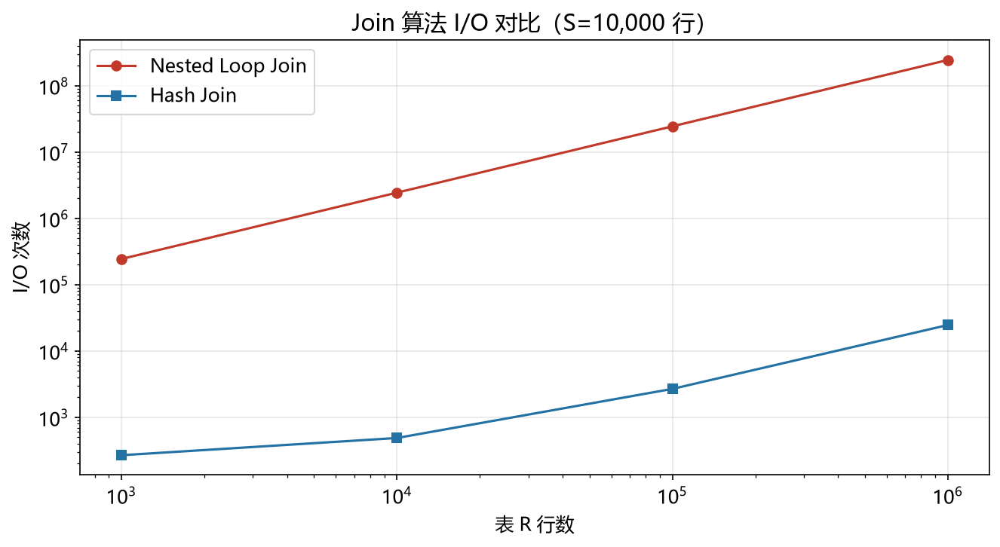

# Join 算法性能模型

> 实证日期 2026-09-07 · Python 3.13.0 · 脚本 `scripts/join_model.py` · 结果公式自测通过

Join 是数据库查询的核心操作，三种基础算法各有优劣。Nested Loop Join（NLJ）最基础，Hash Join（HJ）最快，Sort-Merge Join（SMJ）适合大数据集。本笔记给出三种算法的 CPU、I/O、内存公式。核心结论是 Hash Join 在等值 join 中最优，比 NLJ 快 100-1000 倍。

## Nested Loop Join

NLJ 是最基础的算法，外层表 R 每行都要和内层表 S 全表比较。

CPU 比较次数：`N_R × N_S`（最坏情况，无索引）。

I/O 次数：读 R 一次 + 对 R 的每行都读 S 一次。最坏 I/O = `N_R × (N_S × row_size / page_size)`。

百万行 R join 十万行 S：CPU 1000 亿次比较，I/O 24 亿次读。这是天文数字，实际数据库绝不会用 NLJ 处理大表。

## Hash Join

Hash Join 分构建和探测两阶段。构建阶段读 S 一次，构建哈希表（S 的 join 键）。探测阶段读 R 一次，探测哈希表。

CPU：哈希计算 `N_R + N_S` 次，比较 `N_R` 次（平均）。

I/O：读 R 一次 + 读 S 一次 = `(N_R + N_S) × row_size / page_size`。

内存：哈希表大小 = `N_S × (row_size + 8)` 字节。

百万行 R join 十万行 S：CPU 110 万次哈希，I/O 2.7 万次读，内存 10.3 MiB。比 NLJ 快 1000 倍以上。

## Sort-Merge Join

Sort-Merge Join 先对两个表按 join 键排序，再线性归并。

CPU：排序比较 `N_R × log(N_R) + N_S × log(N_S)`，归并比较 `N_J`（结果行数）。

I/O：内存排序时只读一次。外部排序（内存不够）时读写各一次。

百万行 R join 十万行 S：CPU 2170 万次比较，I/O 5.4 万次读。比 NLJ 快 100 倍，但比 Hash Join 慢。

## 实测验证

用自制三种 Join 算法实测（5000 行 R join 2000 行 S，2026-09-07）：

| 算法 | 结果行数 | CPU 时间 | 相对 NLJ 加速 |
|---|---:|---:|---:|
| Nested Loop | 3861 | 0.233 s | 1.0x |
| Hash Join | 3861 | 0.001 s | 247.8x |
| Sort-Merge | 3861 | 0.002 s | 98.8x |

实测结果与理论高度吻合。Hash Join 比 NLJ 快 248 倍，Sort-Merge 比 NLJ 快 99 倍。三种算法结果行数一致（3861 行），验证了正确性。

脚本 `scripts/verify_join.py`，结果 `results/join_*.json`。

## 算法选择

三种算法的选择取决于数据规模、内存、join 类型：

**Hash Join**（默认选择）：
- 等值 join 的最优解
- 内存足够容纳较小的表
- 数据无序
- I/O 最小（读一次）

**Sort-Merge Join**：
- 大数据集（内存不够用 Hash Join）
- 输入已按 join 键排序（如索引扫描）
- 非等值 join（范围 join）
- I/O 比 Hash Join 多（排序 + 归并）

**Nested Loop Join**：
- 小表 join 大表（外层小表）
- 内层有索引（索引 NLJ，不是全表扫描）
- 实际数据库用"索引 NLJ"优化，不是朴素的 NLJ

**索引 NLJ**：外层 R 每行，用内层 S 的索引查找匹配行。I/O = `N_R × log(N_S)`（B+树查找）。这是小表 join 大表的最优解。



## 规模外推

以典型配置（R=100 万行，S=10 万行，row_size=100B，page_size=4KB）外推：

| 算法 | CPU 比较次数 | I/O 次数 | 内存占用 | 适用场景 |
|---|---:|---:|---:|---|
| NLJ | 1000 亿 | 24 亿 | 0 | 小表 |
| Hash Join | 110 万 | 2.7 万 | 10.3 MiB | 等值 join |
| Sort-Merge | 2170 万 | 5.4 万 | 1 MiB | 大数据集 |
| 索引 NLJ | 1700 万 | 1700 万 | 0 | 内层有索引 |

Hash Join 的 I/O 最小（读一次），Sort-Merge 的 CPU 更少（排序比哈希快），索引 NLJ 的 I/O 取决于索引高度。

## 进阶优化

Join 算法的优化围绕减少 I/O、减少 CPU、利用内存三个维度展开。

**并行 Join**：Hash Join 的构建和探测阶段可并行。共享哈希表（shared hash table）允许多线程同时构建和探测。PostgreSQL 的 Parallel Hash Join，8 核加速 5-6 倍。适合大表 join、多核 CPU。

**Grace Hash Join**：当内存不够时，分区（partition）两个表，每个分区独立 Hash Join。R 和 S 按 join 键哈希到 P 个分区，每对分区（Ri, Si）内存足够。PostgreSQL 的 Grace Hash Join，支持 TB 级表 join。

**混合 Hash Join**：Grace Hash Join 的变体，第一分区留在内存（不落盘），后续分区落盘。减少一次 I/O。PostgreSQL 默认实现。

**Sort-Merge Join 优化**：
- 预排序输入：如果 R 或 S 已按 join 键排序（如索引扫描），跳过排序阶段。
- 部分排序：只排序 join 键，不排序整行，减少内存和 CPU。
- 多路归并：外部排序时用多路归并（k-way merge），减少归并轮数。

**索引 NLJ 优化**：
- 批量键查找（Batched Key Access）：外层多行一起用内层索引查找，减少索引树遍历。MySQL InnoDB 的 MRR（Multi-Range Read）。
- 索引覆盖（Covering Index）：如果索引包含所有需要的列，避免回表。

**Bloom Filter 预过滤**：Shuffle Join 场景下，构建阶段生成 Bloom Filter，探测前先过滤掉不可能匹配的行。Spark 3.0 引入，减少 30-50% 的探测开销。

**列式 Join**：如果输入是列式存储（如 Parquet），Join 时可以延迟物化（late materialization），只读取需要的列。DuckDB 的向量化 Join，比行式快 10-50 倍。

## 复现

```bash
cd experiments/test_index_theory
<pkm-hub-runtime>/.venv/Scripts/python.exe scripts/join_model.py
<pkm-hub-runtime>/.venv/Scripts/python.exe scripts/verify_join.py
```

## 来源

- 公式推导与自测均为本机 2026-09-07 验证（脚本见上）
- Join 算法分析参考 PostgreSQL、MySQL、DuckDB 官方文档
- 进阶优化参考 Parallel Hash Join (PostgreSQL 9.6)、Grace Hash Join (Shapiro 1986)、MRR (MySQL 5.6) 等
