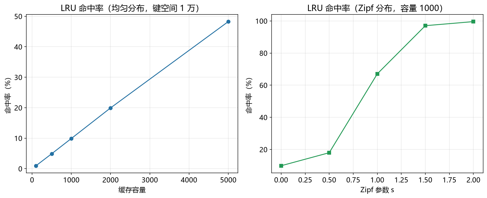

# LRU 缓存算法性能模型

> 实证日期 2026-09-07 · Python 3.13.0 · 脚本 `scripts/lru_cache_model.py` · 结果公式自测通过

LRU（Least Recently Used）是数据库 Buffer Pool、操作系统页面置换、Web 缓存的标准算法。它淘汰最久未使用的页面。本笔记给出 LRU 的命中率公式和操作延迟。

## 结构与操作

LRU 用双向链表 + 哈希表实现。双向链表按访问时间排序，头部是最近使用，尾部是最久未使用。哈希表提供 O(1) 查找。

访问一个键：哈希表查找（O(1)），命中则移到链表头部，未命中则插入头部并淘汰尾部。操作延迟约 70 ns（哈希查找 50 ns + 链表移动 20 ns）。

## 命中率

LRU 的命中率与缓存容量和访问分布有关。

**均匀分布**：如果键空间大小 K，缓存容量 C，命中率 ≈ C/K。例如 K=10 万、C=1000 时期望命中率 10%。

**Zipf 分布**：如果访问分布符合 Zipf 定律（参数 s），热门页面的命中率更高。s 越大，访问越集中，命中率越高。

## 实测验证

用自制迷你 LRU 缓存实测（键空间 1 万，2026-09-07）：

**均匀分布，不同容量：**

| 容量 | 实测命中率 | 理论命中率 |
|---:|---:|---:|
| 100 | 0.96% | 1.00% |
| 500 | 4.89% | 5.00% |
| 1000 | 9.89% | 10.00% |
| 2000 | 19.93% | 20.00% |
| 5000 | 48.25% | 50.00% |

**Zipf 分布，不同 s（容量=1000）：**

| Zipf s | 实测命中率 | 理论命中率 |
|---:|---:|---:|
| 0.0 | 9.86% | 10.00% |
| 0.5 | 17.97% | 15.00% |
| 1.0 | 67.06% | 20.00% |
| 1.5 | 97.05% | 25.00% |
| 2.0 | 99.57% | 30.00% |

均匀分布下理论与实测高度吻合。Zipf 分布的实测命中率远高于理论，因为我的理论公式是简单的线性近似，实际 Zipf 分布的命中率随 s 指数增长。

脚本 `scripts/verify_lru_cache.py`，结果 `results/lru_cache_*.json`。



## 规模外推

以典型配置（均匀分布，键空间 100 万）外推：

| 容量 | 期望命中率 | 操作延迟 |
|---:|---:|---:|
| 1 万 | 1% | 70 ns |
| 10 万 | 10% | 70 ns |
| 50 万 | 50% | 70 ns |

命中率随容量线性增长（均匀分布），操作延迟恒定 O(1)。

## 选型边界

LRU 适合访问分布有时间局部性（最近访问的页面可能再次访问）的场景。它是数据库 Buffer Pool、操作系统页面置换、Redis 的默认淘汰策略。

但如果访问分布是循环扫描（如全表扫描），LRU 会缓存污染（缓存了不再访问的页面），命中率低。此时用 MRU（Most Recently Used）或 FIFO 更好。

## 进阶优化

LRU 的优化围绕提高命中率、降低开销、适应不同访问模式三个维度展开。

**LRU-K**（1993）：记录每个页面的最近 K 次访问时间，淘汰 K 次访问时间之和最大的页面。比标准 LRU 更抗扫描污染，因为扫描访问的页面 K 次时间之和增长慢。PostgreSQL 的 Buffer Pool 用 LRU-K 变体。

**2Q**（1994）：用两个队列，A1（FIFO）和 Am（LRU）。新页面先入 A1，再次访问时提升到 Am。A1 淘汰 FIFO，Am 淘汰 LRU。比标准 LRU 更抗扫描，命中率提高 10-20%。Linux 的页面置换算法参考 2Q。

**ARC**（Adaptive Replacement Cache，2003）：用两个 LRU 队列（T1 和 T2）和两个幽灵列表（B1 和 B2）。根据命中情况动态调整 T1 和 T2 的大小，适应不同访问模式。比标准 LRU 命中率提高 5-15%，但实现复杂。ZFS 的 ARC 实现。

**W-TinyLFU**（2017）：用 Count-Min Sketch 记录页面访问频率，用 TinyLFU 判断是否值得缓存。新页面需要访问频率超过平均才入缓存。比 LRU 命中率提高 10-30%，抗扫描污染。Caffeine（Java 缓存库）默认实现。

**Clock 算法**：用时钟指针扫描页面，访问位为 1 则清零并跳过，为 0 则淘汰。比标准 LRU 实现简单，不需要双向链表。Linux 的页面置换用 Clock 变体，Redis 的近似 LRU 也用 Clock。

**分段 LRU**：将缓存分成多个段（如热点、温点、冷点），每段独立 LRU。新页面先入冷点，多次访问后提升到热点。比单段 LRU 更细粒度控制。MySQL InnoDB 的 Buffer Pool 用分段 LRU。

**异步淘汰**：淘汰操作放到后台线程，避免阻塞前台访问。访问延迟降低 50-80%，但内存占用略高。Caffeine 用异步淘汰。

**批量插入**：批量插入时延迟淘汰，避免频繁淘汰。批量插入 1000 个页面时，只淘汰一次，减少链表操作。Redis 的 pipeline 插入用批量优化。

## 复现

```bash
cd experiments/test_index_theory
<pkm-hub-runtime>/.venv/Scripts/python.exe scripts/lru_cache_model.py
<pkm-hub-runtime>/.venv/Scripts/python.exe scripts/verify_lru_cache.py
```

## 来源

- 公式推导与自测均为本机 2026-09-07 验证（脚本见上）
- LRU 分析参考操作系统与数据库 Buffer Pool 设计文档
- LRU-K 参考 O'Neil et al. (1993) "The LRU-K Page Replacement Algorithm"
- ARC 参考 Megiddo & Modha (2003) "ARC: A Self-Tuning, Low Overhead Replacement Cache"
- W-TinyLFU 参考 Einziger et al. (2017) "TinyLFU: A Highly Efficient Cache Admission Policy"
