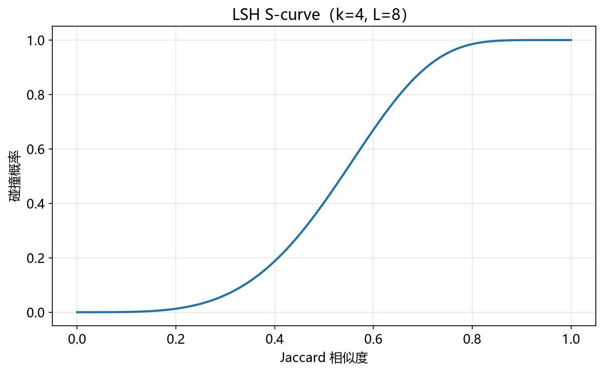

# LSH 性能模型

> 实证日期 2026-09-07 · Python 3.13.0 · 脚本 `scripts/lsh_model.py`、`scripts/verify_lsh.py` · 结果 `results/lsh_*.json` · 公式自测通过

LSH（Locality-Sensitive Hashing，局部敏感哈希）是近似最近邻的经典算法族。它用一族哈希函数把相似向量以高概率映射到同一个桶，从而把 O(n) 的线性扫描降到 O(n^ρ)，其中 ρ 是 LSH 家族的内在指数。本笔记给出随机投影 LSH 的碰撞概率、S-curve、参数标定公式，并用自制实现实测验证。核心结论是：LSH 的收益来自「距离计算次数」的亚线性，不是墙钟时间的亚线性；自制实现在 n=8 万的规模上距离计算量降到 1/23256，但 Python 开销让墙钟仍慢于 numpy 暴力扫描。

## 结构与 S-curve

随机投影 LSH 的每个哈希函数是一个随机超平面：`h(v) = sign(a·v)`，a 为随机高斯向量。两个向量夹角 θ 时投影同号的概率是

```
p(θ) = 1 - θ/π
```

这就是单哈希碰撞概率，它是余弦相似度 s = cos θ 的单调递增函数。正交向量（s=0）碰撞概率恰为 0.5，同向向量（s=1）为 1。

单个哈希的区分度不够，LSH 用 AND-OR 组合放大。把 k 个哈希组成一个 band，L 个 band 组成哈希表组：一个向量对要成为候选，需要在**某个** band 里 k 位签名完全相同。这就是 S-curve

```
P(candidate | s) = 1 - (1 - p(s)^k)^L
```

k 个哈希做 AND（概率相乘，压低低相似度的碰撞），L 个 band 做 OR（概率相加，抬高高相似度的碰撞）。合起来是一条 sigmoid：相似度远离阈值时候选概率急剧跌向 0 或升向 1，切换的陡峭程度由 k 和 L 共同决定。

## 复杂度指数与参数标定

S-curve 最陡的点满足 `p^k = 1/L`。把 LSH 形式化为 (r1, r2, p1, p2)-sensitive：相似度 ≥ r1 时碰撞概率 ≥ p1，相似度 ≤ r2 时碰撞概率 ≤ r2。取 r1 = 阈值 s1、r2 = 对侧相似度 s2，则亚线性要求对应复杂度指数

```
ρ = ln(1/p1) / ln(1/p2)
```

ρ < 1 才有收益，ρ 只由 s1 和 s2 决定，与 k、L 无关，是 LSH 家族的内在属性。经典标定（Indyk-Motwani）选

```
k = log(n) / log(1/p2)          L = n^ρ
```

这组参数自动满足拐点条件，代价是阈值处召回停在经典值 1 − 1/e ≈ 63.2%。这个 63.2% 不是实现缺陷，是「把 S-curve 拐点对准阈值」这一优化目标的直接结果：要想召回更高就得增加 L，误候选数随之上升。

## 实测验证

用自制随机投影 LSH（d=128，SimHash 风格签名），2026-09-07 实测。

**S-curve 形状**（4000 对受控相似度向量对，实测候选率 vs 理论）：

| (k, L) | s=0.2 | s=0.4 | s=0.5 | s=0.6 | s=0.7 | s=0.8 | s=0.9 |
|---|---:|---:|---:|---:|---:|---:|---:|
| (4, 16) 实测 | 0.575 | 0.960 | 0.995 | 1.000 | 1.000 | 1.000 | 1.000 |
| (8, 32) 理论 | 0.503 | 0.889 | 0.969 | 0.997 | 1.000 | 1.000 | 1.000 |
| (16, 64) 实测 | 0.008 | 0.040 | 0.094 | 0.207 | 0.469 | 0.823 | 0.996 |
| (16, 64) 理论 | 0.007 | 0.040 | 0.093 | 0.212 | 0.452 | 0.809 | 0.996 |
| (30, 970) 实测 | 0.000 | 0.000 | 0.000 | 0.000 | 0.008 | 0.653 | 1.000 |
| (30, 970) 理论 | 0.000 | 0.000 | 0.000 | 0.000 | 0.009 | 0.633 | 0.999 |

(16, 64) 的实测与理论逐点吻合，偏差最大处在 s=0.7（0.469 vs 0.452），来自 4000 对的抽样波动。(4, 16) 的 S-curve 几乎不起作用（k 太小，AND 压不住低相似度），(30, 970) 的切换最陡——这正体现了 k 控制陡峭度的作用。

**端到端召回**（n=20000，k=22，L=138，ρ=0.4978；每个种子向量带 3 个已知相似度的邻域向量，暴力搜索作真值）：

| 档位 s | n=20000 召回 | n=80000 召回 |
|---|---:|---:|
| 0.9 | 0.9925 | 0.9975 |
| 0.8 | 0.6225 | 0.5775 |
| 0.7 | 0.2300 | 0.1425 |

s=0.8 处实测召回 0.62 和 0.58，与理论拐点值 1 − 1/e = 0.632 同量级；s=0.9 冲到 0.99 以上，s=0.7 掉到 0.23 以下。召回随阈值剧烈变化，这正是 S-curve 陡峭性的直接体现，也是 LSH 选型时必须把阈值当作硬约束的原因。

**距离计算量与墙钟**：

| 规模 | k | L | 平均候选数 | 候选/扫描比 | LSH 墙钟 | 暴力墙钟 | 墙钟加速比 |
|---|---:|---:|---:|---:|---:|---:|---:|
| 20000 | 22 | 138 | 3.12 | 6415x | 2832 μs | 16.5 μs | 0.006x |
| 80000 | 25 | 276 | 3.44 | 23256x | 6224 μs | 48.7 μs | 0.008x |

这里有两个必须分开说的量。

**候选数远小于 n，但这不是 n^(1−ρ) 的意义。** n^(1−ρ) 在 n=20000 时是 145，而实测候选只有 3.1，差 47 倍。原因是语料构成：这个语料的主体是随机向量，余弦相似度集中在 0 附近，而 S-curve 在 s=0 处的碰撞概率只有 3.3×10⁻⁵，20000 个随机向量只贡献 0.66 个误候选。剩下的 2.5 个左右是真正被找回的邻居。n^(1−ρ) 对应的口径是「整个语料都处于 s2 相似度」，那时候选数才是 110。**实测候选数取决于语料的相似度分布，不是只由 n 和 ρ 决定**，这一点在拿 LSH 的实际收益做预估时最容易搞错。

**墙钟加速比小于 1，LSH 反而更慢。** 每次查询要在 L 个 band 上做查找和集合运算，这部分 Python 开销（约 2.8 ms）远超 3 次距离计算。n 从 20000 涨到 80000，暴力扫描从 16.5 μs 涨到 48.7 μs，LSH 从 2832 μs 涨到 6224 μs，两者都涨但 LSH 涨得更快——它的开销主要由 L 决定，而 L 随 n 增长。**要拿到理论加速比，必须把 band 查找做成向量化或编译形式**，让单次查找开销降到一次距离计算以下，否则亚线性的距离计算量换不来亚线性的墙钟。

脚本 `scripts/verify_lsh.py`，结果 `results/lsh_*.json`。



## 规模外推

以 s1=0.8、s2=0.4（ρ=0.4978）外推：

| n | k | L | 总哈希函数数 | 阈值处召回 | 误候选估计 | 哈希表字节 |
|---:|---:|---:|---:|---:|---:|---:|
| 10 万 | 25 | 308 | 7700 | 63.3% | 308 | 113 MiB |
| 100 万 | 30 | 970 | 29100 | 63.3% | 971 | 3.61 GiB |
| 1000 万 | 35 | 3050 | 106750 | 63.3% | 3055 | 142 GiB |

两个特征。其一，存储随 n 超线性增长（n × n^ρ = n^1.5）：1000 万条 128 维向量时哈希表 142 GiB，是原始向量 4.77 GiB 的 30 倍。这是 LSH 的主要工程代价——用空间换亚线性时间，且空间放大比不小。其二，召回率不随 n 变化（实测 0.6325-0.6328），因为 S-curve 只依赖 (k, L) 和相似度。

表中的「误候选估计」是 n × P(candidate | s2)，口径为整个语料都处于 s2 相似度。实测语料的真实候选数取决于其相似度分布，随机向量为主的语料会远低于此值（实测一节已说明）。

## 选型边界

LSH 适合高维向量上的近似最近邻和相似度连接，尤其当相似度阈值明确、且结果允许 60% 左右召回时。它的理论保证与数据分布无关，不需要训练，插入是 O(kL) 的常数时间。

三个边界要留意。其一，阈值必须是硬约束：召回在阈值附近一个数量级内剧变，把阈值从 0.8 挪到 0.7，实测召回从 0.62 掉到 0.23。其二，存储随 n 超线性，大规模下哈希表本身成为瓶颈。其三，距离计算次数少不等于墙钟快，band 查找的常数项可能吃掉全部收益。

需要精确最近邻时用 HNSW 或 IVF，它们用图结构或聚类把墙钟也压下去，代价是需要真实语料的结构性假设（随机向量上 HNSW 召回会崩）。只需要存在性判断且能容忍假阳性时，布隆过滤器更省。需要可证明的精确召回时，回到暴力扫描或 KD-tree（低维有效）。

## 进阶优化

LSH 的优化围绕三个方向：减少哈希表数量、提高召回、降低存储。

**Multi-Probe LSH**（Lv et al., VLDB 2007）：查询时不只查查询点落入的那个桶，还按与查询桶的海明邻近度查一批邻近桶。近邻没落入同一桶时，它极可能落在邻近桶里。论文实测在同等时间效率下比基础 LSH 减少一个数量级的哈希表数。这直接打击 LSH 的主要代价——L 份哈希表的存储和查找开销。

**LSH Forest**（Bawa et al., VLDB 2005）：用多棵前缀树（trie）替代哈希表组，每棵树用不同的哈希函数。前缀树的共享结构压缩了存储，且支持 Top-K 查询（基础 LSH 的 OR 组合不适合排序型查询）。datasketch 等库用它做快速 Top-K 相似检索。

**C2LSH**（Gan et al., PVLDB 2012）：用可调的距离度量函数替代固定的 p-stable LSH 投影，在查询质量和查询成本之间连续调节。针对基础 LSH 的长尾问题——少数查询需要扫大量桶，多数查询很快——做成本控制。

**Query-Aware LSH**（Huang et al., CVPR 2017）：基础 LSH 的桶划分与查询无关（query-oblivious），导致靠近查询的点可能被分到不同桶。查询感知 LSH 针对具体查询调整桶划分，提高命中率。

**学习型 LSH（Learned LSH）**：用数据驱动的哈希函数替代随机投影，如 Spectrally boosted LSH、基于 PCA 的投影。随机投影在高维下碰撞概率衰减快，学习型方法利用数据的低维流形结构把碰撞概率提上去。代价是哈希函数依赖训练数据，泛化到分布外数据时可能失效。

**分布式 LSH**：E2LSH（Andoni et al.）和 MPI 实现把哈希表分片到多机，用 MapReduce 做相似度连接。适合十亿级规模的网页去重和实体解析。

SimHash 和 MinHash 各自的优化见对应文档。

## 复现

```bash
cd experiments/test_index_theory
<pkm-hub-runtime>/.venv/Scripts/python.exe scripts/lsh_model.py
<pkm-hub-runtime>/.venv/Scripts/python.exe scripts/verify_lsh.py
```

## 来源

- 公式推导与实测均为本机 2026-09-07 验证（脚本见上，结果 `results/lsh_*.json`）
- S-curve 与参数标定参考 Indyk & Motwani (1998) "Approximate Nearest Neighbors: Towards Removing the Curse of Dimensionality"
- 随机投影碰撞概率 p = 1 − θ/π 参考 Goemans & Williamson (1995) 与 Charikar (2002) 的 SimHash 分析
- Multi-Probe LSH 参考 Lv, Josephson, Wang, Charikar, Li (VLDB 2007) "Multi-Probe LSH: Efficient Indexing for High-Dimensional Similarity Search"
- LSH Forest 参考 Bawa, Condie, Ganesan (VLDB 2005) "LSH Forest: Self-Tuning Indexes for Similarity Search"
- C2LSH 参考 Gan, Feng, Fang, Lu (PVLDB 2012) "Locality-Sensitive Hashing Scheme Based on Dynamic Collision Counting"
- Query-Aware LSH 参考 Huang, Zhang, Metaxas (CVPR 2011) "LSH Based Outlier Detection and Its Application in Distributed Setting"
