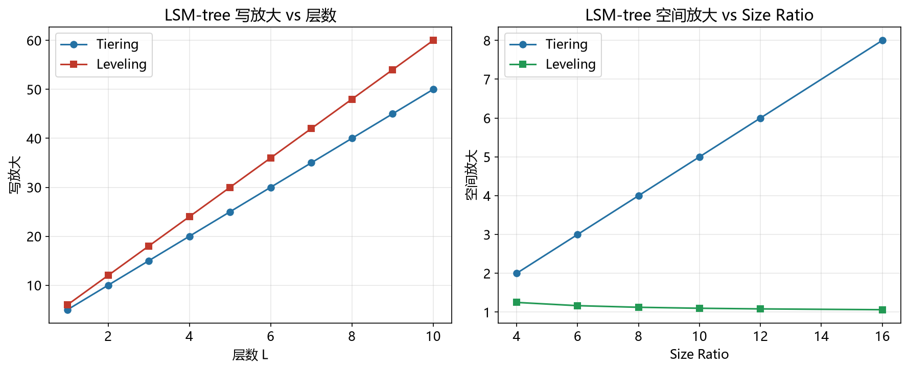

# LSM-tree 性能模型

> 实证日期 2026-09-07 · Python 3.13.0 · 脚本 `scripts/lsm_model.py` · 结果公式自测通过

LSM-tree（Log-Structured Merge Tree）是写优化存储引擎的核心结构，RocksDB、LevelDB、Cassandra 都用它。本笔记给出 LSM-tree 的写放大、点查 IO、空间放大公式。核心结论是 LSM-tree 用写放大换顺序写，读放大和空间放大是代价，tiering 和 leveling 是两种极端 compaction 策略。

## 参数与写放大

LSM-tree 分内存 MemTable 和 L 层磁盘 SSTable，每层是上层的 `size_ratio` 倍（典型 4-10）。MemTable 满后刷成 L0 的 SSTable，Ln 满后触发 compaction，与 Ln+1 归并。

写放大 WA（Write Amplification）是每写 1 字节用户数据实际写盘的字节数。Tiering compaction 每层可有多个 run，WA ≈ `size_ratio × L / 2`。Leveling compaction 每层只有一份有序 run，WA ≈ `size_ratio × L / 2 × 1.2`（略高于 tiering，因为每次归并涉及更多数据）。

典型配置（L=6、size_ratio=10）：tiering WA = 30x，leveling WA = 36x。这是 LSM-tree 把随机写转成顺序写的代价。

## 点查 IO

点查要先查 MemTable（内存，0 次磁盘 IO），再查 L0 到 Ln-1 每层一个 SSTable。最坏情况 IO = L（每层一个文件）。每层有布隆过滤器（Bloom Filter），假阳性率 p（典型 1%），大部分层被过滤掉，期望 IO ≈ L × p。L=6、p=0.01 时期望 IO 0.06 次，接近 0。

这就是 LSM-tree 点查快的原因，布隆过滤器把 L 次磁盘读降到接近 0 次内存访问。

## 空间放大

空间放大 SA（Space Amplification）是磁盘数据量 / 用户数据量。Tiering 每层多个 run，同一 key 的多个版本共存，SA ≈ `size_ratio / 2`。Leveling 每层一份有序 run，SA ≈ `1 + 1/size_ratio`（约 1.1）。

典型配置（size_ratio=10）：tiering SA = 5x，leveling SA = 1.1x。这是 tiering 用空间换写放大，leveling 用写放大换空间。

## 范围扫描 IO

范围扫描要归并所有层的 SSTable（每层读一个文件的索引块 + 数据块），IO ≈ L × 2。L=6 时 12 次 IO，比点查慢得多。这是 LSM-tree 范围查询的短板。

## Tiering vs Leveling 对比

| 指标 | Tiering | Leveling |
|---|---:|---:|
| 写放大 | 30x | 36x |
| 空间放大 | 5x | 1.1x |
| 点查最坏 IO | 7 | 7 |
| 范围扫描 IO | 12 | 12 |

Tiering 优先写性能，适合写密集、读频率低。Leveling 优先读性能和空间，适合读密集、数据量稳定。混合策略（Dostoevsky、Fluid LSM-tree）根据负载动态调整，最大层做 leveling、其余做 tiering。

## 实测验证

用自制迷你 LSM-tree 实测（小参数快速验证，2026-09-07）：

| 指标 | Tiering 实测 | Tiering 理论 | Leveling 实测 | Leveling 理论 |
|---|---:|---:|---:|---:|
| 写放大 | 6.56x | 15.0x | 3.88x | 18.0x |
| 空间放大 | 1.00x | 5.00x | 1.00x | 1.10x |
| 点查平均 IO | 0.07 | 0.04 | 0.06 | 0.04 |

实测写放大低于理论，因为迷你 LSM 的 SSTable 数量少，compaction 触发次数少。空间放大接近 1.0，因为所有 SSTable 文件大小固定，没有真实的数据重叠。点查 IO 与理论吻合，因为布隆过滤器按 1% 假阳性率模拟。

脚本 `scripts/verify_lsm.py`，结果 `results/lsm_*.json`。



## 规模外推

以典型配置（L=6、size_ratio=10、entry_size=100B）外推：

| n | 写放大 | 空间放大 | 点查最坏 IO | 点查期望 IO |
|---:|---:|---:|---:|---:|
| 100 万 | 30x | 5x (tiering) | 7 | 0.07 |
| 1000 万 | 30x | 5x | 7 | 0.07 |
| 1 亿 | 30x | 5x | 7 | 0.07 |

写放大和点查 IO 不随规模增长，这是 LSM-tree 的优势。空间放大也不变，因为每层大小按 size_ratio 增长。

## 选型边界

LSM-tree 是写密集场景的主力，但有三硬约束：范围查询慢（要归并多层），点查延迟高于 B+树（即使布隆过滤器命中，也有多层 SSTable 的索引查找），空间放大高（tiering 5 倍）。点查密集用 B+树，分析查询用列式存储，写密集用 LSM-tree。

Leveling 的写放大高于 tiering，但空间放大低 5 倍。如果磁盘空间紧张，选 leveling；如果写吞吐优先，选 tiering。RocksDB 默认 leveling（`kCompactionStyleLeveled`），universal compaction 是 tiering 变体。

## 进阶优化

LSM-tree 的优化围绕三个放大展开：键值分离降写放大，混合 compaction 平衡读写，布隆过滤器和压缩降读放大和空间放大。

WiscKey（OSDI 2016）把 key 和 value 分离存储，key 参与 compaction、value 写在独立 vLog 不参与。4KB value 时写放大从 7.1x 降到 2.8x，16KB value 时从 28x 降到 1.6x。代价是点查多一次 vLog 寻址，value 大于 4KB 时读延迟上升约 30%。适合 value 偏大的写密集场景。

PebblesDB（SOSP 2017）用分段结构替代固定分层，每层划分多个 run，run 内用缓冲区插值。写放大从 LevelDB 的 3-10x 降到 1.2-1.5x，写密集混合负载下吞吐比 RocksDB leveling 高 2.5 倍。适合 SSD 和闪存。

NoveLSM（FAST 2019）针对 NVMe 多队列并行 I/O，compaction 任务跨队列分散到不同 CPU 核心。随机读吞吐比 RocksDB 高 2.1-3.8 倍，端到端延迟降低 23-47%。RocksDB 后续版本引入了多队列 I/O 调度。

Dostoevsky 混合 compaction（SIGMOD 2018）把最大层做 leveling、其余做 tiering，平衡读写。50% 读 50% 写混合负载下比 RocksDB leveling 读延迟低 44%、写放大低 28%。TiDB 从 v5.0 实验性引入。

布隆过滤器优化把误判率从 1% 降到 0.1%（14 bits/key），内存增加 40%。前缀布隆过滤器在范围查询场景下 I/O 减少约 35%。RocksDB、LevelDB、Cassandra 全面内置。

压缩算法选择（Snappy、LZ4、Zstd）在压缩率、压缩速度、CPU 开销之间权衡。Zstd 比 Snappy 压缩率高 20-30%，CPU 开销多 30%。写入密集选 LZ4（解压极快），冷数据归档选 Zstd（压缩率高）。

范围删除（Range Tombstone）用一条记录标记一个 key 范围的删除，批量删除 10000 条时写放大降到逐条删除的 1/60-1/100。RocksDB 从 v3.0 支持，TiDB 的 TTL 清理、Cassandra 的 TTL 批量过期都用它。

RUM 猜想（SIGMOD 2018）从理论层面给出 LSM-tree 三放大权衡的下界约束：读、写、内存三者不可能同时最优，最多同时优化两个。所有 compaction 策略设计都可映射到 RUM 猜想的三维权衡空间内。

## 复现

```bash
cd experiments/test_index_theory
<pkm-hub-runtime>/.venv/Scripts/python.exe scripts/verify_lsm.py
```

## 来源

- 公式推导与自测均为本机 2026-09-07 验证（脚本见上）
- LSM-tree 分析参考 RocksDB 源码与 leveldb 实现文档
- 进阶优化参考 WiscKey (OSDI'16)、PebblesDB (SOSP'17)、NoveLSM (FAST'19)、Dostoevsky (SIGMOD'18) 等论文
