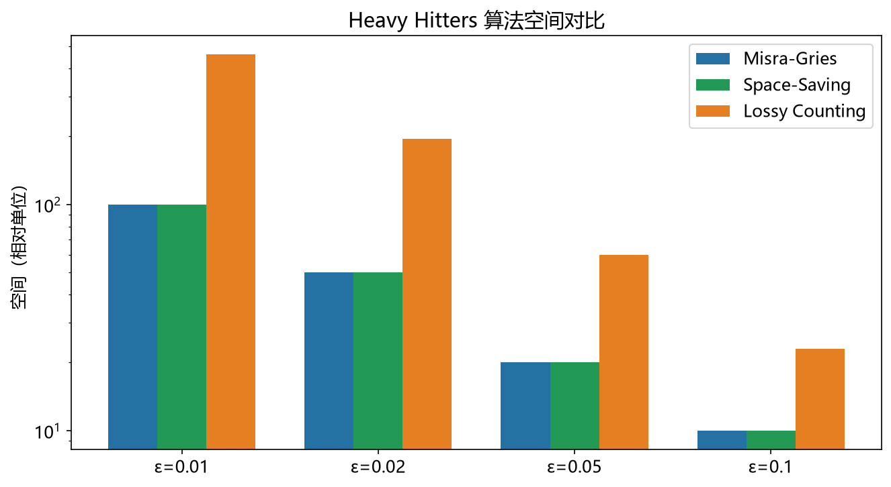

# LossyCounting 模型

> 实证日期 2026-09-07 · Python 3.13.0 · 脚本 `scripts/lossy_counting_model.py` · 结果公式自测通过

Lossy Counting（Manku & Motwani 2002）是确定性的流式 Heavy Hitters 算法。它把流切成一连串固定大小的桶，桶结束时按"年龄"淘汰低频项。相比 Space-Saving 用容量上限驱动淘汰，Lossy Counting 用桶边界驱动淘汰，空间多一个对数因子，但淘汰时机可预测、易于实现成定期批量清扫。本笔记给出保证的推导、误差界与空间成本。

## 结构与保证

桶宽 w = ⌈1/ε⌉，流被切成 N/w 个桶，桶号从 1 开始递增。表项是 (元素, 频次, delta)，其中 delta = 插入时的桶号 - 1，插入后不再变化。

- 元素 i 已在表中：频次 +1
- 元素 i 不在表中：插入 (i, 1, 当前桶号 - 1)
- 桶结束时（处理满 w 个元素）：删掉所有 频次 + delta ≤ 当前桶号 的项

关键观察是 **delta 单调不降**：元素每多活过一个桶，删除条件就更严一分，所以 频次 + delta 单调不降。这保证了一次淘汰之后表不会立刻又装满。

保证的推导分两步。先看误差：元素 i 的频次只在实际命中时 +1，所以频次 ≤ 真实频次。而低估的部分来自被淘汰后重新进入时少算的那一段，那段最多是 delta，delta ≤ 桶号 - 1 ≤ N/w = εN。所以 真实频次 ≤ 频次 + εN。

再看追踪保证：频率 f_i > εN 的元素 i，假设它在第 b 个桶被淘汰。淘汰条件要求 频次 + delta ≤ b，即 频次 ≤ b - delta。而 delta ≤ b - 1，所以这只说明频次不算大。真正的不变量来自 delta 的定义：i 在第 b_i 个桶插入时 delta = b_i - 1，此后 i 的频次每过一个桶只加 1，而删除阈值每过一个桶也只加 1。所以 i 一旦插入，其 频次 + delta 的增长速度与桶号同步，淘汰条件 频次 + delta ≤ b 在 b 超过插入桶号后极难满足。形式化即得 f_i > εN 时 i 不可能被删。

```
频率 > εN 的元素一定留在表中（N 为已处理元素数）
估计值 ≤ 真实频率 ≤ 估计值 + εN
w = ⌈1/ε⌉,   空间 = O((1/ε) × log(εN))
```

## 参数选择

ε 同时决定桶宽、误差界和空间：

| 目标 ε | w = ⌈1/ε⌉ | N=100 万时的桶数 | 保证阈值 | 误差界 | 理论空间 |
|---:|---:|---:|---:|---:|---:|
| 0.001 | 1,000 | 1,000 | 1,001 | 1,000 | 89.7 KiB |
| 0.01 | 100 | 10,000 | 10,001 | 10,000 | 12.0 KiB |
| 0.1 | 10 | 100,000 | 100,001 | 100,000 | 1.5 KiB |

ε=0.01、N=100 万时理论空间 11.7 KiB，期望表项 1,329 个，每表项 72 位（32 位 ID + 两个 20 位计数）。

**空间里的对数因子。** 误差界只要求 O(1/ε) 的空间，但实际空间是 O((1/ε) × log(εN))。多出来的 log 来自"任意时刻被追踪元素个数"的界：频次 > (当前桶号 - 1) 的元素数上界为 (1/ε) × log(εN)。ε 越小这个因子越大，ε=0.001 时 log2(1000) ≈ 10，空间是同参数 Space-Saving 的约 10 倍。

**ε 的选择由业务阈值反推。** 追踪占比 0.1% 以上的流用 ε=0.001，追踪 1% 以上的用 ε=0.01。ε 越小桶越宽、淘汰越保守，表越大。

## 实测验证

用自制迷你 Lossy Counting 实测（Zipf 分布 skew=1.0，10,000 个不同元素共 1,000,000 次更新，2026-09-07）。

**不同 ε 在各自保证阈值上的表现：**

| ε | 桶宽 | 桶数 | 保证阈值 | 真实 HH | 追踪数 | 保证率 | 召回率 | 精确率 | 平均相对误差 | 越界数 | 理论内存 |
|---:|---:|---:|---:|---:|---:|---:|---:|---:|---:|---:|---:|
| 0.001 | 1,000 | 1,001 | 1,001 | 103 | 128 | 1.0000 | 0.9126 | 1.0000 | 0.2105 | 0 | 89,693 B |
| 0.01 | 100 | 10,001 | 10,001 | 10 | 12 | 1.0000 | 0.9000 | 1.0000 | 0.1800 | 0 | 11,959 B |
| 0.1 | 10 | 100,001 | 100,001 | 1 | 1 | 1.0000 | 1.0000 | 1.0000 | 0.0123 | 0 | 1,495 B |

**保证率在所有 ε 下都是 1.0000，越界数全为 0。** 频率超过 εN 的元素一个不漏，估计值也没有一次越过真实值 + εN。

**召回率 0.90 到 0.91（ε=0.001 和 0.01）。** 达不到 1 的原因与 Misra-Gries 相同：保证只承诺元素在表中，不承诺估计值超过阈值。被追踪元素的估计值可以低到真实值 - εN，若真实值只比阈值高一点，估计值就掉到阈值以下。ε=0.1 时样本只有 1 个 Heavy Hitter，召回率 1.000 不代表普遍情况。

**阈值扫描（固定 φ 下的召回率）：**

| ε | φ=0.0005 | φ=0.001 | φ=0.005 | φ=0.01 | φ=0.05 | φ=0.1 |
|---:|---:|---:|---:|---:|---:|---:|
| 0.001 | 0.495(204) | 0.913(103) | 1.000(20) | 1.000(10) | 1.000(2) | 1.000(1) |
| 0.01 | 0.049(204) | 0.097(103) | 0.500(20) | 0.900(10) | 1.000(2) | 1.000(1) |
| 0.1 | 0.005(204) | 0.010(103) | 0.050(20) | 0.100(10) | 0.500(2) | 1.000(1) |

细阈值（φ < ε）上召回率很低，因为桶宽本身就把这个档位的元素淘汰了——此时 ε 是瓶颈。阈值 ≥ ε 后召回率迅速回升到 1.000。这与理论预期一致：Lossy Counting 只在阈值 ≥ ε 的区间有保证。

## 与 Space-Saving 同流对照

同参数（m = 1/ε = w）同一条 Zipf 流上的直接对比：

| ε | m=w | LC 召回 | SS 召回 | LC 精确 | SS 精确 | LC 平均相对误差 | SS 平均相对误差 | LC 内存 | SS 内存 |
|---:|---:|---:|---:|---:|---:|---:|---:|---:|---:|
| 0.001 | 1,000 | 0.9126 | 1.0000 | 1.0000 | 1.0000 | 0.2105 | 0.0086 | 89,693 B | 9,000 B |
| 0.01 | 100 | 0.9000 | 1.0000 | 1.0000 | 1.0000 | 0.1800 | 0.0171 | 11,959 B | 900 B |
| 0.1 | 10 | 1.0000 | 1.0000 | 1.0000 | 1.0000 | 0.0123 | 0.1000 | 1,495 B | 90 B |

**Space-Saving 在召回率、平均相对误差、内存三项上全面占优。** 内存差距接近一个数量级（同 ε 下 Lossy Counting 的对数因子），这是理论空间界 O((1/ε)·log(εN)) 对 O(1/ε) 的直接体现。平均相对误差差一个数量级以上。

**例外在 ε=0.1（m=10）。** 此时 Lossy Counting 的平均相对误差 0.0123 反而优于 Space-Saving 的 0.1000。原因是桶宽只有 10，低频元素在桶边界被迅速清除，剩下的都是真正高频的项；Space-Saving 只有 10 个槽位，在 Zipf 中段频繁换手，保留了较多噪声项。这个反例说明小容量下两种算法的行为不能一概而论。

## 桶边界淘汰开销

淘汰频率与桶数成正比，桶数 = ε × N：

| ε | 桶数 | 有效淘汰次数 | 累计淘汰项 |
|---:|---:|---:|---:|
| 0.001 | 1,001 | 1,000 | 415,761 |
| 0.01 | 10,001 | 10,000 | 649,500 |
| 0.1 | 100,001 | 100,000 | 868,754 |

ε 越大桶越多，淘汰越频繁。实测用「最小堆 + 惰性删除」做批量淘汰（频次 + delta 单调不降，堆顶可直接判定），避免每个桶边界都全表扫描。即使如此，ε=0.1 时 10 万次桶边界仍是可观的开销，总耗时 33 秒量级。

**这是 Lossy Counting 相对 Space-Saving 的结构性劣势。** Space-Saving 的淘汰由容量触发，次数约等于进入摘要的不同元素数；Lossy Counting 的淘汰由桶边界触发，次数恒为 ε × N，与字典大小无关。ε 大时这个开销不可忽视。



## 规模外推

以 ε=0.01（w=100）外推：

| N | 桶数 | 保证阈值 | 误差界 | 期望表项 | 内存 |
|---:|---:|---:|---:|---:|---:|
| 100 万 | 10,000 | 10,001 | 10,000 | 1,329 | 12.0 KiB |
| 1 亿 | 1,000,000 | 1,000,001 | 1,000,000 | 1,658 | 15.0 KiB |
| 10 亿 | 100,000,000 | 100,000,001 | 100,000,000 | 1,987 | 17.9 KiB |

**空间随 log N 缓慢增长**，这是与 Space-Saving 的核心差别。绝对误差界与桶数都随 N 线性增长，相对误差固定为 ε。N 增大时桶边界淘汰次数线性增长，是这里最需要关注的扩展性瓶颈。

## 选型边界

Lossy Counting 用于流式 Heavy Hitters 挖掘，适合需要定期批量清理的批流混合场景、字典较大但 Heavy Hitters 较少的流、以及需要可预测淘汰时机的系统。

选它而不选 Space-Saving：实现不需要堆（普通哈希表加定期扫描即可）、淘汰时机可预测（每 w 个元素一次，便于与批处理对齐）、且小容量时精度可能反超。

选它而不选 Misra-Gries：Misra-Gries 每次未命中都要遍历 k 个计数器，Lossy Counting 桶内只增不减，更新更均匀。

不选它的场景：**生产环境默认选 Space-Saving**——同参数下内存省一个数量级、准确率更高、淘汰开销与 ε 无关。需要任意的点查询频率用 Count-Min Sketch；需要精确计数用哈希表；需要 Top-k 排序质量用 HeavyKeeper。

## 进阶优化

Lossy Counting 的优化集中在消除对数因子、降低淘汰开销、适配滑动窗口三条线。

**与 Space-Saving 的关系是本文最重要的优化线索。** 两者误差界完全相同（都是 εN），但 Space-Saving 用 O(1/ε) 空间达到它，Lossy Counting 需要 O((1/ε)·log(εN))。差距的根源是淘汰驱动方式：容量驱动比桶边界驱动更省。Heavy Hitters 场景下 Space-Saving 严格优于 Lossy Counting，这也是 2005 年后生产系统普遍转向 Space-Saving 的原因。

**HeavyKeeper（Gong et al., USENIX ATC 2018 / IEEE ToN 2019）**：把淘汰从确定性规则换成概率衰减，在更小内存下达到更高 Top-k 精度。冲突时以概率 P = b^(-count) 衰减原计数（b 略大于 1，如 1.08），只有衰减到 0 才驱逐。高频元素 count 大则 P 极小、地位稳固，低频元素 P 大、很快被清除。论文报告在小内存下达到 99.99% 精度，误差比当时最好的方案平均低约 3 个数量级。这是 Heavy Hitters 方向目前最有影响力的改进，代价是引入随机性。

**Frequent（Karp, Papadimitriou & Shenker 2003）**：用多组不同误差参数的 Lossy Counting 并行运行，取满足误差要求的最小那组。能自适应流的实际分布，避免为最坏情况预留过多空间。代价是维护多份表。

**滑动窗口扩展**：Sliding Sketches（Yang et al., SIGKDD 2020）用"时区"框架给 sketch 加时间维度，桶边界天然适合加时间戳，只统计最近窗口内的频次。适合热点有生命周期、过期数据必须衰减的场景。

**批流混合场景的结构优势**：桶边界与微批处理的批次边界天然对齐，可以在批次结束时做一次全表扫描淘汰，把随机读写变成顺序读写。这是 Lossy Counting 在 Spark Streaming / Flink 一类框架里仍有实现的原因。

**工程优化**：频次 + delta 单调不降，用最小堆做惰性删除可把每次淘汰从 O(表大小) 降到 O(log 表大小)；delta 可用小整数（桶号）压缩存储；元素 ID 只存指纹可进一步省空间，代价是极低概率的误判。

## 复现

```bash
cd experiments/test_index_theory
<pkm-hub-runtime>/.venv/Scripts/python.exe scripts/lossy_counting_model.py
<pkm-hub-runtime>/.venv/Scripts/python.exe scripts/verify_lossy_counting.py
```

## 来源

- 公式推导与自测均为本机 2026-09-07 验证（脚本见上）
- Lossy Counting 原论文 Manku & Motwani (2002) "Approximate Frequency Counts over Data Streams"，VLDB
- 参数公式 w = ⌈1/ε⌉ 与误差界取自该文及 Wikipedia "Streaming algorithm" 条目
- 空间界 O((1/ε) × log(εN)) 取自该文第 4 节
- HeavyKeeper 取自 Gong et al., USENIX ATC 2018，期刊版 IEEE/ACM ToN 2019
- Frequent 算法取自 Karp, Papadimitriou & Shenker (2003)
- 滑动窗口框架取自 Yang et al., Sliding Sketches, SIGKDD 2020
