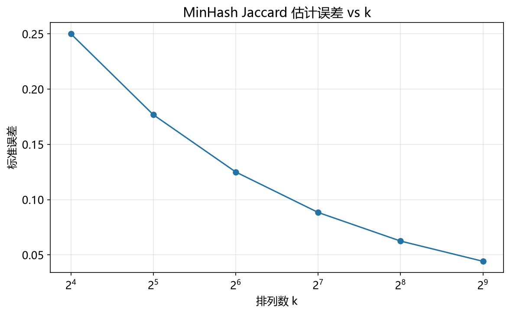

# MinHash 性能模型

> 实证日期 2026-09-07 · Python 3.13.0 · 脚本 `scripts/minhash_model.py`、`scripts/verify_minhash.py` · 结果 `results/minhash_*.json` · 公式自测通过

MinHash 估算两个集合的 Jaccard 相似度 J(A,B) = |A∩B| / |A∪B|。核心性质：对集合做随机置换后取最小哈希值，两个集合的最小哈希相等的概率恰好等于 Jaccard 相似度。用 k 个独立置换得到 k 个最小哈希，其一致比例就是 J 的无偏估计。本笔记给出估计量、误差公式、LSH band 的 S-curve 与拐点标定，并用自制实现实测验证。核心结论是：估计误差 σ = 1/√k 精确成立（σ×√k 稳定在 0.50），band 拐点概率精确停在 1 − 1/e = 0.632。

## 结构与估计量

MinHash 对集合做一次随机置换 π，取最小哈希值 h_min(S) = min_{x∈S} π(x)。两个集合的最小哈希相等，当且仅当置换后第一个元素同时属于两者，概率恰为 J(A,B)。形式化：

```
P(h_min(A) = h_min(B)) = |A∩B| / |A∪B| = J(A,B)
```

用 k 个独立置换得到 k 维签名，估计量为

```
Ĵ = (k 个最小哈希中相等的个数) / k
```

这个估计量是无偏的：E[Ĵ] = J，方差为

```
Var[Ĵ] = J(1−J)/k,   σ = sqrt(J(1−J)/k)
```

J=0.5 时方差最大，σ = 1/√(4k) = 0.5/√k。J 接近 0 或 1 时方差趋于 0。实践中常说的「σ = 1/√k」对应 J→0 或 J→1 极端情形的上界估计。

## LSH band 与 S-curve

k 个最小哈希本身是签名，要筛选候选对还需 band 技术。把签名切成 b 个 band，每 band r 行（b × r = k）。两个集合成为候选对，当且仅当某个 band 的 r 行全部相同。单 band 命中的概率是 J^r（r 行都相同），b 个 band 做 OR：

```
P(候选对 | J) = 1 - (1 − J^r)^b
```

这是另一条 S-curve。拐点满足 J^r = 1/b，拐点处概率为 1 − (1−1/b)^b → 1 − 1/e ≈ 63.2%，与 LSH 的拐点值相同——两个 S-curve 共享同一个数学结构。

band 参数选择：给定阈值 J0，让拐点落在 J0 上。解 J0^r = 1/b，配合 b × r ≤ k（多余行不用）。枚举 b，取 r = k // b，选使 |J0^r − 1/b| 最小的组合。约束 b×r ≤ k 很重要，否则最后一个 band 会被静默截断，该 band 的有效行数变少，候选概率被系统性抬高。

## 实测验证

用自制 MinHash（乘性哈希模拟置换），2026-09-07 实测。universe=20000，set_size=200，400 对集合。

**Jaccard 估计精度**（实测均值±标准差 vs 理论 σ）：

| 真值 J | k=64 实测 | k=64 理论σ | k=128 实测 | k=128 理论σ | k=256 实测 | k=256 理论σ |
|---:|---:|---:|---:|---:|---:|---:|
| 0.099 | 0.100±0.038 | 0.037 | 0.098±0.027 | 0.026 | 0.098±0.020 | 0.019 |
| 0.201 | 0.205±0.050 | 0.050 | 0.202±0.034 | 0.035 | 0.201±0.024 | 0.025 |
| 0.299 | 0.296±0.057 | 0.057 | 0.294±0.038 | 0.041 | 0.301±0.026 | 0.029 |
| 0.498 | 0.504±0.062 | 0.063 | 0.497±0.046 | 0.044 | 0.499±0.033 | 0.031 |
| 0.702 | 0.698±0.058 | 0.057 | 0.704±0.043 | 0.040 | 0.702±0.030 | 0.029 |
| 0.802 | 0.801±0.049 | 0.050 | 0.800±0.034 | 0.035 | 0.800±0.024 | 0.025 |
| 0.896 | 0.898±0.040 | 0.038 | 0.893±0.027 | 0.027 | 0.896±0.019 | 0.019 |

实测标准差与理论 σ 逐格吻合，最大偏差在 J=0.299、k=128（0.038 vs 0.041）和 k=256（0.026 vs 0.029）。无偏性检查（k=128）显示估计均值与真值的偏差最大 0.0046（J=0.299），其余都在 0.003 以内，无偏性成立。

**k 对精度的影响**（J≈0.5，σ×√k 应为常数 0.5）：

| k | 实测 σ | 理论 σ | σ×√k |
|---:|---:|---:|---:|
| 32 | 0.0876 | 0.0884 | 0.496 |
| 64 | 0.0606 | 0.0625 | 0.484 |
| 128 | 0.0448 | 0.0442 | 0.506 |
| 256 | 0.0316 | 0.0313 | 0.505 |
| 512 | 0.0221 | 0.0221 | 0.500 |

σ×√k 稳定在 0.48-0.51，k 翻倍 σ 减半。σ = 1/√k 的标度律精确成立。

**LSH band S-curve**（k=128，自动标定 b=11、r=11，拐点 J=0.8）：

| 真值 J | 实测候选率 | 理论候选率 |
|---:|---:|---:|
| 0.201 | 0.0000 | 0.0000 |
| 0.399 | 0.0000 | 0.0004 |
| 0.498 | 0.0050 | 0.0051 |
| 0.600 | 0.0367 | 0.0392 |
| 0.702 | 0.1950 | 0.2033 |
| 0.747 | 0.3783 | 0.3636 |
| 0.802 | 0.6400 | 0.6372 |
| 0.852 | 0.8650 | 0.8736 |
| 0.896 | 0.9850 | 0.9795 |
| 0.951 | 1.0000 | 0.9999 |

实测与理论逐点吻合。拐点 J=0.8 处实测 0.640，理论 0.637，与 1 − 1/e = 0.632 同量级。J ≥ 0.8 的平均候选率 0.8725——高于拐点值，因为样本包含 J=0.85、0.90、0.95 这些远在拐点右侧的对。

脚本 `scripts/verify_minhash.py`，结果 `results/minhash_*.json`。

## 存储压缩

签名存储 = n × k 比特。原始集合存储 ≈ n × avg_set_size × 4 字节（元素用 4 字节整数）。压缩比 = avg_set_size × 32 / k：avg_set_size=100、k=128 时约 25 倍。压缩比随集合大小增长，随 k 下降。



## 规模外推

以 avg_set_size=100、k=128、b=11、r=11 外推：

| n | 签名字节 | 原始集合字节 | 压缩比 | 暴力两两比较次数 |
|---:|---:|---:|---:|---:|
| 10 万 | 1.5 MiB | 38 MiB | 25x | 5.0×10⁹ |
| 100 万 | 15.3 MiB | 381 MiB | 25x | 5.0×10¹¹ |
| 1000 万 | 153 MiB | 3.73 GiB | 25x | 5.0×10¹³ |

压缩比恒定，存储线性增长。band 的 S-curve 不随 n 变化。暴力两两比较是 O(n²)，10 亿规模下 5×10¹³ 次比较不可行——这是 MinHash LSH 存在的理由。

## 选型边界

MinHash 适合集合相似度的估算和近重复检测，尤其当需要处理十亿级规模的文档去重、网页查重、推荐系统的协同过滤时。它的无偏性和误差公式都精确，不需要训练，签名是定长的整数数组。

三个边界。其一，Jaccard 相似度是集合运算，不适合连续向量——向量相似度要用 SimHash 或点积 LSH。其二，误差 σ = 1/√k 下降慢：要把 σ 从 0.05 降到 0.025 需要 k 从 400 增加到 1600，签名存储翻两番。其三，band 的 (b, r) 选择是精度与召回的权衡：r 大则 S-curve 陡（阈值附近切换干脆），但 J 略低于阈值时召回掉得快；r 小则曲线平缓，召回高但候选集大。

需要处理带权重的相似度（如 TF-IDF 文档）时，标准 MinHash 失效，需用 Weighted MinHash。需要精确 Jaccard 时，直接算集合交集并集。需要处理动态插入的集合时，MinHash 签名不支持增量更新，需要 Bloom Filter 或其他结构。

## 进阶优化

MinHash 的优化围绕降低存储、提高速度、支持加权三个方向。

**b-bit MinHash**（Li & König, UAI 2010）：每个最小哈希只存最低的 b 位而非全部。存储从 k × 64 位降到 k × b 位，例如 b=1 时压缩 64 倍。理论分析表明，b-bit MinHash 的估计方差仅略高于标准 MinHash，在存储敏感的场景下是显著优化。datasketch 等库提供 b-bit 实现。

**One Permutation Hashing (OPH)**（Li et al., NeurIPS 2012）：用一次置换生成 k 维签名，而非 k 次独立置换。标准 MinHash 需要 k 次 O(|A|) 的扫描，OPH 只需一次扫描，时间从 O(k|A|) 降到 O(|A| + k)。代价是当 |A| 接近 k 时部分签名项可能为空，需要特殊处理。适合大集合、大 k 的场景。

**Densified One Permutation Hashing**（Shrivastava, ICML 2014）：改进 OPH 的空项问题，用 densification 技术填充空项，保证 k 项都有效。同时保持 O(|A| + k) 的时间复杂度，且精度接近标准 MinHash。

**Re-randomized Densification**（Shrivastava, NeurIPS 2019）：进一步改进 densification 策略，减少随机比特消耗，提高填充效率。在 One Permutation Hashing 和 bin-wise consistent weighted sampling 中都有应用。

**Consistent Weighted Sampling (CWS)**（Ioffe, ICDM 2010）：扩展 MinHash 到带权重的集合，用改进的采样算法保证加权 Jaccard 相似度的无偏估计。标准 MinHash 假设所有元素等权，CWS 通过 Consistent Weighted Sampling 处理非负权重，适合 TF-IDF 文档向量。

**Active Set Algorithm**（Haeupler et al., NeurIPS 2014）：改进 CWS 的实用性，用 Active Set 数据结构降低计算复杂度，使加权 MinHash 在工程上可行。datasketch 的 WeightedMinHash 基于此实现。

**Fast Similarity Sketching**（Shrivastava & Li, NeurIPS 2014）：提出更快的最小哈希变体，用稀疏集表示和快速采样算法，在保持精度的同时降低计算成本。适合大规模数据流场景。

**LSH Ensemble**（Zhu et al., ICDM 2016）：改进 MinHash LSH 的 band 技术，用多个 LSH 索引的集成提高查询效率。针对基础 LSH 的阈值固定问题，Ensemble 方法动态调整阈值，在精度和召回间取得更好平衡。

SimHash 和 LSH 各自的优化见对应文档。

## 复现

```bash
cd experiments/test_index_theory
<pkm-hub-runtime>/.venv/Scripts/python.exe scripts/minhash_model.py
<pkm-hub-runtime>/.venv/Scripts/python.exe scripts/verify_minhash.py
```

## 来源

- 公式推导与实测均为本机 2026-09-07 验证（脚本见上，结果 `results/minhash_*.json`）
- MinHash 原论文参考 Broder (1997) "On the Resemblance and Containment of Documents" (Compression and Complexity of SEQUENCES)
- LSH band 技术参考 Indyk & Motwani (1998) "Approximate Nearest Neighbors: Towards Removing the Curse of Dimensionality"
- b-bit Minwise Hashing 参考 Li & König (UAI 2010) "b-Bit Minwise Hashing"
- One Permutation Hashing 参考 Li, Owens, Shrivastava (NeurIPS 2012) "One Permutation Hashing"
- Densified One Permutation Hashing 参考 Shrivastava (ICML 2014) "Densifying One Permutation Hashing via Rotation for Fast Near Neighbor Search"
- Re-randomized Densification 参考 Shrivastava (NeurIPS 2019) "Re-randomized Densification for One Permutation Hashing and Bin-wise Consistent Weighted Sampling"
- Consistent Weighted Sampling 参考 Ioffe (ICDM 2010) "Improved Consistent Sampling, Weighted Minhash and L1 Sketching"
- Active Set Algorithm 参考 Haeupler, Manasse, Talwar (NeurIPS 2014) "Consistent Weighted Sampling Made More Practical"
