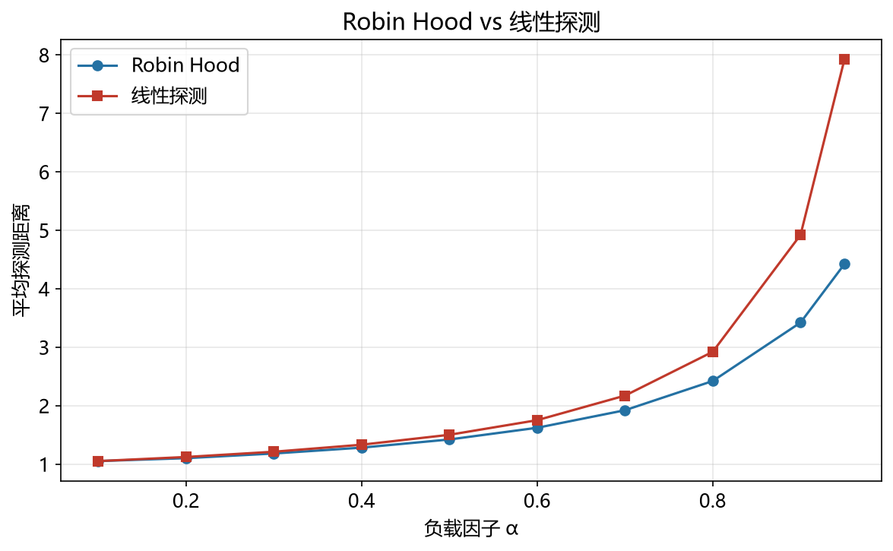

# 罗宾汉哈希性能模型

> 实证日期 2026-09-07 · Python 3.13.0 · 脚本 `scripts/robin_hood_model.py`、`scripts/verify_robin_hood.py` · 结果 `results/robin_hood_*.json`

罗宾汉哈希（Robin Hood Hashing）是开放寻址 + 线性探测的一个变体，机制只有一句话：**插入时比较双方的探测距离，让"富"的给"穷"的让路**。这个规则不改变平均探测距离，但把探测距离的分布压平，直接收益体现在失败查找与尾部延迟上，α=0.9 时失败查找比普通线性探测快约 10 倍。本笔记给出理论公式，并用自写哈希表实测验证。

## 核心机制

每个槽记录元素相对「理想位置」的偏移 PSL（Probe Sequence Length）：`PSL = 当前位置 - home(key)`。理想位置是 `hash(key) % 容量`。

插入时线性探测，遇到占位槽比较双方 PSL：

- 新元素 PSL 更大（更穷）→ **抢占**该槽，把 PSL 更小（更富）的旧元素往后挤
- 新元素 PSL 更小（更富）→ 不抢占，继续向后探测

被挤出的元素携带自己的 PSL 继续探测，而不是继承新元素的 PSL。这是实现里最容易写错的地方。

查找因此多一条提前终止条件：**当前位置元素的 PSL 比自己还小，就可以判定不存在**。因为罗宾汉的不变量保证槽内 PSL 单调不减，遇到比自己富的元素说明目标若存在一定在自己前面。

## 核心公式

负载因子 `α = n / 容量`。均匀哈希假设下的理想值，罗宾汉逼近它：

| 操作 | 罗宾汉逼近的目标 | α=0.5 | α=0.9 |
|---|---|---:|---:|
| 成功查找 | `(1/α)·ln(1/(1-α))` | 1.39 | 2.56 |
| 插入 / 不成功查找 | `1/(1-α)` | 2.00 | 10.0 |

成功查找公式的来历：插入成本取决于插入时刻的 α（从 0 单调增长到当前 α），对 α 积分得 `(1/α)·∫₀^α dx/(1-x) = (1/α)·ln(1/(1-α))`。

**口径警示（这组数字最容易被误引）**：α=0.9 时的 2.56 是均匀哈希的理论下限，对应普通线性探测的**成功查找**均值是 `(1+1/(1-α))/2 = 5.50`。两者的差不是罗宾汉带来的，而是"随机探测 vs 线性探测"的差。罗宾汉仍在做线性探测，初级聚集（primary clustering）依旧存在，所以它的实测均值不会降到 2.56。罗宾汉真正的收益在方差与尾部，下一节用实测数据说明。



## 实测验证

自制罗宾汉哈希表与同哈希函数下的普通线性探测表对照，n=2000，容量 = ceil(n/α)，打乱顺序插入后测查找探测。两表唯一差异是「是否做劫富济贫」。

**不同负载下的探测次数与 PSL 分布：**

| α | 罗宾汉成功 | 罗宾汉失败 | 线性成功 | 线性失败 |
|---:|---:|---:|---:|---:|
| 0.50 | 1.54 | 1.78 | 1.54 | — |
| 0.70 | 2.48 | 2.70 | 2.48 | — |
| 0.90 | 6.66 | 6.97 | 6.66 | 69.69 |
| 0.95 | 9.12 | 9.78 | 9.12 | 150.33 |

**PSL 分布（罗宾汉）vs 偏移分布（线性探测）——这是罗宾汉的全部价值所在：**

| α | 方案 | 均值 | std | p95 | p99 | max |
|---:|---|---:|---:|---:|---:|---:|
| 0.50 | 罗宾汉 | 0.54 | 0.95 | 2 | 4 | 7 |
| 0.50 | 线性探测 | 0.54 | 1.52 | 3 | 7 | 24 |
| 0.70 | 罗宾汉 | 1.48 | 2.09 | 5 | 11 | 14 |
| 0.70 | 线性探测 | 1.48 | 4.42 | 7 | 20 | 61 |
| 0.90 | 罗宾汉 | 5.66 | **5.52** | 16 | 21 | 24 |
| 0.90 | 线性探测 | 5.66 | **21.86** | 23 | 109 | 270 |
| 0.95 | 罗宾汉 | 8.12 | **7.02** | 24 | 26 | 29 |
| 0.95 | 线性探测 | 8.12 | **33.71** | 35 | 174 | 688 |

三点结论：

**一，均值没有改善。** α=0.9 时两者成功查找都是 6.66，PSL 均值都是 5.66。这与理论一致——罗宾汉重新分配的是存量，不减少总量。任何声称"罗宾汉把平均探测降到 2.5"的说法都混淆了均匀哈希下限与罗宾汉实测均值。

**二，方差被压到约四分之一。** α=0.9 时 std 从 21.86 降到 5.52，p99 从 109 降到 21。这是最坏情况查找时间的改善，也是延迟敏感场景选它的理由。

**三，失败查找收益最大。** α=0.9 时 6.97 vs 69.69，α=0.95 时 9.78 vs 150.33。原因是失败查找的代价由探测链长度决定，而长链正是罗宾汉专门削平的对象。提前终止条件（遇更富即判定不存在）进一步压缩了失败查找。

α=0.95 时罗宾汉最大 PSL 仅 29，仍可正常工作，印证了它在中高负载下的稳定性。代价是插入时的抢占开销：α=0.9 时平均每次插入触发 3.06 次交换。

## 存储公式

`存储 = 容量 × (entry_size + psl_field)`。PSL 上界为 O(log n) 量级，工程实现常打包进 4-8 位（本例按 4 字节保守计）。

若叠加 SIMD 分组扫描（把 PSL 换成 1 字节控制字），每槽多 1 字节，即 `容量 × (entry_size + 5)`。以 n=100 万、entry=16 字节、α=0.9 计：容量 1,111,112 槽，基础存储 22.2 MB，加控制字 23.3 MB。

## 扩容阈值

罗宾汉因方差受控，可比普通线性探测容忍更高负载，工程阈值通常取 0.9-0.93（高于 unordered_map 的 0.75）。超过阈值需重建为 2 倍容量，代价 O(n)。

但阈值提高有真实代价：实测显示 α 从 0.9 升到 0.95，罗宾汉失败查找从 6.97 涨到 9.78（+40%），抢占开销从 3.06 升到 4.57 次/插入。线性探测在同样区间从 69.69 涨到 150.33（+116%）。**罗宾汉的优势幅度随负载上升而扩大，但绝对代价仍在增长**——它不是免费的高负载，只是高负载时掉得慢。

## 选型边界

罗宾汉哈希适合查找延迟敏感、负载偏高的内存表：游戏引擎实体表、编译器符号表、嵌入式键值存储。它失败查找快、方差小、实现简单（比布谷鸟简单得多）。

三个不适合的场景：并发写入（PSL 交换不是原子的，需要全局锁）；频繁删除（开放寻址删除需墓碑，负载因子虚高，罗宾汉无法在删除时恢复均衡）；负载长期接近 1（此时任何线性探测变体都退化，该换布谷鸟或扩容）。

对比另外两种方案：布谷鸟哈希查找严格 O(1) 最坏，但负载因子上限 0.5，空间浪费一半；跳房子哈希负载可达 90%+，查找也有界，但需要邻域位图，实现更复杂。罗宾汉处在中间——负载因子与线性探测同档，但把尾部削平，实现成本只多一个 PSL 字段。

## 进阶优化

罗宾汉哈希的优化围绕"把均值也降下来"和"支撑并发"两条线展开，2025 年出现了一条第三条线：理论上重新质疑开放寻址的下界。

**弹性哈希与漏斗哈希**（Farach-Colton, Krapivin, Kuszmaul, 2025, arXiv:2501.02305）：这是本领域近年最具冲击力的理论结果。论文提出**非贪婪**插入策略——不总是接受第一个可用空槽，而是用二维探测（虚拟溢出桶）计算插入地址，证明在不重新排列元素的前提下，均摊与最坏情况期望探测复杂度都能显著优于以往被认为可达的水平。它推翻了姚期智 1985 年《Uniform Hashing is Optimal》留下的核心猜想（贪婪策略下 O(log δ⁻¹) 的均摊探测下界）。对罗宾汉的直接启示：罗宾汉的"劫富济贫"是贪婪框架内的最优均衡之一，但贪婪框架本身存在尚未探尽的空间。

**信息保持哈希**（info-theoretic hashing，Bender 等）：把 PSL 与键的一部分编码进同一个字，用位运算同时完成比较与位移，减少内存访问次数。这是 hashbrown 等现代实现把控制字压到 1 字节的同类思路。

**并发罗宾汉**：PSL 交换的非原子性是主要障碍。工程上有两条路——分片（每片独立表 + 独立锁，Memcached 式），或用乐观并发控制（先无锁读，冲突才回退重试）。Rust hashbrown 目前仍以单线程为主，并发场景多用分片包装。

**与 SIMD 结合的混合设计**：罗宾汉的收益在尾部，SIMD 的收益在均值（一次比较 16 个槽）。现代实现（Go 1.24 起的 map、Rust hashbrown）已把两者合并——用 SIMD 控制字做组内扫描，用罗宾汉式位移做组间均衡。这消解了"选罗宾汉还是选瑞士表"的旧二分，当前工程实践是两者叠加。

**哈希函数是前置条件**：罗宾汉只在哈希分布接近均匀时兑现收益。用弱哈希函数（如直接用键的低位）会在 α=0.9 时立刻退化，因为聚集一旦形成，重新分配存量也无济于事。生产实现配 AHash / xxHash 这类高质量快速哈希。

## 复现

```bash
cd experiments/test_index_theory
<pkm-hub-runtime>/.venv/Scripts/python.exe scripts/robin_hood_model.py
<pkm-hub-runtime>/.venv/Scripts/python.exe scripts/verify_robin_hood.py
```

## 来源

- 成功查找公式 `(1/α)·ln(1/(1-α))` 与不成功查找公式 `1/(1-α)` 为均匀哈希假设下的标准推导（CLRS 第 11 章开放寻址分析）
- 罗宾汉哈希原论文：Celis P, Larson P, Munro J. "Robin Hood Hashing", FOCS 1985
- PSL 分布精确分析：Viola A. "Distributional analysis of Robin Hood linear probing hashing with buckets", Algorithmica 21(1), 2005
- Rust std::collections::HashMap 采用罗宾汉哈希（自 Rust 1.0 起，底层为 hashbrown）
- 弹性哈希与漏斗哈希：Farach-Colton M, Krapivin A, Kuszmaul W. "Optimal Bounds for Open Addressing Without Reordering", arXiv:2501.02305, 2025 年 1 月
