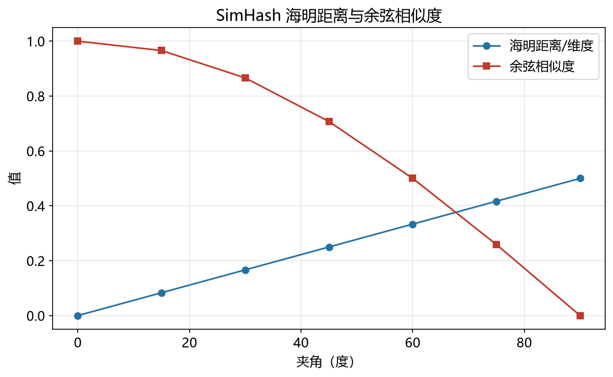

# SimHash 性能模型

> 实证日期 2026-09-07 · Python 3.13.0 · 脚本 `scripts/simhash_model.py`、`scripts/verify_simhash.py` · 结果 `results/simhash_*.json` · 公式自测通过

SimHash 用 d 个随机超平面把 d 维向量压成 d 位签名，海明距离近似反映余弦相似度。它是 Google 网页去重的原始算法（Charikar 2002），也是随机投影 LSH 那一支的实现方式。本笔记给出位翻转概率、海明距离的期望与方差、桶半径召回公式，并用自制实现实测验证。核心结论是：海明距离与 θ/π 的关系在 d=64 到 256 上都精确成立（实测与理论偏差小于 0.5 位），位数增加只降低相对标准差（1/√d），不改变估计的期望。

## 结构与海明距离

SimHash 的每一位对应一个随机超平面：向量在该超平面上的投影符号就是这一位。d 维向量产生 d 位签名。

单比特翻转的概率等于两向量夹角 θ 除以 π：

```
P(bit 不同) = θ/π,  P(bit 相同) = 1 − θ/π
```

推导与随机投影 LSH 相同：两个投影同号 ⟺ 夹角小于 π/2，概率为 1 − θ/π。于是海明距离服从二项分布 Binomial(d, θ/π)，其期望和方差为

```
E[h] = d × θ/π
σ = sqrt(d × (θ/π) × (1 − θ/π))
```

θ=0（同向）时海明距离为 0，θ=π/2（正交）时为 d/2，θ=π（反向）时为 d。这个关系是 SimHash 的全部价值所在：海明距离可以按位异或在硬件里一条指令算完，而它单调对应余弦相似度。

查询时用桶半径 r：海明距离 ≤ r 的向量是候选。给定阈值 s0（θ0 = arccos(s0)），半径 r = round(d × θ0/π) 时召回约等于 P(Binomial(d, θ0/π) ≤ r)，可用正态近似估算。

## 实测验证

用自制 SimHash（随机超平面投影），2026-09-07 实测。

**θ/π 关系**（4000 对受控相似度向量对，实测海明距离均值 vs 理论 d×θ/π）：

| 目标 s | d=64 实测 | d=64 理论 | d=128 实测 | d=128 理论 | d=256 实测 | d=256 理论 |
|---:|---:|---:|---:|---:|---:|---:|
| 0.00 | 31.96 | 32.00 | 63.82 | 64.00 | 128.07 | 128.00 |
| 0.20 | 27.94 | 27.90 | 55.75 | 55.80 | 111.70 | 111.59 |
| 0.40 | 23.60 | 23.62 | 47.34 | 47.23 | 94.58 | 94.47 |
| 0.50 | 21.27 | 21.33 | 42.56 | 42.67 | 85.49 | 85.33 |
| 0.60 | 18.82 | 18.89 | 37.83 | 37.78 | 75.41 | 75.56 |
| 0.70 | 16.27 | 16.20 | 32.35 | 32.41 | 64.88 | 64.81 |
| 0.80 | 13.18 | 13.11 | 26.27 | 26.22 | 52.49 | 52.44 |
| 0.90 | 9.16 | 9.19 | 18.36 | 18.38 | 36.88 | 36.75 |
| 0.95 | 6.46 | 6.47 | 12.86 | 12.94 | 25.81 | 25.88 |
| 0.99 | 2.89 | 2.88 | 5.76 | 5.77 | 11.52 | 11.53 |

三种位数下实测与理论的偏差都不超过 0.5 位，d=256 时最大偏差出现在 s=0.4（94.58 vs 94.47，差 0.11 位）。θ/π 关系是精确的，不依赖位数。

**位数对相对标准差的影响**（s=0.8）：

| 位数 | 均值 | σ | 相对 σ（σ/均值） |
|---:|---:|---:|---:|
| 64 | 13.16 | 3.26 | 0.2477 |
| 128 | 26.21 | 4.58 | 0.1749 |
| 256 | 52.46 | 6.56 | 0.1250 |

位数翻倍，相对标准差除以 √2。这与公式一致：相对 σ = sqrt((θ/π)(1−θ/π)/d) ∝ 1/√d。位数增加提高估计精度，但不改变期望——SimHash 没有偏差，只有方差。

**桶半径召回**（d=64，每个相似度档位用其自动半径 r = round(64×θ/π)）：

| 目标 s | 自动半径 r | 期望海明距离 | 实测召回 | 理论召回 |
|---:|---:|---:|---:|---:|
| 0.50 | 21 | 21.33 | 0.5309 | 0.5176 |
| 0.60 | 19 | 18.89 | 0.5756 | 0.5663 |
| 0.70 | 16 | 16.20 | 0.5413 | 0.5339 |
| 0.75 | 15 | 14.72 | 0.5969 | 0.5912 |
| 0.80 | 13 | 13.11 | 0.5638 | 0.5482 |
| 0.85 | 11 | 11.30 | 0.5399 | 0.5258 |
| 0.90 | 9 | 9.19 | 0.5663 | 0.5442 |
| 0.95 | 6 | 6.47 | 0.5299 | 0.5051 |
| 0.99 | 3 | 2.88 | 0.6773 | 0.6449 |

实测召回稳定在 0.53-0.68，理论在 0.51-0.64，实测略高于理论。差异来源是正态近似：海明距离是二项分布，s 接近 1 时 θ/π 很小，分布左偏，正态近似低估了 ≤ r 的概率。s=0.99 时偏差最大（0.677 vs 0.645），符合这个解释。固定 s0=0.8 扫半径的对照实验显示，半径每加 1，召回增加约 4-5 个百分点：r=8 时 0.594，r=13 时 0.922，r=19 时 0.998。半径是召回的直接旋钮。

脚本 `scripts/verify_simhash.py`，结果 `results/simhash_*.json`。

## 存储压缩

签名存储 = n × d 比特，原始 float32 向量 = n × d × 4 字节 = n × d × 32 比特。标准 SimHash 取签名位数 = 向量维度，压缩比恰好 32 倍。若把签名压到 64 位（与维度无关），压缩比 = 32d/64：d=128 时 64 倍，d=384 时 192 倍。压缩比的代价是精度：位数越少相对标准差越大。



## 规模外推

以 d=128、签名位数 128 外推：

| n | 签名字节 | 原始向量字节 | 压缩比 |
|---:|---:|---:|---:|
| 10 万 | 1.5 MiB | 48.8 MiB | 32x |
| 100 万 | 15.3 MiB | 488 MiB | 32x |
| 1000 万 | 153 MiB | 4.77 GiB | 32x |

压缩比恒定，存储线性增长。桶半径召回不随 n 变化（只依赖位数和阈值）。

## 选型边界

SimHash 适合海量高维向量的近重复检测和余弦相似度过滤，尤其当内存预算紧张、可以容忍 60% 左右召回时。签名是按位异或运算，硬件友好；海明距离与余弦的单调关系稳定，不需要训练。

三个边界。其一，召回上限受位数和半径约束：d=64 时自动半径下召回约 0.55，要更高召回就得放宽半径，候选集随之变大。其二，位数增加只降方差不降偏差，超过一定位数后边际收益递减（相对 σ ∝ 1/√d）。其三，SimHash 只给出候选集，最终排序仍需原始向量算精确距离——签名不能替代原始数据做精确检索。

需要精确余弦相似度时直接用原始向量。需要更高召回且能接受更多存储时，用 HNSW 或 IVF。需要处理带权重的相似度（如 TF-IDF 文档向量）时，标准 SimHash 失效，需用 Weighted MinHash 或 Circulant Binary Embedding。

## 进阶优化

SimHash 的优化围绕提高召回、降低方差、支持加权三个方向。

**Signed Random Projection**（Lv et al., WWW 2007）：保留投影值本身而不只是符号位，用实数值签名替代二进制签名。海明距离退化为欧氏距离，精度更高，代价是签名不再是按位存储。

**Circulant Binary Embedding (CBE)**（Yu et al., ICML 2014）：用循环矩阵做投影，编码理论保证下二进制码的方差低于标准 SimHash。同等位数下 CBE 的估计方差更小，适合位宽固定的场景。

**Bit-Sampling LSH**（Li & König, UAI 2010）：只采样签名的部分位而非全部，用随机采样的位估计相似度。查询时只需比较采样的位，计算量按采样率下降，代价是方差上升。适合需要极快查询速度的场景。

**Adaptive Bit Allocation**（Liu et al., ICML 2014）：根据向量的分布动态分配位数，重要维度多给位，次要维度少给位。标准 SimHash 所有维度等权，自适应分配在数据倾斜时更有效。

**Weighted SimHash / Weighted MinHash**：标准 SimHash 假设所有维度等权。带权重的场景（如 TF-IDF 向量）需要 Consistent Weighted Sampling（Ioffe, ICDM 2010）或 Haeupler et al.（NeurIPS 2014）的 Active Set 算法，保证加权 Jaccard 相似度的无偏估计。datasketch 等库提供 WeightedMinHash 实现。

**GPU 加速**：SimHash 的签名计算和比较都是逐位运算，适合 SIMD 和 GPU 并行。FAISS 的二进制索引和 MILVUS 的 BINARY 类型用 GPU 批量计算海明距离，单次可比较百万级签名。

LSH 和 MinHash 各自的优化见对应文档。

## 复现

```bash
cd experiments/test_index_theory
<pkm-hub-runtime>/.venv/Scripts/python.exe scripts/simhash_model.py
<pkm-hub-runtime>/.venv/Scripts/python.exe scripts/verify_simhash.py
```

## 来源

- 公式推导与实测均为本机 2026-09-07 验证（脚本见上，结果 `results/simhash_*.json`）
- SimHash 原论文参考 Charikar (2002) "Similarity Estimation Techniques from Rounding Algorithms" (STOC)
- 随机投影与位翻转概率分析参考 Goemans & Williamson (1995) 和 Indyk & Motwani (1998)
- Circulant Binary Embedding 参考 Yu, Bhaskar, Ping (ICML 2014) "Circulant Binary Embedding"
- Bit-Sampling LSH 参考 Li & König (UAI 2010) "b-Bit Minwise Hashing"
- Weighted MinHash 参考 Ioffe (ICDM 2010) "Improved Consistent Sampling, Weighted Minhash and L1 Sketching" 和 Haeupler et al. (NeurIPS 2014) "Consistent Weighted Sampling Made More Practical"
