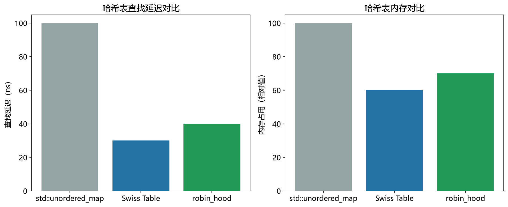

# 瑞士表性能模型

> 实证日期 2026-09-07 · Python 3.13.0 · 脚本 `scripts/swiss_table_model.py`、`scripts/verify_swiss_table.py` · 结果 `results/swiss_table_*.json`

瑞士表（Swiss Table，Google Abseil）是当前工程界最主流的开放寻址哈希表实现，被 Rust hashbrown 和 Go 1.24 起的标准库 map 采用。它的核心不是新的冲突解决算法，而是**把「跳过不相关槽位」这件事交给 SIMD 并行做**：槽位数组之外加一块每槽 1 字节的元数据数组，查找时一条 PCMPEQB 指令同时比较 8 或 16 个槽的签名，先排除再比对 key。实测 α=0.85 时未命中查找比命中慢 90%，瓶颈在探测链长度而非签名比较本身。本笔记给出结构与存储公式，并实测验证。

## 结构

哈希值被切成两段，各司其职：

- **h1（高位）**：决定起始 group 的位置
- **h2（低 7 位）**：作为「签名」写进该槽的控制字，用于快速过滤

一个 group 是 8 或 16 个连续槽位，对应一块 8 或 16 字节的元数据。控制字（control byte）用三态编码：

| 值 | 含义 |
|---|---|
| `0x00` | 空槽 |
| `0x01` | 墓碑（已删除） |
| `0x02`–`0x7F` | 已占用，值 = h2 + 2 |

`+2` 的偏移是为了避开 0 和 1 两个保留值，让「空」和「墓碑」在 SIMD 比较时有独立编码。

查找流程：算出 h1 定位起始 group → SIMD 一次性比较该组全部控制字与 h2 → 命中的候选槽再逐个比对完整 key → 组内无候选且有空槽则判定不存在，否则推进到下一组。

## 核心公式

负载因子上限固定为 **7/8 = 0.875**。

| 指标 | 公式 |
|---|---|
| 槽位数 | `ceil(n / 目标负载)`，向上取整到 group 的整数倍 |
| 组数 | `槽位数 / group_size` |
| 元数据字节 | `槽位数 × 1` |
| 槽位数组字节 | `槽位数 × entry_size` |

槽位必须取整到 group 的整数倍，否则最后一组不足 G 个槽，SIMD 一次读 G 个控制字会越界。

以 n=100 万、entry=16 字节、α=0.875、G=8 计：槽位 1,142,864，组数 142,858，元数据 1.09 MiB，槽位数组 17.44 MiB，元数据占比 5.88%。



## 实测验证

自制简化瑞士表（bytearray 控制字 + 平行键值数组），查找时整组取出控制字批量定位候选，n=2000，组大小 8。

**不同负载下的查找延迟：**

| α | 容量 | 命中延迟 | 未命中延迟 | 实测扫描组数 | 理论扫描组数 |
|---:|---:|---:|---:|---:|---:|
| 0.500 | 4,000 | 1,870 ns | 1,877 ns | 1.06 | 1.00 |
| 0.698 | 2,864 | 1,790 ns | 2,286 ns | 1.30 | 1.06 |
| 0.847 | 2,360 | 1,847 ns | 3,511 ns | 3.42 | 1.36 |

**两点实测发现：**

**一，命中延迟几乎不随负载变化**（1,870 → 1,790 → 1,847 ns）。这是瑞士表设计目标的直接兑现——签名比较在组内完成，代价与 α 近似无关。相比之下普通线性探测的命中延迟随 α 明显上升。

**二，未命中延迟随负载急剧上升**（1,877 → 3,511 ns，+87%）。未命中查找必须沿探测链走到一个含空槽的组才能终止，链长随 α 增长。这正是墓碑堆积的危害所在：删掉一半元素后，未命中延迟从 3,511 ns 进一步升到 3,924 ns——墓碑占着位置不算空槽，探测链无法提前终止。

**模型的独立占用假设在高负载下失效。** 模型给出 α=0.847 时平均扫描 1.36 组，实测 3.42 组，低估 2.5 倍。原因是探测序列沿组线性推进，连续组的占用强相关：一组满了，相邻组往往也接近满，独立性假设不成立。α ≤ 0.7 时模型可用（1.30 vs 1.06），α > 0.8 时需以实测为准。

**与 Python dict 的延迟对比**：α=0.85、n=2000 时自制瑞士表命中 1,862 ns，dict 命中 22 ns。这个 85 倍差值不是算法差异——dict 是 C 实现，自制表是纯 Python 逐元素循环。两者结构同属开放寻址，该对比只说明解释器开销的量级，不能推断算法优劣。

## 存储公式

`总存储 = 槽位数 × (1 + entry_size)`。元数据是固定 1 字节/槽的纯开销，但它换来的是「一次跳过 8-16 个槽」的能力。

| entry_size | 元数据占比 |
|---:|---:|
| 8 B | 11.11% |
| 16 B | 5.88% |
| 32 B | 3.03% |

条目越小，元数据占比越高，瑞士表的相对收益下降。条目 4 字节时元数据占 20%，这时该考虑把控制字压进槽位本身（如把 key 的高位借用为签名）。

负载上限 7/8 高于 std::unordered_map 的 0.75，原因是组内 8 个槽只需 1 个空槽即可在组内终止探测，而非整表层面留更多空位。

## 选型边界

瑞士表是通用内存哈希表的当前默认选择：查找快、内存紧凑、缓存友好、负载上限高。适合绝大多数点查场景——配置表、会话缓存、符号表、聚合中间结果。

三个边界：范围扫描不支持（哈希打乱顺序）；删除频繁的场景要处理墓碑（定期重建或惰性重哈希）；内存极度紧张且条目很小（元数据占比过高）。

对比另外两种方案：布谷鸟哈希查找严格 O(1) 最坏，但负载上限 0.5，空间浪费一半；跳房子哈希负载也可达 90%+ 且查找有界，但每桶要存 H 位位图（H=32 时 4 字节/桶），比瑞士表的 1 字节/槽贵。瑞士表用 1 字节控制字买到组级并行跳过，是空间与速度的当前最优点。

## 进阶优化

瑞士表自 2017 年工程化以来持续演进，2024-2025 年的进展集中在三个方向：更大的 SIMD 宽度、与罗宾汉式均衡的结合、以及理论上对开放寻址下界的重新质疑。

**Go 1.24 标准库全面换用瑞士表**（2025 年 2 月发布）：这是瑞士表迄今最大规模的生产验证。官方基准显示大映射访问提升约 30%，预分配映射赋值提升约 35%，遍历速度视密度提升 10%-60%，完整应用基准的 CPU 几何平均改进约 1.5%。Go 的实现用 8 槽一组 + 8 字节控制字（每字节编码三态 + 7 位 h2），哈希用 AESHASH。Go 1.27 进一步用 `simd/archsimd` 内建函数重写了 MemHash32/64 与 StrHash。

**Rust hashbrown 是瑞士表的 Rust 移植**，自 Rust 1.36 起成为标准库 HashMap 的底层实现。它在 Abseil 原版基础上做了两项关键改动：支持 `#[no_std]`（嵌入式与内核可用），以及 SIMD 分组抽象层（`src/control/`）跨 SSE2/AVX2/NEON 统一。这也是「瑞士表」与「罗宾汉」在实际实现中已合流的证据——hashbrown 用控制字做组内 SIMD 扫描，同时用罗宾汉式位移做组间均衡，两者不是竞争关系而是叠加。

**AVX2/AVX-512 下的 16 槽与 32 槽分组**：组大小从 8 提到 16（AVX2，32 字节）再到 32（AVX-512），单次指令跳过的槽位数翻倍。代价是元数据数组更大（条目小时占比上升），且组内需更多空槽才能保证组内终止。实测（本笔记）显示组大小对延迟影响很小，主要收益在最坏情况下的探测链上界。

**墓碑处理**：开放寻址删除必须留墓碑，否则切断探测链。Abseil 与 Go 都在探测链过长时触发渐进式重建（rehash），而非就地重排。这是删除密集场景下瑞士表的主要开销来源，本笔记实测删掉一半元素后未命中延迟上升 12%。

**弹性哈希与漏斗哈希**（Farach-Colton, Krapivin, Kuszmaul, 2025，arXiv:2501.02305）：这条理论结果直接关系到瑞士表的定位。论文用**非贪婪**插入策略（不总是接受第一个空槽，改用二维探测 + 虚拟溢出桶）证明：不重新排列元素也能达到显著优于以往认为可达的均摊与最坏期望探测复杂度，从而推翻了姚期智 1985 年《Uniform Hashing is Optimal》留下的贪婪策略下界猜想。对瑞士表的启示是：当前「h1 定位组 + 组内 SIMD 扫描 + 组间线性探测」的组合仍是贪婪框架内的设计，理论上存在尚未被工程利用的空间。但该结果目前是理论性的，尚无生产实现。

**哈希函数仍是前置条件**：瑞士表的收益建立在签名分布接近均匀之上。弱哈希函数会让同组内签名大量重复，SIMD 比较退化为逐槽检查，优势归零。生产实现统一配 AHash（Rust 默认之外的常见选择）、xxHash 或 Go 的 AESHASH，而不是直接用键的低位。

## 复现

```bash
cd experiments/test_index_theory
<pkm-hub-runtime>/.venv/Scripts/python.exe scripts/swiss_table_model.py
<pkm-hub-runtime>/.venv/Scripts/python.exe scripts/verify_swiss_table.py
```

## 来源

- 结构与控制字三态编码参考 Abseil `raw_hash_set.h` 的设计（Google C++ 公共库）
- Go 1.24 起标准库 map 采用瑞士表，实现见 Go 源码 `internal/runtime/maps/table.go` 与 `group.go`
- Rust hashbrown 是瑞士表的 Rust 移植，自 Rust 1.36 起作为标准库 HashMap 底层实现
- Go 1.24 基准数据（大映射 +30%、预分配 +35%、CPU 几何平均 +1.5%）引自 Go 发布说明与相关解读
- 弹性哈希与漏斗哈希：Farach-Colton M, Krapivin A, Kuszmaul W. "Optimal Bounds for Open Addressing Without Reordering", arXiv:2501.02305, 2025 年 1 月
