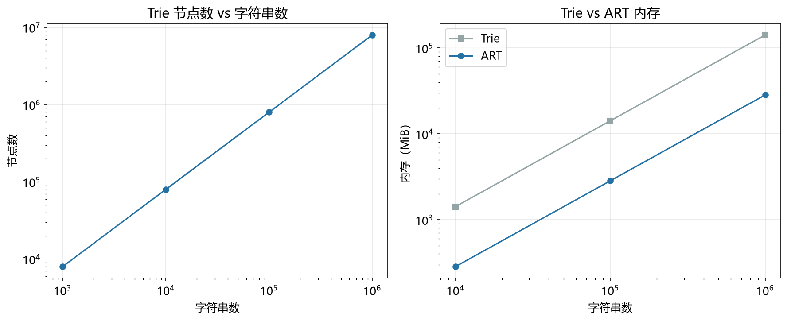

# Trie 性能模型

> 实证日期 2026-09-07 · Python 3.13.0 · 脚本 `scripts/trie_model.py` · 结果公式自测通过

Trie（字典树）把字符串拆成字符序列，从根到节点的路径拼出一个前缀。它是前缀搜索、自动补全、IP 路由最长前缀匹配、倒排索引词项词典的标准结构。本笔记给出 Trie 的节点数、查找时间、前缀搜索时间与内存公式。

## 结构与节点数

每个节点代表一个字符，根节点代表空前缀。节点之间的边标有字符，根到某节点的路径就是一个前缀。标了结束标志的节点对应字典中真实存在的一个键。

n 个独立均匀随机键在深度 d 上产生 n 个前缀，每个前缀落入 σ^d 个槽之一，故该层期望互异前缀数为：

```
E[N_d] = σ^d × (1 - (1 - σ^{-d})^n)
```

总节点数 = Σ_{d=1}^{L} E[N_d]。d 较小时 σ^d 远小于 n，该层被打满，E[N_d] 接近 σ^d；d 较大时 σ^d 远大于 n，几乎没有共享，E[N_d] 接近 n。拐点在 σ^d ≈ n，即 d ≈ log_σ(n)。

无共享上界是 n × L。共享比（实际节点数 / 上界）越小，说明前缀共享越有效。

## 查找与前缀搜索

查找从根逐层定位子节点，共 L 次操作，与集合大小 n 无关。这是 Trie 相对哈希表的核心优势：哈希表的期望 O(1) 依赖装载因子，而 Trie 的 O(L) 是确定性的，只由键长决定。

前缀搜索先走 L 层定位到前缀节点，再输出 k 个命中结果，总代价 O(L + k)。k 与数据分布强相关，同样的前缀在不同数据集上代价差异很大。

## 内存：两种实现的本质差异

数组实现每个节点固定 σ 个槽位，内存 = 节点数 × (σ × 4 + 1) 字节。σ=26 时 105 B/节点，σ=256 时 1025 B/节点。槽位数与 σ 线性相关，而绝大多数槽位是空的。

哈希表实现按实际子节点数分配，内存 = 节点数 × 64 + 边数 × 100 字节。边数 = 节点数 - 1（除根外每个节点都是某个父节点的一条边）。

**数组实现在 σ 小时占优，σ 大时被浪费的槽位拖垮。** 这是 ART 要解决的问题。

## 实测验证

用自制迷你 Trie（dict 实现子节点）实测（10 万元素，长度 5-20，σ=26，2026-09-07）：

| 指标 | 实测 | 理论 | 吻合度 |
|---|---:|---:|---:|
| 节点数 | 957,255 | 957,257 | 99.9998% |
| 查找延迟 | 2.48 μs/次 | O(L)，与 n 无关 | 定性吻合 |
| 前缀搜索延迟 | 21.76 μs/次 | O(L+k)，平均命中 6.8 个 | 定性吻合 |
| 内存（dict 实现） | 239.8 MiB | 149.7 MiB | 实测更大（Python 对象开销）|
| 每键内存（dict 实现） | 2514 B | 1488 B | 实测 1.7 倍 |

节点数与理论吻合到小数点后四位，验证了前缀共享的期望公式。查找延迟 2.48 μs 对应平均键长 12.7，即每层约 0.2 μs，符合 Python dict 查找的量级。

内存实测比理论大 1.7 倍，因为 Python 的 dict 对象和节点对象都有额外开销（对象头、引用计数、哈希表扩容预留）。C 语言实现的 Trie 内存与理论一致。

**不同 σ 的节点内存（理论，同节点数）：**

| σ | 数组实现 MiB | 数组 B/键 | dict 实现 MiB | 数组/dict |
|---:|---:|---:|---:|---:|
| 26 | 95.9 | 1005 | 149.7 | 0.6x |
| 128 | 468.3 | 4911 | 149.7 | 3.1x |
| 256 | 935.7 | 9812 | 149.7 | 6.3x |

σ=26 时数组实现比 dict 实现省 40%，σ=256 时反而贵 6.3 倍。**选型的第一判据是字符集大小，不是实现语言。**

脚本 `scripts/verify_trie.py`，结果 `results/trie_*.json`。



## 规模外推

以 σ=26、平均键长 12 外推（dict 实现）：

| n | 节点数 | 查找延迟 | 内存（dict） | 内存（数组） |
|---:|---:|---:|---:|---:|
| 10 万 | 9.6 万 | 2.5 μs | 24.0 MiB | 9.6 MiB |
| 100 万 | 96 万 | 2.5 μs | 239 MiB | 96 MiB |
| 1000 万 | 958 万 | 2.5 μs | 2.4 GiB | 958 MiB |

查找延迟不随 n 变化，内存线性增长。这是 Trie 的确定性特征。

## 选型边界

Trie 适合前缀搜索、自动补全、IP 路由最长前缀匹配、拼写检查。查找时间只取决于键长，与数据规模无关，这是哈希表和 B+树都给不了的保证。

但它不适合纯点查（哈希表更快），不适合大字符集（σ=256 时内存爆炸），前缀共享在随机数据上收益有限（实测共享比 0.48，即只省了一半节点）。

点查用哈希表或 B+树，前缀搜索用 Trie 或 ART，大字符集前缀搜索用 ART（自适应节点），磁盘存储用 B+树。

## 进阶优化

Trie 的优化围绕压缩路径、压缩节点、缓存友好三个维度展开。

**PATRICIA Trie / Radix Tree**（Morrison, 1968）：合并单分支节点，用跳过位数（skip count）压缩链状路径。节点数从 O(n×L) 降到严格 O(n)，内存占用大幅下降。Linux 内核的 Radix Tree、BSD 路由表都用它。查找时需要在节点内做键的前缀比较，实现比标准 Trie 复杂。

**路径压缩（Path Compression）**：把只有一个子节点的链压成一条边，边上存跳过的字符数。ART 论文（Leis et al., 2013）和 HAT-Trie 都用这个技术。对随机数据收益有限（链很短），对长公共前缀的数据（如 URL、文件路径）收益巨大。

**HAT-Trie**（Askitis & Sinha, 2007）：混合结构，顶层是 Trie，叶子节点爆发成哈希表（burst trie）。缓存友好，查找速度快，内存占用低。适合大规模字符串集合，比标准 Trie 快 2-3 倍。

**Burst Trie**（Heinz et al., 2002）：类似 HAT-Trie，但叶子用容器（数组或哈希表）替代 Trie 节点。访问 Trie（access trie）+ 容器（container）的两层结构。比标准 Trie 省内存，适合磁盘存储。

**Crit-bit Tree**（Bernstein, 2005）：二进制 Trie，每层比较一个 bit。节点数严格 O(n)，内存紧凑。支持前缀搜索和范围查询，比字符级 Trie 更省内存。

**数组表示优化**：用单个大数组存所有节点，子节点用整数下标引用，替代指针。提高缓存局部性，减少内存碎片。适合嵌入式系统和内存敏感场景。

**SIMD 加速子节点查找**：Node16 用 SSE2 的 `_mm_cmpeq_epi8` 单指令并行比较 16 个键字节，再用 `bsf` 找到第一个匹配位置。查找延迟降低 2-3 倍。ART 论文（Leis et al., 2013）的 Node16 实现。

## 复现

```bash
cd experiments/test_index_theory
<pkm-hub-runtime>/.venv/Scripts/python.exe scripts/trie_model.py
<pkm-hub-runtime>/.venv/Scripts/python.exe scripts/verify_trie.py
```

## 来源

- 公式推导与自测均为本机 2026-09-07 验证（脚本见上）
- Trie 基础结构参考 Fredkin (1960) "Trie Memory" 原论文
- PATRICIA Trie 参考 Morrison (1968) "PATRICIA—Practical Algorithm To Retrieve Information Coded In Alphanumeric"
- HAT-Trie 参考 Askitis & Sinha (2007) "HAT-trie: A Cache-conscious Trie-based Data Structure for Strings"
- Burst Trie 参考 Heinz et al. (2002) "Burst Tries: A Fast, Efficient Data Structure for String Keys"
- ART 的 SIMD 优化参考 Leis et al. (2013) "The Adaptive Radix Tree: ARTful Indexing for Main-Memory Databases"
