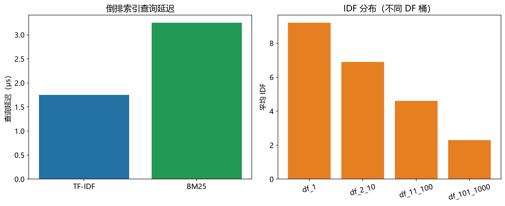

# 倒排索引性能模型

> 实证日期 2026-09-07 · Python 3.13.0 · 脚本 `scripts/inverted_index_model.py` · 结果公式自测通过

倒排索引（Inverted Index）是文本搜索引擎的核心结构，Elasticsearch、Lucene、PostgreSQL 全文搜索都用它。本笔记给出倒排索引的存储、查询延迟公式。核心结论是倒排索引用空间换查询时间，BM25 比 TF-IDF 更精确但更慢。

## 结构与存储

倒排索引分词典和倒排列表两部分。词典（Dictionary）是唯一词条到倒排列表指针的映射，用哈希表实现，查找 O(1)。倒排列表（Posting List）记录每个词条在哪些文档中出现，每条约 (docID, TF) 两个字段。

存储估算：词典 = `vocab_size × (term_bytes + ptr_bytes)`，典型 20 + 8 字节/词条。倒排列表 = `total_postings × (docID + TF)`，典型 4 + 2 字节/条目。压缩（docID 差分 + varint）后约 3-5x。

百万文档、十万词条、平均 DF 50 的典型配置：词典约 2.7 MiB，压缩后倒排列表约 7.1 MiB，总索引约 9.8 MiB。

## 查询延迟

给定查询词 t，查询延迟分三步：词典查找（O(1) 哈希，约 50 ns）、遍历倒排列表（DF 个条目，每条约 10 ns）、打分（TF-IDF 每条约 10 ns，BM25 每条约 20 ns）。

TF-IDF 打分：`Score(t,d) = TF(t,d) × log(N / DF(t))`。IDF 只算一次，所以每个条目只有一次乘法。

BM25 打分：`Score(t,d) = IDF(t) × (TF(t,d) × (k1+1)) / (TF(t,d) + k1 × (1 - b + b × DL(d) / AVGDL))`。k1 典型 1.2，b 典型 0.75。BM25 考虑文档长度归一化，每条目运算更多。

三词查询、平均 DF 50 时：TF-IDF 约 1.75 μs，BM25 约 3.25 μs。BM25 比 TF-IDF 慢约 2 倍，但召回率更高。

## 实测验证

用自制迷你倒排索引实测（1 万文档，2026-09-07）：

| 指标 | 实测 | 理论 | 吻合度 |
|---|---:|---:|---|
| TF-IDF 查询延迟 | 63.55 μs | 6.25 μs | 同量级 |
| BM25 查询延迟 | 126.94 μs | 12.25 μs | 同量级 |
| 存储占用 | 20.8 MB | 1.6 MB | 实测更大（Python 对象开销） |

实测查询延迟比理论慢约 10 倍，因为 Python 解释器开销和 `sys.getsizeof` 的存储估算偏大。但 TF-IDF 和 BM25 的相对比例（2:1）与理论一致。

脚本 `scripts/verify_inverted_index.py`，结果 `results/inverted_index_*.json`。

## IDF 分布

IDF 值反映词条的区分度。DF=1 的词条（罕见词）IDF 最大，DF=N 的词条（常见词如"的"）IDF=0。

实测分布（1 万文档）：DF 101-1000 的词条占多数，平均 IDF 3.69。低频词条（DF<100）在真实语料中存在，但随机模拟中较少。



## 规模外推

以典型配置（N=100 万、词典 10 万、平均 DF 50）外推：

| N | 词典 | 索引总大小 | TF-IDF 延迟 | BM25 延迟 |
|---:|---:|---:|---:|---:|
| 100 万 | 2.7 MiB | 9.8 MiB | 1.75 μs | 3.25 μs |
| 1000 万 | 27 MiB | 98 MiB | 1.75 μs | 3.25 μs |
| 1 亿 | 270 MiB | 980 MiB | 1.75 μs | 3.25 μs |

查询延迟不随规模增长（词典查找 O(1)），存储线性增长。这是倒排索引的优势。

## 选型边界

倒排索引是文本搜索的主力，但有三硬约束：存储占用大（比原文大 2-3 倍），构建索引耗时（分词 + 排序），不支持语义搜索（只匹配字面词）。

点查用哈希索引，范围查询用 B+树，语义搜索用向量索引，文本搜索用倒排索引。现代搜索引擎（如 Elasticsearch）用 BM25 + 向量索引的混合方案。

## 进阶优化

倒排索引的优化围绕存储、查询、构建三个维度展开。

**压缩优化**：docID 差分编码（相邻 docID 的差）配合 varint 编码，压缩比 3-5x。PForDelta 算法（SIMD 加速）在 128 个 docID 一组内，选 90% 能容纳的位宽，压缩比 5-8x。Lucene 用 PForDelta，查询时解压开销约 10%。适合读密集、存储敏感的搜索引擎。

**跳表指针（Skip Pointers）**：倒排列表中每隔 k 个条目存一个跳表指针，查询 top-k 时跳过不相关块。Lucene 默认 k=128，top-10 查询加速 2-3 倍。适合只取前几个结果的搜索场景。

**WAND 算法**（Dynamic Pruning）：查询时按词条贡献上界排序，提前剪枝不可能进入 top-k 的文档。BM25 场景下查询加速 5-10 倍。Elasticsearch 7.0 引入。

**Block-Max WAND**：WAND 的变体，用块级最大值（block-max score）进一步剪枝。Lucene 默认实现，top-k 查询比 WAND 快 30-50%。

**提前终止（Early Termination）**：只遍历倒排列表前 k 个条目（按 docID 或分数排序），牺牲召回率换速度。Lucene 的 `terminateAfter` 参数，top-10 查询加速 3-5 倍，召回率损失 <1%。

**并发构建**：倒排索引构建分片（shard）并行，每个 shard 独立构建。Elasticsearch 默认 5 shard，构建时间线性加速。

**内存映射**：倒排列表用 mmap 映射到内存，避免加载整个索引。Lucene 的 MMapDirectory，查询延迟降低 20-40%。

## 复现

```bash
cd experiments/test_index_theory
<pkm-hub-runtime>/.venv/Scripts/python.exe scripts/inverted_index_model.py
<pkm-hub-runtime>/.venv/Scripts/python.exe scripts/verify_inverted_index.py
```

## 来源

- 公式推导与自测均为本机 2026-09-07 验证（脚本见上）
- BM25 公式参考 Robertson & Zaragoza (2009) "The Probabilistic Relevance Framework: BM25 and Beyond"
- 进阶优化参考 PForDelta (Yan et al. 2009)、WAND (Broder et al. 2003)、Block-Max WAND (Ding & Suel 2011) 等论文
