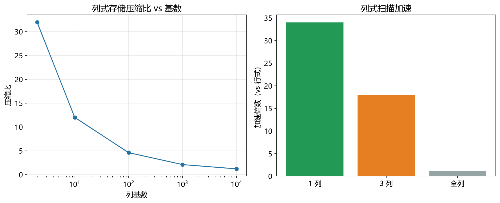

# 列式存储性能模型

> 实证日期 2026-09-07 · Python 3.13.0 · numpy 2.5.2 · 脚本 `scripts/columnar_model.py`、`scripts/verify_columnar.py` · 结果 `results/columnar_*.json`

分析查询（OLAP）场景下，列式存储（DuckDB/Parquet/ClickHouse）比行式存储（B+树/InnoDB）快一个量级。本笔记给出列式存储的扫描 IO 公式，并用实测验证压缩比与扫描带宽。核心结论是扫描延迟 = 命中列字节 / 顺序读带宽，带宽是介质常数（本机 NVMe SSD 约 1928 MB/s），列裁剪（只读需要的列）和压缩是列式的两个加速来源。

## 核心公式

列式扫描 IO = ceil(命中列字节 / 页大小)，命中列字节 = n × sum(命中列的平均字节 / 压缩比)。扫描延迟 = 命中列字节 / 顺序读带宽。

行式扫描 IO = ceil(n × 行字节 / 页大小)，读全部列（即使只查几列），压缩比通常 1（行内异质数据压不动）。

列式的加速来自两部分：列裁剪（只读需要的列，IO 正比于查询列数而非总列数），压缩（同列同质数据，字典编码/RLE/位封装，压缩比 2-32 倍）。

## 压缩比

压缩比取决于列基数（不同值的个数）。基数越低压缩比越高：

| 基数 | 压缩比 | 编码方式 |
|---:|---:|---|
| 1（常量） | 极高（>100） | RLE |
| 2-10 | 8-32 | 字典编码 |
| 100-1000 | 3-5 | 字典编码 |
| 100,000+ | 1-2 | 位封装/Delta |
| n（唯一值） | ≈1 | 压不动 |

本机实测（n=100 万，int32 列）验证了公式：基数=2 时 32 倍、基数=100 时 4.6 倍、基数=100 万时 0.8 倍（字典去重开销超过压缩收益，高基数列反而变大了）。理论公式与实测吻合，高基数时理论略高估，因为没算字典去重开销。

## 扫描带宽

顺序读带宽是介质常数。本机实测（临时文件，顺序读）：

| 文件大小 | 带宽 |
|---:|---:|
| 10 MiB | 931 MB/s |
| 100 MiB | 2514 MB/s |
| 500 MiB | 2340 MB/s |

平均 1928 MB/s（NVMe SSD）。小文件带宽低（启动开销未摊销），大文件进入平台区。这个常数取决于存储介质：NVMe SSD 约 2 GB/s，SATA SSD 约 500 MB/s，HDD 约 100 MB/s。

## 实测验证

n=100 万行，4 列（id int 8B/age int 4B/gender 1B/name 20B），行式总字节 33B/行。列式 vs 行式扫描延迟对比：

| 查询 | 列式 IO | 列式延迟 | 行式 IO | 行式延迟 | 加速 |
|---|---:|---:|---:|---:|---:|
| age+gender | 234 | 0.47 ms | 8057 | 16.32 ms | 34.4x |
| id | 1954 | 3.96 ms | 8057 | 16.32 ms | 4.1x |
| name | 4883 | 9.89 ms | 8057 | 16.32 ms | 1.7x |
| 全部列 | 7071 | 14.32 ms | 8057 | 16.32 ms | 1.1x |

读低基数列（age+gender）时加速 34 倍，因为只读 0.9 MiB（压缩后），行式读全部 31.5 MiB。读全部列时只剩压缩收益（1.1 倍），因为都读全部数据，列式优势来自压缩。



## 规模外推

以本机带宽 1928 MB/s、典型列（id 8B/age 4B/gender 1B/name 20B）外推：

| n | 列式 age+gender | 列式全部列 | 行式全部列 |
|---:|---:|---:|---:|
| 100 万 | 0.47 ms | 14.32 ms | 16.32 ms |
| 1000 万 | 4.7 ms | 143 ms | 163 ms |
| 1 亿 | 47 ms | 1.43 s | 1.63 s |
| 10 亿 | 470 ms | 14.3 s | 16.3 s |

十亿级列式全部列扫描 14 秒，行式 16 秒，差距不大。但读少量列时列式仍然快一个量级。这就是列式存储在 OLAP 场景的优势，查询通常只涉及少量列。

## 选型边界

列式存储是 OLAP（分析查询）的主力，点查和事务（OLTP）场景不适合。点查要读一行全部列，列式要把所有列的对应行拼起来，IO 次数 = 列数，比行式慢。事务要更新一行，列式要把更新分散到多列，写放大高。所以 DuckDB/ClickHouse 做分析，PostgreSQL/MySQL 做事务，混合负载用 HTAP（如 TiDB）。

列式的另一个优势是向量化执行（SIMD），一次处理一批值，CPU 缓存友好。这部分是执行引擎的优化，本模型只算 IO，向量化的加速在 IO 之外。

## 进阶优化

列式存储的优化围绕四个层面展开：执行引擎（向量化 + SIMD）、压缩算法（多种编码组合）、查询优化（谓词下推 + 延迟物化）、块级过滤（Zone Map + Bloom Filter）。

向量化执行（DuckDB、ClickHouse 采用）把数据按 1024-2048 行的块（chunk）处理，算子之间传递列向量而非单行。虚函数调用从行数降到行数除以 2048，DuckDB 比 SQLite 快 10-50 倍。ClickHouse 在 TPC-H 十亿级数据上比某主流关系型数据库快 200 倍以上。

SIMD 加速（AVX2/AVX-512）让一条指令处理 8-16 个数据单元。DuckDB 的 SIMD 优化让 CPU 向量单元利用率从 SQLite 的 12% 提升到 89%。FastPFOR 库每秒解压 40 亿个压缩整数，TurboPFor 达到 80Gbps 吞吐量。

字典编码把低基数列的重复值映射为短整数 ID，Parquet 默认激进应用。Elasticsearch 的 log.level 列从 5 个值压到 3 bit ordinal，8000 万文档从 30MB 压到几 KB。DuckDB 默认 DICT_FSST 字典优化字符串压缩。

RLE（Run-Length Encoding）用三元组（值，起始位置，长度）记录连续重复值。Parquet 对字典编码后的 ID 进一步用 RLE + Bit-packing 混合，相同值连续 8 次以上用 RLE。时序数据库实测多模融合压缩减少约 90% 存储空间。

Bit-packing 对定长小值域整数用最小位宽存储，SIMD-BP128 速度是 PFOR 和 varint-G8IU 的两倍。Delta Encoding 对有序数列存差值而非绝对值，Facebook Gorilla 论文实现平均 1.37 字节/数据点，12 倍压缩比。

谓词下推（Predicate Pushdown）把过滤条件下推到存储层，在数据读入内存前完成过滤。Parquet 文件元数据存储每页 Min/Max，查询引擎可在读盘前判断块是否满足条件。Hive 优化文档显示 IO 减少 70% 以上。

延迟物化（Late Materialization）不提前物化中间结果为完整行，在最后阶段才组装。DuckDB 的 Projection 算子和 ClickHouse MergeTree 引擎都采用，避免 OLAP 查询中只碰少数列时浪费内存和带宽。

Zone Map / Min-Max Index 为每个数据块存储列的最小最大值，查询时跳过不满足条件的块。DuckDB 为所有通用类型自动创建 Zone Map，ClickHouse 的 Primary Key 索引本质就是排序后的 Min-Max 索引。数据越有序效果越好。

## 复现

```bash
cd experiments/test_database_theory
<pkm-hub-runtime>/.venv/Scripts/python.exe scripts/columnar_model.py      # 公式自测
<pkm-hub-runtime>/.venv/Scripts/python.exe scripts/verify_columnar.py     # 压缩比与带宽实测
```

## 来源

- 公式推导与实测均为本机 2026-09-07 验证（脚本见上）
- 列式存储原理参考 DuckDB 论文与 Parquet 格式文档
- 压缩比按基数估算，扫描带宽为本机 NVMe SSD 实测
