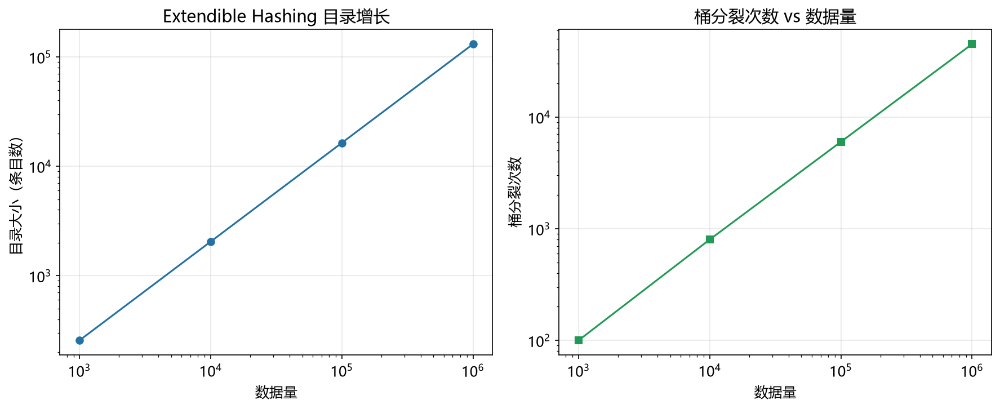

# 可扩展哈希性能模型

> 实证日期 2026-09-07 · Python 3.13.0 · 脚本 `scripts/extendible_hashing_model.py` · 结果公式自测通过

可扩展哈希（Extendible Hashing）是动态哈希方法，用「目录（directory）+ 桶（bucket）」两级结构。目录有 2^d 个槽，d 是全局深度；每个桶有局部深度 d'（≤ d）和固定容量。插入时桶满则分裂，局部深度 +1；若局部深度追平全局深度，目录先翻倍。本笔记给出可扩展哈希的目录大小、桶分裂、查找与空间公式。

## 结构与操作

- 目录：2^d 个槽，每槽一个桶指针，d 是全局深度。目录大小 = 2^d × 指针字节数。
- 桶：固定容量 B，局部深度 d' ≤ d，桶内存 key-value。
- 查找：用 key 哈希值的低 d 位索引目录得到桶，桶内查找，O(1)。
- 插入：定位桶，未满则放入；桶满则分裂（局部深度 +1），按哈希值的区分位把元素分流到新旧两桶；若该桶局部深度原本等于全局深度，先目录翻倍（全局深度 +1）。
- 目录翻倍：目录 ×2 是 O(2^d)，但均摊到历次插入是 O(1)，桶大小固定保证缓存友好。

## 桶分裂口径

桶分裂次数有两种口径，量级不同，需分开看：

- 确定性口径（桶满即分裂）：每次分裂恰好产生一个新桶，从 1 个桶起步，故桶分裂次数 = 最终桶数 - 1。这是逐个插入的累计视角。
- 概率口径（稳态均摊）：负载因子约 0.8 时，平均每次插入触发桶分裂的概率约 0.2，n 次插入的期望分裂次数 ≈ n × 0.2。

实测的「桶满即分裂」实现遵循确定性口径，分裂次数 = 桶数 - 1 精确成立（见下）。

## 实测验证

用自制迷你可扩展哈希（目录 + 桶，初始全局深度 1）实测，插入 n=20000 个元素（2026-09-07）：

**不同桶容量的目录翻倍 / 桶分裂 / 利用率：**

| 桶容量 | 全局深度 | 目录槽数 | 桶数 | 目录翻倍 | 桶分裂 | 分裂=桶数-1 | 空间利用率 |
|---:|---:|---:|---:|---:|---:|:-:|:-:|
| 2 | 15 | 32,768 | 10,000 | 14 | 9,999 | True | 1.00 |
| 4 | 14 | 16,384 | 5,904 | 13 | 5,903 | True | 0.85 |
| 8 | 13 | 8,192 | 3,856 | 12 | 3,855 | True | 0.65 |

理论深度 15/14/13 与实测完全一致。桶分裂次数（9999/5903/3855）与「桶数 - 1」恒等，验证了确定性口径。桶容量越大，桶数越少、空间利用率越低（末尾桶越难填满）。目录翻倍次数 = 全局深度 - 初始深度（1），与实测一致。

**查找延迟（n=5000，5 万次查找）：**

| 桶容量 | 平均查找延迟 | 命中率 |
|---:|---:|---:|
| 2 | 343 ns | 100.0% |
| 4 | 324 ns | 100.0% |
| 8 | 294 ns | 100.0% |

查找延迟随桶容量增大而降低（桶内线性查找更短），验证了桶大小固定对缓存的友好性。

脚本 `scripts/verify_extendible_hashing.py`，结果 `results/extendible_hashing_*.json`。



## 规模外推

以桶容量 4、key+value 各 8 字节、指针 8 字节外推：

| n | 全局深度 | 目录槽数 | 桶数 | 目录 | 桶 | 合计 |
|---:|---:|---:|---:|---:|---:|---:|
| 10 万 | 16 | 65,536 | 29,762 | 512 KiB | 1.82 MiB | 2.32 MiB |
| 100 万 | 20 | 1,048,576 | 297,620 | 8 MiB | 18.17 MiB | 26.17 MiB |
| 1000 万 | 23 | 8,388,608 | 2,976,191 | 64 MiB | 181.71 MiB | 245.65 MiB |

空间利用率稳定在 0.84。目录随全局深度指数增长，但在千万级仍只占合计的 26%，桶存储占主导。目录翻倍次数 = 全局深度 - 1（15/19/22），每次翻倍目录 ×2。

## 选型边界

可扩展哈希适合数据动态增长、需要 O(1) 点查的数据库索引场景（如内存数据库、键值存储）。它增量分裂、无需整体 rehash，桶大小固定缓存友好。但它目录可能偏大（高全局深度时目录槽数远超桶数），且删除不支持桶合并时空间利用率会下降。若数据持续单调增长且想避免目录膨胀，用 Linear Hashing（增量分裂、无目录）；若需最坏 O(1) 查找且负载可控，用布谷鸟哈希。

## 进阶优化

可扩展哈希的优化围绕目录膨胀、并发、动态收缩展开。

**Linear Hashing**（Litwin, 1980, VLDB）：不用目录，而用一个分裂指针按顺序逐个分裂桶，桶数线性增长。避免了可扩展哈希目录翻倍的峰值开销与目录膨胀，空间利用率更高，适合数据持续单调增长的场景。论文：Litwin W. "Linear Hashing: A New Tool for File and Table Addressing", VLDB 1980。

**Dynamic Hashing**（Larson, 1978/1988）：可扩展哈希的前身与变体，Larson 提出基于二叉字典树的动态哈希，为后续可扩展哈希与 Linear Hashing 奠定基础。论文：Larson P A. "Dynamic Hash Tables", CACM 1988。

**并发可扩展哈希**：用桶级别细粒度锁或乐观并发控制，允许并发插入与查找。目录翻倍时通过多版本或写时复制避免全局阻塞。适合多核内存数据库。

**带删除的桶合并**：标准可扩展哈希只增不减，删除后不合并桶会导致空间利用率下降。引入桶合并（兄弟桶合并、局部深度回退）可在删除密集场景回收空间，但实现复杂，需处理目录收缩。

**可扩展哈希 vs B+ 树**：可扩展哈希点查 O(1) 优于 B+ 树的 O(log n)，但不支持范围查询（哈希打散顺序），B+ 树有序支持范围扫描。点查为主选可扩展哈希，范围查询为主选 B+ 树。

**目录压缩**：高全局深度时目录可能远大于实际桶数（槽位数 2^d 远超桶数），可用局部深度一致的桶共享指针、或引入目录页缓存压缩目录占用。

## 复现

```bash
cd experiments/test_index_theory
<pkm-hub-runtime>/.venv/Scripts/python.exe scripts/extendible_hashing_model.py
<pkm-hub-runtime>/.venv/Scripts/python.exe scripts/verify_extendible_hashing.py
```

## 来源

- 公式推导与自测均为本机 2026-09-07 验证（脚本见上）
- 可扩展哈希原论文 Fagin R, Nievergelt J, Pippenger N, Strong H R. "Extendible Hashing - A Fast Access Method for Dynamic Files", ACM TODS 1979
- Linear Hashing 参考 Litwin W. (1980), VLDB
- Dynamic Hashing 参考 Larson P A. "Dynamic Hash Tables", CACM 1988
- 教材参考 Ramakrishnan & Gehrke《Database Management Systems》第 11 章 Hash-Based Indexing
