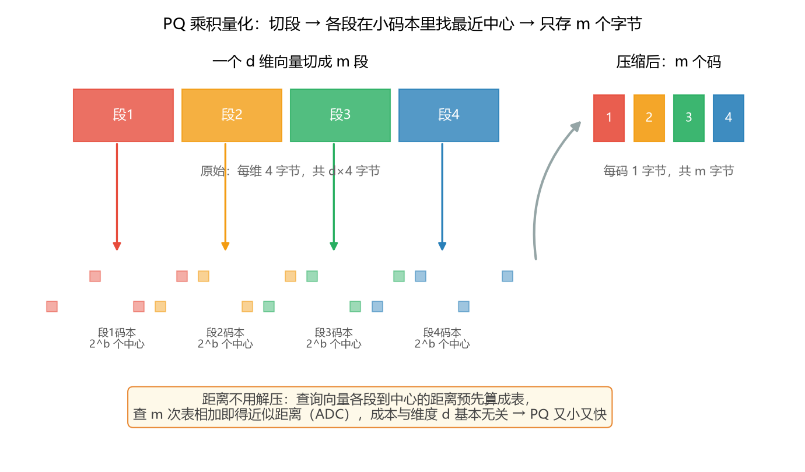
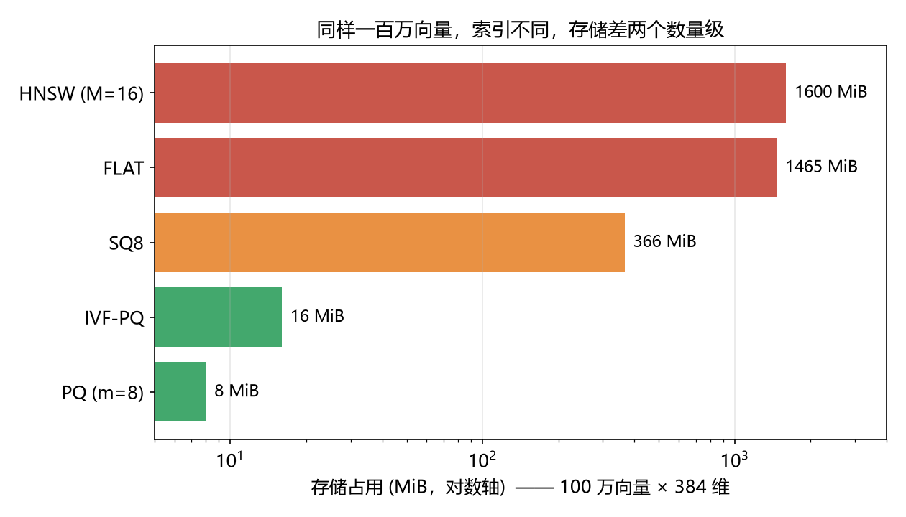

# 向量索引的存储与内存模型

> 存储闭式解与 RSS 只能实测的区分已迁往配套知识库《向量索引统一成本模型》，本文保留 faiss 实测验证表与版本绑定细节。

> 实证日期 2026-09-06 · faiss-cpu 1.15.0 · Python 3.13 · 脚本 `scripts/verify_index_storage.py` · 结果 `results/index_storage_n20000_d128.json`

向量库选型时最先要回答的问题是「这个索引要吃多少内存、多少磁盘」。本笔记给出各类向量索引的存储计算公式，并说明哪些数能直接用公式算、哪些必须实测。它是索引机制层的背景，不是六个库的选型对比（那类快照见 test_vector_db_bench），也不是召回率和延迟的测量（那是后续参数权衡实验）。

核心结论是压缩类索引（FLAT、SQ、PQ、IVF 系列）的存储由数据量和参数完全决定，公式精确到和 faiss 实测字节比约为 1.000，所以存储占用不必跑实验，公式算出后做一次小规模验证即可，规模用公式外推；内存驻留（RSS）理论只能给下界，分配器和临时结构要实测；召回率和查询延迟才必须靠实验。

本文结论用 faiss-cpu 1.15.0 在合成向量上验证，脚本对比理论公式与 `faiss.serialize_index()` 实测字节，验证环境为 n=20000、d=128、随机种子 42。

## 存储和内存是两个不同的数

索引的「存储占用」指它序列化后写盘的字节数，用 `faiss.serialize_index()` 直接得到，等于索引完整状态的大小，也近似内存中数据结构的大小。「内存占用」指进程驻留内存 RSS，用 `psutil` 测构建前后的差。后者比前者大，差额来自分配器开销、内存池、构建期临时缓冲（聚类矩阵、HNSW 的 visited 表和优先队列）和碎片。选型估磁盘用前者，估运行内存用后者并留余量。

原始 float32 向量矩阵是所有压缩的参照基线，大小为 `n × d × 4` 字节，n 是向量数、d 是维度。下文每个索引都对这个基线给出压缩比。

## 压缩类索引的存储公式

**FLAT 暴力索引**不压缩、不加图，就是原始向量本身，存储 `n × d × 4`，召回率恒为 1.0，是所有压缩索引的参照基线。

**标量量化 SQ8** 把每个 4 字节 float 压成 1 字节，存储 `n × d`，精确是原始的四分之一，召回损失很小。

**乘积量化 PQ** 把 d 维切成 m 个子空间，每段量化到 `2^nbits` 个中心，每向量存 m 个码。存储为压缩码 `n × m` 字节（nbits=8 时每子向量 1 字节）加码本 `m × 2^nbits × (d/m) × 4`。m=8、nbits=8 时压缩码是原始向量的 `m/(4d)`，128 维下约为原始的 1/35，码本只有几百 KB 可忽略。下图展示 PQ 怎么把一个向量压成 m 个字节，以及为什么它连距离计算都更快：



**IVF 倒排索引**本身不压缩向量，只加聚类结构：`nlist` 个聚类中心（`nlist × d × 4`）、每条向量的 id（`n × 8`）、以及倒排排列开销。IVF-Flat 仍存完整向量，存储略大于原始；IVF-PQ 在倒排上叠加 PQ 压缩，存储为聚类中心加 PQ 码本加 `n × m` 压缩码加 id。

**HNSW 图索引**不压缩原始向量，额外存一张近邻图。这部分一开始我按每边 8 字节（int64）估，实测揭示 faiss 的邻居 id 用 int32（4 字节），level0 每个节点最多连 `2M` 个邻居，所以图边主体约为 `n × 2M × 4 = n × 8M` 字节，外加高层邻居和 levels/offset 数组（约几个百分点）。M=16 时图边约每节点 128 字节，实测约 144 字节，加上原始向量后总存储约为原始的 1.28 倍。

## 实测验证

n=20000、d=128 的合成向量上，理论公式与 faiss 序列化实测对比如下。理论/实测比值越接近 1 越准。

| 索引 | 理论字节 | 实测 serialize 字节 | 理论/实测 | 占原始比 |
|---|---:|---:|---:|---:|
| flat | 10,240,000 | 10,240,045 | 1.000 | 1.000 |
| sq8 | 2,560,000 | 2,561,105 | 1.000 | 0.250 |
| pq (m=8) | 291,072 | 291,158 | 1.000 | 0.028 |
| ivf_flat | 10,451,200 | 10,452,139 | 1.000 | 1.021 |
| ivf_pq | 502,272 | 503,252 | 0.998 | 0.049 |
| hnsw_flat (M=16) | 12,800,000（修正后） | 13,123,834 | 0.975 | 1.282 |

五种压缩和倒排索引的公式与实测比值为 0.998 到 1.000，差额只是 faiss 序列化头和对齐的几百字节，公式可以直接用来估算。HNSW 按修正后的 int32 边公式比值为 0.975，差的 2.5% 是高层邻居和 levels 数组，估内存时按这个上浮即可。

这组对照确立了方法：存储公式在一个小规模上验证通过后，就可以直接外推到任意数据量，不需要真的构建千万级索引。

## 规模外推

以百万向量、384 维（对齐 all-MiniLM-L6-v2）为例，用公式直接算出各索引的存储，不需要跑实验。

| 索引 | 存储（100 万 × 384 维） | 说明 |
|---|---:|---|
| 原始 float32 / FLAT | 1465 MiB | 1,000,000 × 384 × 4 |
| SQ8 | 366 MiB | 四分之一，召回损失小 |
| PQ m=8 | 约 8 MiB | 压缩码，码本可忽略 |
| IVF-PQ（nlist=4096） | 约 16 MiB | 聚类中心约 6 MiB 加 PQ 码加 id |
| HNSW-Flat（M=16） | 约 1600 MiB | 向量 1465 MiB 加图边约 137 MiB |

结论很直接：内存放不下全量 float32 时，PQ 或 IVF-PQ 能压到原来的 3% 到 5%，HNSW 不省内存反而比原始向量多约三成（图的代价），但它换来的是最高的召回和延迟表现，适合内存放得下、追求查询质量的场景。一千万向量时这些数线性放大 10 倍，IVF-PQ 也才约 160 MiB，而 FLAT 和 HNSW 都到 15 GiB 量级，这就是大规模必须上量化或磁盘索引的原因。一百万向量各索引的存储对比如下图，压缩索引和内存型索引差两个数量级：



## 完整存储还要算正文文本

前面算的是向量索引，一个文档库的完整落盘其实有三段：正文原文、向量、索引结构。正文文本的存储是 `n × 平均每篇字节数`，只取决于语料长度，和索引算法无关，是固定的原始数据成本，压缩它要靠 gzip、zstd 这类通用压缩，不是向量量化。

以 20 Newsgroups 这类新闻语料为例，每篇正文几百到几千字节，上万篇的文本总量通常和原始向量同量级、甚至更大，这正是 test_vector_db_bench 里「向量+正文」比「纯向量」存储显著变高的原因，那份报告对文本存储增量做过 A/B 实测。选型时完整存储预算 = 正文文本（固定、通用压缩）加向量（可向量量化压缩）加索引结构（HNSW 图额外增、IVF 聚类中心很小）。文本部分纯理论可算，量出平均每篇字节数即可，不需要实验。

## 内存驻留 RSS 要用实测

RSS 没有干净的解析公式，它包含数据结构之外的运行时开销。同一次实测里 RSS 增量普遍大于序列化字节：ivf_flat 的 RSS 增量 18.15 MiB 而序列化只有约 10 MiB，因为构建期的聚类临时矩阵和倒排列表分配还驻留；PQ 类的 RSS 也明显高于压缩码本身。进程内连续构建多个索引时，内存池不立即还给系统，跨索引的 RSS 差会带噪声。要拿干净的运行时内存数字，正确做法是每个索引单独起一个子进程测构建后的 RSS 峰值，而不是在同一进程里连测。本笔记的 RSS 数字只用于定性说明「RSS 大于序列化、压缩索引运行时仍需一定内存」，不作为精确口径。

## 怎么用这些数字

选索引时先算存储：用上面的公式代入你的 n 和 d，看哪种索引在内存预算内。内存够、要召回质量，选 HNSW，接受约 1.28 倍原始向量的内存；内存紧张，选 IVF-PQ 或 PQ，用可控的召回损失换 20 到 35 倍压缩；要精确召回做基线或数据量小，用 FLAT。公式告诉你「要占多少」，后续的参数权衡实验告诉你「调 M、nlist、nprobe、m 时召回和延迟怎么交换」，两者配合完成选型。

## 复现

```bash
cd experiments/test_index_essence
<venv>/Scripts/python.exe scripts/verify_index_storage.py     # 存储公式 vs 实测
<venv>/Scripts/python.exe figures/make_schematics.py        # 重画结构示意图（含本图）
<venv>/Scripts/python.exe figures/make_figures.py           # 重画延迟数据图
```

脚本用固定种子合成向量，构建六种索引，输出理论字节、序列化字节、RSS 增量到 `results/index_storage_n20000_d128.json`。改 n、d 重跑可验证其他规模，但规模外推用公式即可，不必跑大数据。

## 来源

- 公式推导与实测对照均为本机 2026-09-06 验证（faiss-cpu 1.15.0，脚本 `verify_index_storage.py`）
- faiss 索引结构参考 faiss 官方 wiki（Indexes、Memory structure）与 `faiss/IndexHNSW.cpp`、`faiss/IndexIVF.cpp` 的数据结构定义
- 各数据库对这些索引的工程封装见 test_vector_db_bench 的 `docs/向量搜索引擎底层实现.md`
