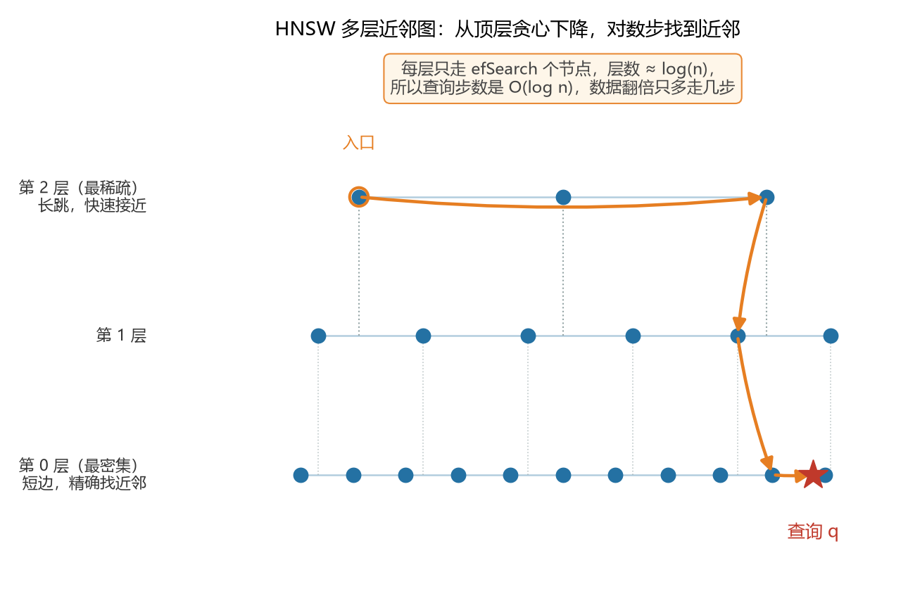
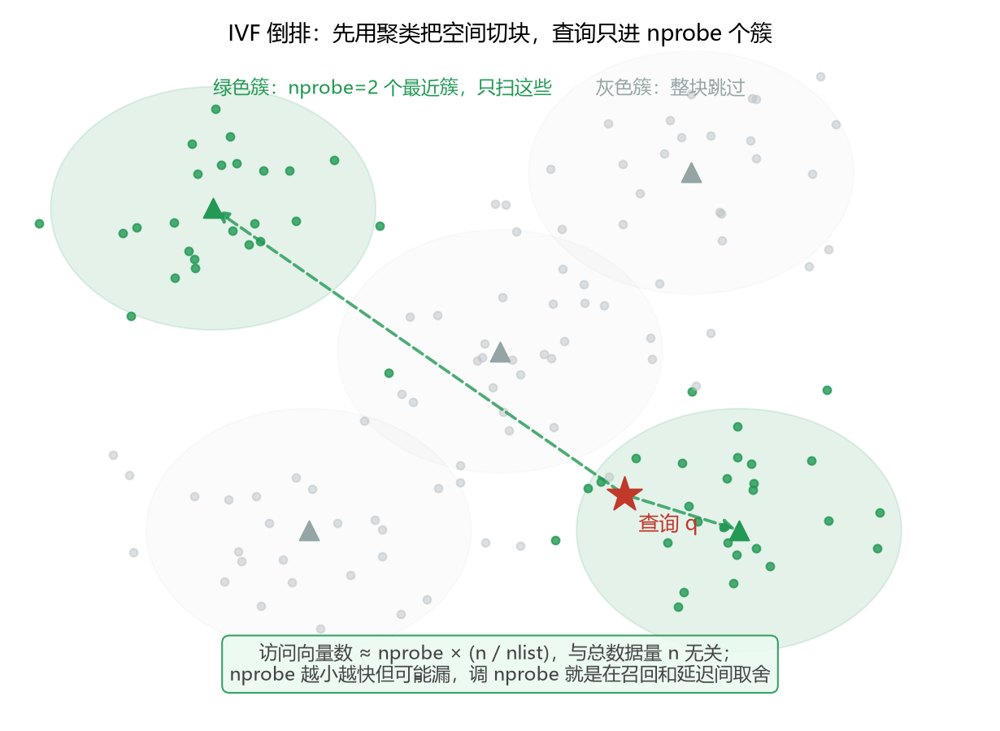
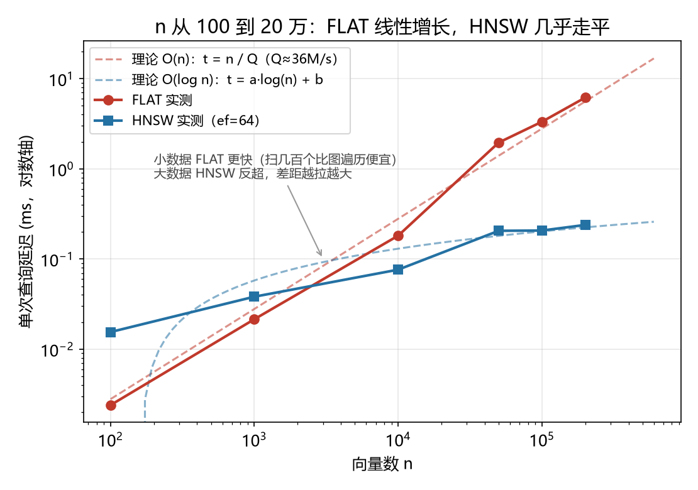
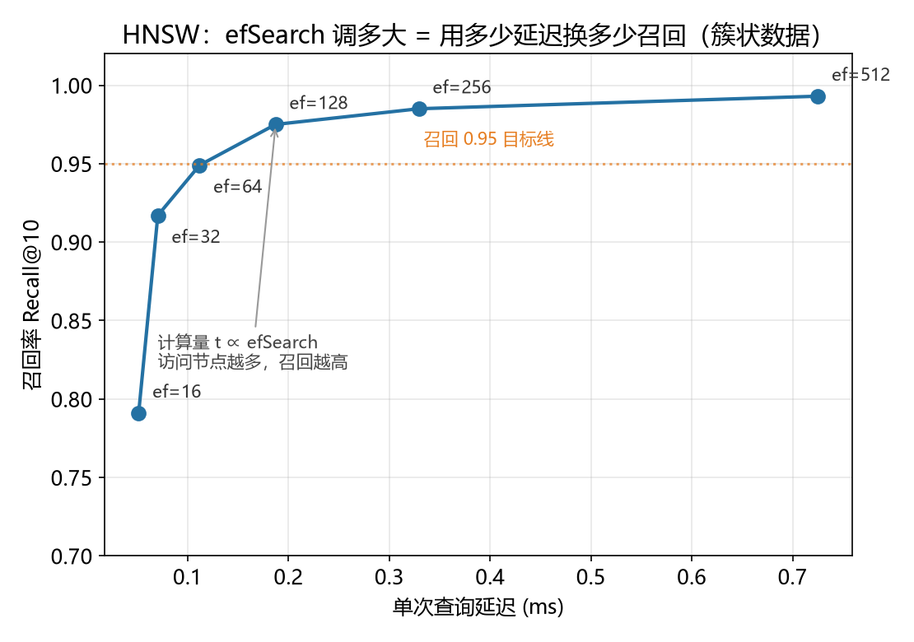
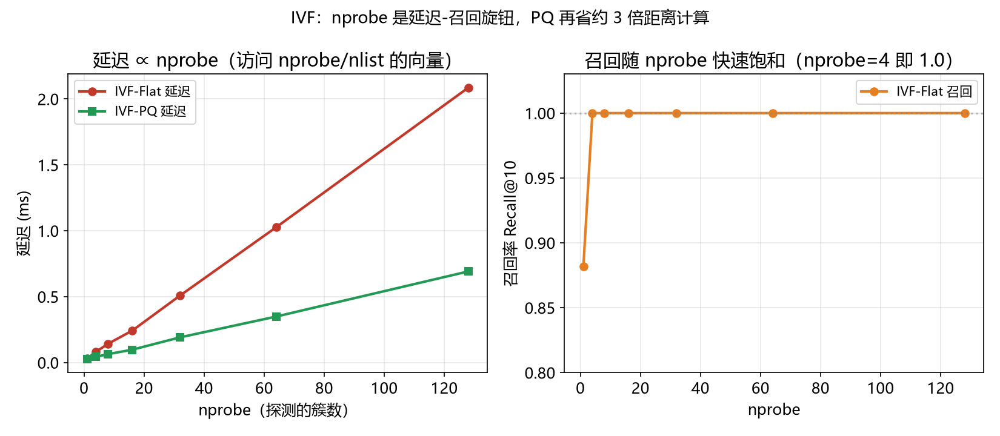

# 向量索引的查询延迟模型

> 「延迟 = 访问量 / 算力常数」的通用机制已迁往配套知识库《向量索引统一成本模型》，本文保留 faiss 1.15.0 与 1.14.2 双平台实测表和版本绑定结论。

> 实证日期 2026-09-06 · Windows 侧 faiss-cpu 1.15.0 · WSL2 侧 faiss 1.14.2 · Python 3.13 / 3.10 · 单核标定 · 脚本 `scripts/verify_query_latency.py`、`scripts/verify_recall_clustered.py`、`scripts/verify_latency_quantization.py` · 结果 `results/query_latency_d128.json`、`results/recall_clustered_d128.json`、`results/latency_quantization_d128.json`、`results/wsl_latency_quant_d128.json`、`results/win_graph_quant_d128.json` · 踩坑记录《faiss 图量化索引标定踩坑记录》

选型时「这个索引查一次要多久」和「占多少内存」一样关键，问题是这个时间能不能不做实验就推出来。本笔记和存储文档配套，存储见《向量索引的存储与内存模型》，这里只讲查询时间。

核心结论是检索延迟的计算量全部可以理论推导，墙钟时间需要在目标机器上标定一个算力常数后按公式外推。一次查询访问多少数据、做多少次距离计算由索引结构和参数完全决定，这部分是数学；把它换成毫秒要除以这台机器的有效算力，这个常数跑一个点就能测出来，不需要在每个数据量上都做实验。

本文用 faiss-cpu 在 d=128、单核上标定，并用一个重要的对照说明召回率该怎么测。量化这一维单独成节，因为实测推翻了两条常见说法：SQ8 比 float32 便宜 4 倍（实际慢 6 倍），PQ 的距离成本与维度无关（实际正比于子向量数 m，而 m 必须随维度增大）。

## 延迟的两个组成部分

近似最近邻检索的延迟分两块：访问多少数据，和每次距离计算多贵。近似索引省的是第一块，量化省的是第二块。精排索引多出第三块，需要单独算。

访问量由索引剪枝决定。FLAT 暴力扫描一次查询要算全部 n 个向量的距离，访问量正比于 n。IVF 只访问 nprobe 个倒排簇里的向量，访问量正比于 `nprobe × n/nlist`。HNSW 从入口点沿图贪心走，访问量正比于 efSearch 影响下的少数节点，随 n 是对数增长。图和倒排的随机访问不连续，单位成本比 FLAT 的顺序扫描高，但剪枝掉的量远大于这个代价。

距离计算本身的成本由编码决定，但「编码更省就一定更快」这个直觉在 faiss 上不成立。float32 的 L2 距离走 AVX2 单指令多数据流路径，一次算 8 个分量的平方和；SQ8 折算到整数后反而退到通用整数路径，实测比 float32 慢约 4 倍。真正快的是 PQ，它把 d 次乘加换成 m 次查表和加法，成本正比于 m，所以 m 远小于 d 时快数倍。固定 m 时 PQ 的成本确实与 d 无关，但 m 必须随 d 增大才能保住召回，实际选型中 PQ 的成本仍随 d 增长。量化省的是内存带宽和存储，不是计算时间，实测见「量化档位的延迟标定」。

精排（refine）是第三种成本来源。粗排索引返回的候选只保留前 `k_factor × k` 个，再用完整向量重算精确距离排序。它不改变访问量，但在粗排之外加了一次精排的距离计算，代价与候选数成正比。Milvus 的 HNSW_SQ、IVF_PQ 家族都支持 refine 参数，作用是把量化损失的召回补回来，代价是同时持有粗排索引和完整向量。

## 计算量公式

各索引一次 top-k 查询的距离计算次数，就是需要标定的计算量。

| 索引 | 访问向量数 | 每次距离成本 | 随 n 增长 |
|---|---|---|---|
| FLAT | n | 2d 浮点，有 SIMD | 线性 O(n) |
| IVF-Flat | nprobe × n/nlist | 2d 浮点，有 SIMD | 与 n 无关（nlist 随 n 调） |
| IVF-SQ8 | nprobe × n/nlist | 整数折算，无 SIMD，实测慢于 float32 | 与 n 无关 |
| IVF-SQ6 / SQ4 | nprobe × n/nlist | 整数折算加位解包，比 SQ8 更慢 | 与 n 无关 |
| IVF-PQ | nprobe × n/nlist | m 次查表，随 m 线性 | 与 n 无关 |
| IVF-PQ + refine | nprobe × n/nlist | m 次查表加 k_factor×k 次精排 | 与 n 无关 |
| HNSW | O(efSearch × log n) | 2d 浮点，有 SIMD | 对数 O(log n) |

公式给出的是相对关系和缩放律：FLAT 时间正比于 n，IVF 时间正比于 nprobe，HNSW 时间正比于 efSearch 且随 n 对数增长。绝对值的换算常数由硬件决定。这些缩放律来自索引的剪枝结构，先看两张结构示意图理解为什么能少算，再看三张实测图验证公式。

标量量化和乘积量化在成本那一列的分工不同，需要分开记。SQ 把每个分量单独压成低位整数，成本正比于 d，常数小于 float32，但 faiss 的 SQ 路径没有 SIMD 优化，实测反而更慢。PQ 把 d 切成 m 段后查码本，成本正比于 m，固定 m 时与 d 无关；但 m 必须随 d 增大才能保住召回，所以实际选型中 PQ 的成本仍随 d 增长。

**图一：HNSW 用多层近邻图实现对数步查找。** 上层节点稀疏、连边长，查询从顶层入口贪心走，长跳快速接近目标区域；每下降一层节点变密、连边变短，到最底层精确定位近邻。每层只走 efSearch 个节点、层数约为 log(n)，所以数据翻倍只多走几步。



**图二：IVF 用聚类把空间切块，整块跳过无关区域。** 向量先聚成 nlist 个簇，查询只进离它最近的 nprobe 个簇（绿色），其余簇（灰色）整块不算。访问量约为 nprobe 乘每簇向量数，和总数据量 n 无关。



下面三张是实测数据，验证上面的缩放律。

**图三：数据量从 100 到 20 万，线性和对数分道扬镳。** FLAT 的实测点全程压在理论直线 t = n/Q 上（红色虚线，Q≈36M/s），数据量每涨 10 倍延迟涨 10 倍；HNSW 的点几乎水平，落在理论对数曲线上（蓝色虚线）。两条线在 n 约两三千处交叉：小数据 FLAT 更快（暴力扫几百个向量比图遍历还便宜），大数据 HNSW 反超，20 万时快约 26 倍。这就是「数据上了规模必须换近似索引」的直观依据。



**图四：HNSW 的 efSearch 是召回-延迟旋钮。** 沿曲线从左下到右上，ef 从 16 加到 512，访问节点变多、延迟变大、召回升高。召回 0.95 的目标线在 ef 约 64 处穿过，代价只要约 0.1 ms；再往右召回提升趋缓，是边际递减区。



**图五：IVF 的 nprobe 旋钮，PQ 再省一截。** 左图延迟随 nprobe 线性增长，IVF-PQ 始终约为 IVF-Flat 的三分之一（距离计算成本下降）；右图召回随 nprobe 快速饱和，簇状数据下 nprobe=4 就到 1.0。所以 IVF 的实用区间是 nprobe 取到召回饱和点为止，再大只加延迟不加召回。



## 实测标定

本机单核、d=128 上的实测延迟，验证了上面四条缩放律。

本机单核、d=128，n 从 100 到 20 万的实测如下。FLAT 和 HNSW 放一张表里看交叉：

| n | FLAT 延迟(ms) | HNSW 延迟(ms，ef=64) | FLAT 算力 Q（向量/秒/核） |
|---:|---:|---:|---:|
| 100 | 0.002 | 0.016 | —（太小，摊销不足） |
| 1,000 | 0.022 | 0.038 | — |
| 10,000 | 0.181 | 0.076 | 5500 万 |
| 50,000 | 1.96 | 0.21 | 2560 万 |
| 100,000 | 3.33 | 0.21 | 3000 万 |
| 200,000 | 6.17 | 0.24 | 3240 万 |

这张表读出三件事。其一，FLAT 严格线性：n 从 1 万涨到 20 万，延迟从 0.18 ms 涨到 6.2 ms，约 34 倍，和 n 的 20 倍一致，实测点压在理论直线 t = n/Q 上，算力常数 Q 在大数据量下稳定在约 3000 万向量/秒/核（小 n 偏大是固定开销未摊销）。其二，HNSW 呈对数：n 从 1 万到 20 万，延迟只在 0.08 到 0.24 ms 间，几乎走平。其三，存在一个交叉点，n 在 2000 到 3000 之间两线相交，小数据时 FLAT 更快（暴力扫几百个向量比图遍历还便宜，HNSW 还要付图结构开销），大数据时 HNSW 反超且差距越拉越大，20 万时快约 26 倍。

用 Q≈3000 万/秒/核外推 FLAT：百万向量单核暴力扫描约 33 ms，一千万约 330 ms，多核线性加速。HNSW 则在任何规模下都停留在亚毫秒到 1 ms 量级。

参数权衡在簇状数据（模拟真实 embedding 分布）上测，这才是可用的召回数字。HNSW 的 efSearch 和 IVF 的 nprobe 都是「多算一点，召回换延迟」：

| efSearch | HNSW 延迟(ms) | 召回@10 |
|---:|---:|---:|
| 16 | 0.05 | 0.79 |
| 32 | 0.07 | 0.92 |
| 64 | 0.11 | 0.95 |
| 128 | 0.19 | 0.98 |
| 256 | 0.33 | 0.99 |
| 512 | 0.73 | 0.99 |

| nprobe | IVF-Flat 延迟(ms) | IVF-PQ 延迟(ms) | IVF-Flat 召回 |
|---:|---:|---:|---:|
| 1 | 0.04 | 0.03 | 0.88 |
| 4 | 0.13 | 0.06 | 1.00 |
| 16 | 0.51 | 0.11 | 1.00 |
| 64 | 1.35 | 0.36 | 1.00 |

上面两张表里 IVF-PQ 那一列来自随机数据脚本，IVF-Flat 那一列来自簇状数据脚本，两者的召回不在同一基准上，不能直接读出「PQ 快几倍」。同基准的对比在下一节。参数权衡的全部依据是：给定召回目标，从簇状数据的权衡曲线上读出最小的 ef 或 nprobe，延迟随之确定。

## 量化档位的延迟标定

这组实测把量化这一维补齐，结论和「量化省计算」的直觉相反。同一批簇状数据（n=10 万、d=128、nlist=256、单核），先看 IVF 包装下的各编码。

| nprobe | IVF-Flat | IVF-SQ8 | IVF-SQ6 | IVF-SQ4 | IVF-SQfp16 | IVF-PQ(m=8) |
|---:|---:|---:|---:|---:|---:|---:|
| 1 | 0.036/0.88 | 0.120/0.87 | 0.240/0.81 | 0.186/0.61 | 0.170/0.88 | 0.026/0.16 |
| 4 | 0.130/1.00 | 0.770/0.97 | 1.467/0.91 | 1.131/0.67 | 1.053/1.00 | 0.062/0.17 |
| 8 | 0.274/1.00 | 1.366/0.97 | 3.343/0.91 | 2.317/0.67 | 1.989/1.00 | 0.099/0.17 |
| 16 | 0.514/1.00 | 2.355/0.97 | 5.236/0.91 | 3.920/0.67 | 3.554/1.00 | 0.188/0.17 |
| 32 | 0.831/1.00 | 3.874/0.97 | 8.079/0.91 | 6.190/0.67 | 5.554/1.00 | 0.276/0.17 |

每格是毫秒除召回。三个读数推翻常见说法。其一，SQ8 在 nprobe=4 时是 0.77 毫秒，比 IVF-Flat 的 0.13 毫秒慢约 6 倍，量化没有省时间。其二，SQ4、SQ6、SQfp16 比 SQ8 还慢，因为低位编码要解包，存储省了但每次距离都要多做位运算。其三，PQ 确实最快，nprobe=4 时 0.062 毫秒是 IVF-Flat 的一半，但召回只有 0.17，这个速度不能直接用。

## Windows 与 Linux 的跨环境复核

上一节的三个读数有个未验证的前提：它们是 Windows 上 faiss 轮子的表现，不一定是量化的固有属性。同一套脚本搬到 WSL2 Ubuntu（faiss 1.14.2）重跑，两个结论要改。

| nprobe | 环境 | IVF-Flat | IVF-SQ8 | IVF-SQ6 | IVF-SQ4 | IVF-SQfp16 | IVF-PQ(m=8) |
|---:|---|---:|---:|---:|---:|---:|---:|
| 8 | Windows 1.15.0 | 0.274 | 1.366 | 3.343 | 2.317 | 1.989 | 0.099 |
| 8 | WSL 1.14.2 | 0.162 | 0.183 | 0.337 | 0.317 | 0.184 | 0.091 |
| 16 | Windows 1.15.0 | 0.514 | 2.355 | 5.236 | 3.920 | 3.554 | 0.188 |
| 16 | WSL 1.14.2 | 0.519 | 0.354 | 0.636 | 0.513 | 0.195 | 0.105 |

跨环境常数是可比的，这一点先确认：同一份数据同一套参数，WSL 的 IVF-Flat 在 nprobe=8 时是 0.162 毫秒，Windows 是 0.274 毫秒，HNSW-Flat 在 ef=64 时 WSL 0.104 毫秒对 Windows 0.112 毫秒，两者都在同一量级且 WSL 略快。所以下面这些差异来自库实现，不来自环境。

第一个要改的是「SQ 一定更慢」。在 Windows 上 SQ8 是 float32 的 5 倍慢，在 Linux 上只有 1.13 倍，nprobe=16 时 SQ8 甚至比 float32 还快一点（0.354 对 0.519）。隔离掉 IVF 剪枝后更清楚：纯暴力扫描 10 万向量，Windows 上 float32 是 3.19 毫秒、SQ8 是 14.08 毫秒，Linux 上这个差距大幅收窄。float32 的 L2 距离有 AVX2 单指令多数据流实现，Windows 轮子的 SQ 距离计算没走同等的向量化路径，Linux 轮子走了。所以「SQ8 便宜 4 倍」在内存上成立，在延迟上取决于平台，不能一概而论。

第二个要改的是「低位量化一定更慢」。Linux 上 IVF-SQfp16 在 nprobe=16 时是 0.195 毫秒，比 IVF-Flat 的 0.519 毫秒快 2.7 倍，召回还是 1.00。这是量化真正省到时间的案例：fp16 把存储砍一半，距离计算也真的更快。Windows 上同一个档位是 3.554 毫秒对 0.514 毫秒，慢 6.9 倍。两边的排序完全反转。

PQ 的结论跨环境一致，这是本次复核里最稳的一条。两个环境上 IVF-PQ(m=8) 都是同档最快，召回都只有 0.17，m 加到 64 后召回都回到 0.82。WSL 上 m 从 8 到 128 延迟从 0.26 涨到 1.09 毫秒，召回从 0.17 升到 0.94，和 Windows 的 0.18 到 1.89 毫秒同构。所以「PQ 成本正比于 m」这个模型是平台无关的。

图索引上的量化是这轮补测的主要收获。上一轮判断「Windows 上三类图量化索引全部跑不起来」，这个判断是错的，本轮在 Windows 原生上跑通了其中两类。

| efSearch | HNSW-Flat | HNSW-SQ8 | HNSW-SQ4 | HNSW-PQ(pq_M=128) |
|---:|---:|---:|---:|---:|
| 16 | 0.037 | 0.091 | 0.146 | 0.186 |
| 32 | 0.057 | 0.124 | 0.193 | 0.290 |
| 64 | 0.089 | 0.166 | 0.198 | 0.268 |
| 128 | 0.136 | 0.249 | 0.260 | 0.300 |
| 256 | 0.241 | 0.330 | 0.390 | 0.415 |

全部为 Windows faiss 1.15.0、n=10 万、d=128、单核，来自 `win_graph_quant_d128.json` 的同一次运行。召回对应为 HNSW-Flat 0.791/0.917/0.949/0.975/0.985，HNSW-SQ8 0.818/0.896/0.936/0.939/0.961，HNSW-SQ4 0.452/0.480/0.483/0.484/0.496，HNSW-PQ(pq_M=128) 0.732/0.830/0.875/0.904/0.931。

同一套脚本跑第二遍，HNSW-Flat 在 ef=64 是 0.096 对这次的 0.089，HNSW-SQ8 是 0.157 对 0.166，RaBitQ nb_bits=1 是 0.144 对 0.109。单次延迟在 0.1 到 0.2 毫秒量级时跨次波动可达 25%，所以表内的绝对值不能当精确值用，趋势和比值可以。受影响最大的是 HNSW-PQ 的 ef=16 与 ef=32：第一遍是 0.231 与 0.195（单调），第二遍是 0.186 与 0.290（非单调），两遍排序相反。这说明这两个档位的差异小于噪声，不能据此说延迟随 ef 单调。

WSL 侧的 HNSW-Flat、HNSW-SQ8、HNSW-SQ4 在同一组 ef 上跑过（ef=64 时 0.104/0.103/0.131），与上表同量级，定性一致。WSL 那批 HNSW-PQ 数据作废，因为它是用错签名采的：`IndexHNSWPQ` 的 C++ 签名是 `(d, pq_M, M, pq_nbits)`，WSL 脚本传的是 `(D, 16, 32, 8)`，即 pq_M=16，却标成了 m=32。pq_M=16 对 d=128 而言每子向量 8 维，召回只有 0.043 到 0.052，当时归因成「m 太小」，方向对但没怀疑参数本身。作废记录见 `wsl_latency_quant_d128.json` 的 `graph_quant_ef.pq_recall` 字段。

pq_M 越小越快但召回塌，扫描结果如下（Windows，M=16、nbits=8、ef=64）：

这就把量化的定位说全了，但要说清它的边界：延迟上的盈亏取决于量化算法与访问模式的组合，不是访问模式单独决定。SQ 和 PQ 在 IVF 上亏或打平，在图上打平或小赚。RaBitQ 是例外，它在 IVF 上既不亏也不赚，还能把召回从 0.401 抬到 0.988，见下一节。上一轮只说「量化不省时间」是不准确的，准确说法是「量化的延迟盈亏因算法而异，SQ 和 PQ 取决于访问模式，RaBitQ 取决于是否命中粗筛阈值」。

PQ 要召回可用就得加大子向量数 pq_M，而延迟正比于 pq_M。这是原来说「PQ 成本与 d 无关」需要补的一半。

| pq_M | HNSW-PQ 延迟(ms) | 召回@10 |
|---:|---:|---:|
| 16 | 0.053 | 0.038 |
| 32 | 0.092 | 0.186 |
| 64 | 0.174 | 0.646 |
| 128 | 0.277 | 0.875 |

pq_M 从 16 到 128 延迟涨 5.2 倍，召回从 0.038 升到 0.875。注意 pq_M 必须整除 d，d=128 时合法值是 16、32、64、128，传 48 会直接抛 `!(d % M == 0)` 断言。这四档与上表的 ef 扫描均已固化进 `scripts/verify_latency_graph_quant_win.py`，落盘 `win_graph_quant_d128.json`，可复现。这一档的结论修正了上一轮「HNSW-PQ 召回需要 m 取到 32 以上」的说法：32 只给 0.186，要到 128 才够用，而此时延迟是 HNSW-Flat 的 2.9 倍，不如直接用 HNSW-Flat 或 HNSW_SQ。

| m | 每个子向量维度 | IVF-PQ 延迟(ms, nprobe=16) | 召回@10 |
|---:|---:|---:|---:|
| 8 | 16 | 0.181 | 0.168 |
| 16 | 8 | 0.315 | 0.304 |
| 32 | 4 | 0.575 | 0.532 |
| 64 | 2 | 1.033 | 0.820 |
| 128 | 1 | 1.887 | 0.936 |

m 从 8 加到 128，延迟涨约 10 倍，召回从 0.17 升到 0.94。m=8 时每个子向量 16 维只用 256 个码字，码本覆盖不足是召回崩塌的原因；m=128 时每个子向量 1 维，等于逐分量量化，召回接近 float32 但延迟已经超过 IVF-Flat。d=128 这个维度上，召回能用的 m 至少 64，此时延迟是 IVF-Flat 的 2 倍。

这就给出量化的真实定位，但有一个例外需要单独说。它换的是内存，延迟上的盈亏取决于量化算法与访问模式的组合：SQ 和 PQ 在顺序访问的 IVF 上大多亏或打平，在随机访问的图上打平或小赚；RaBitQ 在 IVF 上延迟不随比特数变化，代价全落在存储上。

RaBitQ 把这条结论打破了。它在 IVF 上 nb_bits 从 1 到 8，延迟 0.144 到 0.161 毫秒不动，召回 0.401 升到 0.988，存储 24 到 148 字节。也就是说，在 IVF 上量化既能拿召回又不付时间代价，与 SQ 和 PQ 的表现相反。原因是它用 1 位码粗筛，只对通过阈值的候选算精排，加比特的代价是精排次数而非扫描次数。所以「IVF 上量化亏时间」只在 SQ 和 PQ 上成立，不能推广成 IVF 的固有属性。

在百万级以下的稠密向量场景，不量化也能拿到可用召回，但此时选 RaBitQ 仍然划算：它用不到三分之一的存储拿到更高的召回，时间与不量化同量级。量化的价值不一定要等数据放不进内存才兑现，RaBitQ 让它提前兑现。

精排是把 PQ 的召回补回来的手段，代价是一次额外的精确距离计算。

| nprobe | IVF-PQ(m=8) 延迟 | 召回 | Refine 延迟 | 召回 | 增益 |
|---:|---:|---:|---:|---:|---:|
| 1 | 0.033 | 0.158 | 0.039 | 0.372 | +0.214 |
| 4 | 0.062 | 0.168 | 0.087 | 0.393 | +0.225 |
| 16 | 0.188 | 0.168 | 0.233 | 0.393 | +0.225 |
| 32 | 0.336 | 0.168 | 0.369 | 0.393 | +0.225 |

精排延迟约为粗排的 1.1 到 1.4 倍，召回从 0.168 提到 0.393。但注意召回停在 0.393 不再随 nprobe 上升，因为精排只能重排粗排返回的候选，补不回已经被剪掉的向量。m=8 时真正的近邻大多不在粗排的前 40 名里，加大 nprobe 只是把更多错误候选放进精排池。要把召回真正拉回 0.9 以上，得先靠加大 m 让粗排本身召回上去，精排只负责修正同分段的排序误差。

精排还有一项存储代价：粗排索引和完整向量要同时驻留，因为重排需要原始 float32。Milvus 的 refine 参数就是这个机制。

## 召回率必须用簇状数据测

这是本次标定最重要的方法论收获。第一版脚本用标准正态随机向量，各向同性、没有簇结构，结果 HNSW ef=64 召回只有 0.38、IVF nprobe=128 才 0.86，看着像索引失效。换成高斯混合的簇状数据后，同样参数 HNSW ef=64 召回 0.95、IVF nprobe=4 就到 1.0。

原因是 ANN 的剪枝依赖数据有结构，真实 embedding 聚成若干语义簇，图和倒排能沿着簇把无关区域整块跳过；均匀随机数据是理论最坏情况，每个点的邻居四散，剪枝几乎无效。延迟不受影响（延迟只取决于访问了多少节点），但召回绝对值完全依赖数据分布。所以测召回必须用带簇结构的数据（真实 embedding 或模拟簇），不能用纯白噪声，否则会低估所有 ANN 索引。

## Milvus 支持的全索引家族

Milvus 3.0.0 的向量索引类型从其源码的 indexparamcheck 确认，下表按机制归类。faiss 直接能标定的给出模型，其余按机制外推或注明待实测。

| Milvus 索引 | 机制 | 延迟模型 | faiss 可标定 |
|---|---|---|---|
| FLAT | 暴力扫描 | O(n)，线性 | 是 |
| IVF_FLAT | 倒排 + 完整向量 | O(nprobe × n/nlist) | 是 |
| IVF_SQ8 | 倒排 + 8 位标量量化 | IVF 访问量，Windows 上慢于 float32、Linux 上持平 | 是（双平台已标定） |
| IVF_PQ | 倒排 + 乘积量化 | IVF 访问量，m 次查表 | 是（已标定） |
| IVF_RABITQ | 倒排 + 1 位量化加随机旋转 | IVF 访问量，1 位粗排加精排 | 是（nb_bits 与 qb 双轴已标定） |
| HNSW | 近邻图 | O(efSearch × log n) | 是 |
| HNSW_SQ | 图 + 标量量化 | HNSW 访问量，SQ 单位成本 | 是（双平台已标定，参数顺序 (d, qtype, M)） |
| HNSW_PQ | 图 + 乘积量化 | HNSW 访问量，pq_M 次查表 | 是（双平台已标定，pq_M 须达 128 才召回可用） |
| HNSW_PRQ | 图 + 残差乘积量化 | HNSW 访问量，残差查表 | 否 |
| IVF_HNSW | 倒排 + 图做子索引 | IVF 访问量，簇内走图 | 否 |
| DISKANN | 磁盘上的图（Vamana） | 内存只留图骨架，延迟含磁盘 IO | 否，IO 主导待实测 |
| AISAQ | 铠侠全 SSD 图索引 | Vamana 图加 PQ 码全在 SSD，IO 主导 | 否，待实测 |
| SCANN | 各向异性量化 + 可选树 | 量化加速为主，内存中等 | 否（faiss 无 ScaNN），参考 PQ 趋势 |
| GPU_CAGRA | GPU 近邻图（NVIDIA cuvs） | HNSW 图模型，跑在 GPU 上 | 否（GPU） |
| GPU_BRUTE_FORCE | GPU 暴力 | FLAT 模型，GPU 并行 | 否（GPU） |
| GPU_IVF_FLAT / GPU_IVF_PQ | GPU 倒排（cuvs，前身 RAFT） | 对应 IVF 模型，GPU 并行 | 否（GPU） |
| BIN_FLAT / BIN_IVF_FLAT | 二值向量（汉明距离） | 汉明距离按位与，模型同 FLAT/IVF | 部分（二值距离更快） |
| MINHASH_LSH | 二值向量 MinHash 局部敏感哈希 | LSH 查桶，召回由哈希函数数决定 | 否，独立模型 |
| SPARSE_INVERTED_INDEX | 稀疏向量倒排（BM25/SPLADE） | 按非零维度走倒排，计算量取决于稀疏度 | 否，独立模型 |
| SPARSE_WAND | 稀疏向量倒排加 WAND 动态剪枝 | 倒排加最大分上界剪枝，跳过无效倒排链 | 否，独立模型 |
| INVERTED | 标量倒排 | 关键词匹配，非向量 ANN | 否 |
| TRIE | 前缀树 | 字符串前缀匹配 | 否 |
| STL_SORT | 标量排序数组 | 二分查找，O(log n) | 否 |
| BITMAP | 位图索引 | 低基数字段的位运算 | 否 |
| NGRAM | 文本 n-gram 倒排 | LIKE 模糊匹配 | 否 |
| FMINDEX | FM-index 压缩后缀数组 | 子串搜索 | 否 |
| RTREE | R 树空间索引 | 只建在 geometry 字段，非向量 | 否 |
| HYBRID | BITMAP + INVERTED 组合 | 先标量过滤再倒排 | 否 |
| AUTOINDEX | 按数据类型自动选 | 落到上面某个具体索引 | 取决于解析结果 |

faiss 覆盖了 CPU 稠密向量的主力索引（FLAT、IVF 系、HNSW、PQ/SQ），它们的延迟模型已标定。待补的是四块。DISKANN 和 AISAQ 的磁盘 IO 延迟受存储介质和缓存影响，必须实测，它们的图模型与 HNSW 同构，差别全在 IO 这一项。GPU 系列（GPU_CAGRA、GPU_IVF_*）延迟模型与 CPU 对应项相同，但常数取决于 GPU 算力和显存带宽，需要对应环境标定。稀疏向量和全文（SPARSE_INVERTED_INDEX、SPARSE_WAND、BM25 系）访问量由词项频率和稀疏度决定，是另一套模型，稠密向量的缩放律不适用。二值向量（BIN_FLAT、MINHASH_LSH）用汉明距离或 MinHash，单位成本是位运算，比 float32 快一到两个数量级，但只在二值 embedding 场景出现。

HNSW_SQ、HNSW_PQ、HNSW_PRQ、IVF_RABITQ 这四项是图和量化的复合索引，延迟模型等于 HNSW 或 IVF 的访问量乘以量化后的单位成本，两者相乘即可。其中 HNSW_SQ、HNSW_SQ4、HNSW_PQ、IVF_RABITQ 都已在 Windows 标定，数据见「Windows 与 Linux 的跨环境复核」，落盘在 `results/win_graph_quant_d128.json`；HNSW_PRQ 未标定。上一轮写下「这三项只能在 WSL 里标定」是错的，Windows 原生 1.15.0 全都能测。

标定这三项时踩到两个参数顺序的坑，都值得单列，因为错误信息完全不指向真正的原因。

第一个是 `IndexHNSWSQ` 的构造签名 `(d, qtype, M)`，写成 `(d, M, qtype)` 时 Windows 上直接进程崩溃（退出码 0xC0000005），Linux 上抛 `unknown qtype`，两种表现都让人以为是库的缺陷，实际是把 M 和 qtype 传反了。改成 `faiss.IndexHNSWSQ(D, faiss.ScalarQuantizer.QT_8bit, 16)` 后两个平台都正常，Windows 上 ef=64 时 0.157 毫秒、召回 0.936。

第二个更隐蔽：`IndexHNSWPQ` 的 C++ 签名是 `(d, pq_M, M, pq_nbits)`，而 faiss 自带的 `__init__.pyi` stub 写的是 `(d, pq, M, metric)`，stub 是错的。按 stub 传 `(D, 16, 32, 8)` 不会报错，实际取到 pq_M=16，对 d=128 来说每子向量 8 维，召回只有 0.038 且延迟几乎不随 pq_M 变化。这个失效形态和「PQ 真失效」无法区分，上一轮就是在这里误判成「召回要靠加大 m 补偿」，还在 WSL 上用错签名采了一整列数据。pq_M 必须取到 128 召回才到 0.875。

另有一项与参数无关：`IndexHNSWSQ` 和 `IndexHNSWPQ` 建索引前必须显式 `train()`，`IndexHNSWFlat` 不需要，漏掉会报 `is_trained` failed。

上一轮关于 `IVF_RABITQ` 的结论「只有 qb=1 可用，qb>=2 触发 metric 断言，属封装缺陷」整个是错的，根因是参数位置搞错。C++ 签名是 `(quantizer, d, nlist, metric, own_invlists, nb_bits)`，第 4 位是 `MetricType`，当时传的 1/2/4 全被当成 metric 值，等于依次选 L2、L1、Lp，而 RaBitQ 只实现 L2 与内积，所以 2 和 4 命中断言，1 恰好是 L2 才跑通。多比特的 nb_bits 在第 6 位，从来没被测到。用正确签名重扫（Windows，nprobe=8、n=10 万、d=128）：

| nb_bits | 延迟(ms) | 召回@10 | code_size(B) |
|---:|---:|---:|---:|
| 1 | 0.109 | 0.401 | 24 |
| 2 | 0.142 | 0.615 | 52 |
| 4 | 0.142 | 0.850 | 84 |
| 8 | 0.162 | 0.988 | 148 |

查询量化位数 qb 是独立参数（默认 4，取 0 时用原始 fp32），扫描如下（nb_bits=1、nprobe=8）：

| qb | 延迟(ms) | 召回@10 |
|---:|---:|---:|
| 0 | 3.356 | 0.401 |
| 1 | 0.083 | 0.181 |
| 2 | 0.097 | 0.295 |
| 4 | 0.110 | 0.401 |
| 8 | 0.150 | 0.402 |

qb=0 比 qb=4 慢 30 倍，这是关掉查询量化的代价。qb 从 1 到 8 延迟涨 1.8 倍，召回只从 0.181 到 0.402，因为 nb_bits=1 时精排本身精度就封顶在 0.401，qb 再高也补不回来。要把召回做上去得加 nb_bits，不是加 qb。

延迟在 0.109 到 0.162 毫秒之间，跨度看着有 49%，但两次运行各自内部是 0.109 到 0.162 与 0.144 到 0.161，同一档跨次波动就有 25%（nb_bits=1 两次是 0.109 与 0.144），所以这个跨度主要是噪声。召回从 0.401 单调升到 0.988，四档排序两次完全一致，这个稳。这是 RaBitQ 最值得注意的性质：它用 1 位码做粗筛，只对通过阈值的候选算精排（源码 `should_refine_candidate`），所以加比特的代价是存储而不是时间。nb_bits=8 时 0.162 毫秒拿到 0.988 召回，对比 HNSW-Flat ef=256 的 0.241 毫秒 0.985，更快且存储是 148 字节对 512 字节。这是这批索引里唯一「既更快又更小」的组合，其余量化都是拿召回换存储。这类索引的标定过程与踩坑记录见同目录《faiss 图量化索引标定踩坑记录》。

## Milvus 之外的索引家族

Milvus 支持的索引之外，向量检索领域还有几支独立的索引家族。它们不在 Milvus 的索引列表里，但选型时经常被拿出来对比，了解它们的延迟模型有助于判断 Milvus 的覆盖边界。

**树状索引**是近似最近邻最早的一支，思路是用划分树把空间递归切成小块，查询只走包含目标的分支。KD 树轮流按坐标轴切分，Ball 树按到球心的距离切分。Annoy（Spotify 开源）用随机投影树，多棵树并行取交集，是随机超平面切分的森林。微软的 SPTAG 用相对邻域图加空间划分树（SPTAG-KDT）或平衡聚类树（SPTAG-BKT），在中文场景的文档检索里用得较多。

树状索引的延迟随维度急剧恶化，这是它与图和倒排最根本的区别。KD 树和 Ball 树在低维（d 小于 20）时查询接近 O(log n)，维度升高后剪枝失效，退化到接近暴力扫描，因为高维空间里任意两个点的距离都差不多，任何划分都切不开近邻。Annoy 的随机投影树同样受这个限制，多棵树能把召回稳住，但每多一棵树就多一份查询时间。所以 d 在 100 以上的 embedding 场景基本不用树状索引，这也是 Milvus 不提供它们的原因。树状索引的剩余价值在可解释性和动态插入：树的结构可以直接可视化，插入新点只需要沿路径找到叶节点。

**哈希索引**用局部敏感哈希把相近的向量映射到同一个桶，查询只查对应的桶。经典 LSH 用随机超平面签名，MINHASH_LSH 是它的二值版本，用于 Jaccard 相似度。

LSH 的延迟模型与倒排类似，访问量正比于被查到的桶大小乘桶数，与 n 无关。召回由哈希函数数量控制：函数越多桶越纯、桶越小、延迟越低，但近邻落进不同桶的概率上升、召回下降。它不保证召回上界，因为一旦近邻的哈希签名不同就再也找不回来。LSH Forest 用多棵前缀树缓解这个问题，但复杂度和 Annoy 的多树方案类似。Milvus 只在二值向量上保留了 MINHASH_LSH，稠密向量场景的 LSH 已被倒排和图取代。

**图索引的变体**在 HNSW 之外还有几支。NSG（Navigating Spreading-out Graph）是单层图加一个导航入口点，用贪心的单调搜索保证每个节点的出边指向离查询更近的点，搜索复杂度可控，构建时需要近邻图做初始化。Vamana 是 DiskANN 用的单层图算法，用 RNG（相对邻域图）剪边控制度数。CAGRA 是 NVIDIA 为 GPU 设计的图，建图阶段在 GPU 上并行，查询可走 GPU 或 CPU。NNDescent 是一类不依赖初始近邻图的增量建图法，反复用现有图的近邻近似更新彼此。

这些变体的延迟模型与 HNSW 同构：访问量正比于 efSearch 影响下的节点数，随 n 对数增长。差别在常数。HNSW 的多层结构让入口点质量更高，上层快速逼近；NSG 和 Vamana 是单层，靠导航点和边剪枝达到类似效果，省掉多层结构的存储但入口点选择更关键。CAGRA 在 GPU 上把图遍历并行化，延迟常数量级不同于 CPU 图索引。Milvus 的 DISKANN 底层是 Vamana，GPU_CAGRA 是 CAGRA 的 NVIDIA 实现。

**磁盘索引**处理放不进内存的规模，三支各有取舍。DiskANN 把图全部存在 SSD，内存只留压缩后的向量用于距离计算，查询时按需从 SSD 读节点。SPANN（微软 2025 年提出）用内存里的一张小图做路由，向量数据按聚类分片存在 SSD，查询先在图里定位再读对应分片。铠侠的 AiSAQ 把图索引和 PQ 码本全放 SSD，靠预取和缓存隐藏延迟，已在单服务器上支撑数十亿向量。

这三支的延迟模型都是 HNSW 的图访问量加一项 IO 成本，IO 项取决于 SSD 的随机读性能和缓存命中率，必须实测。它们的共同约束是延迟下界由 IO 决定，内存索引把延迟压到亚毫秒后它们仍然在毫秒级，换来的是容量可以超出内存一个数量级。Milvus 的 DISKANN 是 Vamana 的 SSD 版本，AISAQ 是 2025 年后并入 knowhere 的新选项。

## 选型边界

把上面的缩放律和实测常数放在一起，选型可以按数据规模和内存预算两刀切。

**两三千向量以下，用 FLAT。** FLAT 和 HNSW 的交叉点在本机标定里是 n 约 2000 到 3000。n=1000 时 FLAT 要 0.022 毫秒、HNSW 要 0.038 毫秒，暴力扫描确实更便宜，因为图遍历的固定开销还没被剪枝收益摊平。过了交叉点 HNSW 立刻反超，n=10000 时 HNSW 只要 0.076 毫秒而 FLAT 要 0.18 毫秒。这个规模下暴力扫描是最优解，加索引结构是净亏。

**三千到一百万的稠密向量，用 IVF-Flat 或 HNSW-Flat，不要用 SQ 或 PQ。** 这是本次标定最实际的结论，但要说清它的证据边界：n=100k 这一档是实测，三千到十万和十万到百万是靠缩放律外推。IVF-Flat 在 nprobe=4 时召回就到 1.0，延迟 0.13 毫秒；HNSW 在 ef=64 时召回 0.95，延迟 0.11 毫秒。两者都不需要量化就能拿到可用召回。Windows 上换 IVF-SQ8 慢 6 倍、换 IVF-PQ 要把 m 加到 64 才召回可用，此时延迟是 IVF-Flat 的两倍；Linux 上 IVF-SQ8 与 float32 持平、IVF-SQfp16 反而快 2.7 倍，量化在这一档的代价取决于平台。无论哪个平台，不量化都能拿到可用召回，所以没有理由先付这个代价。

上一版这条写成「不要用量化」，范围过大，RaBitQ 是反例：它在 IVF 上 nb_bits=8 时 0.162 毫秒召回 0.988，与 IVF-Flat 的 0.13 毫秒 1.0 同量级，而存储从 512 字节降到 148 字节。这一档不需要量化是为了省事，不是因为量化一定亏，SQ 和 PQ 在这一档确实亏，RaBitQ 不亏。需要压存储时选 IVF_RABITQ 是划算的。

**内存放不下时才上量化，此时省内存优先于省时间。** 百万以上向量、内存预算紧张时用 IVF-PQ，m 取 32 到 64，靠 refine 把召回拉回来。这一档的延迟常数是按缩放律外推的，不是实测，真要落地建议在目标机器上跑一遍同脚本确认。这个区间 PQ 把向量压到原始大小的几十分之一（具体比值取决于 m 和码本在数据量上的摊薄，见《向量索引的存储与内存模型》），省下的内存换来的容量比多出来的延迟值钱。判断标准是算一遍：数据全量 float32 占多少内存，加一倍余量后机器放不放得下。放得下就不用量化。

**超出内存一个数量级，用磁盘索引。** 亿级向量、单机内存只有几十 GB 时，DISKANN 和 AISAQ 把图存在 SSD，延迟下界由 SSD 随机读决定，毫秒级起步。这个区间内存索引已经不可能，磁盘索引是唯一选项。选型要点是 SSD 的随机读 IOPS 直接决定延迟常数，上 NVMe 和上 SATA SSD 是两个量级。这一档没有实测数据，常数为 SSD 介质决定的量级判断。

**高并发读多写少用 HNSW，写多读少用 IVF。** HNSW 的查询延迟更稳（不依赖聚类质量），但插入新点要改图、代价高；IVF 插入只需挂到对应簇，代价低。Milvus 的 IVF_HNSW 是折中，外层倒排、簇内用图，把插入代价和查询延迟都控制在中间。

**稀疏向量和二值向量走独立分支。** BM25 加 SPLADE 的稀疏向量用 SPARSE_INVERTED_INDEX 或 SPARSE_WAND，访问量由非零维度数决定，和稠密向量的缩放律无关。CLIP 这类二值 embedding 用 BIN_FLAT 或 MINHASH_LSH，汉明距离是位运算，单位成本比 float32 低一到两个数量级，即使全量扫描也在可接受范围。这两类不要套用本文的稠密向量公式。

## 外推方法

推算任意规模的延迟分三步：确定索引和数据规模，用计算量公式得到相对访问量（FLAT 是 n，IVF 是 nprobe × n/nlist，HNSW 是 efSearch × log n），乘以本机标定的单位成本常数。FLAT 用 Q≈3000 万向量/秒/核；IVF 用每访问向量的延迟，IVF-Flat 约等于 FLAT 的单位成本，IVF-SQ8 与 IVF-PQ(m=8) 的相对快慢随平台反转，外推前先确认目标平台的定性；HNSW 用图访问常数，延迟在 0.1 到 1 ms 量级随 efSearch 线性。召回目标先从簇状数据的权衡曲线读出所需 ef 或 nprobe，再代回延迟公式。换硬件重测一个 FLAT 点更新 Q 即可，整套缩放律不变。

外推有三个前提要注意。一是这些常数来自 d=128 的单核标定，换维度时单位成本按「float32 路径正比于 d、PQ 路径正比于 m」重算，不能直接沿用。二是常数只在同一次标定的环境和数据分布内可比，跨机器、跨 faiss 版本、跨数据分布都不能直接搬。三是量化索引的延迟定性（SQ 比 float32 快还是慢）在 Windows 和 Linux 的 faiss 轮子上相反，跨平台外推量化索引前必须重测。

## 复现

```bash
cd experiments/test_index_essence
<venv>/Scripts/python.exe scripts/verify_query_latency.py         # 延迟缩放律（随机数据，延迟有效）
<venv>/Scripts/python.exe scripts/verify_recall_clustered.py     # 召回权衡（簇状数据，召回有效）
<venv>/Scripts/python.exe scripts/verify_latency_quantization.py  # 量化档位与精排（簇状数据）
<venv>/Scripts/python.exe figures/make_figures.py                # 从结果 JSON 重画本文三张图

# 跨环境复核与图量化索引标定（WSL2 Ubuntu，faiss 1.14.2）
wsl -d Ubuntu-22.04 -- bash -lc "cd ~/faiss_probe && python3 verify_latency_wsl_crosscheck.py"
```

延迟脚本用随机数据即可（延迟与分布无关），召回必须用簇状脚本。单核标定，改 n、ef、nprobe 可扩展。量化档位脚本需要 faiss 1.15.0 以上，Windows 和 WSL 两侧都能跑。跨环境脚本在 WSL2 里跑，产出 `results/wsl_latency_quant_d128.json`；跑之前要把脚本从 `pkm-hub-runtime/scratch/` 复制到 WSL 原生目录，直接从 `/mnt/c` 跑会因 9p 文件系统的 Python import 限制报 `Input/output error`。图量化索引（HNSW_SQ 等）在 Windows 原生 1.15.0 上直接可标定，参数顺序为 `(d, qtype, M)`；WSL 仅用于跨环境复核量化定性，不是必需的运行环境。GPU 和磁盘索引的常数需要对应环境另行实测。

## 来源

- 延迟计算量公式与标定数据均为本机 2026-09-06 实测（Windows 侧 faiss-cpu 1.15.0，WSL 侧 1.14.2，脚本见上）
- 索引机制参考 faiss 官方 wiki（Indexes、IndexHNSW、IndexIVF）与 Johnson 等《Billion-scale similarity search with GPUs》
- Milvus 索引清单来自本地 Milvus 3.0.0 源码 `client/index/common.go` 与 `internal/util/indexparamcheck/`（各索引 checker）
- Milvus AUTOINDEX 的默认索引配置见 `pkg/util/paramtable/autoindex_param_nocuda.go`
- AiSAQ 的机制与进展见铠侠公开技术资料（2026 年检索），已集成进 Milvus 的 knowhere
- 各库工程封装与选型对比见 test_vector_db_bench
