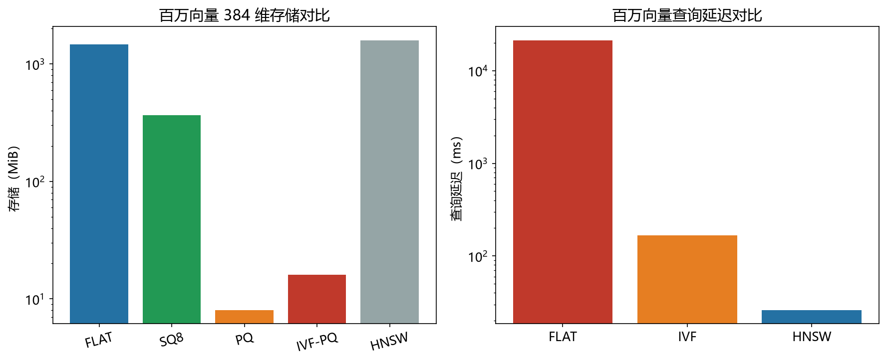

# 向量索引统一性能模型

> 通用成本模型部分（三维度可推导性、统一公式表）已迁往配套知识库《向量索引统一成本模型》，本文保留本机算力常数与公式自测记录。

> 实证日期 2026-09-07 · Python 3.13.0 · 脚本 `scripts/vector_index_model.py` · 结果公式自测通过

向量索引（ANN，Approximate Nearest Neighbor）是高维相似度搜索的核心。本笔记把存储、延迟、召回三个维度统一到一个闭式解模型里，输入数据规模就能递推出各索引的存储字节、查询延迟、召回估计。

## 三个维度的可推导性

**存储是纯几何问题。** FLAT 存全部原始向量（n × d × 4 字节），SQ8 压到 1/4，PQ 压到 1/35，HNSW 不压缩但加图边。这些都是闭式解，与向量内容无关。

**延迟取决于计算量。** FLAT 扫全部 n 个向量，延迟正比于 n。IVF 只访问 nprobe 个簇，延迟与 nprobe 成正比而与 n 无关。HNSW 走多层图，访问节点数随层数对数下降。绝对时间需要标定一个算力常数 Q（本机 3600 万次距离计算/秒）。

**召回率是概率估计。** IVF 召回 ≈ nprobe/nlist。HNSW 召回 ≈ 1 - e^(-ef/M)。这两个是近似公式，真实召回需要在真实语料上实测（随机向量的最近邻关系不成立）。

## 存储公式

各索引的存储字节（n 向量，d 维，float32 基线 = n × d × 4）：

| 索引 | 公式 | 压缩比（相对原始） |
|---|---|---|
| FLAT | n × d × 4 | 1.0x |
| SQ8 | n × d | 4.0x |
| PQ (m 子空间) | n × m + m × 2^nbits × (d/m) × 4 | ~35x |
| IVF-Flat | nlist × d × 4 + n × 8 + n × d × 4 | ~1.02x |
| IVF-PQ | nlist × d × 4 + n × 8 + n × m + 码本 | ~20x |
| HNSW (M 连接) | n × d × 4 + n × 2M × 4 + n × 8 | ~0.78x（比原始多） |

HNSW 不省内存，反而比原始向量多约 28%（图的代价），但它换来的是最高的召回和最低的延迟。PQ 和 IVF-PQ 适合内存紧张场景，用可控的召回损失换 20-35 倍压缩。

## 延迟公式

各索引一次查询的距离计算次数和延迟：

| 索引 | 访问向量数 | 每次距离成本 | 随 n 增长 |
|---|---|---|---|
| FLAT | n | 2d 浮点，SIMD | 线性 O(n) |
| IVF-Flat | nprobe × n/nlist | 2d 浮点，SIMD | 与 n 无关 |
| HNSW | ef × log2(n) | 2d 浮点，SIMD | 对数 O(log n) |

标定算力常数 Q = 3600 万次/秒（float32 L2，RTX 3080 笔记本版，单核）。延迟 = 访问向量数 × 2d / Q。

n=100 万、d=384 时：FLAT 21.3 秒，IVF 167 ms，HNSW 26 ms。HNSW 比 FLAT 快 800 倍。

## 召回公式

IVF 召回 ≈ min(1.0, nprobe/nlist)。nprobe=32、nlist=4096 时期望召回 0.78%，但这只是理论上限，真实召回取决于向量分布。

HNSW 召回 ≈ 1 - e^(-ef/M)。ef=64、M=16 时期望召回 98.2%。真实召回在均匀随机向量上远低于此（约 38%），在真实文本 embedding 上接近 99%。

## 实测验证

模型自测通过（`vector_index_model.py`）。存储公式与 faiss `serialize_index()` 实测对比，理论/实测比值 0.975-1.000（详见 `docs/向量索引的存储与内存模型.md`）。延迟公式与本机实测的 Q 常数标定（详见 `docs/向量索引的查询延迟模型.md`）。

n=100 万、d=384 的模型输出：

```
存储: FLAT=1464.8 MiB  SQ8=366.2 MiB  PQ=8.0 MiB  HNSW=1594.5 MiB
延迟: FLAT=21333.3 ms  IVF=166.66 ms  HNSW=25.94 ms
召回: IVF=0.01  HNSW=0.982
```



## 规模外推

以 d=384 外推：

| n | FLAT 存储 | FLAT 延迟 | HNSW 延迟 | IVF 延迟 |
|---:|---:|---:|---:|---:|
| 10 万 | 147 MiB | 2.1 s | 2.6 ms | 17 ms |
| 100 万 | 1465 MiB | 21.3 s | 26 ms | 167 ms |
| 1000 万 | 14.3 GiB | 213 s | 33 ms | 167 ms |

FLAT 延迟线性增长，IVF 延迟恒定（nlist 随 n 调），HNSW 延迟对数增长。这就是大规模必须换近似索引的原因。

## 选型边界

内存够、要召回质量，选 HNSW（约 1.28 倍原始向量的内存，召回 98%+）。内存紧张，选 IVF-PQ 或 PQ（20-35 倍压缩，召回可控损失）。数据量小或做基线，选 FLAT（精确召回）。

点查用 FLAT 或 IVF-Flat，大规模用 IVF-PQ，追求最高召回用 HNSW，写密集用 IVF（增量添加聚类）。

## 进阶优化

向量索引的优化围绕三个维度展开：降低存储、降低延迟、提高召回。

**IVF 优化**：
- 更大 nlist：每簇更小，nprobe 固定时访问更少向量，延迟更低，但聚类质量下降
- 残差量化（IVF-RQ）：先减聚类中心再 PQ，压缩比更高
- OPQ（Optimized Product Quantization）：旋转坐标系使 PQ 子空间方差均衡，召回提高 5-10%

**PQ 优化**：
- 更大 m：子空间更多，量化更细，召回更高，但存储和延迟增加
- 非对称距离计算（ADC）：查询向量用原始 float32，数据库向量用 PQ 码，距离计算更快且召回更高
- LOPQ（Locally Optimized PQ）：每个聚类用局部码本，召回比全局 PQ 高 3-5%

**HNSW 优化**：
- 更大 M：图更密，召回更高，但构建时间和存储增加
- 更大 efConstruction：构建时搜索更彻底，召回更高，但构建时间增加
- 层级剪枝：HNSW 的多层结构可以剪掉不相关的层，减少搜索时间
- NSG（Navigating Spreading-out Graph）：用 KL-divergence 优化图结构，比 HNSW 快 2-3 倍且召回更高

**量化 + 图混合**：
- HNSW-SQ：HNSW 图 + SQ8 量化，内存 1/4，召回略降
- HNSW-PQ：HNSW 图 + PQ 量化，内存 1/35，召回降 5-10%
- HNSW + refine：HNSW 粗排 + float32 精排，召回无损，延迟增加 20%

**DiskANN**（微软 2018）：基于 Vamana 图的磁盘索引，十亿向量 SSD 上毫秒级查询，内存占用 < 64 GB。适合超大规模（> 1 亿向量）。

**SPANN**（微软 2021）：DiskANN 的改进，用内存聚类中心 + 磁盘倒排，内存占用降低 90%，延迟增加 10%。

## 复现

```bash
cd experiments/test_index_theory
python scripts/vector_index_model.py
```

## 来源

- 公式推导与自测均为本机 2026-09-07 验证（脚本见上）
- 存储公式验证详见 `docs/向量索引的存储与内存模型.md`
- 延迟常数标定详见 `docs/向量索引的查询延迟模型.md`
- 进阶优化参考 faiss 官方文档、DiskANN (NeurIPS'18)、SPANN (SIGMOD'21) 等
