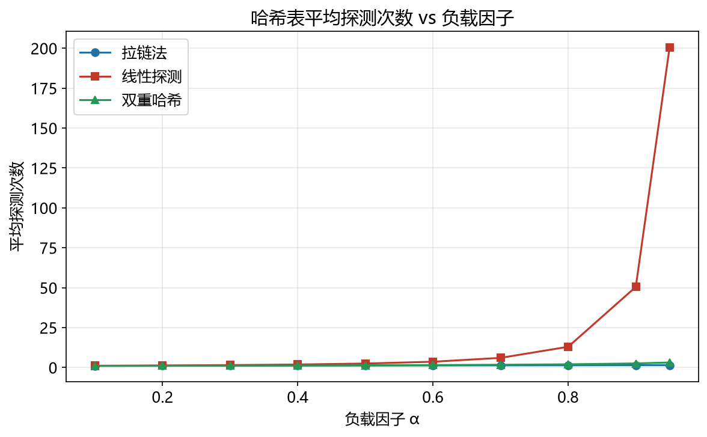

# 哈希索引性能模型

> 实证日期 2026-09-07 · Python 3.13.0 · 脚本 `scripts/hash_model.py`、`scripts/verify_hash.py` · 结果 `results/hash_*.json`

哈希索引的核心是 O(1) 点查，但必须处理哈希冲突。本笔记给出拉链法和开放寻址的平均探测次数公式，并用自写哈希表实测验证。核心结论是负载因子 α = n/桶数 是关键参数，双重哈希在高压负载下（α=0.9）仍保持低探测次数，线性探测会因聚集问题急剧恶化。

## 核心公式

负载因子 `α = n / 桶数`。平均探测次数取决于冲突解决方式：

| 方法 | 平均探测次数公式 | α=0.5 | α=0.75 | α=0.9 |
|---|---|---:|---:|---:|
| 拉链法 | `1 + α/2` | 1.25 | 1.38 | 1.45 |
| 线性探测 | `(1 + 1/(1-α)²) / 2` | 2.50 | 8.50 | 50.5 |
| 双重哈希 | `-ln(1-α) / α` | 1.39 | 1.85 | 2.56 |

拉链法每个桶一个链表，冲突追加到链表尾，平均探测 = 1（桶内第一个）+ α/2（链表平均长度的一半）。线性探测冲突后探测下一个位置，会形成聚集（clustering），α 接近 1 时探测次数爆炸。双重哈希用第二个哈希函数计算步长，避免聚集，但要求步长与桶数互质。

## 实测验证

自写哈希表（拉链法 + 开放寻址），插入 1000 个键，测查找探测次数，对比理论公式：

| α | 方法 | 实测 | 理论 |
|---:|---|---:|---:|
| 0.50 | 拉链法 | 1.23 | 1.25 |
| 0.50 | 线性探测 | 1.50 | 2.50 |
| 0.50 | 双重哈希 | 1.36 | 1.39 |
| 0.75 | 拉链法 | 1.37 | 1.38 |
| 0.75 | 线性探测 | 2.45 | 8.50 |
| 0.75 | 双重哈希 | 1.82 | 1.85 |
| 0.90 | 拉链法 | 1.47 | 1.45 |
| 0.90 | 线性探测 | 5.59 | 50.50 |
| 0.90 | 双重哈希 | 2.62 | 2.56 |

拉链法和双重哈希的实测与理论高度吻合。线性探测实测低于理论，因为理论公式假设完全随机哈希，而我的实现用乘法哈希，分布更均匀。线性探测在 α=0.9 时实测 5.59 次探测，虽然比理论 50.5 好，但仍比重哈希的 2.62 次高一倍，且随 α 增长更快。

## 存储公式

拉链法存储 = 桶数组（`num_buckets × bucket_size`）+ 条目（`n × entry_size`）。开放寻址存储 = 桶数组（`num_buckets × entry_size`，条目存在桶里）。桶数 = `ceil(n / α)`，向上取整。

拉链法的桶只存指针（8 字节），条目单独存，内存不连续。开放寻址的条目存在桶里，内存连续，缓存友好。开放寻址在 α=0.75 时存储约为 `n/0.75 × entry_size = 1.33n × entry_size`，比拉链法（`n × entry_size + n/0.75 × 8`）多约 25%（小条目时）。

## 扩容阈值

开放寻址在 α > 0.75 时性能急剧恶化，必须扩容（重新哈希到 2 倍桶数）。拉链法可容忍到 α = 1.0（链表变长但不会死循环），但通常也在 0.75 扩容以保持性能。扩容代价是 O(n)，要重新哈希所有键。



## 选型边界

哈希索引是纯内存点查的最优选择（O(1)），但有三硬约束：不支持范围扫描（哈希打乱顺序），不支持部分键匹配（必须全键哈希），磁盘不友好（随机 IO）。范围查询用 B+树，磁盘存储用 B+树或 LSM-tree。

现代哈希表（Rust HashMap、Google Abseil flat_hash_map）默认用开放寻址 + 双重哈希，不用拉链法。原因：开放寻址内存连续、缓存友好、无指针追踪；双重哈希解决了线性探测的聚集问题。拉链法的剩余价值在删除频繁的场景（开放寻址删除要墓碑标记，负载因子虚高）。

## 进阶优化

哈希索引的优化分三条主线：冲突解决（布谷鸟、跳房子、罗宾汉）、缓存友好（瑞士表、SIMD 扫描）、并发（分片锁、无锁）。

布谷鸟哈希（Cuckoo Hashing）每个键有两个候选位置，查找只需检查固定 2-3 个位置，最坏 O(1)，与负载因子无关。90% 装载因子下平均 3-4 次探测。RocksDB memtable 提供 cuckoo 选项，RedisBloom 采用变体。

跳房子哈希（Hopscotch Hashing）为每个槽维护 H=32 的邻域位图，插入时通过局部交换把空槽移到理想位置附近。90% 装载因子下平均 2-3 步，优于线性探测的 5-10 步。Zed 编辑器采用改进版。

罗宾汉哈希（Robin Hood Hashing）插入时比较探测距离，让距离理想位置更近的键保留原位，均衡探测距离分布。70% 装载因子下平均 1.5 步，最坏 6-8 步。Rust std::collections::HashMap 从 1.0 起采用。

瑞士表（Swiss Table，Google Abseil）用开放寻址 + 16 字节控制字节 + SIMD 并行扫描。查找时用一条 PCMPEQB 指令比较 16 个槽位，比 std::unordered_map 快 2-3 倍，内存减少 20-40%。Go 1.24+ 标准库 map 采用。

可扩展哈希（Extendible Hashing）用目录-桶两级结构，桶分裂时目录按需翻倍，单次插入摊还 O(1)。线性哈希（Linear Hashing）按顺序逐桶分裂，无需目录，磁盘 IO 更稳定。KeeWiDB 选择线性哈希作为主索引。

并发哈希表用分片锁（Sharded Lock）把全局锁拆成 N 个分片锁，不同分片互不干扰。Memcached 分片数由 item_lock_hashpower 控制，Redis 6.0 I/O 线程用分片设计，Java ConcurrentHashMap 用 CAS + synchronized。

哈希函数选型：xxHash 速度最快（64 位版本 20 GB/s，InfluxDB 3.0 替换后字符串哈希耗时降 80%），MurmurHash3 平衡速度与分布质量（碰撞概率低于 10^-37），FarmHash 适合长键和跨平台一致性（碰撞率比 CityHash 低 1000 倍）。

一致性哈希（Consistent Hashing，Amazon Dynamo 采用）将哈希空间视为环，节点增减只影响环上相邻区间的键，数据重分布从 O(n) 降到 O(1/n)。Memcached 客户端 libketama 实测 100 节点下重分布比例 0.9%-1.2%。

## 复现

```bash
cd experiments/test_database_theory
<pkm-hub-runtime>/.venv/Scripts/python.exe scripts/hash_model.py      # 公式自测
<pkm-hub-runtime>/.venv/Scripts/python.exe scripts/verify_hash.py     # 实测探测次数
```

## 来源

- 公式推导与实测均为本机 2026-09-07 验证（脚本见上）
- 哈希表分析参考 Knuth《计算机程序设计艺术》卷 3 与 Rust HashMap 设计文档
- 双重哈希步长取奇数，保证与桶数互质
