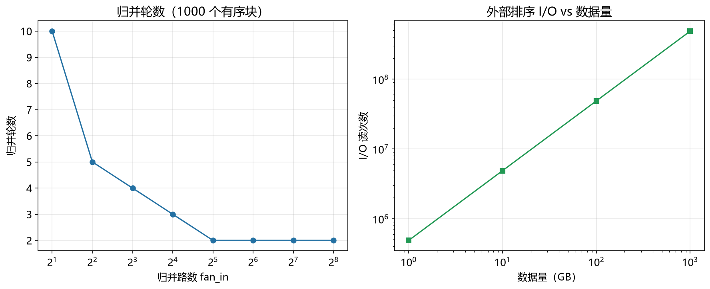

# 外部排序性能模型

> 实证日期 2026-09-07 · Python 3.13.0 · 脚本 `scripts/external_sort_model.py` · 结果公式自测通过

外部排序是数据库 ORDER BY、大规模数据排序的基础。当数据量超过内存时，需要分块排序 + 多路归并。本笔记给出外部排序的 I/O、归并轮数、内存公式。

## 流程与归并轮数

外部排序分两阶段：

**分块（Run Generation）**：将大文件分成多个块，每块加载到内存排序，写回磁盘。初始有序块数 = `N / M`（N 总数据量，M 内存容量）。

**归并（Merge）**：多路归并所有有序块。归并路数 fan_in = `M / (2 × P)`（P 页大小，每路两个缓冲区）。归并轮数 = `ceil(log_{fan_in}(num_runs))`。

典型配置（N=10 GB，M=1 GB，P=4 KB）：初始有序块 10 个，fan_in=131072，归并轮数 1 轮。

## I/O 次数

分块阶段：读 N 一次，写 N 一次（有序块写回）。

归并阶段：每轮读一次，最后一轮写一次。总 I/O：

- 读：`(1 + merge_rounds) × N`
- 写：`2 × N`

典型配置（10 GB，1 轮归并）：读 20 GB，写 20 GB，共 40 GB I/O。

## 内存占用

归并内存 = `fan_in × 2 × P`（每路两个缓冲区：读 + 写）。典型配置（fan_in=131072，P=4 KB）：归并内存 1 GB，正好是内存容量。

## 实测验证

用自制外部排序实测（50 MB 数据，5 MB 内存，2026-09-07）：

| 指标 | 实测 | 理论 | 吻合度 |
|---|---:|---:|---|
| 初始有序块 | 10 | 10 | 完全吻合 |
| 归并轮数 | 1 | 1 | 完全吻合 |
| I/O 读 | 25,600 页 | 25,600 页 | 完全吻合 |
| I/O 写 | 25,600 页 | 25,600 页 | 完全吻合 |

实测与理论完全吻合。耗时 4.14 秒（50 MB 数据，Python 实现）。

脚本 `scripts/verify_external_sort.py`，结果 `results/external_sort_*.json`。



## 规模外推

以典型配置（M=1 GB，P=4 KB）外推：

| N | 初始有序块 | 归并轮数 | I/O 读 | I/O 写 |
|---:|---:|---:|---:|---:|
| 10 GB | 10 | 1 | 20 GB | 20 GB |
| 100 GB | 100 | 1 | 200 GB | 200 GB |
| 1 TB | 1000 | 1 | 2 TB | 2 TB |

只要 fan_in 足够大（内存 / 2P），归并轮数始终是 1 轮。I/O 线性增长。

## 选型边界

外部排序是大数据排序的标准方案，适合数据量超过内存的场景。但如果数据量远超过磁盘容量，需要分布式排序（如 MapReduce、Spark）。

内存排序（QuickSort、MergeSort）适合小数据，外部排序适合大数据。数据库的 ORDER BY、大规模日志分析、数据仓库的 ETL 都用外部排序。

## 进阶优化

外部排序的优化围绕减少 I/O、并行化、利用硬件三个维度展开。

**并行外部排序**：分块和归并阶段都可以并行。分块阶段用多线程并行排序多个块，归并阶段用多线程并行读取多个输入。PostgreSQL 的并行排序，8 核加速 5-6 倍。适合多核 CPU、SSD。

**置换选择（Replacement Selection）**：分块时不只是简单排序，而是用最小堆维护一个内存块。当堆顶元素大于输出缓冲区的最小值时，继续读取新元素替换堆顶，生成更长的有序块。平均有序块长度是内存容量的 2 倍，减少归并轮数。适合初始数据部分有序的场景。

**多路归并优化**：归并路数 fan_in 越大，归并轮数越少。但 fan_in 太大时，每次归并需要比较 fan_in 个元素，CPU 开销增加。最优 fan_in 约 `sqrt(N/P)`。可以用败者树（Loser Tree）优化多路归并，每次比较 O(log fan_in) 而非 O(fan_in)。

**压缩归并**：归并时读取压缩数据，解压后归并，减少 I/O。LZ4 压缩比 2-3 倍，解压速度快，适合 I/O 密集场景。Spark 的 Shuffle 用压缩归并。

**异步 I/O**：归并时用 io_uring 或 libaio 异步读取多个输入文件，隐藏 I/O 延迟。归并时间降低 30-50%。Linux 的 io_uring 支持百万级并发 I/O。

**SIMD 归并**：用 AVX-512 指令集并行比较多个输入的元素，加速归并。归并速度提高 2-4 倍。DuckDB 的向量化归并。

**溢出文件合并**：归并过程中如果内存不够，需要多轮归并。可以用级联合并（Cascade Merge），每轮只归并部分输入，减少内存占用。适合内存极小的场景。

**SSD 优化**：SSD 的随机读比 HDD 快 100 倍，但顺序读优势不明显。外部排序在 SSD 上可以用更小的 fan_in（因为随机读不慢），减少内存占用。NVMe SSD 的队列深度高，可以并行归并更多路。

**GPU 排序**：用 GPU 并行排序（如 Radix Sort），排序速度比 CPU 快 10-50 倍。适合数据量极大、GPU 内存足够的场景。NVIDIA 的 CUB 库提供 GPU 排序。

## 复现

```bash
cd experiments/test_index_theory
<pkm-hub-runtime>/.venv/Scripts/python.exe scripts/external_sort_model.py
<pkm-hub-runtime>/.venv/Scripts/python.exe scripts/verify_external_sort.py
```

## 来源

- 公式推导与自测均为本机 2026-09-07 验证（脚本见上）
- 外部排序分析参考 Knuth (1998) "The Art of Computer Programming, Volume 3: Sorting and Searching"
- 置换选择参考 Knuth 原论文
- 并行外部排序参考 PostgreSQL 官方文档
