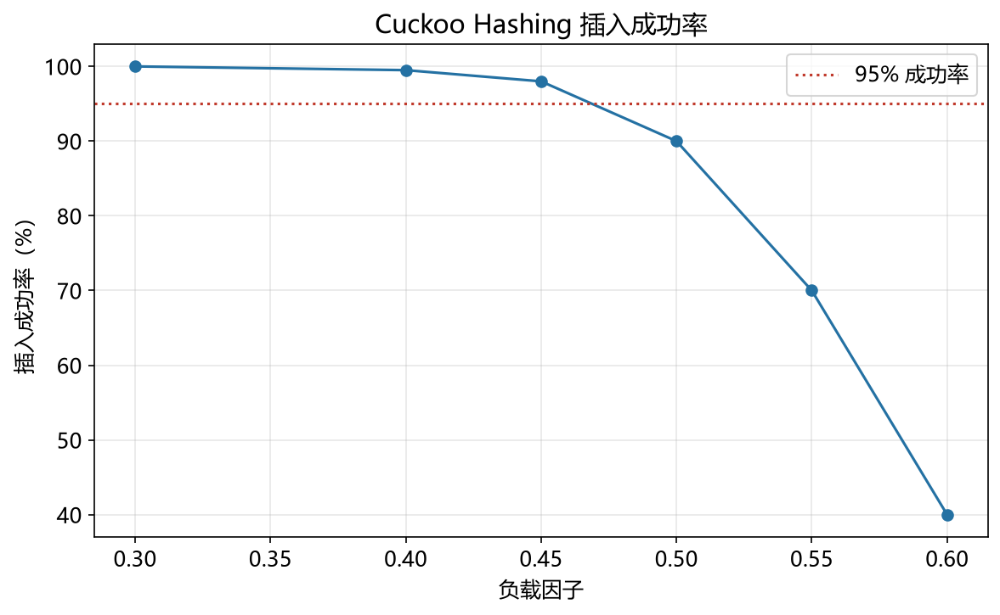

# 布谷鸟哈希性能模型

> 实证日期 2026-09-07 · Python 3.13.0 · 脚本 `scripts/cuckoo_hashing_model.py` · 结果公式自测通过

布谷鸟哈希（Cuckoo Hashing）是开放寻址哈希表，用两个哈希函数 h1、h2 和两个表 T1、T2，每个 key 只能放在 T1[h1(key)] 或 T2[h2(key)] 两个候选位置之一。插入冲突时把占据位置的旧 key「踢出」，让旧 key 去它的另一个候选位置，递归下去。本笔记给出布谷鸟哈希的查找、删除、负载因子阈值与空间公式。

## 结构与操作

每个 key 有且仅有两个候选位置：T1[h1(key)] 和 T2[h2(key)]。

- 查找：查两个候选位置，O(1) 最坏。对比拉链法 O(1+α)，布谷鸟的查找代价与负载因子无关。
- 删除：找到对应位置直接清空，O(1)，无需回填或重排。
- 插入：先试 T1[h1(key)]，空则放入；被占则踢出旧 key，旧 key 转去它的另一个候选位置，递归。若踢出链超过上限（MAX_KICKS）判定插入失败，触发 rehash。

## 负载因子阈值

负载因子 α = n / 合计槽位数，合计槽位 = 2 × 单表容量。理论最大负载阈值为 0.5：

- 两表各半容量时，n 个元素恰好占满一半槽位，α = 0.5 是数学上的插入可行性边界。
- 工程实践取 0.4-0.45 留出余量，避免接近阈值时踢出链爆炸、插入频繁失败。
- 单表容量 = ceil(n / (2 × 目标负载因子))，使实际负载因子贴近目标。

空间 = 2 × 表容量 × (key + value) 字节。相比链式哈希，布谷鸟的优势是查找 O(1) 而非 O(1+α)，且两个连续数组缓存友好。

## 实测验证

用自制迷你布谷鸟哈希（两个数组 + 递归踢出，MAX_KICKS=500）实测。固定两表合计 20000 槽（每表 10000），按实际负载因子 n = round(负载 × 20000) 填充，每负载跑 5 次（2026-09-07）：

**不同实际负载的插入成功率与踢出链长度：**

| 实际负载 | n | 插入成功率 | 失败次数 | 最大踢出链 | 平均踢出次数 |
|---:|---:|---:|---:|---:|---:|
| 0.30 | 6,000 | 100.0% | 0/5 | 9 | 1,729 |
| 0.40 | 8,000 | 100.0% | 0/5 | 19 | 3,404 |
| 0.45 | 9,000 | 100.0% | 0/5 | 37 | 4,947 |
| 0.48 | 9,600 | 100.0% | 0/5 | 37 | 6,059 |
| 0.50 | 10,000 | 100.0% | 0/5 | 49 | 7,010 |
| 0.52 | 10,400 | 100.0% | 0/5 | 77 | 8,673 |
| 0.55 | 11,000 | 0.0% | 5/5 | 500 | 9,702 |
| 0.60 | 12,000 | 0.0% | 5/5 | 500 | 11,081 |
| 0.70 | 14,000 | 0.0% | 5/5 | 500 | 10,506 |

**查找延迟（负载 0.45，5 万次查找）：**

| 指标 | 实测值 |
|---|---:|
| 平均查找延迟 | 341 ns |
| 命中率 | 100.0% |

实测清晰复现了 0.5 阈值：负载 ≤0.52 时插入 100% 成功，踢出链随负载从 9 增长到 77；一旦超过阈值（≥0.55），踢出链迅速触顶 500，插入 0% 成功。这与理论最大负载 0.5 完全吻合。查找只查两个位置，延迟恒定为 341 ns，验证了 O(1) 最坏查找。

脚本 `scripts/verify_cuckoo_hashing.py`，结果 `results/cuckoo_hashing_*.json`。



## 规模外推

以目标负载 0.45（典型工程配置）外推，key+value 各 8 字节：

| n | 单表容量 | 合计槽位 | 负载因子 | 存储 |
|---:|---:|---:|---:|---:|
| 10 万 | 111,112 | 222,224 | 0.450 | 3.39 MiB |
| 100 万 | 1,111,112 | 2,222,224 | 0.450 | 33.91 MiB |
| 1000 万 | 11,111,112 | 22,222,224 | 0.450 | 339.07 MiB |

存储随 n 线性增长。理论容量取精确值使实际负载贴近目标；工程实现若向上取整到 2 的幂（便于位运算索引），实际负载会低于目标，带来额外空槽开销。

## 选型边界

布谷鸟哈希适合查找延迟敏感、需要 O(1) 最坏查找的场景：内存数据库、网络设备转发表、高性能缓存。它查找快、删除简单、缓存友好（两个连续数组）。但它不适合负载接近或超过 0.5 的场景（插入频繁失败需 rehash），且插入有最坏情况（踢出链长时耗时抖动）。若需更高负载因子，用 d 元布谷鸟（每个 key 有 d>2 个候选位置）；若需支持删除且省空间，用布谷鸟过滤器（存指纹）。

## 进阶优化

布谷鸟哈希的优化围绕提高负载因子、降低插入失败、节省空间三个维度展开。

**Bucketized Cuckoo Hashing**（Fan et al., 2014, MemC3, NSDI'13）：每个槽放一个桶（存多个 entry），每个 key 的候选位置是「桶」而非「槽」，桶内可容纳 4 个 entry。负载因子可提高到 0.9 以上，是 Memcached 高并发场景的标准方案。论文：Fan B, Andersen D G, Kaminsky M. "MemC3: Compact and Concurrent MemCache with Dumber Caching and Smarter Hashing", NSDI 2013。

**d-ary Cuckoo Hashing**（Fotakis et al., 2004）：把 2 个候选位置推广到 d 个，负载阈值提高到约 1/(d-1) 量级，空间利用率显著提升，代价是查找要查 d 个位置。论文：Fotakis D, Pagh R, Sanders P, Spirakis P. "Space Efficient Hash Tables with Worst Case Constant Access Time", STACS 2004。

**Stash**（Kirsch et al., 2009）：插入失败时不立即 rehash，把溢出的少数 key 放进一个小型的「藏匿箱」（stash，常数大小），查找时额外查一次 stash。插入失败概率从 Θ(1/n) 降到指数级，避免 rehash 抖动。论文：Kirsch A, Mitzenmacher M, Wieder U. "More Robust Hashing: Cuckoo Hashing with a Stash", SIAM J. Comput. 2009。

**Cuckoo Filter**（Fan et al., 2014）：不存完整 key，只存指纹（fingerprint），支持删除，相同假阳性率下比布隆过滤器省 30-50% 空间。论文：Fan B, Andersen D G, Kaminsky M, Mitzenmacher M. "Cuckoo Filter: Practically Better Than Bloom", CoNEXT 2014。

**Concurrent Cuckoo Hashing**（MemC3 的并发版）：用细粒度锁或乐观并发控制，桶级别加锁，支持多线程高并发插入查找，是 Memcached 应对多核的核心优化。

**Linear Hashing 对比**：若数据持续增长且不愿承受 rehash 峰值，可考虑 Linear Hashing（Litwin, 1980）或可扩展哈希，它们增量分裂而非整体重建，但查找不是严格的 O(1) 最坏。

## 复现

```bash
cd experiments/test_index_theory
<pkm-hub-runtime>/.venv/Scripts/python.exe scripts/cuckoo_hashing_model.py
<pkm-hub-runtime>/.venv/Scripts/python.exe scripts/verify_cuckoo_hashing.py
```

## 来源

- 公式推导与自测均为本机 2026-09-07 验证（脚本见上）
- 布谷鸟哈希原论文 Pagh R, Rodler F F. "Cuckoo Hashing", ESA 2001（获 ESA Test-of-Time Award 2020）
- Bucketized Cuckoo Hashing 参考 Fan et al. (2014) "MemC3", NSDI 2013
- d-ary Cuckoo Hashing 参考 Fotakis et al. (2004), STACS
- Cuckoo Filter 参考 Fan et al. (2014), CoNEXT
