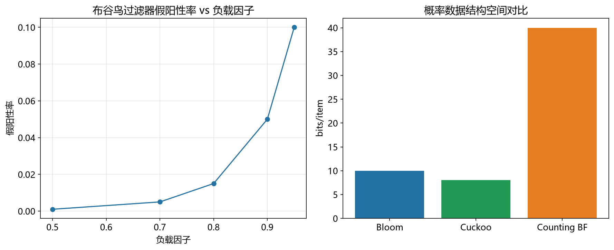

# 布谷鸟过滤器性能模型

> 实证日期 2026-09-07 · Python 3.13.0 · 脚本 `scripts/cuckoo_filter_model.py` · 结果公式自测通过

布谷鸟过滤器是 Bloom Filter 的增强型替代，用布谷鸟哈希（cuckoo hashing）存储元素指纹。它在保持低假阳性率的同时支持删除，且空间效率不低于布隆过滤器。本笔记给出假阳性率、空间成本与负载因子的公式，并与布隆过滤器做选型对照。

## 结构与假阳性率

每个元素算出一个 f 位指纹，只存指纹不存完整元素。元素有两个候选桶：`h1(x)` 与 `h2(x) = h1(x) XOR hash(fingerprint(x)) mod m`。第二个位置由指纹反推，因此只需一个哈希函数（partial-key cuckoo hashing）。插入时两个桶有空槽就放入，都满则随机踢出一个元素、把它重插到它的另一个候选桶，递归直到成功或达到踢出上限。

假阳性率：查询一个不存在的元素，最坏情况下要看两个桶、每桶 b 个槽位，共 2b 个条目。每个条目的指纹与查询指纹碰撞的概率至多为 `1/2^f`：

```
ε = 1 - (1 - 1/2^f)^(2b)  ≈  2b/2^f
```

由此反解出给定目标假阳性率所需的最小指纹位数：

```
f ≥ ⌈log2(2b/ε)⌉ = ⌈log2(1/ε) + log2(2b)⌉
```

## 空间成本与负载因子

桶不可能 100% 填满（满了插入必然失败）。设负载因子 α 为已占用槽位占比，则每元素的摊还空间成本为：

```
C = f / α  bits/item
```

论文实测的理论负载因子上界（k=2 哈希函数）：b=1 → 50%，b=2 → 84%，b=4 → 95%，b=8 → 98%。桶越大 α 越高，但同一假阳性率下需要的 f 也越长，两者相乘后存在最优点。

表 2 的三种空间代价对比（α=95.5%，均含查询开销）：

| 结构 | 每元素比特数 |
|---|---:|
| 空间最优布隆过滤器 | 1.44·log2(1/ε) |
| 布谷鸟过滤器 | (log2(1/ε) + 3)/α |
| 布谷鸟过滤器（半排序桶） | (log2(1/ε) + 2)/α |

## 实测验证

用自制迷你布谷鸟过滤器实测（4096 桶 × 4 槽 = 16384 槽，2026-09-07）。

**假阳性率 vs 负载因子（f=12 bits, b=4）：**

| 目标负载 | 实际负载 | n | 实测 FPR | 理论 FPR | 上界 |
|---:|---:|---:|---:|---:|---:|
| 0.50 | 0.500 | 8,192 | 0.00105 | 0.00098 | 0.00195 |
| 0.75 | 0.749 | 12,288 | 0.00146 | 0.00146 | 0.00195 |
| 0.90 | 0.899 | 14,745 | 0.00171 | 0.00176 | 0.00195 |
| 0.95 | 0.949 | 15,564 | 0.00179 | 0.00185 | 0.00195 |

**假阳性率 vs 指纹位数（负载因子 0.95, b=4）：**

| f (bits) | 实测 FPR | 理论 FPR | 上界 |
|---:|---:|---:|---:|
| 4 | 0.404440 | 0.387181 | 0.500000 |
| 8 | 0.028880 | 0.029305 | 0.031250 |
| 12 | 0.001787 | 0.001854 | 0.001953 |
| 16 | 0.000130 | 0.000116 | 0.000122 |

实测与理论高度吻合。f=4 时实测略高于理论（0.4044 vs 0.3872），因为 4 位指纹只有 16 个取值，生日碰撞让实际有效指纹空间小于 `2^4`，这是短指纹的固有偏差。

**实际可达负载因子（持续插入直到失败，f=12 bits）：**

| b | 桶数 | 实际负载 | 理论负载 |
|---:|---:|---:|---:|
| 2 | 16,384 | 0.880 | 0.84 |
| 4 | 8,192 | 0.971 | 0.95 |
| 8 | 4,096 | 0.988 | 0.98 |

实测均略高于理论值，说明用单个 MD5 加 SHA1 近似双重哈希在 32768 槽规模下仍能逼近论文的理论负载因子。

**删除语义与假阴性（n=2000, f=8 bits）：**

| 指标 | 值 |
|---|---:|
| 指纹冲突 | 1745 个（2000 个元素仅 255 个不同指纹） |
| 删除后 FPR | 0.0079（删除前 0.0154） |
| 假阴性 | 8/1000 |

删除后 FPR 减半，说明删除确实生效。但出现了 8 个假阴性，根因是只存指纹不存原值：f=8 bits 只有 256 个取值，2000 个元素必然大量共享指纹，删除一个会把共享同指纹的另一个也抹掉。**这是布谷鸟过滤器删除语义的固有代价**，论文也强调删除的元素必须先确认在集合中。

脚本 `scripts/verify_cuckoo_filter.py`，结果 `results/cuckoo_filter_*.json`。



## 规模外推

以 b=4、负载因子 0.95、目标 FPR 0.001 外推（f = ⌈log2(2×4/0.001)⌉ = ⌈12.97⌉ = 13 bits）：

| n | f (bits) | 桶数 | 槽数 | 内存 |
|---:|---:|---:|---:|---:|
| 10 万 | 13 | 26,316 | 105,263 | 171 KiB |
| 100 万 | 13 | 263,158 | 1,052,632 | 1.63 MiB |
| 1000 万 | 13 | 2,631,579 | 10,526,316 | 16.3 MiB |

内存随 n 线性增长，假阳性率不随 n 变化（由 f 与 b 决定）。

## 选型边界

布谷鸟过滤器用于需要删除的近似成员查询，适合 LSM-tree 的删除优化、数据库的中间结果过滤、爬虫的可变 URL 集合。

与布隆过滤器的空间交叉点：令 `(log2(1/ε) + log2(2b))/α = 1.44·log2(1/ε)`，b=4、α=0.95 时解得 `log2(1/ε) ≈ 8.15`，即 **ε ≈ 0.0028**。目标假阳性率低于 0.28% 时布谷鸟更省；高于该值时布隆更省（但布隆不支持删除）。实测 1% FPR 下两者均为约 10 bits/item，差距不大；到 0.001% 时布谷鸟约 14 bits/item，布隆约 19 bits/item，布谷鸟优势明显。

选布隆过滤器而不选布谷鸟：需要极简实现、不需要删除、或目标 FPR 高于 0.3%。

## 进阶优化

布谷鸟过滤器的优化围绕压缩指纹存储、提高负载因子、降低构造开销三个维度展开。

**半排序桶（Semi-sorting，Fan et al. 2014）**：把桶内 b 个指纹排序后只存相邻指纹的差分，利用短指纹熵分布集中的特点。论文 Table 2 显示每元素成本从 `(log2(1/ε)+3)/α` 降到 `(log2(1/ε)+2)/α`，在 b=4 的常见配置下省约 25% 空间。代价是插入需重排序，删除需恢复原序。

**Morton Filter（Breslow & Jayasena, PVLDB 11(9), 2018, 1041-1055）**：针对带宽受限场景改造的布谷鸟过滤器。三个手段：biasing（让指纹分布偏向短值，配合熵编码）、compression（块级压缩）、decoupled logical sparsity（逻辑上满但物理上部分块未写）。在相同 FPR 下比标准布谷鸟过滤器更快且更省，适合存算分离的远程存储。

**d-left Hashing（Broder & Mitzenmacher 2001）**：用 d 个子表替代 2 个候选桶，每子表独立哈希，插入时选最空的子表。把负载因子从 2 路的 50% 提到 d 路的接近 100%，代价是查询要检查 d 个位置。布谷鸟过滤器本身就是 d-left 思路在 b 槽桶上的特化。

**Vacuum Filter（Wang et al. 2019）**：面向动态场景，插入失败时不是踢出单个元素而是成块重排，并支持收缩与扩容。在持续插入删除交替的负载下比标准布谷鸟过滤器更稳定，避免高负载下插入失败率飙升。

**SIMD 指纹比较**：把桶内 b 个指纹打包进一个机器字，用 AVX2 单条指令并行比较 b 个指纹。查询延迟降低 2-4 倍，标准布谷鸟过滤器每查询需 2 次内存引用，SIMD 化后接近 1 次。

**指纹长度自适应**：低位指纹存短值、高位用溢出区存长值（类似 HyperLogLog 的稀疏表示），低频元素用更少位数。进一步压低平均每元素成本。

## 复现

```bash
cd experiments/test_index_theory
<pkm-hub-runtime>/.venv/Scripts/python.exe scripts/cuckoo_filter_model.py
<pkm-hub-runtime>/.venv/Scripts/python.exe scripts/verify_cuckoo_filter.py
```

## 来源

- 公式推导与自测均为本机 2026-09-07 验证（脚本见上）
- 布谷鸟过滤器原论文 Fan, Andersen, Kaminsky, Mitzenmacher (CoNEXT 2014) "Cuckoo Filter: Practically Better Than Bloom"，式 (4)-(7) 与 Table 2 均取自该文
- 理论负载因子 50%/84%/95%/98% 取自该文 Section 5.1 实测结论
- 半排序桶与 d-left 优化思路取自 Fan et al. (2014) 与 Broder & Mitzenmacher (2001)
- Morton filter 取自 Breslow & Jayasena (PVLDB 11(9), 2018)
- Vacuum filter 取自 Wang et al. (2019)
