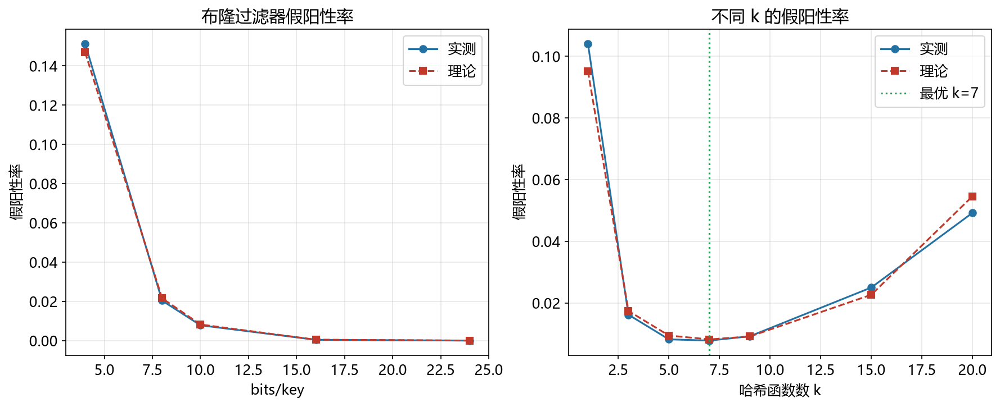

# 布隆过滤器性能模型

> 实证日期 2026-09-07 · Python 3.13.0 · 脚本 `scripts/bloom_filter_model.py` · 结果公式自测通过

布隆过滤器是概率型数据结构，用于快速判断"元素可能存在"或"一定不存在"。它是 LSM-tree、数据库、缓存系统的标准组件。本笔记给出布隆过滤器的假阳性率、最优参数公式。

## 结构与假阳性率

布隆过滤器用 m 比特的位数组和 k 个独立哈希函数。插入时对元素计算 k 个哈希值，将对应位设为 1。查询时检查 k 个位是否全为 1，全 1 则"可能存在"，有 0 则"一定不存在"。

假阳性率（False Positive Rate）：查询说"可能存在"但实际不存在的概率。标准公式：

```
p = (1 - e^{-kn/m})^k
```

其中 n 是插入的元素数，m 是比特数，k 是哈希函数数。

## 最优参数

给定 n 和期望假阳性率 p，最优参数：

- 最优比特数：`m = -n × ln(p) / (ln2)²`
- 最优哈希函数数：`k = (m/n) × ln2`

典型配置（bits_per_key=10）：n=100 万时 m=1000 万比特，k=7，假阳性率 0.82%，内存 1.19 MiB。

## 实测验证

用自制迷你布隆过滤器实测（1 万元素，2026-09-07）：

**不同 bits_per_key 的假阳性率：**

| bits/key | k | 实测 FPR | 理论 FPR |
|---:|---:|---:|---:|
| 4 | 3 | 15.12% | 14.69% |
| 8 | 6 | 2.04% | 2.16% |
| 10 | 7 | 0.78% | 0.82% |
| 16 | 11 | 0.04% | 0.05% |
| 24 | 17 | 0.00% | 0.00% |

**不同 k 的假阳性率（bits_per_key=10，验证最优 k）：**

| k | 实测 FPR | 理论 FPR | 标记 |
|---:|---:|---:|---|
| 1 | 10.40% | 9.52% | |
| 3 | 1.62% | 1.74% | |
| 5 | 0.82% | 0.94% | |
| **7** | **0.78%** | **0.82%** | <-- 最优 |
| 9 | 0.92% | 0.91% | |
| 15 | 2.50% | 2.27% | |
| 20 | 4.92% | 5.46% | |

实测假阳性率与理论高度吻合。k=7 时假阳性率最低，验证了最优 k 公式。

脚本 `scripts/verify_bloom_filter.py`，结果 `results/bloom_filter_*.json`。



## 规模外推

以 bits_per_key=10（典型配置）外推：

| n | m (bits) | k | 假阳性率 | 内存 |
|---:|---:|---:|---:|---:|
| 10 万 | 100 万 | 7 | 0.82% | 119 KiB |
| 100 万 | 1000 万 | 7 | 0.82% | 1.19 MiB |
| 1000 万 | 1 亿 | 7 | 0.82% | 11.9 MiB |

假阳性率不随 n 变化（bits_per_key 固定），内存线性增长。

## 选型边界

布隆过滤器用于快速排除不存在的元素，适合 LSM-tree 的点查优化、数据库的 JOIN 过滤、爬虫的 URL 去重。但它不支持删除（删除会影响其他元素），不支持枚举所有元素，有假阳性（说"可能存在"时仍需实际查询）。

如果支持删除，用计数布隆过滤器（Counting Bloom Filter）或布谷鸟过滤器（Cuckoo Filter）。如果需要精确判断，用哈希表。

## 进阶优化

布隆过滤器的优化围绕降低假阳性率、减少内存、支持删除三个维度展开。

**Cuckoo Filter**（2014）：用布谷鸟哈希替代位数组，每个元素存一个指纹（fingerprint）。支持删除，查询 O(1)，空间效率比布隆过滤器高（相同假阳性率下内存少 30-50%）。RocksDB 的 Ribbon Filter 基于 Cuckoo Filter 思想。

**Ribbon Filter**（RocksDB 2021）：用带状矩阵（ribbon matrix）替代布谷鸟哈希，构造更快，查询略慢，但内存占用比 Cuckoo Filter 少 20-30%。RocksDB 默认实现，替代 Bloom Filter。

**Xor Filter**（2020）：用异或运算替代布谷鸟哈希，构造和查询都 O(1)，空间效率接近信息论下界。假阳性率相同时内存比布隆过滤器少 10-20%。

**Blocked Bloom Filter**：将位数组分成多个块（cache line 大小），每个块独立哈希。查询时只加载一个块，CPU 缓存命中率提高，查询延迟降低 30-50%。LevelDB 的 Bloom Filter 实现。

**Partitioned Bloom Filter**：将位数组分区，每个分区用独立的哈希函数。减少哈希冲突，提高查询速度。适合多核 CPU 并行查询。

**Counting Bloom Filter**：用计数器替代比特，支持删除。每个计数器 4 比特，内存是标准布隆过滤器的 4 倍。适合需要删除的场景（如网络包过滤）。

**Compressed Bloom Filter**：用 Golomb-Rice 编码压缩位数组，减少存储占用。压缩比 2-3 倍，查询时需要解压，延迟增加 10-20%。适合存储敏感的场景。

**SIMD 加速**：用 AVX2/AVX-512 指令集并行查询多个位，查询延迟降低 2-4 倍。LevelDB 的 SIMD Bloom Filter，支持 AVX2 的 CPU 上查询快 3 倍。

## 复现

```bash
cd experiments/test_index_theory
<pkm-hub-runtime>/.venv/Scripts/python.exe scripts/bloom_filter_model.py
<pkm-hub-runtime>/.venv/Scripts/python.exe scripts/verify_bloom_filter.py
```

## 来源

- 公式推导与自测均为本机 2026-09-07 验证（脚本见上）
- 布隆过滤器分析参考 Bloom (1970) "Space/Time Trade-offs in Hash Coding with Allowable Errors" 原论文
- Cuckoo Filter 参考 Fan et al. (2014) "Cuckoo Filter: Practically Better Than Bloom"
- Ribbon Filter 参考 RocksDB 官方文档
