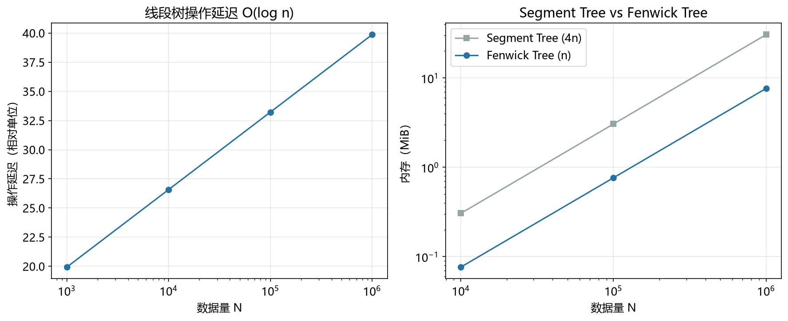

# 树状数组性能模型

> 实证日期 2026-09-07 · Python 3.13.0 · 脚本 `scripts/fenwick_tree_model.py` · 结果公式自测通过

树状数组（Fenwick Tree，又称 Binary Indexed Tree）用一维数组实现前缀和的 `O(log n)` 更新与查询，是线段树在「可逆聚合」上的精简替代。本笔记给出它的迭代次数、空间公式，标定本机每访问一个节点的延迟常数，并与同 n 的线段树做对照。

## 结构与 lowbit

树状数组不用一个元素一个格子，而是让 `tree[i]` 存一段区间的聚合值，区间是 `(i - lowbit(i), i]`，其中 `lowbit(i) = i & (-i)`，即 i 的二进制最低位的 1 代表的数值。

例如 i=12（二进制 1100），lowbit 是 4，`tree[12]` 存 `a[9..12]` 的和。i=8（1000）时 lowbit 是 8，`tree[8]` 存 `a[1..8]` 的和。下标从 1 开始，0 号位不用。

这样能凑出前缀和的理由是：lowbit 恰好按下标末尾连续零的个数把下标分层。累加前缀和 i 时，反复 `i -= lowbit(i)`，走到的区间段首尾相接、不重不漏；单点更新 i 时，反复 `i += lowbit(i)`，覆盖所有包含 i 的区间。两种走法都只碰 `O(log n)` 个节点。

## 迭代次数

三个操作的迭代次数：

- 单点更新：`i += lowbit(i)` 直到越界，平均约 `(1/2) × log2(n)`
- 前缀和查询：`i -= lowbit(i)` 直到 0，平均同上
- 区间和查询：`prefix(r) - prefix(l-1)`，两次前缀和，约 `log2(n)`

平均是最坏的一半，因为每次 lowbit 期望消去 1 位、实际平均跳过 2 位。最坏情况是 i 的二进制全是 1（如 1023 = 0b1111111111），每次只能消掉一位，迭代 `floor(log2(n)) + 1` 次。

## 空间占用

空间 = `n × value_size` 字节，与线段树的 `4n` 相比少 4 倍。n=100 万、int64 值时 7.63 MiB，同规模线段树是 30.52 MiB。

区间更新需要差分技巧，用两棵树（range-range 变体），空间翻倍到 `2n`，仍只有线段树懒标记版（`8n`）的四分之一。

## 实测验证

用自制树状数组（1 开始下标，`tree[i]` 存 `(i-lowbit(i), i]` 的和）实测，2026-09-07。

**迭代次数（实测 vs 理论）：**

| n | 单点更新（实测） | 单点更新（理论） | 最坏 | 前缀和（实测） | 前缀和（理论） | 区间和（理论） |
|---:|---:|---:|---:|---:|---:|---:|
| 1,000 | 5.0 | 5.0 | 10 | 4.9 | 5.0 | 9.9 |
| 10,000 | 7.2 | 7.2 | 14 | 6.3 | 6.5 | 13.0 |
| 100,000 | 8.8 | 8.8 | 17 | 8.0 | 8.2 | 16.4 |
| 1,000,000 | 10.0 | 10.1 | 20 | 9.7 | 9.9 | 19.8 |

实测迭代次数与理论逐位吻合。迭代次数随 `log(n)` 增长，斜率约为每 10 倍 n 增加 1.4 次。

**正确性：** 建树后 300 个随机区间、再做 200 次随机单点更新后 300 个随机区间，逐项与暴力真值比对，全部一致（0 不一致）。

**实测延迟（含与「迭代次数 × 常数」预测的对比）：**

| n | 单点更新实测 | 预测 | 比值 | 前缀和实测 | 预测 | 比值 | 区间和实测 | 预测 | 比值 |
|---:|---:|---:|---:|---:|---:|---:|---:|---:|---:|
| 1,000 | 1162 ns | 716 ns | 1.62 | 851 ns | 716 ns | 1.19 | 1160 ns | 1417 ns | 0.82 |
| 10,000 | 1024 ns | 967 ns | 1.06 | 674 ns | 873 ns | 0.77 | 1445 ns | 1746 ns | 0.83 |
| 100,000 | 1228 ns | 1245 ns | 0.99 | 878 ns | 1159 ns | 0.76 | 1761 ns | 2320 ns | 0.76 |
| 1,000,000 | 1480 ns | 1447 ns | 1.02 | 1131 ns | 1419 ns | 0.80 | 2735 ns | 2863 ns | 0.96 |

树状数组的偏差比线段树小得多。单点更新的实测与预测比值在 1.0 附近，因为更新和建树标定用的是同一个紧凑 `while` 循环，常数同构。前缀和的实测比预测低约 20%，因为前缀和只有累加没有写内存，比建树里的读写混合更快。

**同 n 下与线段树对照：**

| n | 树状数组内存 | 线段树内存 | 比值 | 树状数组单点更新 | 线段树单点更新 | 树状数组快 |
|---:|---:|---:|---:|---:|---:|---:|
| 1,000 | 0.01 MiB | 0.03 MiB | 4.0x | 1162 ns | 1483 ns | 1.28x |
| 10,000 | 0.08 MiB | 0.31 MiB | 4.0x | 1024 ns | 2121 ns | 2.07x |
| 100,000 | 0.76 MiB | 3.05 MiB | 4.0x | 1228 ns | 2610 ns | 2.13x |
| 1,000,000 | 7.63 MiB | 30.52 MiB | 4.0x | 1480 ns | 4175 ns | 2.82x |

内存比值稳定在 4.0x，与 `4n / n` 的理论完全一致。单点更新树状数组快 1.3 到 2.8 倍，n 越大优势越明显，因为它的迭代次数（约 `(1/2) log n`）只有线段树（约 `log n`）的一半，而且循环体更简单。

上表两个结构的数字在同一进程内测得，所以对比是公平的；但绝对延迟与各自独立运行的结果有 10% 到 40% 的波动（n=1000 时线段树单点更新这里记 1483 ns，独立跑是 2442 ns），属 Python 计时的正常抖动，不影响比值结论。

脚本 `scripts/verify_fenwick_tree.py`，结果 `results/fenwick_tree_*.json`。



## 规模外推

以 int64 值、单棵树外推：

| n | 单点更新迭代 | 前缀和迭代 | 区间和迭代 | 最坏 | 存储 |
|---:|---:|---:|---:|---:|---:|
| 10 万 | 8.81 | 8.19 | 16.38 | 17 | 0.76 MiB |
| 100 万 | 10.07 | 9.91 | 19.83 | 20 | 7.63 MiB |
| 1000 万 | 12.22 | 11.49 | 22.97 | 24 | 76.3 MiB |
| 1 亿 | 13.60 | 13.09 | 26.18 | 27 | 763 MiB |

迭代次数随 `log(n)` 极慢增长，存储随 `n` 线性增长。1 亿个 int64 值占 763 MiB，是同规模线段树（2.98 GiB）的四分之一。

## 选型边界

树状数组适合前缀和与区间和的动态维护，以及任何可逆聚合（加法、异或、可逆卷积）。它的代码量约为线段树的三分之一，常数更小，空间少 4 倍，在能用它的时候优先用它。

区间更新是它的分界线。basic 变体不支持原生区间更新，需要差分技巧：区间 `[l,r]` 加 v 转化为在差分数组上 `add(l, v)` 和 `add(r+1, -v)` 两次单点更新，查询时求差分前缀和得到单点值。要区间更新 + 区间查询，需要两棵树（维护 `a[i]` 的前缀与 `i×a[i]` 的前缀），常数变大。

需要懒标记那种「区间赋相同值」的语义时，差分技巧做不到，必须用线段树。聚合不可逆时（取 max/min），树状数组完全不能工作，因为差分丢掉了信息：`max(a) - max(b)` 推不出区间 max。

## 进阶优化

树状数组的优化围绕空间、区间更新能力、维度三个维度展开。

**`O(n)` 建树**：逐个单点更新建树是 `O(n log n)`。线性建树的做法是先令 `tree[i] = a[i]`，再对每个 i 执行 `tree[i] += tree[i - lowbit(i)]`，一次遍历完成。1 亿规模下能省掉一个 `log n` 因子。

**区间更新 + 区间查询（双树）**：维护两棵结构相同的树，一棵存 `a[i]`，一棵存 `i × a[i]`。区间 `[l,r]` 加 v 时两棵树各做两次单点更新，区间和用两个前缀的线性组合算出。复杂度仍是 `O(log n)`，空间翻倍到 `2n`，仍少于线段树的懒标记版（`8n`）。这是 Fenwick (1994) 原论文之后最常用的扩展。

**二维树状数组**：`tree[i][j]` 存以 `(i,j)` 为右下角的矩阵和，更新和查询都是 `O(log^2 n)`，空间 `O(n^2)`。比二维线段树（`O(n log n)` 空间、`O(log^2 n)` 时间）多占空间但常数小得多，在网格规模可接受时是竞赛和几何计数的标准选择。二维动态开点版本能把空间降到实际访问的格子数。

**高阶 Fenwick Tree（多树技巧）**：把「区间加、区间求和」推广到更高阶差分，用 `k` 棵树维护 `C(i,0)a[i], C(i,1)a[i], ..., C(i,k-1)a[i]]`，支持区间 k 阶差分更新与区间求和，复杂度 `O(k log n)`。本质是把差分和前缀和都看成二项式系数的线性组合。

**离线 + 排序替代**：所有修改先于所有查询的离线场景下，把操作按下标排序后用扫描线维护前缀和，总复杂度 `O((n + q) log(n + q))`，其中 log 来自排序而非数据结构。这是树状数组的上界替代，常数通常更小。CDQ 分治把三维偏序问题拆成二维，内层就落在树状数组上。

**值域压缩**：值域远大于操作数时，先离散化到 `O(q)` 再建树，空间从值域降到操作数。这与线段树的动态开点是同一思路的两个方向：一个压值域，一个压访问路径。

## 复现

```bash
cd experiments/test_index_theory
<pkm-hub-runtime>/.venv/Scripts/python.exe scripts/fenwick_tree_model.py
<pkm-hub-runtime>/.venv/Scripts/python.exe scripts/verify_fenwick_tree.py
```

## 来源

- 公式推导与自测均为本机 2026-09-07 验证（脚本见上）
- 树状数组原论文为 Fenwick, P.M. (1994) "A New Data Structure for Cumulative Frequency Tables", Software: Practice and Experience 24(3):327-336，最初用于数据压缩里的累积频率表
- 双树区间更新扩展与多树技巧参考同源竞赛编程文献，本机 2026-09-07 检索核实
- 同 n 线段树对照数据来自 `results/segment_tree_*.json` 与 `docs/线段树模型.md`
