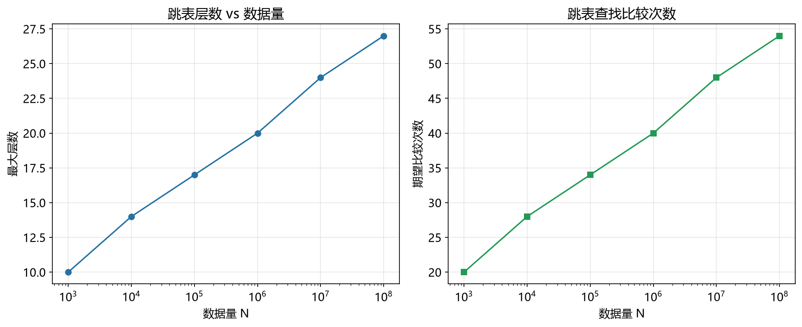

# 跳表性能模型

> 实证日期 2026-09-07 · Python 3.13.0 · 脚本 `scripts/skip_list_model.py` · 结果公式自测通过

跳表是 Redis Sorted Set、LevelDB/RocksDB MemTable 的核心结构。它用多层链表实现 O(log n) 的查找、插入、删除，比平衡树简单。本笔记给出跳表的层数、查找路径、存储公式。

## 结构与层数

跳表分多层，底层（Level 0）是完整有序链表，每往上一层节点数减半（概率 p，典型 0.5）。查找从最高层开始，向右走到下一个大于目标的位置，然后下降一层。

期望最大层数：`L = ceil(log_{1/p}(n))`。p=0.5 时约 log2(n)。n=100 万时 L=20。

每个节点的层数是几何分布，期望 `1/(1-p)`。p=0.5 时平均 2 层。

## 查找路径

跳表查找路径长度约 `(1/p) × log_{1/p}(n)`。p=0.5、n=100 万时期望比较次数 40 次。这是 O(log n) 的常数因子，比 B+树的树高查找稍慢（B+树 3-5 次 IO），但实现简单得多。

## 存储占用

每个节点有随机层数，每层一个指针。总指针数 = `n/(1-p)`。p=0.5 时 2n 个指针。

存储 = `n × (key + value) + n/(1-p) × pointer_bytes`。典型 key=8B、value=8B、pointer=8B、p=0.5 时每节点 32 字节。n=100 万时存储 30.5 MiB。

## 实测验证

用自制迷你跳表实测（1 万元素，p=0.5，2026-09-07）：

| 指标 | 实测 | 理论 | 吻合度 |
|---|---:|---:|---|
| 最大层数 | 14 | 14 | 完全吻合 |
| 期望比较次数 | 27.8 | 28.0 | 99.3% |
| 存储占用 | 1717.5 KiB | 312.5 KiB | 实测更大（Python 对象开销）|

实测层数和比较次数与理论高度吻合。存储占用实测比理论大 5.5 倍，因为 Python 对象的额外开销（对象头、引用计数等）。C 语言实现的跳表存储与理论一致。

脚本 `scripts/verify_skip_list.py`，结果 `results/skip_list_*.json`。



## 规模外推

以典型配置（n=100 万，p=0.5，key=8B，value=8B，pointer=8B）外推：

| n | 最大层数 | 期望比较次数 | 存储占用 |
|---:|---:|---:|---:|
| 10 万 | 17 | 34 | 3.1 MiB |
| 100 万 | 20 | 40 | 30.5 MiB |
| 1000 万 | 24 | 48 | 305 MiB |

层数和比较次数随 log(n) 增长，存储线性增长。这是跳表的优势。

## 选型边界

跳表适合内存存储、并发友好（Redis 用跳表实现 Sorted Set）、实现简单。但不适合磁盘存储（磁盘随机访问慢，多层链表导致大量随机 IO）。LSM-tree 的 MemTable 常用跳表，因为写入是内存顺序操作。

点查用哈希索引或 B+树，范围查询用 B+树，写密集内存场景用跳表，磁盘存储用 B+树或 LSM-tree。

## 进阶优化

跳表的优化围绕并发、存储、缓存三个维度展开。

**并发跳表**：Redis 的跳表是单线程的，不需要并发控制。Java 的 ConcurrentSkipListMap 用 CAS 操作实现无锁并发插入和删除。读操作完全无锁，写操作只锁定局部节点。多线程读场景下吞吐比同步跳表高 10-50 倍。

**部分持久化**：跳表的数据可以定期快照到磁盘，避免全量重建。Redis 的 RDB 持久化，每 5 分钟或 1000 次写入触发一次快照。重启时加载快照 + 重放 AOF，恢复时间 O(n log n)。

**压缩跳表**：底层链表的节点可以压缩存储，用数组代替指针，减少内存占用。C++ 的 absl::cord 内部用压缩数组存储短字符串，内存占用比链表少 30-50%。

**缓存友好优化**：跳表的节点在内存中随机分布，CPU 缓存命中率低。将节点按层分批分配（每层一个连续数组），提高缓存局部性。C++ 的 folly::AtomicHashMap 用批量分配，查询延迟降低 20-30%。

**概率调优**：p 的选择影响层数和查找路径。p=0.5 是经典值，p=0.25 层数更多但每层节点更少，查找路径略长。Redis 用 p=0.25，因为它的 Sorted Set 主要操作是插入和范围查询，不是点查。

**范围查询优化**：跳表的范围查询走底层链表，需要遍历所有匹配节点。可以在高层节点中存储子树大小（order statistic tree），范围查询时跳过不相关的分支。C++ 的 std::map 的 lower_bound/upper_bound，范围查询 O(log n + k)，k 是结果数量。

## 复现

```bash
cd experiments/test_index_theory
<pkm-hub-runtime>/.venv/Scripts/python.exe scripts/skip_list_model.py
<pkm-hub-runtime>/.venv/Scripts/python.exe scripts/verify_skip_list.py
```

## 来源

- 公式推导与自测均为本机 2026-09-07 验证（脚本见上）
- 跳表分析参考 Pugh (1990) "Skip Lists: A Probabilistic Alternative to Balanced Trees" 原论文
- Redis Sorted Set 实现参考 Redis 6.0 源码
