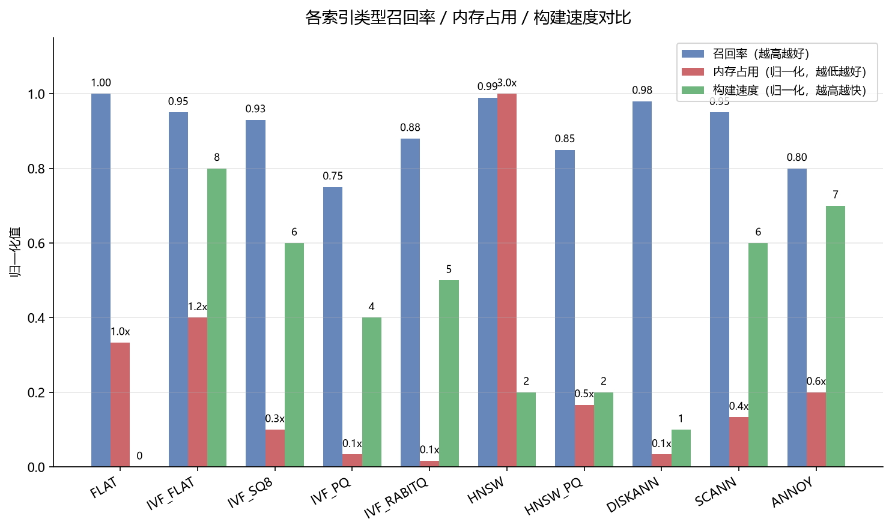
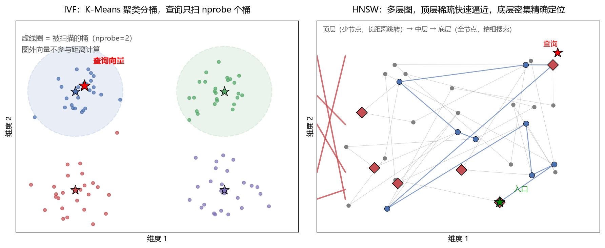

# 主流向量索引类型区别

## 这个文档是干嘛的

记录主流向量索引类型（FLAT、IVF、HNSW、PQ、SQ、DISKANN、SCANN、ANNOY、RaBitQ）的原理、优缺点和适用场景。供理解本次基准测试中不同库、不同索引类型表现差异的底层原因时参考。

## 总览

| 索引 | 原理 | 召回率 | 查询速度 | 内存占用 | 构建速度 | 适用数据规模 |
|---|---|---|---|---|---|---|
| FLAT | 暴力全表扫描 | 1.000 | 慢 | 低 | 无 | < 10 万 |
| IVF_FLAT | 聚类分桶 + 扫描部分桶 | 高 | 中 | 中 | 快 | 10 万 - 1000 万 |
| IVF_SQ8 | IVF + 标量量化（float32→uint8） | 较高 | 中 | 低 | 中 | 100 万 - 1 亿 |
| IVF_PQ | IVF + 乘积量化（高维→多段子向量编码） | 中 | 快 | 极低 | 慢 | > 1000 万 |
| IVF_RABITQ | IVF + 随机旋转 + 比特量化 | 较高 | 快 | 极低 | 中 | > 1000 万 |
| HNSW | 多层可导航小世界图 | 高 | 极快 | 高 | 慢 | 100 万 - 1 亿 |
| HNSW_PQ | HNSW + 乘积量化 | 中 | 快 | 中 | 慢 | 内存受限的大规模 |
| DISKANN | 磁盘优化的图索引（SSD） | 高 | 中 | 极低 | 慢 | > 1 亿 |
| SCANN | 各向异性量化 + 倒排 | 高 | 快 | 中 | 中 | 大规模、内存敏感 |
| ANNOY | 随机投影树 | 中 | 中 | 中 | 中 | 中等规模 |

*图 2 | 十种索引在三个维度的归一化对比。FLAT 召回最高但查询慢；HNSW 召回接近 FLAT 但内存是它的 3 倍；IVF_PQ 和 IVF_RABITQ 内存最低但召回有损失；DISKANN 内存和 FLAT 相当但查询快得多。没有一种索引在所有维度都最优，选型是在这三个维度之间做权衡。*

*图片来源：本文档作者用 matplotlib 自绘，数据来自本文档「公开 benchmark 参考数据」章节的定性归纳（高/中/低映射为归一化数值），非单一来源的实测数据。*

## 公开 benchmark 参考数据

以下数字来自公开测试，硬件和参数不同，绝对值不可跨来源比较，但相对关系有参考价值。

### Milvus 官方文档（1000 万向量数据集）

| 索引 | 参数 | QPS | Recall@90 |
|---|---|---|---|
| IVF_FLAT | nprobe=32 | 1,500 | 95% |
| HNSW | M=32 | 3,000 | 92% |

来源：Milvus 官方文档《索引调优黄金法则》（2026-09-05 检索）

### ann-benchmarks 改版压测（Top-10，并发 50）

| 索引 | QPS | P99 延迟 | 召回率@10 | 内存占用 |
|---|---|---|---|---|
| Faiss IVF_FLAT | 8,200 | 28ms | 99.1% | 38GB |
| HNSW + 标量量化 | 31,500 | 7ms | 95.8% | 14GB |

来源：CSDN《RAG 加速指南：Faiss / Milvus / Qdrant 向量库选型与调优》（2026-09-05 检索）

### 存储压缩倍数（相对原始向量的倍数）

| 索引 | 压缩倍数 | 召回率 |
|---|---|---|
| FLAT | 1x | 100% |
| IVF-Flat | 15x | 95% |
| IVF-PQ | 50x | 88% |
| HNSW | 40x | 97% |
| ScaNN | 55x | 96% |
| DiskANN | 35x | 94% |

来源：dev.to《向量数据库选型指南 2026》（2026-09-05 检索）

这些数字和本次基准的趋势一致：HNSW 召回高、QPS 高但内存大；IVF_PQ 压缩最狠但召回损失最大；IVF_FLAT 召回接近 FLAT 但 QPS 只有 HNSW 的四分之一。

不做任何近似，逐条计算查询向量与全部向量的距离，返回精确 top-k。

优点是召回率恒为 1.000，是评估其他索引精度的基准。缺点是计算量随数据量线性增长，百万级以上延迟不可接受。

本次基准中 sqlite-vec 0.1.9 走的就是 FLAT，11,293 条数据延迟 18.1ms，召回 1.000。

## IVF 系列（倒排文件索引）

核心思路是先用 K-Means 把向量空间聚成 `nlist` 个桶，查询时只扫描最近的 `nprobe` 个桶，而不是全量扫描。两个参数直接决定性能：`nlist` 越大分桶越细，`nprobe` 越大召回越高但越慢。

*图 1 | 左：IVF 通过 K-Means 把向量空间分成多个桶（彩色点），查询时只扫描离查询向量最近的 nprobe 个桶（虚线圈内的点），圈外的向量不参与距离计算。右：HNSW 构建多层图，顶层节点少、连接跨度大（红色菱形），用于快速逼近目标区域；底层包含全部节点（灰色小点），用于精细搜索。查询从顶层入口（绿色星号）逐层贪心下降。*

*图片来源：本文档作者用 matplotlib 自绘（合成示意数据，非真实数据集），生成脚本见 `docs/_figures/`。*

IVF 的变种通过量化压缩向量存储：

**IVF_SQ8** 把 float32 压成 uint8，存储省 4 倍，召回损失不到 2 个百分点。本次基准 Milvus IVF_SQ8 存储增量仅 0.27x（4.6MB），是存储效率最高的索引。

**IVF_PQ**（乘积量化）把高维向量切成多段子向量分别聚类，压缩比可达几十倍。代价是精度损失更大，本次基准 Milvus IVF_PQ 召回仅 0.390。

**IVF_RABITQ** 是 2024 年提出的新一代量化算法。先对向量做随机旋转（Random Rotation）让各维度分布更均匀，再把每个维度量化为 1 bit（只保留符号位），内存压缩到原始向量的 1/32，距离计算走位运算加速。由南洋理工大学与苏黎世联邦理工团队研发，SIGMOD 2024/2025 发表，已集成进 Milvus 和 FAISS。

## HNSW（分层可导航小世界图）

目前线上高并发场景的事实标准。构建多层图：顶层节点稀疏、连接跨度大，像高速公路快速逼近目标区域；底层包含全部节点、连接密集，做最终精确定位。查询从顶层入口逐层贪心下降。

三个关键参数：`M`（每个节点的最大邻居数，越大图越密、召回越高、内存越大）、`ef_construction`（建索引质量）、`ef_search`（查询深度）。

相比 IVF，HNSW 在高维场景召回率更稳、延迟抖动更小、动态增删改能力更强。代价是内存占用高、建索引慢。本次基准 Qdrant HNSW 存储净开销 296MB，是 Milvus 的 15.6 倍。

**HNSW_PQ** 是 HNSW 加乘积量化的组合，在图上做向量压缩。本次基准 LanceDB 的 HnswPq 召回只有 0.537，默认参数下量化误差压低了召回。

## DISKANN（磁盘图索引）

专为超大规模数据设计，把图索引存在 SSD 上而非内存。核心优化是减少磁盘随机 IO，通过 Vamana 图结构在 SSD 上实现高召回。

本次基准 Milvus DISKANN 构建时间 11.7 秒（最长），召回 0.989，存储净开销 4.9MB。适合数据量大到内存装不下的场景。

## SCANN（谷歌各向异性量化）

谷歌开源的向量索引，结合优化的倒排索引 + 乘积量化，引入查询分数感知量化和 SIMD 指令集加速。在精度（Recall 约 95%）和性能间取得平衡。

## ANNOY（随机投影树）

Spotify 开源的树索引。用随机超平面反复切割向量空间构建二叉树，查询时遍历树找最近叶节点。构建快、内存占用固定，但召回率中等，适合中等规模、对精度要求不极端的场景。

## 选型速查

| 场景 | 推荐索引 |
|---|---|
| < 10 万条，要精确结果 | FLAT |
| 10 万 - 100 万条，内存够 | HNSW |
| 100 万 - 1000 万条，内存够 | HNSW 或 IVF_FLAT |
| > 1000 万条，内存充裕 | HNSW 或 IVF_FLAT |
| > 1000 万条，内存受限 | IVF_SQ8 或 IVF_PQ |
| > 1 亿条，内存装不下 | DISKANN |
| 频繁增删改 | HNSW（动态图）或 IVF（追加式） |
| 追求极致压缩比 | IVF_PQ 或 IVF_RABITQ |

## 对基准测试的意义

本次基准只测了每个库的一到两种索引。不同索引类型的性能差异远大于同索引跨库的差异，选型时索引类型的选择比选哪个数据库更重要。如果要扩展测试维度，Milvus 和 LanceDB 还有大量未测的索引组合（IVF_SQ8、SCANN、DISKANN、IVF_RQ 等）。

## 来源

- 各库官方文档与源码（clone 于 2026-09-05，位置 `CodeProjects/_reference/projects/infra-and-backend/`）
- FAISS Wiki 与 RaBitQ 论文（SIGMOD 2024/2025）
- Milvus 官方文档《Index Explained》（2026-09-05 检索）
- JavaGuide《RAG 向量索引算法和向量数据库》（2026-09-05 检索）
- OceanBase 向量索引最佳实践（2026-09-05 检索）
