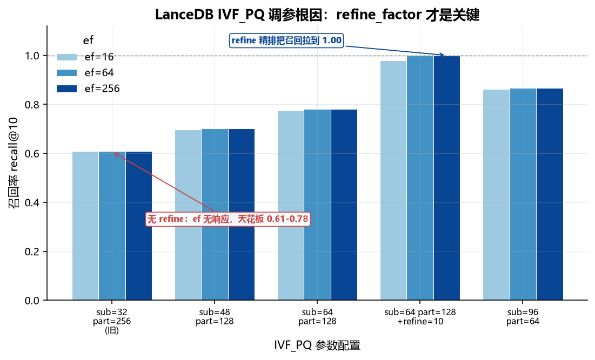

# 五库向量检索对比 · 真实数据版（2026-09-03）

**这个文档是干嘛的**：本实验第一次用**真实文本 embedding** 做的五库横评，是换真实数据后的第一版基准。它确立了「召回率基准是暴力精确 top-k、数据是 20 Newsgroups」这套口径，后续的索引矩阵基准是在它基础上扩展索引维度和存储记账。要看完整的索引 × 构建时间 × 存储三段拆分，看 `2026-09-04-真实数据-索引矩阵基准.md`。本文只测了单一索引（各库默认 HNSW），没有索引类型维度，也没有构建时间和存储分段。

**机器**：Windows 11，AMD Ryzen 9 5900HX（8 核 16 线程），64 GB 内存，全 CPU 推理无 GPU
**数据**：20 Newsgroups，all-MiniLM-L6-v2（384 维，max_seq 256，去邮件头截 1200 字符）
**规模**：train 11,293 篇入库，test 分层采样 40 条查询（20 类 × 2），k=10
**召回率基准**：暴力精确 top-k（L2）

上一版（`2026-09-03-随机向量专项测试.md`）用 768 维均匀随机向量，是 ANN 的最坏情况，召回绝对值全部失真（LanceDB 0.04）。本版换成有真实聚类结构的文本 embedding，五库召回率恢复正常，结论可信。

## 汇总

| 库 | 版本 | 写入 vec/s | ef=64 p50 | ef=64 召回 | ef=256 p50 | ef=256 召回 |
|---|---|---:|---:|---:|---:|---:|
| Qdrant | 1.19.0 | 1,608 | 5.7ms | **1.000** | 5.8ms | 1.000 |
| Milvus | v3.0.0 | 2,869 | 4.9ms | 0.988 | 5.8ms | 1.000 |
| SurrealDB | 3.2.4 | 714 | 6.1ms | 0.984 | 7.5ms | 0.9975 |
| LanceDB | 0.38.0 | **29,377** | 14.4ms | 1.000 | 20.6ms | 1.000 |
| sqlite-vec | 0.1.9 | **31,922** | 22.8ms | 1.000 | 22.0ms | 1.000 |

## ef 扫描（p50 毫秒 / 召回率）

| ef | Qdrant | Milvus | SurrealDB | LanceDB | sqlite-vec |
|---:|---|---|---|---|---|
| 64 | 5.7ms / 1.000 | 4.9ms / 0.988 | 6.1ms / 0.984 | 14.4ms / 1.000 | 22.8ms / 1.000 |
| 128 | 5.8ms / 1.000 | 5.0ms / 1.000 | 6.6ms / 0.9975 | 19.6ms / 1.000 | 22.8ms / 1.000 |
| 256 | 5.8ms / 1.000 | 5.8ms / 1.000 | 7.5ms / 0.9975 | 20.6ms / 1.000 | 22.0ms / 1.000 |

sqlite-vec 无 ANN 索引，是暴力全表扫描，ef 参数无效，延迟平坦是预期行为。

## 分组解读

### 标准 HNSW：Milvus、Qdrant、SurrealDB

三个库延迟都在 5-8ms，召回 ef=128 即到顶。差别在写入吞吐：Milvus 2869 vec/s，Qdrant 1608，SurrealDB 714。SurrealDB 落后是因为它是嵌入式 RocksDB 存储，走 HTTP `/sql` 端点批量插入，没有独立服务化组件做写入缓冲。

SurrealDB 的 ef=64 召回 0.984 略低于其余两个库，已知原因：它的向量存储截断 6 位小数，384 维下相对误差比 768 维更大。ef=128 时追平到 0.9975。

### IVF_PQ：LanceDB

LanceDB 是唯一用倒排文件加乘积量化的库。写入最快（29,377 vec/s），因为不需要构建 HNSW 图。查询慢一档（14-20ms），因为 PQ 粗排后还要按 `refine_factor=10` 拉回原始向量做精排。

召回高的代价是延迟：ef 从 64 到 256，延迟涨 40% 但召回不动（1.000 封顶），说明 IVF_PQ 的瓶颈是量化误差，不是 nprobes 不够。

### 暴力扫描：sqlite-vec

22.8ms 且完全平坦，1 万条 384 维的暴力扫描在可接受范围。超过 10 万条会线性劣化，规模上去后必须换 ANN 库。

## LanceDB 召回 0.04 的根因（已定位）

上一版 LanceDB 召回 0.04-0.05 且不随 ef 变化，曾怀疑是 adapter 实现错误。参数对照实验证明不是：

| IVF_PQ 参数 | ef=16 | ef=64 | ef=256 |
|---|---|---|---|
| sub=32 part=256（旧） | 0.608 | 0.608 | 0.608 |
| sub=48 part=128 | 0.696 | 0.702 | 0.702 |
| sub=64 part=128 | 0.774 | 0.780 | 0.780 |
| sub=64 part=128 + refine=10 | 0.980 | 1.000 | 1.000 |
| sub=96 part=64 | 0.862 | 0.866 | 0.866 |



*图 1 | LanceDB IVF_PQ 五组参数的召回率（ef=16/64/256 三档）。无 refine 时召回天花板 0.61–0.78 且 ef 无响应（nprobes 饱和，瓶颈在 PQ 量化精度）；加 refine_factor=10 精排后拉到 0.98–1.00。根因是缺 refine 精排，不是 sub-vectors / partitions 的大小。*

真实数据上旧参数就有 0.61 召回，不是 0.04。根因是**随机向量无聚类结构**：IVF 的聚类中心在均匀分布下失去意义，nprobes 覆盖率与召回脱钩，加上 768 维 sub=32 的 PQ 量化误差，两者叠加把召回压到 0.04。

同一次实验还暴露一个真实缺陷：旧参数下 ef 从 16 到 256 召回完全不变，说明 nprobes 已饱和但天花板只有 0.61，瓶颈在 PQ 量化精度。加 `refine_factor` 精排后拉到 0.98-1.00，这是 LanceDB 官方推荐用法。

## 测试过程记录

### Embedding 生成

- 模型 all-MiniLM-L6-v2 本地加载，384 维 float32
- 本机 CPU 推理速度是决定性约束：`max_seq_length=512` 时 11-14 docs/s，全集要 28 分钟；改 256 后 40 docs/s，全集 6.7 分钟。384 反而只有 18 docs/s（padding 到 384 更浪费），不是线性关系
- 必须去掉邮件头：20 Newsgroups 的 header（From/Subject/Organization）占前几百 token，不剥掉会把正文挤出 256 token 窗口
- train 11,293 篇 + test 600 篇（每类 30），npz 17MB

### 已知遗留问题

- 向量范数均值 1.89，未做归一化。如果后续要换余弦相似度语义，需要重跑 embedding
- SurrealDB 6 位小数截断在 384 维上比 768 维影响更大（相对误差随维度数上升），ef=64 的 0.984 部分源于此
- LanceDB 的 refine 精排与其余四库的纯 HNSW 不同构，延迟对比需单列标注

## 复现

```bash
# 1. 生成 embedding（约 7 分钟）
./.venv/Scripts/python.exe scripts/gen_emb.py

# 2. LanceDB 参数对照实验（可选，验证根因）
./.venv/Scripts/python.exe scripts/probe_lance.py

# 3. 五库对比
./.venv/Scripts/python.exe scripts/multi_bench.py --real --only surreal
./.venv/Scripts/python.exe scripts/multi_bench.py --real --only milvus qdrant lance sqlite
```

结果文件：`results/multi-real-20news-*.json`
