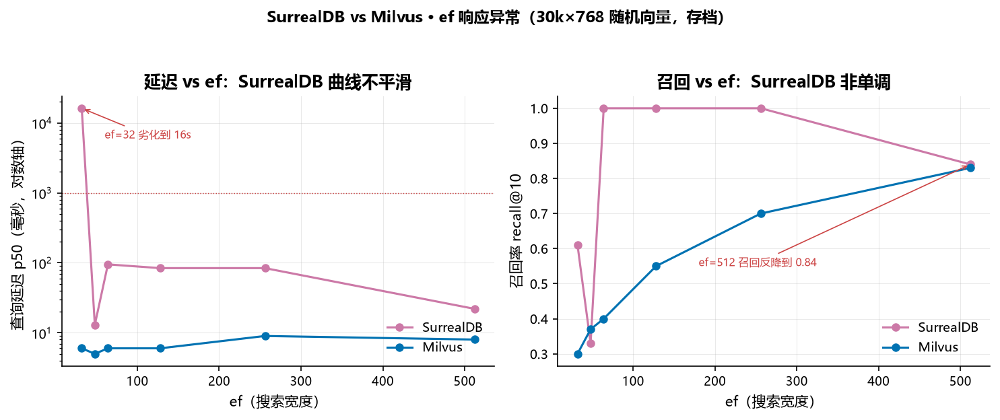

# 随机向量专项测试 · 合成数据探底（2026-09-03）

**这个文档是干嘛的**：记录本实验最早用**合成随机向量**做的一批探底测试。它和真实数据报告是两套独立的数据，结论不能混用。留档的目的是两个：一是在换真实数据之前验证测试脚本能跑通、暴露各库的接入问题；二是用「ANN 最坏情况」观察每个库的 ef 响应下限。要性能结论和选型建议，看 `2026-09-04-真实数据-索引矩阵基准.md`，不要引用本文的数字。

**机器**：Windows 11，AMD Ryzen 9 5900HX（8 核 16 线程），64 GB 内存，无 GPU
**日期**：2026-09-03
**数据**：30,000 条 768 维 float32 均匀随机向量（`default_rng(0)`），50 条随机查询（`default_rng(99)`），k=10
**召回率基准**：暴力精确 top-k（L2）

**为什么召回率绝对值都失真**：768 维均匀随机向量各向同性、没有聚类结构，是 ANN 的最坏情况。任何基于空间划分或近邻图的索引都无从下手，召回率天然偏低。这份数据的价值不在绝对值，在于看每个库 ef 调参的响应曲线和实现是否正常。LanceDB 在这里只有 0.04 召回，就是被这种数据打回原形。

## 一、五库横评

| 库 | 版本 | 写入 vec/s | ef=64 p50 | ef=64 召回 | ef=256 p50 | ef=256 召回 |
|---|---|---:|---:|---:|---:|---:|
| LanceDB | 0.38.0 | **14,325** | 8ms | 0.040 | 14ms | 0.044 |
| Milvus | v3.0.0 | 4,885 | **5ms** | 0.410 | 9ms | 0.704 |
| sqlite-vec | 0.1.9 | 4,192 | 88ms | **1.000** | 89ms | 1.000 |
| Qdrant | 1.19.0 | 1,093 | 8ms | 0.814 | 9ms | 0.980 |
| SurrealDB | 3.2.4 | 421 | 74ms | 1.000 | 74ms | 1.000 |

ef 扫描（p50 毫秒 / 召回率）：

| ef | Milvus | Qdrant | LanceDB | sqlite-vec | SurrealDB |
|---:|---|---|---|---|---|
| 64 | 7ms / 0.410 | 8ms / 0.814 | 8ms / 0.040 | 88ms / 1.000 | 74ms / 1.000 |
| 128 | 8ms / 0.562 | 8ms / 0.926 | 10ms / 0.044 | 91ms / 1.000 | 77ms / 1.000 |
| 256 | 9ms / 0.704 | 9ms / 0.980 | 14ms / 0.044 | 89ms / 1.000 | 74ms / 1.000 |

按实现形态分三组看。

**标准 HNSW：Milvus 与 Qdrant**。召回率随 ef 单调上升，延迟基本不变，是教科书曲线。随机数据的低召回是数据本身造成的，ef 给到 256 时 Qdrant 到 0.98、Milvus 到 0.70。Qdrant 召回更高不必然是实现优劣，两边 HNSW 参数（M、efConstruction）和建图过程不同，默认图质量在这份数据上 Qdrant 更好。延迟 Milvus 略快 1-2ms，写入 Milvus 快（4,885 vs 1,093 vec/s）。

**LanceDB：召回崩了，索引没在工作**。写入 14,325 vec/s 是全部库最快，但召回率只有 0.04 且 ef 从 64 到 256 几乎不变（0.040 → 0.044）。这个数字意味着 IVF_PQ 索引查询结果近乎随机。按 nprobes 语义，ef=256 对应 256 个探测分区，30k 数据配 256 分区理论上应扫到大部分数据。0.04 说明索引构建或查询参数有问题，需在调参层面继续查，当前数据不能代表 LanceDB 真实能力。后来换真实数据、用 `probe_lance.py` 调参后才恢复正常（见真实数据报告）。

**sqlite-vec 与 SurrealDB：召回满分但那是暴力扫描**。两者召回 1.000 且 ef 无响应。原因相同，它们在这个测试里实际走暴力全表扫描。sqlite-vec 的 vec0 虚拟表默认就是暴力 KNN；SurrealDB 的 ef 无响应是它的 HNSW 实现异常（见下节深潜）。延迟 sqlite-vec 88ms、SurrealDB 74ms 接近，考虑到都是暴力扫描，88ms 扫 30k 条 768 维约 2300 万次距离计算，合理。

## 二、双库深潜：SurrealDB vs Milvus

这一节只比两个库，但 ef 扫得更密、写入分析得更细，用来定位 SurrealDB 的向量实现问题。

**汇总**（都 HNSW，M=16，efConstruction=200）：

| 指标 | SurrealDB 3.2.4 | Milvus v3.0.0 | 倍数 |
|------|----------------:|--------------:|-----:|
| 写入吞吐 | 407 vec/s | 3,938 vec/s | **9.7×** |
| 查询 p50（ef=64） | 95 ms | 6 ms | **16×** |
| 查询 p50（ef=128） | 84 ms | 6 ms | **14×** |
| 查询 p50（ef=512） | 22 ms | 8 ms | 2.8× |
| 召回率（ef=512） | 0.84 | 0.83 | 持平 |

ef 扫描（p50 毫秒 / 召回率）：

| ef | SurrealDB p50 | SurrealDB recall | Milvus p50 | Milvus recall |
|---:|--------------:|-----------------:|-----------:|--------------:|
| 32 | **16,210** | 0.61 | 6 | 0.30 |
| 48 | 13 | 0.33 | 5 | 0.37 |
| 64 | 95 | 1.00 | 6 | 0.40 |
| 128 | 84 | 1.00 | 6 | 0.55 |
| 256 | 84 | 1.00 | 9 | 0.70 |
| 512 | 22 | 0.84 | 8 | 0.83 |

两个现象值得单独说，画成曲线更清楚：



*图 1 | SurrealDB 与 Milvus 在 30k×768 随机向量上的 ef 响应。左：SurrealDB 延迟非单调（ef=32 劣化到 16s，ef=512 反降到 22ms），Milvus 平稳 5–9ms；右：SurrealDB 召回非单调（ef=64 即 1.00，ef=512 反降到 0.84），Milvus 单调上升。两条曲线印证正文判断：SurrealDB 的 ef 参数没有按预期控制搜索宽度。*

两个现象值得单独说。

**SurrealDB 的 ef 曲线不平滑且不单调**。ef=64 到 256 延迟恒定 84-95ms，ef=512 反而降到 22ms。正常 HNSW 应该 ef 越大越慢。ef=32 直接劣化到 16 秒。这说明它的 ef 参数没有按预期控制搜索宽度，存在实现层面的异常。

**两边召回率都低但原因不同**。Milvus 召回率随 ef 单调上升（0.30 → 0.83），是标准 HNSW 的精度-延迟权衡。SurrealDB 在 ef=64 就到 1.00，然后 ef=512 掉到 0.84，这条曲线不可能是同一个算法的输出。随机数据本身召回率不高正常，但 SurrealDB 的非单调性不正常。

**写入吞吐的 9.7 倍有相当部分来自 SurrealDB 的服务端限制而非引擎本身**。SurrealDB 侧试过三种写法：逐条 `CREATE` 拼 SQL 文本最慢且超线性恶化；改用 `INSERT INTO vec $rows` 参数化后 5000 条一批 8.8 秒，但 4000 条以上会被 HTTP 层以 413 Payload Too Large 拒收；最终用 WS 加内联数组、每批 400 条，才拿到 407 vec/s。Milvus 侧 5000 条一批直接 insert 即可。所以写入差距要看成受限条件下的下限。

**真正需要注意的是 ef=32 的 16 秒**。这不是「慢」，是劣化到不可用。如果生产环境有低 ef 配置（追求极致延迟、接受低召回），SurrealDB 3.2.4 在这条路径上有严重问题。召回率方面两者在 ef=512 持平（0.84 vs 0.83），精度上限没有代差，但 SurrealDB 的 ef-召回曲线不单调，无法预测调参效果，这是工程上的实际障碍。

## 三、这次专项暴露的实现问题

这批合成数据测试最大的价值是暴露了四个实现层面的问题，后来都影响了真实数据测试的设计。

**Milvus 的索引必须在数据写入之后创建**。在 `setup()` 里先建索引、之后写入数据，会让 `describe_index` 永久停在 `InProgress` 且 `pending_index_rows` 等于全部行数，查询打在半成品索引上。实测召回率从 0.53 崩到 0.23，且 ef 完全无响应，症状和 AUTOINDEX 降级几乎一样，极易误判。区分方法：AUTOINDEX 看 `describe_index` 的 `index_type` 字段；索引未建成看 `state` 和 `pending_index_rows`。`index_bench.py` 的 `MilvusAdapter` 因此把建索引放在 `write()` 之后的 `build_index()`。

**LanceDB 的 IVF_PQ 在随机数据上召回 0.04**，索引基本没工作，必须在真实数据上重新调参（sub-vectors / partitions / refine_factor）才能评估。

**sqlite-vec 的 vec0 默认暴力 KNN**，没有 ANN。ef 参数无效、延迟恒定，召回恒 1.000 因为是精确扫描。它的定位是小规模本地暴力检索，不是近似最近邻引擎。

**SurrealDB 的 ef 参数不控制搜索宽度**，曲线非单调，调参不可预测。这是它的 HNSW 实现异常，不是数据问题。

## 四、选型判断

合成数据下的方向性结论：要性能选 Milvus 或 Qdrant，两者标准 HNSW、ef 可预测，Qdrant 召回更高、Milvus 写入更快。sqlite-vec 的价值在部署成本（一个 SQLite 文件、零服务、pip 装完就用），万级以下向量的本地工具合适，30k 已到 88ms。SurrealDB 在向量这一维没有竞争力，它的价值在多模型的图和文档能力。LanceDB 写入速度惊人但召回需重测。

这些判断在真实数据上基本成立，但具体数字一概以真实数据报告为准。

## 五、复现

```bash
# 五库横评（30k, 768 维随机）
./.venv/Scripts/python.exe scripts/multi_bench.py --n 30000 --dim 768 --rounds 3

# 双库深潜（Surreal vs Milvus）
./.venv/Scripts/python.exe scripts/final_bench.py   # 已被 index_bench.py --synthetic 取代
./.venv/Scripts/python.exe scripts/index_bench.py --synthetic

# 单库
./.venv/Scripts/python.exe scripts/multi_bench.py --only milvus
```

原始数据在 `results/multi-*.json`、`results/bench-*.json`。`index_bench.py --synthetic` 是后来统一的合成数据入口（30,000 × 768），与本文数据一致。
