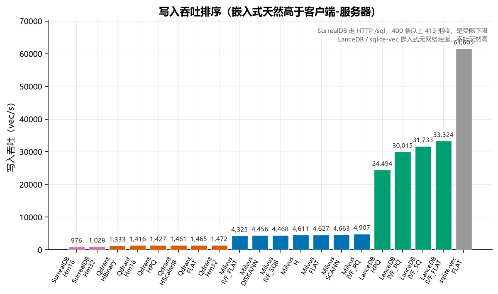
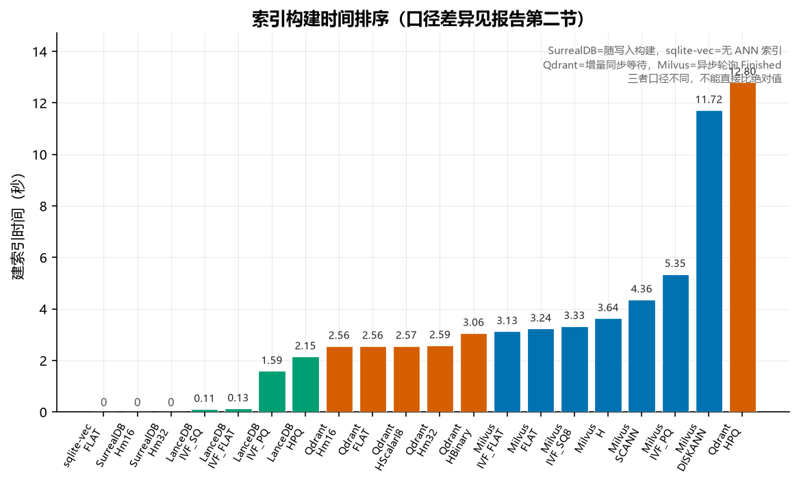
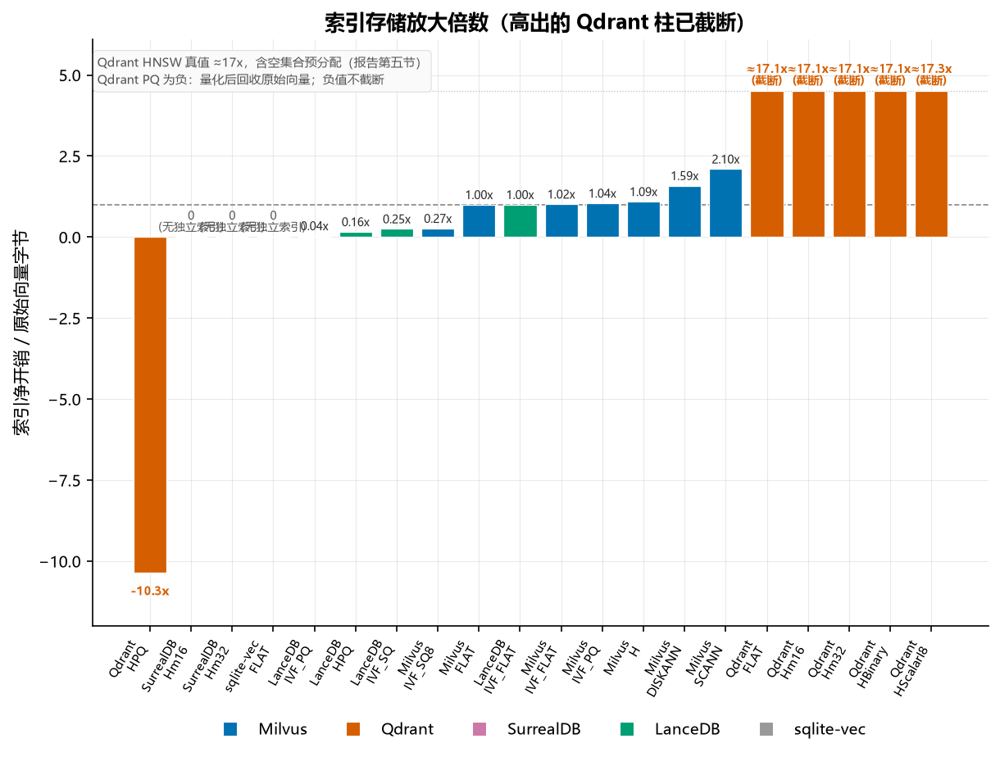
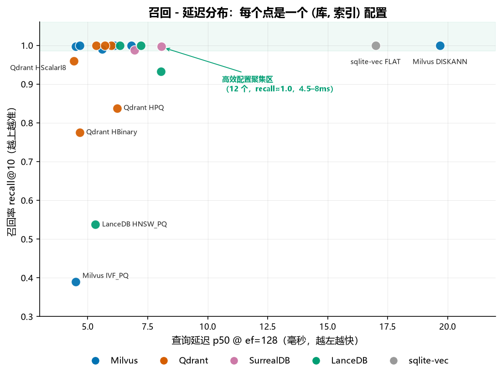

# 向量库索引矩阵基准 · 索引类型 × 构建时间 × 存储分段（2026-09-04）

**这个文档是干嘛的**：本实验的**主报告**，也是唯一用真实数据、覆盖「索引类型 × 构建时间 × 存储三段拆分」全维度的报告。它回答的是：同一份真实数据上，每个库它实际支持的每种索引，分别要花多久建、查多快、召回多少、落盘占多少（拆成向量 / 正文 / 索引三段）。选型建议和完整存储分解都在这里。

**它在实验序列里的位置**：`2026-09-03-随机向量专项测试.md` 用合成随机数据探底（结论失真，仅留档），`2026-09-03-真实数据-五库对比.md` 是换真实数据后的第一版（只测单一默认索引）。本报告在后者基础上把索引维度、构建时间、存储记账全部补全，是当前唯一应被引用的性能与存储结论来源。

**机器**：Windows 11，AMD Ryzen 9 5900HX（8 核 16 线程），64 GB 内存，全 CPU 无 GPU
**数据**：20 Newsgroups，all-MiniLM-L6-v2，384 维 float32；train 11,293 篇入库，test 分层采样 40 条查询（20 类 × 2），k=10
**被测版本**：Milvus v3.0.0（Docker standalone，pymilvus 3.0.1）/ Qdrant 1.19.0 / SurrealDB 3.2.4（Windows 原生）/ LanceDB 0.38.0 / ChromaDB 1.5.9 / sqlite-vec 0.1.9
**召回率基准**：暴力精确 top-k（L2）
**原始向量字节**：11,293 × 384 × 4 = 17.3 MB

这份报告补上 `multi_bench.py` 缺的三块：索引类型维度、索引构建时间、存储分段记账。脚本是 `scripts/index_bench.py`，按 (库 × 索引类型) 两重循环跑，结果在 `results/indexbench-real-20news-20260904-151957.json`。文本存储成本单独用 `--text-storage` 测，结果在 `results/textbench-*.json`。

环境搭建与复现步骤看 `环境搭建.md`。跑分过程中踩的坑、测错的根因、被推翻的文档说法，统一记在 `docs/调试与排错记录.md`，本报告只给结论。

## 一、同索引跨库对比

同一索引机制在不同库的实现差异，这是本次基准的主要目的。

### HNSW：Milvus、Qdrant、SurrealDB、LanceDB、ChromaDB

| 库 | 写入 vec/s | 建索引 s | ef=64 p50 | ef=64 召回 | ef=256 p50 | ef=256 召回 | 索引净开销 |
|---|---:|---:|---:|---:|---:|---:|---:|
| Milvus HNSW | 4,611 | 3.64 | 4.1ms | 0.985 | 5.2ms | 0.998 | +19.0MB |
| Qdrant HNSW m=16 | 1,416 | 2.56 | 5.0ms | 1.000 | 5.9ms | 1.000 | +296.0MB |
| ChromaDB HNSW | 4,975 | 0.00 | 1.6ms | 0.585 | 2.3ms | 0.585 | +0.0MB |
| LanceDB HnswPq | 24,494 | 2.15 | 5.0ms | 0.538 | 5.0ms | 0.537 | +2.8MB |
| SurrealDB HNSW m=16 | 976 | 0.00 | 5.8ms | 0.978 | 7.9ms | 0.990 | +0.0MB |

ChromaDB 的召回率恒为 0.585，不随 ef 变化（ef=64/128/256 结果相同）。原因是 ChromaDB 的 HNSW ef 参数在查询时不接受运行时调整，metadata 里的 `hnsw:search_ef` 未显式设置时用默认值，ef 参数被忽略。延迟 1.6ms 是六个库中最快的，但低召回说明 HNSW 图质量或搜索宽度不足，需要调参才能和其余库并列比较。

ChromaDB 的索引净开销 0.0MB 和 SurrealDB 同理：HNSW 索引在写入时随数据一起构建，没有独立的建索引阶段，索引成本已算进数据那 31.1MB 里。

查询延迟四个库挤在 4-8ms，差距不大。真正的分化在写入吞吐和存储。

写入吞吐差 25 倍，从 sqlite-vec 的 61,605 vec/s 到 SurrealDB 的 976 vec/s。这个差距不能全归给引擎：SurrealDB 走 HTTP `/sql` 端点批量插入，400 条以上会被 413 拒收，这个数字是受限条件下的下限。LanceDB 和 sqlite-vec 是嵌入式库，没有网络往返，吞吐天然高。

存储差 15 倍。Qdrant 的 HNSW 索引净开销 296.0MB，是 Milvus 的 15.6 倍。原因是 Qdrant 的空 collection 就预分配了 352.6MB 的 HNSW 图结构（详见第五节），Milvus 的索引是写入后按需构建的。

LanceDB 的 HnswPq 召回只有 0.537，不能和其余三个库并列。它是 HNSW 加乘积量化的组合，默认参数下量化误差压低了召回，需要单独调参才具备可比性。

SurrealDB 的索引净开销 0.0MB 也不是它不占空间。它的 HNSW 索引在 `DEFINE INDEX` 时就随写入一起建了，没有独立的建索引阶段，所以「建索引后减写入后」恒为零，索引成本已经算进了数据那 129.6MB 里。这一项在表里单列说明，不参与跨库存储对比。

### IVF_PQ：Milvus、Qdrant、LanceDB

| 库 | 写入 vec/s | 建索引 s | ef=64 p50 | ef=64 召回 | 索引净开销 |
|---|---:|---:|---:|---:|---:|
| Milvus IVF_PQ | 4,907 | 5.35 | 4.3ms | 0.390 | +18.1MB |
| Qdrant HNSW_PQ | 1,427 | 12.80 | 6.3ms | 0.838 | -179.5MB |
| LanceDB IvfPq | 30,015 | 1.59 | 7.7ms | 0.932 | +0.7MB |

三者的召回不可直接比，因为 PQ 的分段数不同：Milvus 用 `m=8`（384 维 → 48 维/段），LanceDB 用 `num_sub_vectors=64`，Qdrant 用 `x16` 压缩比。参数不同构，表里列出是为了说明「同名索引，实现和默认参数都不同」。

Milvus IVF_PQ 的召回 0.390 明显偏低。`m=8` 对 384 维来说分段太粗，量化误差大。这个参数不是最优配置，列出来是为了记录，不是推荐值。

Qdrant 的索引净开销 -179.5MB 是负数，因为它做量化后把原始向量从落盘里移除了（量化向量足以应答查询），总量反而下降。这是量化的正常收益。

### FLAT（暴力）与倒排：各库独有索引

| 库 | 索引 | 写入 vec/s | 建索引 s | ef=64 p50 | 召回 | 索引净开销 |
|---|---|---:|---:|---:|---:|---:|
| Milvus FLAT | 无索引 | 4,627 | 3.24 | 7.1ms | 1.000 | +17.3MB |
| Milvus IVF_FLAT | 倒排 | 4,325 | 3.13 | 6.1ms | 1.000 | +17.6MB |
| Milvus IVF_SQ8 | 倒排+标量量化 | 4,468 | 3.33 | 5.2ms | 0.990 | +4.6MB |
| Milvus SCANN | 各向异性量化 | 4,663 | 4.36 | 4.6ms | 1.000 | +36.4MB |
| Milvus DISKANN | 磁盘图索引 | 4,456 | 11.72 | 13.0ms | 0.995 | +27.5MB |
| Qdrant FLAT (m=0) | 无索引 | 1,465 | 2.56 | 5.4ms | 1.000 | +295.8MB |
| Qdrant HNSW_ScalarI8 | HNSW+INT8 | 1,461 | 2.57 | 4.8ms | 0.960 | +300.3MB |
| Qdrant HNSW_Binary | HNSW+二值量化 | 1,333 | 3.06 | 4.7ms | 0.775 | +296.7MB |
| LanceDB IvfFlat | 倒排 | 33,324 | 0.13 | 6.3ms | 1.000 | +17.4MB |
| LanceDB IvfSq | 倒排+标量量化 | 31,733 | 0.11 | 7.2ms | 1.000 | +4.4MB |
| sqlite-vec FLAT | 无索引 | 61,605 | 0.00 | 18.1ms | 1.000 | +0.0MB |

Milvus 的 IVF_SQ8 是这批里存储效率最高的 ANN 索引：索引只多占 4.6MB（原始向量 17.3MB 的 27%），召回 0.990，查询 5.2ms。标量量化把 float32 压成 int8，精度损失很小。

LanceDB 的 IvfSq 同构，索引也只多占 4.4MB，召回 1.000，查询 7.2ms。两者可比，LanceDB 的召回略高但延迟略高。

Milvus 的 DISKANN 是这批里唯一查询随 ef 显著变慢的（13.0 → 35.0ms），其余索引的 ef 曲线基本平坦。DISKANN 是为磁盘设计的图索引，search_list 参数控制搜索宽度，对 ef 的响应符合预期。它的建索引时间 11.72s 也是最长的，是其余 Milvus 索引的 3 倍。

把写入吞吐按降序画出来，梯队差异比表格更直观：



*图 1 | 写入吞吐（vec/s）降序。嵌入式库 LanceDB、sqlite-vec 无网络往返稳居第一梯队（24k–61k）；客户端-服务器库 Milvus、Qdrant 居中（1.3k–4.9k）；SurrealDB 走 HTTP /sql 且受 413 限制垫底。同库内不同索引的吞吐差异远小于跨库差异，说明瓶颈在客户端-服务器往返而非索引机制本身。*

## 二、索引构建时间

| 索引 | 建索引时间 |
|---|---:|
| LanceDB IvfFlat | 0.13s |
| LanceDB IvfSq | 0.11s |
| SurrealDB HNSW | 0.00s（随写入构建，无独立阶段） |
| sqlite-vec | 0.00s（无索引） |
| LanceDB IvfPq | 1.59s |
| LanceDB HnswPq | 2.15s |
| Qdrant HNSW 系列 | 2.56-3.06s |
| Milvus FLAT | 3.24s |
| Milvus IVF_FLAT | 3.13s |
| Milvus IVF_SQ8 | 3.33s |
| Milvus IVF_PQ | 5.35s |
| Milvus SCANN | 4.36s |
| Milvus HNSW | 3.64s |
| Qdrant HNSW_PQ | 12.80s |
| Milvus DISKANN | 11.72s |

三类行为要分开看。

Milvus 的所有索引都在 3-6s，只有 DISKANN 到 11.72s。这个时间包含 `create_index` 返回后的异步等待：Milvus 3.0 的索引构建是异步的，必须轮询 `describe_index` 到 `state=Finished` 且 `pending_index_rows=0`，否则查询打在半成品索引上。FLAT 没有真正的构建工作，那 3.24s 基本是加载和落盘的固定开销。

Qdrant 的 HNSW 系列在 2.56-3.06s，但这不是「建索引」时间。Qdrant 的 HNSW 随写入增量构建，`create_collection` 时图参数已定。这里测的是等待索引追上写入进度（`indexed_vectors_count` 达到 `points_count`）的时间，本质是同步等待，不是构建耗时。与 Milvus 的构建时间不可直接比。

SurrealDB 恒为 0.00s，因为 `DEFINE INDEX` 在建表语句里就执行了，索引随数据写入一起构建，没有独立阶段。



*图 2 | 索引构建时间（秒）升序。Milvus 全系 3–6s（异步轮询 Finished 口径），DISKANN 11.7s 最长；Qdrant 2.6–12.8s（增量同步等待口径）；SurrealDB、sqlite-vec 为 0（随写入构建 / 无 ANN 索引）。三者口径不同，柱高只可在同口径内比较，不能跨口径比绝对值。*

## 三、存储分段记账

每个 (库, 索引) 组合记录三个时点的落盘字节数。原始向量理论字节 17.3MB。

| 库 | 索引 | 空库 | 写入后 | 建索引后 | 数据增量 | 索引增量 | 总倍数 |
|---|---|---:|---:|---:|---:|---:|---:|
| Milvus | FLAT | 0.0 | 17.5MB | 34.8MB | +17.5MB | +17.3MB | 2.01x |
| Milvus | IVF_FLAT | 0.0 | 34.8MB | 34.8MB | +34.8MB | +0.0MB | 2.01x |
| Milvus | IVF_SQ8 | 0.0 | 34.8MB | 34.8MB | +34.8MB | -30.2MB | 2.01x |
| Milvus | IVF_PQ | 0.0 | 17.5MB | 35.6MB | +17.5MB | +18.1MB | 2.05x |
| Milvus | HNSW | 0.0 | 34.8MB | 53.8MB | +34.8MB | +19.0MB | 3.10x |
| Milvus | DISKANN | 0.0 | 34.8MB | 62.3MB | +34.8MB | +27.5MB | 3.59x |
| Milvus | SCANN | 0.0 | 17.4MB | 53.8MB | +17.4MB | +36.4MB | 3.10x |
| Qdrant | HNSW m=16 | 352.6MB | 621.2MB | 917.2MB | +268.6MB | +296.0MB | 52.9x |
| Qdrant | HNSW m=32 | 352.6MB | 621.2MB | 917.2MB | +268.6MB | +296.0MB | 52.9x |
| Qdrant | FLAT | 352.6MB | 621.2MB | 917.0MB | +268.6MB | +295.8MB | 52.9x |
| Qdrant | HNSW_ScalarI8 | 352.6MB | 621.2MB | 921.5MB | +268.6MB | +300.3MB | 53.2x |
| Qdrant | HNSW_PQ | 352.6MB | 621.1MB | 441.6MB | +268.6MB | -179.5MB | 25.5x |
| Qdrant | HNSW_Binary | 352.6MB | 889.6MB | 1186.3MB | +537.0MB | +296.7MB | 68.5x |
| SurrealDB | HNSW m=16 | 0.0 | 129.6MB | 129.6MB | +129.6MB | +0.0MB | 7.47x |
| SurrealDB | HNSW m=32 | 0.0 | 126.7MB | 126.7MB | +126.7MB | +0.0MB | 7.31x |
| LanceDB | IVF_PQ | 0.0 | 17.4MB | 18.1MB | +17.4MB | +0.7MB | 1.04x |
| LanceDB | IVF_FLAT | 0.0 | 17.4MB | 34.8MB | +17.4MB | +17.4MB | 2.00x |
| LanceDB | IVF_SQ | 0.0 | 17.4MB | 21.8MB | +17.4MB | +4.4MB | 1.25x |
| LanceDB | HNSW_PQ | 0.0 | 17.4MB | 20.2MB | +17.4MB | +2.8MB | 1.17x |
| sqlite-vec | FLAT | 0.0 | 19.2MB | 19.2MB | +19.2MB | +0.0MB | 1.10x |

数据增量是写入后减空库，索引增量是建索引后减写入后。总倍数是建索引后总量除以原始向量字节 17.3MB。

数据增量目前只含「向量 + pk」。真实部署还要存正文文本，这块单列在下面「文本存储增量」。

Milvus 的 IVF_SQ8 索引增量为负（-30.2MB），因为写入阶段先落盘 float32 原始向量，建索引时量化成 int8 并把原始向量回收了，净效果是总量下降。Milvus IVF_FLAT 的索引增量为 0.0MB 同理：写入时就把向量落盘了，建倒排索引只是加了个映射表，增量小于测量精度。

LanceDB 全程最省。IVF_PQ 总倍数 1.04x，写入 17.4MB（等于原始向量），建索引只多 0.7MB。它是列式存储，向量按段紧凑排列，没有每记录的行头开销。

SurrealDB 的 7.47x 来自 RocksDB 的 LSM 树开销。它把每条记录的整个文档（含 `pk`、`emb` 数组、索引项）当 value 存，11,293 条就有 11,293 个 RocksDB entry，每个都带 key 前缀和 WAL 记录。这是通用文档数据库存向量的固有代价，不是向量索引本身的开销。（RocksDB 与 LSM 树的机制已迁往配套知识库《B+树与 LSM-tree 成本模型》）

把「索引净开销 ÷ 原始向量」即存储放大倍数画出来，能直接看出各索引的空间代价梯队：



*图 3 | 索引存储放大倍数（建索引后净增量 ÷ 原始向量 17.3MB）。量化压缩类（Milvus IVF_SQ8 0.27x、LanceDB IVF_SQ 0.25x / IVF_PQ 0.04x）低于 0.3x 最省；倒排与 HNSW 在 1.0–2.1x；Qdrant HNSW 真值 ≈17x（含空集合预分配，图中截断到 4.5x）；Qdrant PQ 为负（量化后回收原始向量）；SurrealDB、sqlite-vec 无独立索引增量为 0。*

### 文本存储增量（A/B 实测）

上面「数据增量」只含向量加 pk。真实 RAG 场景每篇还要存正文，这块用 `--text-storage` 单独测：同一索引下跑两轮，一轮只写向量加 pk，一轮再加 20news 正文（原始 9.6MB UTF-8，均值 850 字符），两轮落盘差就是文本增量。向量加 pk 那一轮的读数与上表数据增量一致（Qdrant 268.6MB、LanceDB 17.4MB、sqlite-vec 19.2MB 全部吻合），说明 A/B 干净。

| 库 | 索引 | 向量+pk | +文本 | 文本增量 | 原始文本 | 比值 |
|---|---|---:|---:|---:|---:|---:|
| Milvus | FLAT | 17.4MB | 20.8MB | +3.4MB | 9.6MB | 0.35x |
| Qdrant | FLAT | 268.6MB | 268.6MB | 0.0MB | 9.6MB | 0.00x* |
| SurrealDB | HNSW_m16 | 129.8MB | 143.8MB | +14.0MB | 9.6MB | 1.46x |
| LanceDB | IVF_PQ | 17.4MB | 23.3MB | +6.0MB | 9.6MB | 0.62x |
| sqlite-vec | FLAT | 19.2MB | 30.6MB | +11.5MB | 9.6MB | 1.20x |

比值是落盘增量除以原始文本字节。小于 1 说明库压缩了文本，大于 1 说明有每记录的行头或文档结构开销。

Milvus 的 0.35x 是 VARCHAR 压缩，不是截断。抽 3 条文本灌进去再读回，620/675/1200 字符全部逐字命中，存储完整。Qdrant 的 0.00x 是测量口径的产物，不是文本免费，见下。SurrealDB 的 1.46x 是 RocksDB 把整篇文档当 value 存的固有开销，与它向量那 7.47x 同源。LanceDB 列式压缩把 9.6MB 压到 6.0MB。sqlite-vec 按行原样存，1.20x 是 SQLite 行开销。

**Qdrant 的 0.0MB 必须单列解释。** Qdrant 把 payload 存在固定大小的预分配页里（实测单页 33.55MB，11,293 条时 payload 区预分配 268MB），文本写进去能正常读回，但落在预分配的余量里，文件大小不增长，`dir_bytes` 量的是已分配容量不是已用字节，所以看不到。灌 90MB 文本进去落盘依然不变，读回正常。结论：Qdrant 的文本成本被预分配掩盖，真实值大于 0，但受制于按点数的固定页预分配，无法用文件大小差分测出。要精确测 Qdrant 文本成本得读页内已用字节，本次没做。跨库比文本成本时，Qdrant 这行只能当「下界，实际更高」，不能当 0。

### 三段拆分总览

把上表的数据增量、文本增量、索引增量（第三节表里的「索引增量」列）合起来，就是「向量 + 文本 + 索引」的完整落盘分解。取各库的基线索引：

| 库 | 向量+pk | 文本 | 索引 | 带文本后建索引总量 |
|---|---:|---:|---:|---:|
| Milvus FLAT | 17.4MB | 3.4MB | +17.3MB | ~38MB |
| Qdrant FLAT | 268.6MB | 0.0MB* | +295.8MB | ~564MB |
| SurrealDB HNSW_m16 | 129.8MB | 14.0MB | +0.0MB | ~144MB |
| LanceDB IVF_PQ | 17.4MB | 6.0MB | +0.7MB | ~24MB |
| sqlite-vec FLAT | 19.2MB | 11.5MB | +0.0MB | ~31MB |

SurrealDB 和 sqlite-vec 的索引增量为 0，前者索引随写入建、后者没有 ANN 索引，成本已含在各自的数据增量里。Qdrant 带 * 的文本按上段说明按下界读。这组数字回答「每库完整存一批 384 维向量加正文加索引要占多少盘」。

## 四、ef 扫描

延迟单位毫秒，斜杠后是召回率。

| 库 | 索引 | ef=64 | ef=128 | ef=256 |
|---|---|---|---|---|
| Milvus | HNSW | 4.1 / 0.985 | 4.5 / 0.998 | 5.2 / 0.998 |
| Milvus | IVF_FLAT | 6.1 / 1.000 | 6.1 / 1.000 | 6.2 / 1.000 |
| Milvus | IVF_SQ8 | 5.2 / 0.990 | 5.6 / 0.990 | 5.6 / 0.990 |
| Milvus | IVF_PQ | 4.3 / 0.390 | 4.5 / 0.390 | 4.6 / 0.390 |
| Milvus | SCANN | 4.6 / 1.000 | 4.7 / 1.000 | 5.1 / 1.000 |
| Milvus | DISKANN | 13.0 / 0.995 | 19.7 / 1.000 | 35.0 / 1.000 |
| Qdrant | HNSW m=16 | 5.0 / 1.000 | 6.0 / 1.000 | 5.9 / 1.000 |
| Qdrant | FLAT | 5.4 / 1.000 | 5.7 / 1.000 | 5.4 / 1.000 |
| Qdrant | HNSW_ScalarI8 | 4.8 / 0.960 | 4.4 / 0.960 | 5.0 / 0.960 |
| Qdrant | HNSW_PQ | 6.3 / 0.838 | 6.2 / 0.838 | 6.3 / 0.838 |
| Qdrant | HNSW_Binary | 4.7 / 0.775 | 4.7 / 0.775 | 5.3 / 0.775 |
| SurrealDB | HNSW m=16 | 5.8 / 0.978 | 6.9 / 0.988 | 7.9 / 0.990 |
| SurrealDB | HNSW m=32 | 7.7 / 0.983 | 8.1 / 0.998 | 9.2 / 0.998 |
| LanceDB | IVF_PQ | 7.7 / 0.932 | 8.1 / 0.932 | 7.7 / 0.932 |
| LanceDB | IVF_FLAT | 6.3 / 1.000 | 6.3 / 1.000 | 6.0 / 1.000 |
| LanceDB | IVF_SQ | 7.2 / 1.000 | 7.2 / 1.000 | 7.7 / 1.000 |
| LanceDB | HNSW_PQ | 5.0 / 0.538 | 5.3 / 0.537 | 5.0 / 0.537 |
| sqlite-vec | FLAT | 18.1 / 1.000 | 17.0 / 1.000 | 17.2 / 1.000 |

ef 曲线揭示了三类行为。

**ef 有效**：Milvus 全系、SurrealDB 的召回随 ef 上升（Milvus HNSW 从 0.985 到 0.998，SurrealDB 从 0.978 到 0.990），延迟只有小幅上升。这是标准 ANN 的精度-延迟权衡。

**ef 无效**：Milvus IVF_PQ（0.390 恒定）、Qdrant HNSW_PQ（0.838 恒定）、Qdrant HNSW_ScalarI8（0.960 恒定）、Qdrant HNSW_Binary（0.775 恒定）、LanceDB 全部（0.932 或 0.538 恒定）。这些是量化类索引，召回上限由量化误差决定，不是搜索宽度。调 ef 对它们无效，这是量化的固有特性，不是 bug。

**无 ef 概念**：sqlite-vec 是暴力扫描，ef 参数被忽略，延迟恒定 17-18ms。它有 partition key 可以裁扫描量，但那是等值过滤不是 ef，见下节。

Milvus 的 IVF_FLAT 召回 1.000 且 ef 不变，是因为 11,293 条这个规模下，`nprobes` 从 64 涨到 256 已经覆盖了全部分区（`nlist=128` 但实际数据分布让少量探测就能命中），召回提前饱和。



*图 4 | 召回率 recall@10 vs 查询延迟 p50（均取 ef=128），每个点是一个 (库, 索引) 配置，左上为帕累托最优。12 个高效配置挤在 recall≈1.0、4.5–8ms（绿框），彼此差异不大；分化在离群点：量化类（Milvus IVF_PQ 0.39、LanceDB HNSW_PQ 0.54、Qdrant HBinary 0.775）快但掉精度，暴力扫描（sqlite-vec 17ms、Milvus DISKANN 19.7ms）准但慢。全量逐配置数值见上一张 ef 表。*

## 五、四个必须单列标注的差异

**Qdrant 的空 collection 预分配 352.6MB。** 这是本次测量中最反直觉的一项：`create_collection` 之后、写入任何数据之前，落盘就已经有 352.6MB。空 collection、零向量、零索引。原因是 Qdrant 的 HNSW 图结构在建表时按预估规模预分配了内存映射文件。

这带来两个后果。存储对比不能用总量比值，Qdrant 的总倍数 52.9x 是失真的，因为它把 352.6MB 预分配算进了分母对应的增量里。跨库对比应以「索引增量」为准，Qdrant 的 HNSW 索引增量 +296.0MB 与 Milvus 的 +19.0MB 才有可比性。另外 `FLAT`（m=0，关闭 HNSW）的预分配是 352.6MB，和 HNSW 完全一样，说明这笔开销不是图结构本身，而是 Qdrant 的存储层预分配，`m=0` 并不省。

**LanceDB 的 IVF_PQ 配 `refine_factor`。** LanceDB 是粗排加精排：PQ 粗排出候选，再按 `refine_factor=10` 拉回原始向量做精排。这与其余库的纯索引查询不同构，延迟对比要单列。它的召回 0.932 也依赖这个 refine，去掉之后会掉到 0.61（`probe_lance.py` 的对照实验）。

**SurrealDB 的索引随写入构建。** `DEFINE INDEX` 在建表语句里执行，HNSW 图随数据写入一起建，没有独立的建索引阶段，`index_build_s` 恒为 0.00s。索引成本已计入数据存储那 129.6MB，索引增量 0.0MB 不代表它不占空间。

**sqlite-vec 没有 ANN 索引，但有 partition key。** `vec0` 只有 brute-force KNN，没有 IVF、HNSW 之类的近似索引，这是多个独立来源一致确认的事实。但它有个容易被忽略的机制：分区键。查询时带等值约束可以裁掉大部分扫描。

```sql
CREATE VIRTUAL TABLE docs USING vec0(
  id INTEGER PRIMARY KEY,
  cat INTEGER PARTITION KEY,
  embedding FLOAT[384]
);

-- 只扫 cat = 0 那个分区
SELECT id, distance FROM docs
WHERE embedding MATCH ? AND k = 10 AND cat = 0;
```

实测（11,293 条 384 维，v0.1.9）：

| 查询方式 | p50 |
|---|---:|
| 无分区键全表扫描 | 34.27ms |
| 建了分区键但查询不带约束 | 59.58ms |
| 带 `cat = 0` 约束（1/20 数据） | 2.39ms |

分区约束能快 14 倍，但两点必须说清。

**它不是 ANN。** 分区查询只在该分区内找 top10，不保证是全局 top10。实测全表真值 top10 与 `cat = 0` 分区内返回结果只有 2/10 命中。这是精确的分区过滤，不碰精度问题，也就不是 ANN 定义下「牺牲可接受精度换速度」的那种索引。

**分区表本身有开销。** 上表第二行，建了分区键但查询不带约束时是 59.58ms，比不带分区的 34.27ms 还慢。建了分区表却不用约束，会比不建更慢。

所以本报告里 sqlite-vec 那行 18.1ms 是无分区键的全表扫描基线，代表它的下限能力。实际部署如果数据带天然类别，用分区键可以快一个量级，代价是结果不再是全局 top-k。

## 六、索引能力实测清单

由 `scripts/probe_index.py` 逐个试建确认，不照抄文档。

| 索引机制 | Milvus | Qdrant | SurrealDB | LanceDB | sqlite-vec |
|---|---|---|---|---|---|
| FLAT（暴力） | FLAT | m=0 | 无 | IvfFlat | 原生 |
| IVF_FLAT | IVF_FLAT | 无 | 无 | IvfFlat | 无 |
| IVF_SQ8 | IVF_SQ8 | Scalar INT8 | 无 | IvfSq | 无 |
| IVF_PQ | IVF_PQ | ProductQuant | 无 | IvfPq | 无 |
| HNSW | HNSW | HNSW | HNSW | HnswPq | 无 |
| DISKANN | DISKANN | 无 | 无 | 无 | 无 |
| SCANN | SCANN | 无 | 无 | 无 | 无 |

两个实测推翻了文档的说法。

网上文档写 SurrealDB 支持 `MTREE` 向量索引，3.2.4 实际只支持 `HNSW`。`MTREE` 关键字直接解析报错（`Unexpected token an identifier, expected Eof`），试了 `MTREE`、`MTREE M 12`、`MTREE CAPACITY 12` 三种语法全部失败。

LanceDB 的 `IVF_FLAT` 不能靠 `num_sub_vectors=0` 构造，校验报 `num_sub_vectors must divide vector dimension 128, but got 0`。要走新统一 API 的 `IvfFlat()` 配置对象。

Milvus 3.0 在本机（无 GPU）上 `GPU_IVF_FLAT` 和 `GPU_CAGRA` 均不可用，报 `invalid index type`，属预期。

> 这张表只列「支持哪些索引类型」，没列「底层用什么引擎实现」。同名索引在不同库是不同实现：Milvus 走 Knowhere（封装 FAISS/hnswlib），Qdrant 是纯 Rust 自研 HNSW，LanceDB 在 Lance 列式格式上自研，SurrealDB 的 HNSW 也是自研。sqlite-vec 在本次基准的 0.1.9 上只有暴力扫描、无 ANN（当前 0.1.10 已加入自研 ANN，版本差异见下）。这层差异会混进跨库对比里，引擎归属已从各库源码核实，三条实现路线的总览已迁往配套知识库《向量数据库选型：六库能力、部署形态与接入难度》。

## 七、测量口径

存储数字要可信，口径必须先说清，否则同一份数据能读出完全不同的结论。四个库的落盘
位置不同，其中三个有坑。完整根因和解法见 `docs/调试与排错记录.md` 第四节。

- **Milvus** 用 minio 对象存储。`drop_collection` 不回收空间，且对象路径的 id 与
  `describe_collection` 返回的 `collection_id` 不匹配，按它过滤只能抓到 `insert_log`
  抓不到 `index_files`。改用快照差分：跑分前拍基线，只统计本轮新增对象
- **Qdrant** 的空 collection 预分配 352.6MB，跨库对比用索引增量而非总量比值
- **SurrealDB** 每轮起独立进程加独立数据目录
- **LanceDB、sqlite-vec** 是本地文件或目录，直接 `du`

三处推翻文档的实测（SurrealDB 的 MTREE、LanceDB 的 IVF_FLAT 构造方式、Milvus Lite
的 Windows 支持）见排错记录第五节。

## 八、复现

```bash
# 1. 起服务（Milvus / Qdrant 走 Docker，SurrealDB 用 bin/surreal.exe）
docker compose -f config/milvus-standalone-compose.yml up -d
MSYS_NO_PATHCONV=1 docker run -d --name qdrant -p 6333:6333 -p 6334:6334 \
  -v "$(pwd)/data/qdrant:/qdrant/storage" qdrant/qdrant:latest
./bin/surreal.exe start --user root --pass root --bind 127.0.0.1:8000 "rocksdb:data/surreal.db"

# 2. 索引能力探测（确认各库支持哪些索引，约 3 分钟）
./.venv/Scripts/python.exe scripts/probe_index.py

# 3. 索引矩阵基准（真实数据，11293 x 384，20 组，约 12 分钟）
./.venv/Scripts/python.exe scripts/index_bench.py

# 只跑指定库 / 指定索引
./.venv/Scripts/python.exe scripts/index_bench.py --only milvus qdrant --index HNSW IVF_PQ
./.venv/Scripts/python.exe scripts/index_bench.py --synthetic   # 合成 30000 x 768
```

结果文件：`results/indexbench-*.json`

Windows 上跑 Qdrant 容器必须加 `MSYS_NO_PATHCONV=1`，否则 Git Bash 会把 `C:/...` 路径
改写掉，bind mount 静默失效成匿名卷，存储测量会读到空目录。排错记录 1.3 有验证方法。
