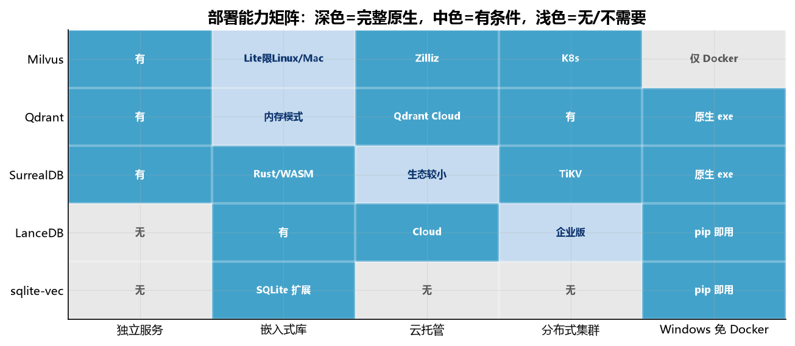

# 向量数据库部署方式与平台支持对比

**这个文档是干嘛的**：本实验的**部署选型报告**，和性能基准是两条独立的线。它回答选型时最先要问的问题（这个库能不能跑在目标环境上）：部署形态（Docker 服务 / 嵌入式库 / Windows 原生二进制 / 云托管）、各平台支持程度、以及每个库在部署上的硬约束。它不测性能，要延迟、召回、构建时间、存储占用看 `2026-09-04-真实数据-索引矩阵基准.md`。

**整理日期**：2026-09-04
**覆盖版本**：Milvus v3.0.0 / Qdrant 1.19.0 / SurrealDB 3.2.4 / LanceDB 0.38.0 / sqlite-vec 0.1.9
**本机环境**：Windows 11，AMD Ryzen 9 5900HX，64 GB 内存，Docker Desktop 28.4.0

这份文档回答选型时最先要问的问题：这个库能不能跑在目标环境上。覆盖部署形态（服务 / 嵌入式 / 云托管）和各平台的原生支持程度。性能与存储数据见 `2026-09-04-真实数据-索引矩阵基准.md`。

## 一、部署形态总览

五个库分属三种架构范式，这个差异决定了它们能进哪些场景。

| 库 | 架构范式 | 独立服务 | 嵌入式库 | 云托管 | 分布式集群 |
|---|---|---|---|---|---|
| Milvus | 专用向量数据库 | 有 | 有（Lite） | Zilliz Cloud | 有（K8s） |
| Qdrant | 专用向量数据库 | 有 | 无（有内存模式） | Qdrant Cloud | 有 |
| SurrealDB | 多模型数据库 | 有 | 有（Rust/WASM） | SurrealDB Cloud | 有（TiKV） |
| LanceDB | 嵌入式向量库 | 无（OSS） | 有 | LanceDB Cloud | 有（Enterprise） |
| sqlite-vec | SQLite 扩展 | 无 | 有 | 无 | 无 |



*图 1 | 五库 × 五部署维度的支持度一图总览（深色=完整原生，中色=有条件或部分，浅色=不支持/不需要）。前四列同本节部署形态表，第五列预览 Windows 就绪度（详见第七节）。*

三种范式的分界。Milvus 和 Qdrant 是独立服务的专用向量数据库，主路径是起一个常驻进程，客户端通过网络协议访问。LanceDB 和 sqlite-vec 是嵌入式，库链接进或加载进宿主进程，没有独立服务，数据就是本地文件。SurrealDB 横跨两边，既能起服务也能作为 Rust crate 嵌入。

这个分野直接决定了并发模型。服务型可以多进程多客户端共享同一份数据，嵌入式受宿主进程限制。LanceDB 官方文档明确说它能很好地处理并发读、可以水平扩展，但 OSS 版的扩展靠多副本而非多写。

## 二、Milvus v3.0.0

Milvus 提供四种部署选项，从笔记本到 Kubernetes 集群。

### Milvus Lite（嵌入式 Python 库）

通过 `pip install pymilvus[milvus-lite]` 安装，`MilvusClient("./demo.db")` 指定本地文件名即用，数据持久化在本地文件。API 与 Standalone 和 Distributed 完全一致，本地开发的代码可以直接迁到生产。

官方文档列的[支持环境](https://milvus.io/docs/zh/milvus_lite.md)只有两项：Ubuntu 20.04 及以上（x86_64 和 arm64）、macOS 11.0 及以上（苹果硅 M1/M2 和 x86_64）。**Windows 不在支持列表里。**

这一点在选型时容易踩。网上有教程写「Windows/Mac/Linux 全部支持」，与官方文档矛盾。实测本机 pymilvus 3.0.1 装的是服务端依赖，`MilvusClient("./demo.db")` 走的是远端连接而非 Lite 路径。要在 Windows 上用嵌入式 Milvus，官方路径是走 Docker。

索引方面，Milvus Lite 底层强制 FLAT 暴力检索，不支持 HNSW、IVF 等加速索引。这意味着它只适合小规模验证，大规模检索会线性劣化。

### Milvus Standalone（单机 Docker）

所有组件打包在单个 Docker 镜像里，配套 etcd 和 MinIO 两个容器。适合中小规模生产，官方标称支持到 1 亿向量。

Windows 上通过 Docker Desktop 加 WSL 2 运行，官方有专门的[安装指南](https://milvus.io/docs/zh/install_standalone-windows.md)。本机实测可行，用官方 docker-compose 起三个容器（`milvus-standalone`、`milvus-etcd`、`milvus-minio`），19530 端口提供 gRPC。

这是 Windows 上跑完整 Milvus 功能的唯一路径。本实验的 20 组索引矩阵全部跑在 Standalone 上，8 种索引（FLAT、IVF_FLAT、IVF_SQ8、IVF_PQ、HNSW、DISKANN、SCANN、AUTOINDEX）全部可用。

### Milvus Distributed（Kubernetes 集群）

云原生架构，组件冗余，专为数十亿到数百亿向量规模。需要 K8s 集群，运维成本最高。

### Zilliz Cloud（全托管）

Zilliz 官方云服务，免运维。BYOC 模式可以跑在自己的云账号里。

## 三、Qdrant 1.19.0

Qdrant 的部署选项在五个库里最多，覆盖从进程内内存到分布式集群。

### Docker（推荐路径）

官方镜像 `qdrant/qdrant`，一条命令起服务：

```bash
docker run -d --name qdrant -p 6333:6333 -p 6334:6334 qdrant/qdrant
```

6333 是 HTTP/REST，6334 是 gRPC。本机实测可用，镜像 270MB。

Windows 上跑 Docker 版有个静默陷阱。Git Bash 会把 `C:/...` 卷路径改写成 `/c/...`，Docker 解析失败后降级成匿名卷：容器跑得正常，数据也写进去了，但 host 上看不到。必须加 `MSYS_NO_PATHCONV=1`：

```bash
MSYS_NO_PATHCONV=1 docker run -d --name qdrant -p 6333:6333 -p 6334:6334 \
  -v "$(pwd)/data/qdrant:/qdrant/storage" qdrant/qdrant
```

验证方法是 `docker inspect qdrant --format '{{range .Mounts}}{{.Source}}{{end}}'`，Source 必须是 Windows 路径。

### Windows 原生二进制

GitHub Releases 提供 `qdrant-x86_64-pc-windows-msvc.zip`，解压得到一个独立的 `qdrant.exe`，不需要 Docker。这是五个库里唯一提供 Windows 原生二进制的服务型数据库。

启动需要同级目录放一个 `config.yaml`，配 `storage.storage_path` 和 `service.http_port`。建议开 `on_disk_payload: true` 把 payload 存磁盘，大幅降低内存占用。

不支持 Windows 7，需要 Windows 10 及以上。

### 本地内存模式

Python 客户端 `QdrantClient(":memory:")` 起一个进程内的临时实例，无需端口无需配置，数据随进程退出丢失。适合调试和单元测试。注意这是客户端特性，不是独立的部署形态。

### 分布式集群

Qdrant 支持集群模式，多节点分片加副本。配置比单机复杂，生产环境建议用 Docker Compose 或 K8s 编排。

## 四、SurrealDB 3.2.4

SurrealDB 是五个库里部署形态最灵活的一个，同一个二进制覆盖从浏览器 WASM 到分布式集群。

### 存储后端

`surreal start` 通过最后的 URI scheme 参数选存储引擎：

- `memory`：纯内存，重启丢失，适合测试
- `rocksdb:<path>`：RocksDB LSM-Tree 持久化，单节点
- `surrealkv:<path>`：SurrealDB 自研引擎（3.x 起的默认持久化选项）
- `tikv://<addr>`：TiKV 分布式键值存储，多节点集群

本实验用 `rocksdb:data/surreal.db` 起服务，因为 3.2.4 的 `surrealkv` 还在快速迭代中，rocksdb 更稳。

### Windows 原生二进制

GitHub Releases 提供 `surreal-v3.2.4.windows-amd64.exe`，单文件约 115MB。本机 `bin/surreal.exe` 就是这个。启动：

```bash
./bin/surreal.exe start --user root --pass root --bind 127.0.0.1:8000 "rocksdb:data/surreal.db"
```

Windows 支持完善，是五个库里在 Windows 上体验最原生的。

### 嵌入式模式

Rust crate `surrealdb` 可以 `Surreal::new::<Mem>(()).await` 在进程内起实例，不需要网络栈。这是真正的库嵌入，比服务模式少一层序列化开销。

### Docker

官方镜像 `surrealdb/surrealdb`，默认基于内存。挂载卷持久化：

```bash
docker run -p 8000:8000 -v $(pwd)/mydata:/mydata \
  surrealdb/surrealdb start rocksdb:/mydata/mydatabase.db
```

### WASM 边缘部署

SurrealDB 编译成 WebAssembly 后可以跑在浏览器里，用 IndexedDB 做持久化。这是五个库里独有的能力，适合纯前端应用。

### 分布式集群

TiKV 后端支持多节点，`surreal start --node=3 tikv://...`。需要额外部署 TiKV 集群，运维成本高。官方文档也提到 memory 和 rocksdb 后端在超过 500GB 数据时会出现压缩暂停导致的秒级卡顿，大规模要上 TiKV。

## 五、LanceDB 0.38.0

LanceDB 的 OSS 版没有独立服务进程，是纯嵌入式库。这条和其余四个库都不同。

### LanceDB OSS（嵌入式库）

Python、TypeScript、Rust 三种客户端 SDK，核心引擎是 Rust。`pip install lancedb` 后 `lancedb.connect("data/my-db")` 即用，数据存在本地目录的 Lance 列式格式文件里。

存储后端可以是本地目录，也可以是 S3 或兼容 S3 的对象存储。这意味着数据可以放在本地、MinIO、或者云上，客户端代码不变。

零拷贝是它的核心特性。基于 Apache Arrow，数据在 Python / Pandas / Polars / DuckDB 之间传递不需要序列化。这也是它写入吞吐能到 30,000 vec/s 的原因之一，比服务型数据库少了两层网络往返和序列化。

Lance 格式自带版本控制，每次写入生成新版本，可以时光倒流查询历史版本。这是其余四个库都没有的。

并发方面，官方文档说并发读表现很好、可以水平扩展，但 OSS 版没有多写。多进程同时写同一个库需要外部协调。

### LanceDB Cloud（托管无服务器）

全托管服务，按存储和搜索量自动扩展，不用管基础设施。从 OSS 迁移过去只要改连接字符串。

### LanceDB Enterprise（分布式 lakehouse）

分布式多模态 lakehouse，面向企业级部署。支持 AWS、GCP、Azure 多云，可以 BYOC（带上自己的云账号和 K8s 集群），也支持让 LanceDB 托管。有 SOC2 Type2 和 HIPAA 合规、静态加密。

这个版本和 OSS 是两个不同的产品线，API 兼容但底层架构不同。

## 六、sqlite-vec 0.1.9

sqlite-vec 是五个库里最轻的，本身不是一个数据库，是 SQLite 的动态加载扩展。

### SQLite 扩展

纯 C 实现，零依赖。不需要 BLAS、OpenBLAS、CUDA 或任何数值计算库，编译出来就一个 `.dll`（Windows）或 `.so`（Linux）或 `.dylib`（macOS）。

平台支持是五个库里最广的：Linux、macOS、Windows、iOS、Android、WASM 浏览器、树莓派。SQLite 能跑的地方它就能跑。

Python 用法：

```python
import sqlite3, sqlite_vec
db = sqlite3.connect("vectors.db")
db.enable_load_extension(True)
sqlite_vec.load(db)
db.execute("CREATE VIRTUAL TABLE vec USING vec0(embedding float[384])")
```

用 `vec0` 虚拟表存向量，`MATCH` 操作符做 KNN 查询。非向量数据可以存在元数据列、辅助列或分区键列里。

### 无 ANN 索引，但有 partition key

sqlite-vec 只做暴力全表扫描，没有 IVF、HNSW 之类的 ANN 近似索引。10 万向量以内延迟可接受，超过之后线性劣化。它的定位是小规模本地场景，不是生产向量数据库。

但它有个容易被忽略的机制：分区键（partition key）。`vec0` 虚拟表可以声明一个等值分区列，查询时带约束就能只扫对应分区，实际能快一个量级。实测（11,293 条 384 维）：无分区全表扫描 34.27ms，带 `cat = 0` 约束（1/20 数据）降到 2.39ms。

两点限制必须说清，否则会误判成 ANN。分区查询只在该分区内取 top-k，不保证是全局 top-k，实测全局真值 top10 与分区内返回只有 2/10 命中，这是精确过滤不是近似最近邻。另外分区表本身有开销，建了分区键但查询不带约束时（59.58ms）比不建分区（34.27ms）更慢。所以「没有 ANN 索引，但分区键约束能裁扫描量」才是完整表述。延迟基线数据见 `2026-09-04-真实数据-索引矩阵基准.md` 第五节。

版本还是 pre-v1（0.1.9），官方明说可能会有突破性变化，上生产要担这个风险。

### 项目背景

Alex Garcia 开发，是 sqlite-vss 的继任者，Mozilla Builders 项目之一，获得 Mozilla、fly.io、Turso、SQLite Cloud、Shinkai 赞助。

## 七、Windows 支持程度汇总

这张表是 Windows 用户最关心的。标注「本机实测」的是这次实验真正跑起来的。

| 库 | Windows 原生二进制 | Docker Desktop | 嵌入式库 | 本机实测 |
|---|---|---|---|---|
| Milvus | 无 | 支持（官方指南） | Lite 不支持 Windows | Standalone Docker 可用 |
| Qdrant | 有（`qdrant.exe`） | 支持 | 无（有内存模式） | Docker 可用 |
| SurrealDB | 有（`surreal.exe`） | 支持 | Rust crate 支持 | 原生二进制可用 |
| LanceDB | 不需要 | 不适用 | Python/Rust/TS 支持 | Python 库可用 |
| sqlite-vec | 不需要 | 不适用 | SQLite 扩展支持 | Python 库可用 |

Windows 上的三条可行路径，按优先级排。

**有原生二进制的服务（Qdrant、SurrealDB）**：直接跑 `.exe`，不依赖 Docker。这两个库在 Windows 上体验最完整，不需要 WSL2 中转。缺点是原生进程的内存管理和 Docker 版略有差异，Qdrant 官方文档建议开 `on_disk_payload` 控内存。

**Docker Desktop 跑服务（Milvus、Qdrant）**：Milvus 只有这条路。需要 Docker Desktop 加 WSL2，镜像体积大（Milvus 三个容器合计约 4.2GB）。Qdrant 的 Docker 版要注意 bind mount 路径改写问题。

**嵌入式库（LanceDB、sqlite-vec、SurrealDB Rust）**：库链接进宿主进程，平台兼容性由底层引擎保证。LanceDB 和 sqlite-vec 在 Windows 上不需要任何额外组件，`pip install` 就能用。

Milvus Lite 是唯一的反例。网上教程常写它支持 Windows，官方文档明确只列 Ubuntu 和 macOS。要在 Windows 上用 Milvus 的嵌入式形态，实际不可行，只能走 Docker。

## 八、选型建议

按部署约束倒推。

**必须跑在 Windows 且不想装 Docker**：Qdrant 原生二进制或 SurrealDB 原生二进制。两者都有官方 Windows 构建，解压即用。要纯嵌入式就 LanceDB 或 sqlite-vec，连进程都不用起。

**已有 K8s 集群，追求大规模**：Milvus Distributed 或 Qdrant 集群。这两个是生产级向量数据库的标准选择，有完整的运维工具链。LanceDB Enterprise 也支持 BYOC，但生态成熟度不如前两个。

**嵌入式、边缘、单机应用**：LanceDB 是默认选择，列式存储加零拷贝，写入吞吐和查询延迟都在第一梯队。sqlite-vec 适合已有 SQLite 技术栈的轻量场景，但要接受它只有暴力扫描。

**已有关系型数据库，想加向量能力**：sqlite-vec 是最轻的加法，不需要新进程新端口。SurrealDB 适合想要多模型（文档加图加向量）一体化的场景，但它的向量检索只是能力分支，不是主业。

**要浏览器端运行**：只有 SurrealDB 有 WASM 构建。这是独有能力，其余四个库都不支持。

**不折腾运维**：Zilliz Cloud（Milvus）、Qdrant Cloud、LanceDB Cloud 都是全托管。SurrealDB Cloud 存在但生态较小。

## 九、参考来源

- Milvus 部署选项：https://milvus.io/docs/zh/install-overview.md
- Milvus Lite 支持环境：https://milvus.io/docs/zh/milvus_lite.md
- Milvus Windows Docker 安装：https://milvus.io/docs/zh/install_standalone-windows.md
- Qdrant Windows 原生二进制：https://github.com/qdrant/qdrant/releases
- SurrealDB 安装与部署：https://surrealdb.com/docs/surrealdb/installation
- LanceDB 运行方式：https://docs.lancedb.com/
- sqlite-vec 项目：https://github.com/asg017/sqlite-vec

以上均为 2026-09-04 检索的官方文档。版本相关的支持矩阵会随时间变化，选型前建议复核官方文档的最新说明。
