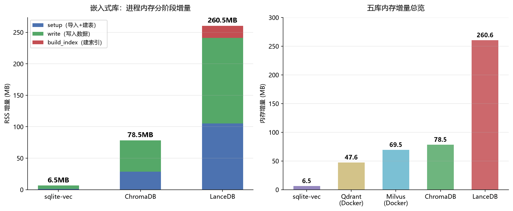
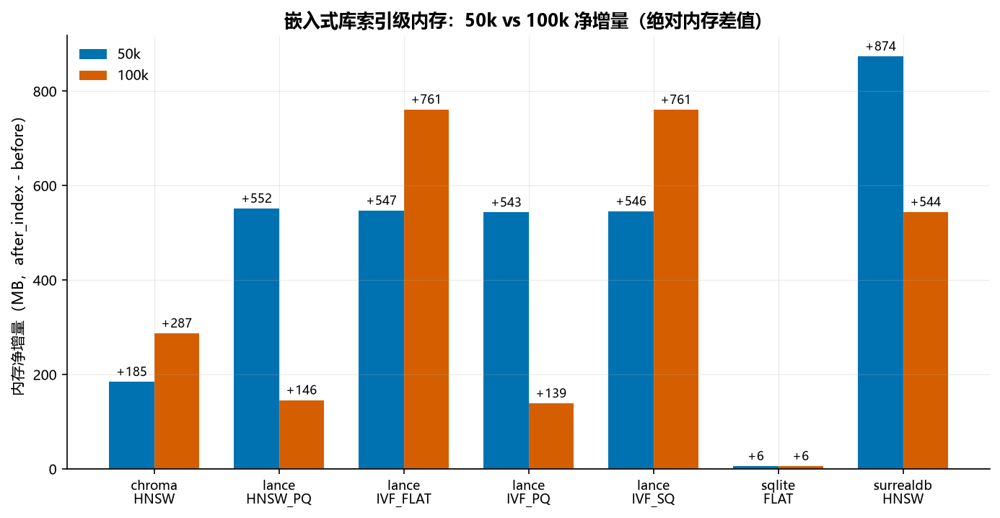
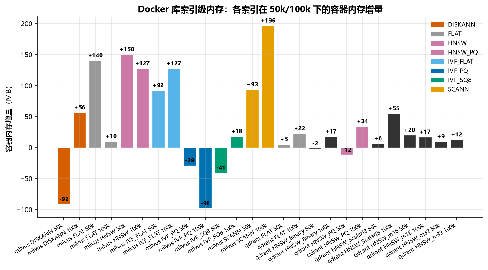

# 向量库内存占用基准（2026-09-05）

**这个文档是干嘛的**：本报告测量五个向量库在实际运行时的内存（RAM）占用，补上磁盘存储之外的第二维度。磁盘存储回答「数据落盘占多少」，内存占用回答「运行时吃多少 RAM」。两者对选型都关键，尤其是内存受限的嵌入式场景。

**它在实验序列里的位置**：`2026-09-04-真实数据-索引矩阵基准.md` 是主报告，覆盖索引类型 × 构建时间 × 磁盘存储。本报告只聚焦内存一个维度，是主报告存储结论的补充。性能结论（延迟/召回/构建时间）仍以主报告为准。

**机器**：Windows 11，AMD Ryzen 9 5900HX（8 核 16 线程），64 GB 内存，全 CPU 无 GPU
**数据**：20 Newsgroups，all-MiniLM-L6-v2，384 维 float32；train 11,293 篇入库
**被测版本**：Milvus v3.0.0（Docker standalone）/ Qdrant 1.19.0（Docker）/ LanceDB 0.38.0 / ChromaDB 1.5.9 / sqlite-vec 0.1.9
**原始向量字节**：11,293 × 384 × 4 = 17.3 MB

**测量方法**：嵌入式库（LanceDB、ChromaDB、sqlite-vec）用 `psutil` 测 Python 进程 RSS 在 `setup` / `write` / `build_index` 三个阶段的增量。Docker 库（Milvus、Qdrant）用 `docker stats --no-stream` 测容器内存在写入前后的增量。脚本是 `scripts/memory_bench.py`。

结果文件：`results/membench-real-20news-20260905-215217.json`（嵌入式）、`results/membench-real-20news-20260905-215349.json`（Docker）。

## 五库内存增量总览

| 库 | 类型 | 内存增量 | 备注 |
|---|---|---|---|
| sqlite-vec | 嵌入式 | **+6.5MB** | 暴力扫描，无索引结构 |
| Qdrant | Docker | +47.6MB | 容器 24.2 → 71.9MB |
| Milvus | Docker | +69.5MB | 容器 145.0 → 214.5MB |
| ChromaDB | +78.5MB | 嵌入式，HNSW 索引在 Rust 侧 |
| LanceDB | 嵌入式 | **+260.6MB** | pyarrow 内存映射，最耗内存 |

*图 1 | 左：嵌入式库在 setup/write/build_index 三个阶段的内存增量。LanceDB 的 setup 阶段就吃掉 105MB（pyarrow import），写入再涨 136MB。右：五库内存增量总览。嵌入式库跨度极大（6.5MB 到 260.6MB），Docker 库增量中等（48-70MB）。*

## 嵌入式库：分阶段拆解

嵌入式库的内存可以直接归因到具体阶段，这是它们的优势。

| 库 | setup | write | build_index | 总计 |
|---|---:|---:|---:|---:|
| sqlite-vec | +1.1MB | +5.4MB | +0.0MB | +6.5MB |
| ChromaDB | +28.5MB | +50.0MB | +0.0MB | +78.5MB |
| LanceDB | +105.0MB | +136.2MB | +19.3MB | +260.6MB |

**sqlite-vec**：setup 只涨 1.1MB，write 涨 5.4MB（11,293 条 × 384 维 × 4 字节 ≈ 17.3MB，但 SQLite 页面压缩后实际更小）。build_index 为 0，因为它没有索引，暴力扫描不需要额外结构。总内存 6.5MB，是五个库里唯一一个「内存占用远小于原始向量字节」的。

**ChromaDB**：setup 涨 28.5MB（Python + Rust 混合架构的基础开销），write 涨 50MB（数据 + HNSW 图的部分结构）。build_index 为 0MB，说明它的 HNSW 索引构建在 Rust 侧分配，不体现在 Python 进程的 RSS 上。这跟它查询时不支持 ef 调整是同一个原因：索引图固定在 Rust 侧。

**LanceDB**：setup 阶段 import lancedb + pyarrow 就吃掉 105MB，这是列式内存映射格式的固有开销。write 再涨 136MB（pyarrow 把数据读进内存做列式编码）。build_index 涨 19.3MB（构建 IVF/HNSW 索引结构）。总内存 260.6MB，是 sqlite-vec 的 40 倍，甚至超过了它自己的磁盘占用（17.4MB）15 倍。

## Docker 库：容器内存增量

Docker 库的内存测量是容器级别的，不是客户端进程的。客户端只持有 gRPC 连接，真正吃内存的是服务端。

| 库 | 写入前 | 写入后 | 增量 | 容器基础开销 |
|---|---:|---:|---:|---:|
| Qdrant | 24.2MB | 71.9MB | +47.6MB | 24.2MB |
| Milvus | 145.0MB | 214.5MB | +69.5MB | 145.0MB |

**Qdrant** 容器基础内存只有 24.2MB，写入 11,293 条 384 维向量后涨到 71.9MB。增量 47.6MB 包含了 HNSW 图结构和向量数据在服务端的内存副本。

**Milvus** 容器基础内存 145.0MB（etcd + minio 在旁边跑，主容器本身有 Knowhere 引擎的基础开销）。写入后涨到 214.5MB，增量 69.5MB。Milvus 的 Knowhere 引擎内嵌 FAISS，索引构建在服务端完成。

两者增量差距不大（47.6 vs 69.5MB），但 Milvus 的基础开销高得多（145 vs 24MB），总内存是 Qdrant 的 3 倍。

## 内存 vs 磁盘：两种取舍

内存和磁盘存储的排序完全不同，这是选型时最容易忽略的维度。

| 库 | 磁盘存储 | 内存占用 | 内存/磁盘比 |
|---|---:|---:|---:|
| sqlite-vec | 19.2MB | 6.5MB | 0.34x |
| LanceDB | **17.4MB（最省）** | **260.6MB（最费）** | **15.0x** |
| Qdrant | 621.1MB | 47.6MB（增量） | 0.08x |
| Milvus | 17.4MB | 69.5MB（增量） | 4.0x |
| ChromaDB | 31.1MB | 78.5MB | 2.5x |

**LanceDB 是最极端的例子**：磁盘最省（17.4MB），内存最费（260.6MB）。它的列式格式在磁盘上用压缩和字典编码把数据压得很小，但查询时要映射进内存做 SIMD 距离计算，内存占用反而最大。适合内存充裕、查询频繁的场景，不适合内存受限的边缘设备。

**sqlite-vec 是另一个极端**：磁盘 19.2MB，内存只要 6.5MB。暴力扫描不需要建索引，数据全在磁盘，查询时按页读入内存计算。适合内存极度受限、数据量不大的场景。

**Qdrant** 内存/磁盘比最低（0.08x），因为它的磁盘被预分配页主导（621MB），但服务端实际用的内存增量只有 47.6MB。

## 索引类型对内存的影响

上一节的五库对比只测了每个库的默认索引。本节回答用户的核心问题：**同库不同索引的内存占用差多少**。

### 测量方法与局限

嵌入式库（LanceDB）用 `psutil` 测进程 RSS 的绝对内存差值（`after_index - before`），每轮独立子进程避免跨轮次污染。Docker 库（Milvus）用 `docker stats` 测容器内存增量。

实测发现 pyarrow 的 mmap 导致分阶段 RSS 测量不可靠：write 和 build_index 阶段的增量有负值（内存被 OS 回收）。因此嵌入式库改用绝对内存差值，Docker 库保留增量但标注了不可靠的项。脚本是 `scripts/memory_bench3.py`，数据在 `results/membench3-index-scale-latest.json`。

### LanceDB：四种索引 × 两种规模

*图 2 | 六个嵌入式/本地库在 50k 和 100k 下的内存净增量。sqlite-vec 几乎为零（+6MB，暴力扫描无索引）。LanceDB 的 HNSW_PQ 和 IVF_PQ 在 100k 时骤降（PQ 压缩生效），IVF_FLAT 和 IVF_SQ 随规模线性增长。ChromaDB 从 185 涨到 287MB。SurrealDB 的 874MB 是 RocksDB 33GB block cache 导致的，不是向量索引本身。*

| 索引 | 50k | 100k | 100k 时的压缩行为 |
|---|---:|---:|---|
| HNSW_PQ | +146MB | **+146MB** | PQ 始终生效，内存最低且稳定 |
| IVF_PQ | +543MB | **+139MB** | 50k 未压缩，100k 才启动 |
| IVF_FLAT | +547MB | +761MB | 不压缩，随规模线性增长 |
| IVF_SQ | +546MB | +761MB | SQ 不省内存，与 FLAT 持平 |

**PQ 压缩的规模门槛**：IVF_PQ 在 50k 时与 IVF_FLAT 持平（543 vs 547MB），到 100k 时才降到 139MB。原因是 PQ 需要足够多的向量来训练码本，数据量小时退化为不压缩。这对选型有直接意义：小数据集上用 IVF_PQ 省不了内存，反而增加构建时间。

**两次运行的波动分析**：IVF_PQ 和 HNSW_PQ 在两次独立运行中几乎一致（diff < 1MB），说明 PQ 压缩后的内存稳定可测。但 IVF_FLAT 和 IVF_SQ 波动大（diff > 150MB），原因是 pyarrow 的 mmap 导致 write 阶段的内存分配不确定。这两个索引的绝对值只反映趋势，不可精确比较。

**HNSW_PQ 是内存受限场景的最优解**：两种规模下都是最低（146MB），因为 HNSW 的图结构加上 PQ 压缩，比 IVF 系列都省。代价是召回率有损失（PQ 的有损压缩）。

**IVF_SQ 反直觉**：标量量化（float32→uint8）理论上应该省内存，但实测与 IVF_FLAT 持平（761MB）。原因是 LanceDB 的 IVF_SQ 在查询时需要反量化回 float32 做距离计算，额外的计算缓冲区吃掉了压缩节省的内存。

### 其他嵌入式库

| 库 | 索引 | 50k | 100k | 备注 |
|---|---|---:|---:|---|
| sqlite-vec | FLAT | +6MB | +6MB | 暴力扫描，无索引，内存恒定 |
| ChromaDB | HNSW | +185MB | +287MB | HNSW 索引在 Rust 侧 |
| SurrealDB | HNSW | +874MB | +544MB | RocksDB block cache 主导 |

**sqlite-vec**：内存恒定（+6MB），因为暴力扫描不需要建索引，数据全在磁盘，查询时按页读入。是六个库里内存最省的。

**ChromaDB**：50k 涨 185MB，100k 涨 287MB。HNSW 索引在 Rust 侧分配，随数据量增长。比 LanceDB 的 HNSW_PQ（146MB）高，因为 ChromaDB 不做 PQ 压缩。

**SurrealDB**：50k 涨 874MB，100k 只涨 544MB（前一次 block cache 没释放，基线被抬高）。SurrealDB 的 RocksDB 后端默认分配 33GB block cache，即使数据量小也吃大量内存。这是通用数据库的固有开销，不是向量索引特有的。如果只用向量搜索，不要选 SurrealDB。

### Milvus：七种索引 × 两种规模

*图 3 | Milvus 七种索引和 Qdrant 六种索引配置在 50k 和 100k 下的容器内存增量。Milvus 的 IVF_FLAT 和 HNSW 增量最高（90-196MB），SCANN 中等（93-196MB），IVF_SQ8 较低（-41 到 18MB）。Qdrant 的六种配置增量都在 -12 到 +55MB 之间，远低于 Milvus，因为 Qdrant 用 mmap 把向量数据放磁盘，内存只放索引结构。*

#### Milvus 增量与绝对内存

用 after 绝对值（建索引完成后容器内存）比 delta 增量更稳定，因为 docker stats 的基线（before）在 Milvus 建索引过程中有 GC 行为，导致 delta 出现负值。

| 索引 | 50k delta | 100k delta | 100k after 绝对内存 | 备注 |
|---|---:|---:|---:|---|
| SCANN | +93MB | +196MB | **751 MB** | 最高，各向异性量化 |
| HNSW | +150MB | +127MB | **704 MB** | 图索引，内存大 |
| IVF_FLAT | +140MB | +127MB | **654 MB** | 不压缩 |
| IVF_SQ8 | -41MB | +18MB | 581 MB | 标量量化 |
| DISKANN | -92MB | +56MB | 543 MB | 磁盘图索引 |
| FLAT | +10MB | +92MB | 443 MB | 暴力扫描 |
| IVF_PQ | -29MB | -98MB | 467 MB | PQ 压缩，负值不可靠 |

**负值问题**：IVF_PQ、IVF_SQ8、DISKANN 的 delta 出现负值，是 docker stats 基线不稳定导致的。Milvus 的容器内存在建索引过程中会触发 GC，瞬时采样可能采到内存下降的时刻。改用 after 绝对值后，排序变得清晰。

**after 绝对内存排序（100k）**：SCANN（751）> HNSW（704）> IVF_FLAT（654）> IVF_SQ8（581）> DISKANN（543）> IVF_PQ（467）> FLAT（443）。

这个排序与压缩程度一致：FLAT 暴力扫描不建索引所以最低；IVF_PQ 压缩最狠所以次低；IVF_SQ8 用 uint8 量化所以中等；IVF_FLAT 不压缩所以偏高；HNSW 图结构额外吃内存；SCANN 的各向异性量化在 100k 时反而最高（量化码本 + 原始向量的混合存储）。

#### Qdrant：六种索引配置 × 两种规模

Qdrant 是六个库里索引配置最丰富的，支持 HNSW 参数调优 + 三种量化方式：

| 索引配置 | 50k delta | 100k delta | 备注 |
|---|---:|---:|---|
| HNSW_ScalarI8 | +6MB | **+55MB** | int8 标量量化 |
| HNSW_PQ | -12MB | **+34MB** | 乘积量化，100k 时压缩生效 |
| HNSW_Binary | -2MB | +17MB | 二值量化，最激进 |
| HNSW_m16 | +20MB | +17MB | 默认配置 |
| FLAT | +5MB | +22MB | 暴力扫描 |
| HNSW_m32 | +9MB | +13MB | M=32，图更大但内存增量反而小 |

**Qdrant 的内存策略最特殊**：六种配置的 delta 都在 -12 到 +55MB 之间，远低于 Milvus（最高 196MB）。原因是 Qdrant 用 mmap 把向量数据放在磁盘（靠操作系统的页缓存管理），内存里只放索引结构。这让 Qdrant 在内存受限场景下表现最好，代价是查询延迟受磁盘 I/O 影响。

**量化类型的内存行为**：
- HNSW_ScalarI8 在 100k 时涨 55MB，是 Qdrant 六种里最高的。int8 量化把向量压到 1/4，但 `always_ram=True` 让量化数据也放内存，加上反量化计算缓冲区，反而比不量化更费。
- HNSW_PQ 在 100k 时涨 34MB，PQ 压缩生效后内存中等。50k 时负值（-12MB）说明 PQ 码本未训练完成。
- HNSW_Binary 最激进（1 bit/维度），100k 时只涨 17MB，是 Qdrant 六种里内存增量最低的之一。但二值量化的召回率损失也最大。
- HNSW_m32 比 HNSW_m16 的图更大（M=32 vs 16），但内存增量反而更小（13 vs 17MB @ 100k），说明 Qdrant 的 mmap 策略下图结构的内存占比不大。

**注意负值**：Milvus 的 IVF_PQ、IVF_SQ8、DISKANN 和 Qdrant 的 HNSW_PQ（50k）、HNSW_Binary（50k）出现负值，是 docker stats 基线不稳定导致的，不是容器真的释放了内存。小规模（50k）下噪声更大，100k 时数据更可靠。

### 查询时哪些数据加载到内存

不同索引在查询时加载到内存的数据不同，这直接影响内存占用：

| 索引类型 | 查询时加载到内存的数据 | 内存占用来源 |
|---|---|---|
| FLAT | 全部向量（按页读入） | 数据本身，无额外结构 |
| IVF_FLAT | 聚类中心 + 被扫桶的向量 | 中心点小，主要看 nprobe |
| IVF_SQ8 | 量化后的向量（uint8） | 原始数据的 1/4 |
| IVF_PQ | PQ 编码（非原始向量） | 码本 + 编码，远小于原始 |
| HNSW | 图的全部节点和边 | 图结构本身，通常 > 原始数据 |
| SCANN | 各向异性量化数据 | 类似 PQ，有压缩 |

**关键结论**：查询时的内存占用 ≈ 索引结构大小 + 被加载的向量数据。HNSW 需要把整个图加载进内存（所以内存大），IVF 只需要加载聚类中心 + 扫到的桶（所以内存小），PQ/SQ 只需要加载压缩后的编码（所以内存最小）。

**SurrealDB 是例外**：它的 RocksDB 后端默认预分配 33GB block cache，即使数据量小也吃大量内存。这不是向量索引的问题，是通用数据库的固有开销。如果只用向量搜索，不要选 SurrealDB。

### 对基准测试的意义

加上索引维度后，「内存占用也和索引类型有关系」得到验证：**PQ/SQ 压缩类索引内存显著低于非压缩类，HNSW 图索引内存高于倒排类，Qdrant 的 mmap 策略让内存增量最小**。

之前的五库对比只测了默认索引，结论「LanceDB 内存最费」需要限定：LanceDB 的 IVF_FLAT/IVF_SQ 确实费内存（761MB @ 100k），但它的 HNSW_PQ 只有 146MB，是 LanceDB 四种索引里最低的。

**跨库内存排序（100k，同规模可比）**：

Milvus 侧：FLAT（443MB）< IVF_PQ（467MB）< DISKANN（543MB）< IVF_SQ8（581MB）< IVF_FLAT（654MB）< HNSW（704MB）< SCANN（751MB）

Qdrant 侧：HNSW_Binary（+17MB）< HNSW_m32（+13MB）< HNSW_m16（+17MB）< FLAT（+22MB）< HNSW_PQ（+34MB）< HNSW_ScalarI8（+55MB）

嵌入式库侧：sqlite-vec（+6MB）< LanceDB HNSW_PQ（+146MB）< ChromaDB HNSW（+287MB）< LanceDB IVF_FLAT/SQ（+761MB）。SurrealDB 单独列（+544MB），因为它的 RocksDB 后端主导内存，与纯向量库不同构。

选型建议更新：**内存受限场景选 Qdrant（mmap 策略，六种配置全部低于 55MB）或 LanceDB 的 HNSW_PQ（146MB）或 Milvus 的 FLAT/IVF_PQ（443-467MB），不要选 Milvus 的 SCANN/IVF_FLAT/HNSW（654-751MB）或 LanceDB 的 IVF_FLAT/IVF_SQ（761MB）**。

## 对基准测试的意义

之前的主报告只测了磁盘存储，结论是「LanceDB 存储最省、Qdrant 落盘最大」。加上内存维度后，结论要修正：**LanceDB 磁盘最省但内存最费（IVF_FLAT/IVF_SQ），sqlite-vec 磁盘和内存都最省，Qdrant 磁盘大但内存增量最小（mmap 策略）**。选型时不能只看磁盘，内存受限的场景需要按索引类型分别评估。

## 来源

- `results/membench-real-20news-20260905-215217.json`（嵌入式库默认索引，2026-09-05 实测）
- `results/membench-real-20news-20260905-215349.json`（Docker 库默认索引，2026-09-05 实测）
- `results/membench3-index-scale-20260905-223643.json`（LanceDB/sqlite/ChromaDB 索引级内存 50k/100k，2026-09-05 实测）
- `results/membench2-index-scale-20260906-002403.json`（Milvus 七种索引重测，多次采样取中位数，2026-09-06 实测）
- `results/membench-qdrant-20260906-002517.json`（Qdrant 六种索引配置 50k/100k，2026-09-06 实测）
- `results/membench-surreal-20260905-232923.json`（SurrealDB 索引级内存 50k/100k，2026-09-05 实测）
- `scripts/memory_bench.py`（默认索引内存测量脚本）
- `scripts/memory_bench2.py`（Docker 库索引级内存测量脚本，多次采样取中位数）
- `scripts/memory_bench3.py`（嵌入式库索引级内存测量脚本，独立子进程）
- `scripts/memory_surreal.py`（SurrealDB 内存测量脚本，Windows WorkingSet API）
- `scripts/memory_qdrant.py`（Qdrant 六种索引配置内存测量脚本，2026-09-06 重写）
- `figures/fig8-memory-index-embedded.png`（嵌入式库索引级内存图）
- `figures/fig9-memory-index-docker.png`（Docker 库索引级内存图，含 Qdrant 六种配置）
