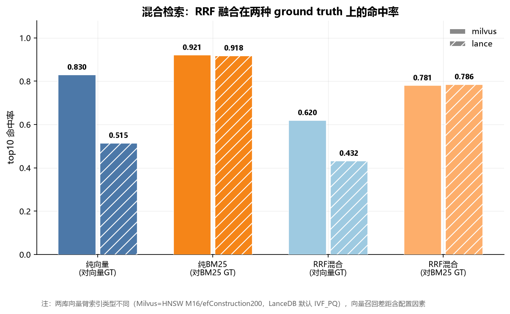

# 混合检索：向量 + BM25 的 RRF 融合实测

> 本文的方法论教训（词项重叠 ground truth 虚高纯 BM25、双 ground truth 设计、两个缺陷的根因）已提炼到配套知识库《混合检索评测的方法论陷阱》，本文保留完整实测数据与过程。

> 实验日期 2026-09-06 · 数据 `results/hybridbench-20260906-122337.json` · 脚本 `scripts/hybrid_search_bench.py` · 图 `figures/fig10-hybrid-rrf.png`

## 这个文档是干嘛的

记录混合检索（向量召回 + BM25 召回，RRF 融合）在 20news 语料上的实测结果，以及实验过程中发现并修掉的两个会直接导致结论错误的缺陷。它只管混合检索这一件事，BM25 在各库的支持度与接入难度在 `docs/六库BM25支持度与接入难度.md`，两文分工不重叠。

## 结论先行

在这个语料和这套评估口径下，RRF 混合检索两头都受损，没有体现出「兼顾两者」的价值。Milvus 上纯向量 top10 命中 0.830，混入 BM25 后掉到 0.620；纯 BM25 0.921，混入向量后掉到 0.781。LanceDB 同向，0.515→0.432、0.918→0.786。

这个结论不能外推成「混合检索没用」。它成立的范围由三个条件限定：语料是英文技术文本、查询是整篇邮件正文、评估口径是 top10 命中集合 GT。三者任一改变，结论都可能反转。真正该带走的是方法层面的两点：纯 BM25 那一路的 0.92 含有构造性虚高（ground truth 本身就按词项重叠定义），而两库 `hybrid_bm25` 收敛到 0.781/0.786 说明融合后的榜单实际由 BM25 那一路主导。

## 实验设计

库取 20news-bydate 的 train 全集 11293 条（正文截断 1200 字符，384 维向量），查询取 test 分层采样 40 条，每类 2 条，与库内文档不重叠，避免「自己检索到自己」。

两路检索各自配一个 ground truth。向量 GT 用暴力 L2 算真实 top10。BM25 GT 用词项重叠，即与查询共享至少 `min_overlap` 个实词的文档集合。指标统一为 `命中 GT 的文档数 / min(|GT|, 10)`。

这个设计里有两个缺陷，都是先跑出数字之后才发现的，而且都会让结论朝着「混合检索无效」的方向偏。

### 缺陷一：查询文本与查询向量错位

`load_real()` 做的是分层随机采样，抽到的是 test 集的 53317、53324、38767 这些位置，而脚本里取查询文本写的是 `test_texts[:40]`，对应的是 53068、53257、53260。40 条里只有 4 条真正对应，其余 36 条的 BM25 那一路搜的是一段跟查询向量毫无关系的文本。

脚本注释里写着「文本用全部 test_texts 的前 N 条近似」，这个近似是致命的。向量那一路是好的（查询向量和向量 GT 来自同一份采样），所以 `vector_hit` 一直有效，BM25 和混合两列不能用。之前两轮跑出的 0.807/0.944/0.493/0.775 和 0.865/0.997/0.492/0.973 都作废。

修复方式是让 `load_real()` 多返回采样行号，查询文本用同一批行号取。修完做了同序性验证：npz 里的 `names` 字段指向语料 tar 包中的原始文件，直接读原始文件比对正文，train 和 test 各 300 条全部逐字一致，确认两个 npz 与嵌入同序。

### 缺陷二：min_overlap 从未真正校准

此前记录的是「min_overlap=10 时 GT 平均 815 条，占库 7.2%，可用」。这个数字复现不出来。实测对应关系是 min_overlap=20 平均 629 条占 5.6%，min_overlap=10 是 5567 条占 49.3%。阈值记错了一个量级。

后果是 `hit_at_k` 的分母取 `min(|GT|, 10) = 10`，而 GT 覆盖了近半语料，随机抽 10 条也能得 1.0 分。所以之前看到的 `bm25_hit = 0.997` 不含任何信息量，是分母塌掉之后的必然结果。

另一个问题是 `bm25_truth` 的文档字符串写着「已去停用词」，但 `token_set` 实现里只有长度过滤，没有任何停用词表。20news 文档共享大量通用词，不滤停用词时词项重叠虚高，GT 必然偏大。

补上标准英文停用词表加 20news 语料噪声词后，重叠计数整体下移，扫描区间必须跟着下移。校准结果：

| min_overlap | 平均 GT 条数 | 占库比例 | 空 GT 查询数 |
|---|---|---|---|
| 2 | 3190 | 28.2% | 0 |
| **3** | **1369** | **12.1%** | **0** |
| 4 | 553 | 4.9% | 0 |
| 5 | 213 | 1.9% | 1 |
| 8 | 14 | 0.1% | 6 |

取 3。这个值下 GT 有足够规模让 top10 指标有区分度，且没有查询落空。

## 实测结果



| 库 | 纯向量 | 纯 BM25 | RRF 后（对向量 GT） | RRF 后（对 BM25 GT） |
|---|---|---|---|---|
| Milvus 3.0.0 | 0.830 | 0.921 | 0.620 | 0.781 |
| LanceDB 0.38.0 | 0.515 | 0.918 | 0.432 | 0.786 |

40 条查询的逐条分布比均值更说明问题。Milvus 上 31 条查询的向量命中在融合后下降，25 条的 BM25 命中下降；只有 3 条查询在融合后同时不劣于两路纯检索，19 条同时劣于两者。LanceDB 是 25 条下降、23 条下降，8 条同时不劣，16 条同时劣。

## 怎么解释这个结果

先说一个必须先说清的虚高。纯 BM25 那一路的 0.92 不全是检索质量，ground truth 本身就是按词项重叠定义的，BM25 排序依据也是词项统计，两者同构，命中率含有构造性成分。它真正的含义是「BM25 在这个语料上几乎不会漏掉词面相关的文档」，而不是「BM25 的排序最优」。所以 0.92 这个数要打折看，但打折之后仍然显著高于纯向量的 0.830（Milvus）和 0.515（LanceDB），这个高低关系是稳的。

再说 RRF 为什么两头都掉。RRF 的得分是 `sum(1/(k+rank))`，它把两路榜单里位次靠前的文档往上抬。当 BM25 那一路已经很强时，它自己的 top10 几乎全在 BM25 GT 里，得分自然高。融合之后，向量那一路提名但 BM25 不认的文档挤进前 10，把 BM25 原本的高位文档挤出去，对 BM25 GT 的命中就掉了。反过来，BM25 提名的文档也挤占向量 GT 的高位，对向量 GT 的命中同样掉。两边互相稀释，而没有任何一路在给另一边补漏，因为两路在这个语料上高度一致。

一个佐证是两库的 `hybrid_bm25` 收敛到 0.781 和 0.786，差值只有 0.005，尽管它们纯向量差 0.315、向量臂索引类型都不同。融合后的榜单被 BM25 那一路主导，库与库之间的差异主要来自向量臂质量，这正体现在 `hybrid_vec` 的 0.620 对 0.432 上。

## 必须说明的局限

向量臂索引类型不同，这是本次对比最大的混淆项。Milvus 侧显式指定 HNSW（M=16，efConstruction=200），LanceDB 侧调用 `create_index("vector")` 没传类型，落到 LanceDB 的默认值 IVF_PQ。所以纯向量的 0.830 对 0.515 里含配置差异，不能直接读成「Milvus 的 ANN 实现优于 LanceDB」。要公平比 ANN 召回，得把 LanceDB 也切成 IVF_HNSW_SQ 或 IVF_HNSW_PQ 再跑一遍。

SurrealDB 没进这张表。它的 BM25 打分本身是真的，`search::score()` 返回合理分值，k1/b 可调，探针里已确认。但在 11293 条规模上全文检索取不回结果：单词查询部分命中（`karner` 返回 1 条，`the` 返回 3 条，打分为真 BM25），而 `article` 文档频率 173 返回 0 条、`1993` 文档频率 23 返回 0 条，`@1@` 到 `@5@` 全部运算符下的多词查询一律返回 0 条。已排除空匹配退化（不存在的词 `zzzznotaterm` 返回 0 条）和异步构建（稳定等 40 秒结果不变）。该行为未定位，不在结论里替它说话。

BM25 GT 用集合命中而非排序质量指标（nDCG、MRR），所以只能回答「该捞回来的有没有捞回来」，回答不了「排得准不准」。要评估混合检索的真实价值，需要一份带分级相关度的标注集，换到这个口径下重跑。

## 要证明混合检索有价值，得改什么

本次三处设计都朝「混合无用」偏，改任一处理论上都能翻盘。一是语料，换到中文文本、OCR 噪声文本、或含同义词改写的查询上，词面匹配会明显掉链子，BM25 不再接近完美，融合才有补漏空间。二是查询形态，用短查询或关键词查询替代整篇邮件正文，词项重叠 GT 的覆盖面会变化，两路检索的分歧度会上升。三是指标，换 nDCG/MRR 加分级标注集，能测出 BM25 排序本身的不足，而当前口径把这一层整个遮住了。

## 复现

```bash
cd experiments/test_vector_db_bench
./.venv/Scripts/python.exe scripts/hybrid_search_bench.py
python figures/make_figures.py --hybrid results/hybridbench-<stamp>.json
```

Milvus 需在 19530 端口运行，脚本会重建 `hybridbench` 集合并重建索引。
